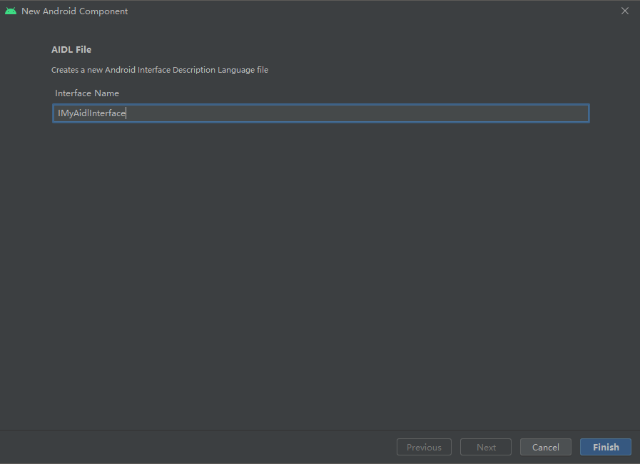

## 何为AIDL

AIDL（Android Interface Definition Language，Android接口定义语言）是一种在Android上实现的跨进程通信（InterProcess Communication，IPC）方式。在Android中，一个进程通常无法访问另一个进程的内存。因此，为进行通信，进程需将其对象分解成可供操作系统理解的原语，并将其编组为可供开发者操作的对象，这时候就要用到AIDL。

> 根据Google官方的说法，只有在需要**不同应用**的客户端通过IPC方式访问服务，并且希望在服务中进行多线程处理时，才有必要使用AIDL。如果无需跨不同应用执行并发IPC，则应通过实现Binder来创建接口；或者，如果想执行IPC，但不需要处理多线程，则使用Messenger来实现接口。

下面就开始介绍AIDL的具体使用使用步骤。

## 创建.aidl文件

首先要在Android Studio中，为所有`.aidl`文件创建一个独立的存放目录，名字为aidl，级别与assets、java、res以及jniLibs等相同。接着在aidl目录里面创建package，package的名字要和服务端所在进程AndroidManifest文件中的package保持一致。

>例如，要访问的Service所在服务端进程的package名称，在其AndroidManifest文件中为com.example.app，那么客户端aidl目录下就要创建名为com.example.app的package目录。

创建完目录之后，就要创建`.aidl`文件了。在`Project`视图下，找到刚才创建好的目录和package，右键点击，选择`New -> AIDL -> AIDL File`，然后Android Studio就会弹出一个配置窗口，里面的主要功能只有一个——设置文件名称，类似于下图所示：



创建好的`.aidl`文件类似于下面的格式：

```
// IMyAidlInterface.aidl
package com.example.app;

// Declare any non-default types here with import statements

interface IMyAidlInterface {
    // This is a custom const
    const String NAME = "AIDL";

    /**
     * Demonstrates some basic types that you can use as parameters
     * and return values in AIDL.
     */
    void basicTypes(int anInt, long aLong, boolean aBoolean, float aFloat,
            double aDouble, String aString);
}
```

>注意，`.aidl`文件里面目前还不支持使用中文。此外，[Google官方文档](https://developer.android.google.cn/guide/components/aidl?hl=zh-cn#Create)中给出的示例是Kotlin，而通过IDE直接创建出来的文件是Java的，这里以实际创建格式为准。

AIDL使用一种简单的语法，允许开发者通过一个或多个方法来声明接口。参数和返回值为任意类型，甚至是AIDL生成的其他接口。`.aidl`文件**只能使用Java来构建**，默认情况下AIDL支持的数据类型有：

+ Java基本类型
+ String
+ CharSequence
+ Parcelable
+ List
+ Map

其中，List和Map中的所有元素必须是以上列表中支持的数据类型；AIDL支持List用作泛型类，但是另一方在接收的时候其具体类始终是ArrayList；AIDLM不支持使用泛型Map，但是另一方在接收的时候其具体类始终是HashMap。如果在与接口相同的包内，定义上方未列出的附加类型，亦须为其各自加入一条import语句。

在自定义服务接口的时候需要注意以下几点：

1. 方法可带零个或多个参数，返回特定值或空值；
2. 所有**非原语参数**均需要指示数据走向，如使用`in`、`out`或`inout`，原语参数默认为`in`且不可修改；
3. 生成的`IBinder`接口内包含`.aidl`文件中所有代码注释（import和package语句之前的注释除外）；
4. AIDL接口内可以定义String和int类型的常量；
5. AIDL接口内允许使用`@nullable`注释可空参数或返回类型。

## 实现.aidl接口

在构建应用的时候，Android SDK工具会生成与`.aidl`文件同名的`.java`接口文件。生成的接口包含一个名为`Stub`的子类，该子类是其父接口的抽象实现，并且会声明`.aidl`文件中的所有方法。

>注意：Stub还会定义几个辅助方法，其中最值得注意的是asInterface()，该方法会接收IBinder通常是传递给客户端 onServiceConnected()回调方法的参数），并返回Stub接口的实例。

如果要实现`.aidl`生成的接口，就要扩展生成的Binder接口，并实现继承自`.aidl`文件的方法。而Binder接口的实现，就在Service中。特别要注意的是，由于使用的是AIDL，为了确保符合使用场景，应该在当前项目的AndroidManifest文件中，为刚刚创建好的Service添加`android:process`属性，例如“:remote”，以确保Service不是运行在当前项目所属进程中，这样就做到了跨进程。下面是代码示例：

```
class DemoService : Service() {
    private val binder = object : IRemoteService.Stub() {

        override fun getPid(): Int = Process.myPid()

        override fun basicTypes(
            anInt: Int,
            aLong: Long,
            aBoolean: Boolean,
            aFloat: Float,
            aDouble: Double,
            aString: String
        ) {
            // Does something
        }
    }
    override fun onBind(intent: Intent): IBinder = binder
}
```

在上面的示例中，binder作为`Stub`类的一个实例，其定义了Service的远程过程调用（Remote Procedure Call，RPC）接口。只要客户端能够持有此公开实例，就能与服务端进行交互。此外，在实现AIDL接口时，应注意遵守以下规则：

+ 由于无法保证在主线程上执行传入调用，因此需要做好多线程处理的准备，并对Service进行适当构建以使其达到线程安全的标准；
+ 默认情况下，RPC是**同步**调用，因此在必要的时候应该从客户端内的单独线程调用Service；
+ 由开发者引发的任何异常都不会回传给调用方，否则将可能导致两个进程全部崩溃，这就失去了跨进程的保护作用。

## 客户端调用AIDL接口

客户端要调用AIDL接口，需要借助两样东西：（1）公开的AIDL接口实例；（2）公开的ServiceConnection实例。下面是Google官方给出的代码示例：

```
var iRemoteService: IRemoteService? = null

val mConnection = object : ServiceConnection {

    // Called when the connection with the service is established
    override fun onServiceConnected(className: ComponentName, service: IBinder) {
        // Following the example above for an AIDL interface,
        // this gets an instance of the IRemoteInterface, which we can use to call on the service
        iRemoteService = IRemoteService.Stub.asInterface(service)
        // TODO: does something with iRemoteService
    }

    // Called when the connection with the service disconnects unexpectedly
    override fun onServiceDisconnected(className: ComponentName) {
        Log.e(TAG, "Service has unexpectedly disconnected")
        iRemoteService = null
    }
}
```

可以看到，客户端首先要实现一个ServiceConnection对象，然后在`onServiceConnected`方法里面，以`Stub.asInterface()`的方式获取到AIDL接口实例，剩下的就是调用该实例包含的AIDL接口方法。在启动Service的时候，要使用`bindService`，只有这样才能真正使得AIDL服务端发挥作用：

```
val intent = Intent(...)
...
bindService(intent, mConnection, Context.BIND_AUTO_CREATE)
```

