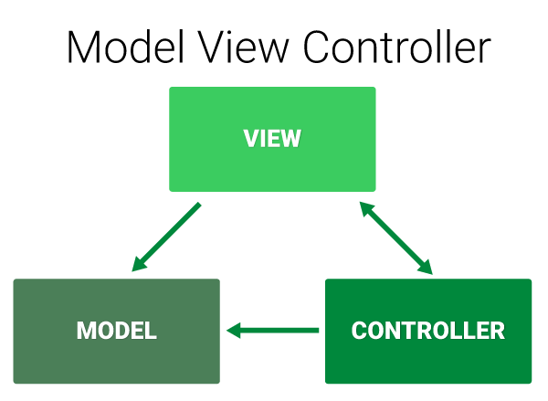
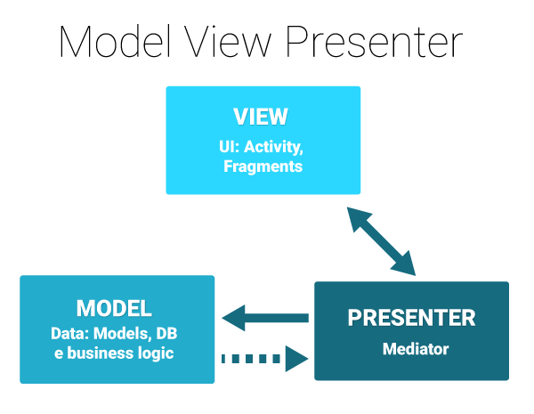
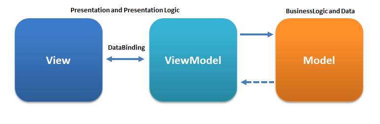

和其他领域的软件开发类似，Android应用开发当中也有一个“架构”的概念。所谓架构，简单理解就是一个系统的草图，可以用来描述构成该系统的各个组件之间存在何种联系。一个好的应用架构，可以让系统各组件模块化、具体化，同时减少组件之间的耦合程度，提高开发效率，降低维护成本。反之，一个糟糕的架构会使得模块职责不清，代码逻辑混乱，最终会让一个项目迅速成为开发者的噩梦（也就是屎山代码）。

对于Android应用而言，架构通常就是描述三个层面（数据层、业务逻辑层以及视图层）各自的职责以及它们之间的关系。针对这三个层面的划分，Android应用开发经历了从MVC到MVP再到MVVM（现在还有MVI）的多次变迁。如果仔细考察这些变迁历程就会发现，代表数据层的“M”和代表视图层的“V”似乎是稳定不变的，而业务逻辑层则经常发生变化。

## MVC架构

MVC架构是一个十分经典的架构，后续的架构变迁可以说是MVC架构的改进。MVC表示Model-View-Controller，它们之间的关系大致如下图所示：

MVC架构是划时代的，其带来的好处有：

1. **降低耦合性**：对早期应用而言，MVC强制分离了业务逻辑层和视图层，使得它们的职责开始变得清晰，减少了“一个页面囊括所有业务逻辑”这种可怕情况的出现；
2. **增加复用性**：采用架构之后，应用可以重复利用数据源，优化了成本和效率；
3. **开发工程化**：从MVC架构开始，应用开发有了一定的标准约束，开发者不能再像以往那样随心所欲，只求功能实现，不考虑其他问题。

但是作为早期出现的应用架构，MVC也是存在一些问题的，最突出的问题包括：

1. Activity/Fragment责任不明，经常出现同时负责View层和Controller层业务逻辑的情况，导致其违反单一职责原则；
2. Model层有时会跟View层发生耦合，View层修改可能会连带导致Controller和Model都得进行改动。

## MVP架构

MVP采用Presenter取代Controller，与UI交互无关的业务逻辑从View层拆分出来，收归到Presenter，同时Model不再持有View，它们的关系大致如下图所示：

View层的UI刷新逻辑抽象成接口，由具体的Activity/Fragment来实现；Presenter层的业务逻辑也抽象成接口，由具体的Presenter实现类来完成。Presenter持有View接口，执行完业务逻辑就调用View接口传递数据、刷新UI；View持有Presenter接口，界面交互时需要执行指定业务逻辑就直接调用。

MVP跟MVC相比有了一定的进步，通过采用面向接口编程的方式，实现了依赖倒置原则，解决了MVC架构中View层责任不明的问题。但是MVP让View和Presenter之间相互持有，遗留下代码耦合的问题。此外，View层和Presenter层都需要引入大量接口，这样就增加了实现的复杂度。

## MVVM架构

MVVM架构最早由Microsoft提出，借鉴了桌面应用程序的MVC思想。MVVM在不同开发领域有着不同的具体实现，但在**数据驱动**这一思路上是大致相通的：View产生交互事件，使用ViewModel执行业务逻辑之后更新Model数据；Model把更新好的数据传递给ViewModel，再由ViewModel通知View更新UI。它们之间的关系大致如下图所示：

MVVM的ViewModel比MVP的Presenter更进一步，取消了对View的持有，一方面提高了解耦程度，另一方面也不再需要View层编写和实现大量的调用接口。MVVM在Android开发领域主要使用Google的Jetpack组件来具体实现，后面的内容会逐一介绍Android开发实现MVVM架构的核心：ViewModel以及Data Binding。

## MVI架构