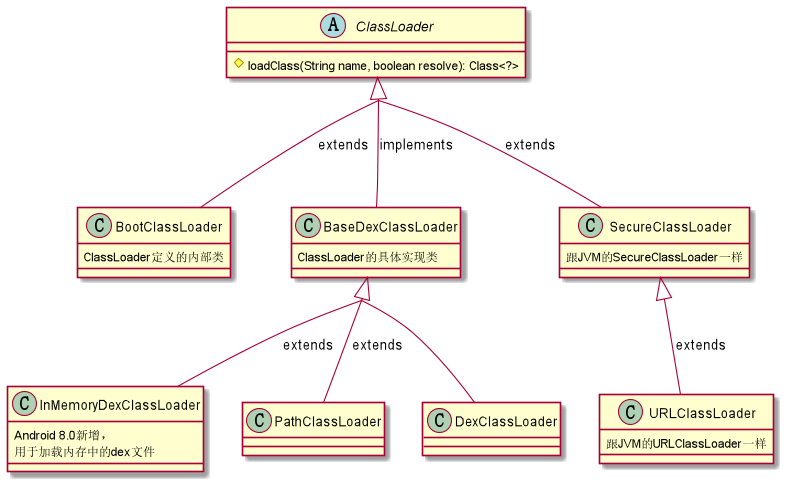
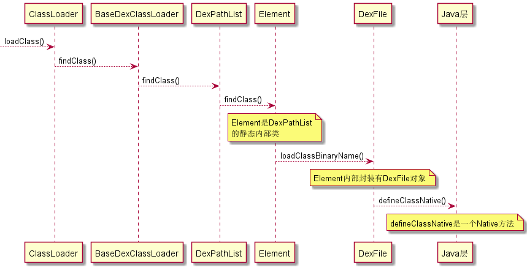

Android应用也是在虚拟机上运行的，但使用的不是[JVM](/Java/jvm)，而是Google专门开发的Android虚拟机。Android虚拟机有两种，一种是Android 4.4上使用的Dalvik虚拟机（DVM），另一种则是Android 5.0以后使用的ART虚拟机（ART）。

Android不采用JVM的主要原因在于，当时（也就是iPhone和iOS刚出现的时期）智能设备性能不足以像PC那样支持JVM的运行，因此Android虚拟机必须针对移动设备的硬件进行优化，于是采取了JVM的思路，但并未遵循JVM的规范。这就是为什么最后在Android设备上运行的是Android应用，而不是Java程序。

## Dalvik虚拟机

DVM是Android平台最早广泛使用的虚拟机，它跟JVM的主要区别如下：

|对比项目|DVM|JVM|备注说明|
|:---------:|:-----------:|:----------:|:---------:|
|架构|基于**寄存器**|基于**栈**|直接操作寄存器通常速度比较快|
|生成产物|`.dex`文件|`.jar`文件|`.dex`文件和`.jar`文件都是从`.class`文件转换而来|
|运行环境|一个应用对应一个DVM|所有应用运行在同一JVM当中|独立虚拟机可防止虚拟机崩溃影响所有应用进程|
|共享机制|不同应用间可以共享相同的类|不同程序间不能共享相同的类|共享相同类具有更高的效率|
|JIT编译器使用|Android 2.2才引入|一直使用|JIT(Just In Time)可以优化热点代码，直接生成和使用Native Code以提高执行效率|

DVM虽然不是JVM，但也要处理`.class`文件。Java或Kotlin代码被编译为`.class`文件后，DVM的DX工具就会先去除里面的冗余信息，然后将所有`.class`文件整合进一个`.dex`文件中。之所以要这么做，主要是因为打包成`.jar`格式之后，虚拟机每次加载`.jar`文件都要加载里面所有的`.class`文件，速度很慢，对于内存极其有限的早期Android设备来说是难以接受的。

Java程序执行的是`.jar`，而Android应用执行的是`.dex`，从这里可以看出，Android使用了Java进行应用开发，但最后生成的产物却跟Java程序大相径庭，因此运行这些产物的Dalvik虚拟机并不能被视为Java虚拟机。`.dex`文件由后面要提到的Android类加载器进行处理，经过解释器根据指令集对Dalvik字节码进行解释和执行之后，最后交由Linux处理。

>注意，在针对低版本设备的项目开发过程中，如果应用内包含的方法数超过65536个，那么在构建`.dex`的时候会报错，原因是DVM提供的方法引用索引只有16位长度，即$2^{16}$个索引。这就是著名的“64K问题”。要解决该问题，要么是减少方法数重新编译，要么就是引入分包技术——然而在ART取代DVM之后，这个问题在高版本Android设备上就基本消失了（难道是在暗示DVM本身就是个问题？🤣）。

DVM的运行时堆（Runtime Heap）使用[标记-清除算法](/Java/jvm?id=垃圾标记与收集)进行GC，它由两个Space（Zygote Space和Allocation Space，也可分别称为Zygote Heap和Active Heap）以及多个辅助数据结构组成。Zygote Space用来管理Zygote进程在启动过程中预加载和创建的各种对象，不会触发GC，并且被Zygote进程和应用进程所共享。

Allocation Space是从Zygote Space里面分出来的，在Zygote进程fork第一个子进程之前，Zygote Space会被分为原来已经被使用的Zygote Space以及未被使用的Allocation Space两部分，以后的对象都会在Allocation Space上进行分配与释放。AllocationSpace在每个进程之间独立拥有一份，并不共享。

DVM还包含以下数据结构：

|数据结构|说明|
|:-----|:-----|
|Card Table|用于DVM Concurrent GC，当第一次进行垃圾标记后，记录垃圾信息|
|Heap Bitmap|有两个，一个用来记录上次GC存活的对象，另一个用来记录这次GC存活的对象|
|Mark Stack|用于GC时标记存活的对象，方便后续的遍历操作|

DVM的GC日志格式为：

`D/dalvik: <GC_Reason> <Amount_freed>, <Heap_stats>, <External_memory_stats>, <Pause_time>`

各部分信息说明如下：

|信息|说明|
|:------|:------|
|GC_Reason|引起GC的原因|
|Amount_freed|本次GC释放的内存大小|
|Heap_stats|堆内空闲内存占总内存数的百分比|
|Pause_time|暂停时间，堆越大时间越长；并发暂停时间有两个，一个出现在GC开始时，另一个出现在快要完成时|

GC原因通常有以下几种：

|GC原因|说明|
|:-----|:-----|
|GC_CONCURRENT|当堆开始填充时，并发GC可以释放内存|
|GC_FOR_MALLOC|当堆内存已满时，App尝试分配内存引起的GC，系统必须停止App并回收内存|
|GC_HPROF_DUMP_HEAP|当用户请求创建HPROF文件来分析堆内存时出现的GC|
|GC_EXPLICIT|显式GC，如调用`System.gc()`，通常不建议显式GC|
|GC_EXTERNAL_ALLOC|仅适用于API = 10及以下，且用于外部分配内存的GC|

## ART虚拟机

ART（Android Runtime）发布于Android 4.4，在Android 5.0后取代了DVM。ART与DVM间的主要区别如下：

1. **ART采用AOT+JIT，DVM采用JIT**
   
   ART采用AOT（Ahead Of Time）方式进行预编译，将所有字节码预先编译成机器码存储在本地，这样在应用安装时只需执行一次即可。采用AOT的Android系统在应用程序的运行效率上极大超过了DVM，但AOT本身也具有安装时间长和存储空间占用多的缺陷。为了扬长避短，Android 7.0开始又重新引入了JIT作为补充，这样一方面缩短了应用安装时间，另一方面只需在运行中将热点代码编译成机器码，节省了存储空间。

2. **ART支持64位CPU，DVM仅支持32位CPU**
   
   DVM是为32位的CPU设计的，ART则支持64位并兼容32位的CPU。32位CPU的淘汰是大势所趋，因此DVM必然也要随之被淘汰掉。

3. **ART采用不同的运行时堆空间划分方式**
   
   默认情况下，ART的运行时堆空间与DVM相比还多了*Image Space*和*Large Object Space*这两个空间，其中前者用于存放一些预加载类，与Zygote Space一道被进程间共享；后者主要用于存放一些大对象（默认大小为12KB）。除了这四个空间，ART的Java堆中还包括两个Mod Union Table，一个Card Table，两个Heap Bitmap，两个Object Map以及三个Object Stack等辅助数据结构。

4. **ART改进了DVM的GC机制**
   
   ART在GC机制方面的改进主要有更频繁地执行并行GC，并且将并行GC暂停次数从2次减少为1次等。ART的GC日志跟DVM也有很大的差别。ART只有在主动请求GC或认为GC速度慢（GC暂停超过5ms或GC持续时间超过100ms）时才打印日志。ART的GC日志格式如下：

   `I/art: <GC_Reason> <GC_Name> <Objects_freed>(<Size_freed>) AllocSpace Objects, <Large_objects_freed>(<Large_objects_size_freed>) <Heap_stats> LOS objects, <Paunse_time(s)>`

   日志中各部分信息解释如下：

   |信息|说明|
   |:------|:------|
   |GC_Reason|引起GC的原因，数量上比DVM要多一些|
   |GC_Name|垃圾收集器名称|
   |Objects_freed|本次GC从非Large Object Space中回收的对象数量|
   |Size_freed|本次GC从非Large Object Space中回收的字节数|
   |Large_objects_freed|本次GC从Large Object Space中回收的对象数量|
   |Large_objects_size_freed|本次GC从Large Object Space中回收的字节数|
   |Heap_stats|堆内空闲内存占总内存数的百分比|
   |Pause_time|暂停时间，与在GC运行时修改的对象引用数量成比例；目前的CMS收集器仅有一次出现在GC结尾附近的暂停|

   ART的GC原因主要有以下几种：

   |GC原因|说明|
   |:------|:------|
   |Concurrent|并发GC，运行于后台，不会使App的线程暂停，也不会阻止内存分配|
   |Alloc|当堆内存已满时，App尝试分配内存而引起的GC，发生于正在分配内存的线程中|
   |NativeAlloc|Native内存分配时，比如为Bitmaps或RenderScript分配对象，这会导致Native内存压力，从而触发GC|
   |Explicit|App显式请求执行GC，如调用`System.gc()`，通常不建议采用显式GC|
   |CollectorTransition|由堆转换引起的GC，运行时切换垃圾收集器就会引起。仅出现在App在内存较小的设备上将进程状态变更为暂停或非暂停状态|
   |HomogeneousSpaceCompact|App处于可察觉的暂停进程状态时内存使用减少，进行堆内存碎片整理就会触发|
   |DisableMovingGc|不是真正触发GC的原因，发生并发堆压缩时，由于使用了GetPrimitiveArrayCritical，GC会被阻塞，因此一般情况下强烈建议不要使用|
   |HeapTrim|不是触发GC的原因，但是堆内存整理会一直阻塞GC直至整理完毕|

   ART采用多种GC方案，每个方案运行不同的垃圾收集器。默认方案是CMS（Concurrent Mark-Sweep），主要使用了sticky-CMS和partial-CMS。这些垃圾收集器的说明如下：

   |垃圾收集器种类|用途说明|
   |:-----------|:-------|
   |Concurrent Mark Sweep|CMS是一种以获取最短手机暂停时间位目标的收集器，采用和标记-清除算法实现。它是完整的堆垃圾收集器，能释放除Image Space外的所有空间|
   |Concurrent Partial Mark Sweep|部分完整的堆垃圾收集器，能释放Image Space和Zygote Space外的所有空间|
   |Concurrent Sticky Mark Sweep|粘性收集器，基于分代的垃圾收集思想，只能释放自上次GC以来分配的对象。垃圾收集更快，暂停时间更短，扫描也更频繁|
   |Marksweep + Semispace|非并发的垃圾收集器，复制GC用于堆转换以及堆碎片整理（即齐性空间压缩）|

## Android类加载器
   
前面已经提到，Android的DVM和ART加载执行的是`.dex`文件，而不是`.jar`或`.class`文件，因此Android平台的类加载器跟JVM当中的类加载器**完全不是同一个东西**，就跟[Kotlin协程](/Kotlin/coroutine)和其他语言的协程的关系一样。Android类加载器分为系统类加载器和自定义类加载器两种，其中系统类加载器主要包括BootClassLoader、DexClassLoader以及PathClassLoader。

### BootClassLoader

Android系统启动时会使用BootClassLoader来预加载常用类，与JVM中的BootstrapClassLoader不同，它并不是由C/C++代码实现的，而是由Java实现的。BootClassLoader是ClassLoader的内部类，也是一个单例类，同时继承自ClassLoader。它的访问修饰符是默认的，只有在同一个包中才可以访问，因此在应用程序中是无法直接调用的。

BootClassLoader被创建于Zygote进程的Zygote入口方法中，然后传入Native方法`classForName()`进行后续的操作。它所预加载的类来源于系统中的preloaded-classes文件。该文件存储在`/system/etc/preloaded-classes`目录下，供BootClassLoader读取出所有与加载类的名称。Zygote环境在预加载阶段配置得越健全通用，应用程序所要单独做的事情就越少，这就是以空间换时间的策略。

### DexClassLoader

DexClassLoader顾名思义就是专门加载处理与`.dex`相关的文件。DexClassLoader继承自BaseDexClassLoader，并且方法都在BaseDexClassLoader中实现。DexClassLoader的构造方法需要传入四个参数：

|参数|说明|
|:-----|:-----|
|dexPath|`.dex`相关文件路径集合，多个路径使用文件分隔符（默认为`:`）分隔|
|optimizedDirectory|解压的`.dex`文件存储路径，必须是内部存储路径，一般情况下是[应用专属存储](/Android/io?id=访问应用专属存储的数据文件)|
|librarySearchPath|包含C/C++库的路径集合，多个路径用文件分隔符分隔，可为null|
|parent|父加载器|

### PathClassLoader

PathClassLoader用于加载系统类和应用程序类。它跟DexClassLoader一样也是继承自BaseDexClassLoader，方法实现也是一样。但是PathClassLoader在构造方法上跟DexClassLoader有一处不同，那就是没有optimizedDirectory参数，原因是PathClassLoader已经将其设置为默认的`/data/dalvik-cache`。因此PathClassLoader通常用来加载apk的`.dex`文件。PathClassLoader创建于SystemServer中，并且采用的是[工厂模式](/DesignPattern/创建型设计模式?id=四、factory-method)。

### 继承关系和工作过程

Android类加载器的继承关系如下图所示：

Android类加载器在查找加载一个类时，同样使用了双亲委派模式，其查找流程大致如下图所示：

