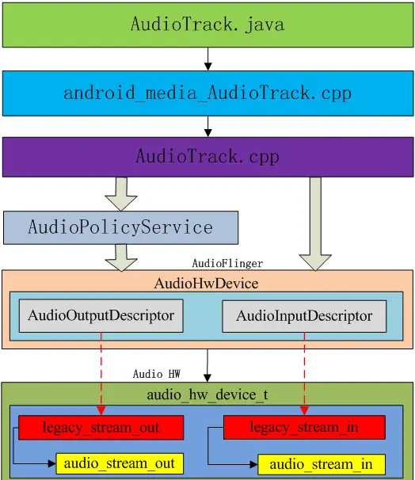
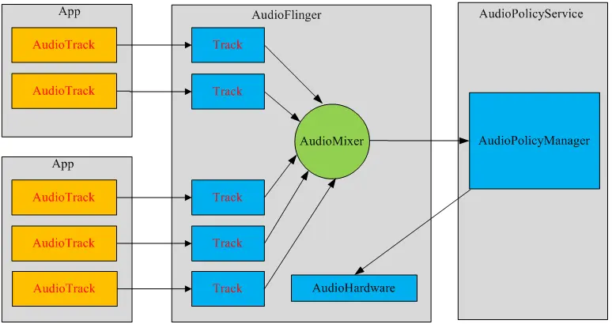

Android多媒体框架支持播放各种常见媒体类型，以便开发者能轻松地将音频、视频和图片集成到应用中。本节内容主要介绍Android多媒体框架中基础的API使用，至于更深入的音视频开发，则在其他章节展开。

## MediaPlayer

`MediaPlayer`是多媒体框架最重要的组成部分之一。`MediaPlayer`对象能够获取、解码以及播放音频和视频，而且只需进行极少设置。它支持多种不同的媒体源，例如：

+ `res/raw`资源；
+ 在线资源（流式传输）；
+ 内部URI，例如从Content Resolver获取到的URI。

下面就从不同媒体源对`MediaPlayer`的使用展开介绍。不过在此之前，需要注意申请运行时可能会用到的一些权限，比如播放在线媒体内容需要申请网络权限，访问设备磁盘上的多媒体文件需要申请存储空间访问权限，以及播放内容时防止屏幕变暗或处理器进入休眠状态需要申请唤醒锁定权限：

```
<uses-permission android:name="android.permission.WAKE_LOCK" />
```

最后再提供一张Google官方绘制的`MediaPlayer`运行时的状态机示意图：


根据这张状态机示意图，开发者可以知道调用什么方法会进入什么状态，从某一个状态切换到下一个状态需要调用什么方法，在开发时就能更好地运用这些API。

更多有关`MediaPlayer`的详细资料，可以参阅[Google官方文档](https://developer.android.google.cn/guide/topics/media/mediaplayer)。

### `res/raw`资源

`res/raw`资源是指系统不会尝试以任何特定方式解析的文件。一般来说，现成的音频和视频这些多媒体文件都可以放到这个目录下供应用读取调用。

```
var mediaPlayer: MediaPlayer? = null

if (mediaPlayer == null) {
    // 从res/raw目录下读取多媒体文件进行播放，需要调用MediaPlayer.create()方法，
    // 这个方法内部自动调用了prepare()，因此开发者不需要自行再去调用
    mediaPlayer = MediaPlayer.create(this, R.raw.local_resource)
}

// 开始播放或继续播放多媒体文件
mediaPlayer?.start()

// 暂停播放多媒体文件
mediaPlayer?.pause()

// 停止播放多媒体文件，实际操作是注销了MediaPlayer的所有监听回调
mediaPlayer?.stop()

// 在使用完MediaPlayer之后，务必及时释放MediaPlayer资源
mediaPlayer?.release()
mediaPlayer = null
```

### 在线资源

MediaPlayer支持HTTP流式传输，可以播放在线资源。需要特别注意的是，如果应用禁止明文通信，仅允许使用HTTPS协议，而传入的在线资源用的是HTTP协议，那么MediaPlayer就有可能出现无法正常解析播放该资源的异常情况。针对这种问题，一个可以参考的解决方法是将在线资源url的协议头换成HTTPS。另外，加载在线资源通常是耗时的，因此一般会采用下面示例代码的方式来进行异步加载：

```
// 传入在线资源的url
val url = "http://···"

var mediaPlayer: MediaPlayer? = MediaPlayer().apply {
    // 设置MediaPlayer异步准备完毕之后的回调
    setOnPreparedListener { it: MediaPlayer ->
        it.start()
        ···
    }

    // 设置MediaPlayer播放完毕之后的回调
    setOnCompletionListener { it: MediaPlayer ->
        ···
        it.release()
        mediaPlayer = null
    }

    // 设置MediaPlayer发生错误时的回调
    setOnErrorListener { mp, what, extra ->
        mp.release()
        mediaPlayer = null
         Log.e("MyTag","what = $what, extra = $extra")
        true
    }

    try {
        // 将在线资源地址传入MediaPlayer，注意该方法随时可能抛出异常
        setDataSource(url)

        // 设置在线资源的流媒体形式，比如音频就按照下面这种方式来设置
        setAudioAttributes(AudioAttributes.Builder()
            .setContentType(AudioAttributes.CONTENT_TYPE_MUSIC)
            .setLegacyStreamType(AudioManager.STREAM_MUSIC)
            .build())

        // 由于加载在线资源相对耗时，最好调用prepareAsync()，而非prepare()
        prepareAsync()
    } catch (e: Exception) {
        e.printStackTrace()
        ···
    }
}

// 释放MediaPlayer资源步骤省略
···
```

> 注意，`MediaPlayer.setDataSource()`实际上不光能传入在线资源url，还可以传入磁盘上存在的多媒体文件的路径，从而进行加载。也就是说，`MediaPlayer.setDataSource()`既能加载在线资源，又能加载本地资源。

### 内部URI

通过[Content Resolver](Android/contpro?id=使用content-resolver访问其他应用的数据)，开发者可以从本地解析出多媒体文件的URI，然后调用`MediaPlayer.setDataSource()`完成加载，如下面代码所示：

```
// 获取到多媒体资源的URI
val myUri: Uri = ···

var mediaPlayer: MediaPlayer? = MediaPlayer().apply {
    ···

    // 由于其他过程跟加载在线资源基本一样，这里只展示如何传入URI
    setDataSource(applicationContext, myUri)

    ···
}
```

### 使用唤醒锁定

当应用在后台播放媒体内容时，设备可能随时会进入休眠状态。由于Android系统尝试在设备处于休眠状态时节省电量，因此它会尝试关闭手机上任何不必要的功能，包括CPU和WLAN硬件。因此开发者需要考虑如何防止系统休眠干扰内容播放。

为了确保媒体播放在这些情况下能继续运行，开发者必须使用“唤醒锁定”。唤醒锁定可以告诉系统：当前应用正在使用一些即使在手机处于闲置状态时也应该可用的功能。需要注意的是，开发者应始终谨慎使用唤醒锁定功能，因为它们会显著缩短设备的电池续航时间。

为确保CPU在`MediaPlayer`播放时继续运行，在初始化时应调用`setWakeMode()`方法。完成该操作后，`MediaPlayer`会在播放时保持指定的锁定状态，并在暂停或停止播放时自动释放锁定，如下面代码所示：

```
var mediaPlayer: MediaPlayer? = MediaPlayer().apply {
    ···

    // 其他初始化过程省略，只展示如何启用唤醒锁定功能
    setWakeMode(applicationContext, PowerManager.PARTIAL_WAKE_LOCK)

    ···
}
```

## MediaRecorder

Android多媒体框架支持捕获和编码各种常见的音频和视频格式。如果设备硬件支持，开发者可以使用`MediaRecorder`的相关API来录制音频。本节内容主要介绍如何使用 `MediaRecorder`实现基本的录音功能。更多关于`MediaRecorder`的详细资料，尤其是`MediaMuxer`的使用，可以参阅[Google官方文档](https://developer.android.google.cn/guide/topics/media/mediarecorder)。

需要注意的是，调用录音功能必须申请录音权限：

```
<uses-permission android:name="android.permission.RECORD_AUDIO" />
```

### `MediaRecorder`的基本使用

首先来看如何初始化以及启动录音：

```
// 在Android 12+的设备上，MediaRecorder的构造方法需要传入Context，低于Android 12的设备则继续使用无参构造方法
var mediaRecorder: MeiaRecorder? = MediaRecorder().apply {
    try {
        // 设置音频源，一般为设备的麦克风
        setAudioSource(AudioSource.MIC)

        // 设置录音输出格式，在Android 8.0+设备上建议使用MPEG_2_TS，因为这有利于进行流式传输
        setOutputFormat(if (Build.VERSION.SDK_INT >= Build.VERSION_CODES.O){
            MediaRecorder.OutputFormat.MPEG_2_TS
        } else {
            MediaRecorder.OutputFormat.AAC_ADTS
        })

        // 设置输出的音频文件名和格式，通常格式选用MP3
        setOutputFile("XXXXXX.mp3")

        // 设置音频编码器
        setAudioEncoder(AudioEncoder.AAC)

        // 设置音频采样频率，单位Hz，可根据实际选用的编码器来决定
        setAudioSamplingRate(16000)

        // 设置录音的声道数，1表示单声道，2表示双声道
        setAudioChannels(2)

        // 设置抛出错误通知的回调
        setOnErrorListener { mr, what, extra ->
            ···
        }

        // 设置信息事件通知的回调
        setOnInfoListener { mr, what, extra ->  
            ···
        }

        // 调用prepare()就表示MediaRecorder对象已经配置完毕，因此所有的set操作都必须在prepare()之前调用
        prepare()
    } catch (e: Exception) {
        ···
    }
}

// 开始录音
mediaRecorder?.start()

// 暂停录音
mediaRecorder?.pause()

// 恢复录音
mediaRecorder?.resume()
```

> 注意，在Android 10+的设备上，`MediaRecorder`提供了`registerAudioRecordingCallback()`这一回调注册方法，用于接收音频录制过程中一些事件的通知。另外，使用`registerAudioRecordingCallback()`要配套使用`unregisterAudioRecordingCallback()`以注销回调监听，防止引发内存泄漏。

录制结束后务必及时释放`MediaRecorder`资源：

```
mediaRecorder?.apply {
    try {
        stop()
        // 调用reset()方法时，MediaRecorder对象尚可重用
        reset()
        // 调用release()方法后，MediaRecorder对象就无法重用了
        release()
    } catch (e: Exception) {
        ···
    }
}
mediaRecorder = null
```

## AudioRecord

`AudioRecord`是比`MediaRecorder`更偏向底层的Android API。按照[Google官方文档](https://developer.android.google.cn/reference/kotlin/android/media/AudioRecord?hl=en)的说法，`AudioRecord`用于管理应用层的音频资源，以便从平台硬件录制音频。之所以说它偏向底层，一个重要的原因就是`AudioRecord`采集到的音频是原始的[PCM](Android/audio?id=编解码)数据，开发者可以比较灵活地处理这些原始音频。

在简单了解`AudioRecord`之后，下面就要开始介绍如何使用`AudioRecord`。在此之前，同样地，不要忘记申请录音权限：

```
<uses-permission android:name="android.permission.RECORD_AUDIO" />
```

### `AudioRecord`对象构造

`AudioRecord`通常采用[Builder模式](DesignPattern/创建型设计模式?id=builder)来构建一个实例对象，如下面代码所示：

```
AudioRecord.Builder()
    .setAudioSource(AudioSource.MIC)                    // 配置音频源
    .setAudioFormat(AudioFormat.Builder()
        .setEncoding(AudioFormat.ENCODING_PCM_16BIT)    // 配置音频数据编码格式
        .setSampleRate(16000)                           // 配置采样频率，单位Hz
        .setChannelMask(AudioFormat.CHANNEL_IN_STEREO)  // 配置输入声道
        .build())
    .setBufferSizeInBytes(1024)                         // 配置音频数据缓冲区大小，单位byte
    .setContext(context)                                // 配置录音上下文，Android S开始可用
    .setPrivacySensitive(true)                          // 配置录音功能隐私保护，仅在音频源为AudioSource.VOICE_COMMUNICATION
                                                        // 或AudioSource.CAMCORDER时设为true，Android R开始可用
    .build()
```

当然，`AudioReord`也提供了一个包含若干入参的构造方法：

```
// 传入音频源、采样频率（单位Hz）、声道、编码格式以及缓冲区大小（单位byte）
AudioRecord(
    AudioSource.MIC,
    16000,
    AudioFormat.CHANNEL_IN_STEREO,
    AudioFormat.ENCODING_PCM_16BIT,
    1024
)
```

### 音频录制基本操作

在构建好`AudioRecord`对象之后，就可以调用相应的API进行录音了。首先来看如何开启录音：

```
try {
    if (!isReady) {
        ···
        return
    }
    // 开启录音只需要调用startRecording()
    audioRecord?.startRecording()
} catch (e: Exception) {
    ···
}
```

接着来看如何停止录音：

```
try {
    if (!isRecording) {
        ···
        return
    }
    audioRecord?.run {
        // 停止录音调用stop()
        stop()
        // 不要忘记释放AudioRecord资源
        release()
    }
    audioRecord = null
} catch (e: Exception) {
    ···
}
```

### 音频流数据处理

`AudioRecord`使用的最关键部分就是在录音过程中读取音频流数据，然后对其进行处理。由于音频流数据读取和后续处理会涉及到I/O操作，通常会把这一步骤放到子线程中去执行。

```
// 获取AudioRecord最小缓冲区大小，可能会根据采样频率等配置有所变化
val minBufferSize = AudioRecord.getMinBufferSize(16000,
        AudioFormat.CHANNEL_IN_STEREO, AudioFormat.ENCODING_PCM_16BIT)

// 构建一个缓冲区Byte数组
val audioData = ByteArray(minBufferSize)

// 用一个变量来承接读取数据流时的状态
var code = AudioRecord.ERROR_INVALID_OPERATION

// 循环读取音频流数据
while (true) {
    // 将音频流数据读取到ByteArray类型的audioData当中，并返回状态值
    code = read(audioData, 0, minBufferSize)

    // 将填满的audioData传递到下一步流程中，比如利用FileOutputStream输出到磁盘文件
    if (AudioRecord.ERROR_INVALID_OPERATION != code) {
        handleBuffer(audio)
    }
}
```

## AudioTrack

[AudioTrack](https://developer.android.google.cn/reference/kotlin/android/media/AudioTrack?hl=en)也是一个偏向底层的API，其主要作用是管理和播放应用层的音频资源，尤其适用于流媒体以及VoIP语音电话等场景当中。`AudioTrack`由于比`MediaPlayer`（后者的底层实现就是`AudioTrack`）更为接近底层，没有专门的解码器，因此能支持的音频格式就少了很多，只有已经解码的PCM流以及`.wav`音频能直接播放。

`AudioTrack`支持两种播放模式，一种是流（Streaming）模式，另一种则是固定（Static）模式。前者适用于时长较长、码率较高因而可能会大量占用内存的音频资源，或是需要按照队列顺序接收和播放音频流数据的场景；后者适用于较为短小且对实时性要求较高的音频资源，比如点击音效等。

下面这张示意图展示了`AudioTrack`是如何工作的：



下面这张示意图中，每一个音频流对应着一个`AudioTrack`实例，每个`AudioTrack`会在创建时注册到 `AudioFlinger`中，由`AudioFlinger`把所有的`AudioTrack`进行混合（Mixer），然后输送到`AudioHardware`中进行播放。目前Android同时最多可以创建32个音频流，也就是说，Mixer最多会同时处理32个`AudioTrack`的数据流。



需要注意的是，播放音频是耗时操作，如果没有特殊说明，均默认是在子线程当中进行。

### `AudioTrack`对象构造

和`AudioRecord`类似，`AudioTrack`对象额度构建方式也有两种，一种是通过Builder模式构建，另一种则是直接使用构造方法，如下面代码所示：

```
// 使用Builder模式构建AudioTrack对象
val audioTrack = AudioTrack.Builder()

    // 配置播放模式，传入MODE_STREAM或MODE_STATIC
    .setTransferMode(AudioTrack.MODE_STREAM)

    // 配置音频格式
    .setAudioFormat(AudioFormat.Builder()
        .setChannelMask(AudioFormat.CHANNEL_IN_STEREO)
        .setEncoding(AudioFormat.ENCODING_PCM_16BIT)
        .setSampleRate(44100)
        .build())

    // 配置音频播放时的缓冲区大小
    .setBufferSizeInBytes(1024)

    // 配置音频属性
    .setAudioAttributes(AudioAttributes.Builder()
        .setLegacyStreamType(AudioManager.STREAM_MUSIC)
        .build())

    // 配置性能模式，Android O开始可用。可传入PERFORMANCE_MODE_NONE / LOW_LATENCY / POWER_SAVING
    .setPerformanceMode(AudioTrack.PERFORMANCE_MODE_LOW_LATENCY)

    // 配置封装模式，Android R开始可用。可传入ENCAPSULATION_MODE_NONE / ELEMENTARY_STREAM，用于封装音频数据
    .setEncapsulationMode(AudioTrack.ENCAPSULATION_MODE_ELEMENTARY_STREAM)

    // 配置启用或关闭卸载播放模式，Android Q开始可用。主要用于流播放，
    // 需要配合调用AudioAttributes.Builder().setUsage(AudioAttributes.USAGE_MEDIA)
    .setOffloadedPlayback(true)

    .build()

// 使用构造方法创建AudioTrack对象
val audioTrack = AudioTrack(
    AudioAttributes.Builder(). ··· .build(),
    AudioFormat.Builder(). ··· .build(),
    // 缓冲区大小，单位byte
    1024,
    // 播放模式
    AudioTrack.MODE_STREAM,
    // 一个Int类型的会话ID
    sessionId
)
```

### 流播放模式

流播放模式需要`AudioTrack`对象在一个循环中一边读取音频流数据，以便执行播放操作，如下面代码所示：

```
// 获取AudioRecord最小缓冲区大小，可能会根据采样频率等配置有所变化
val minBufferSize = AudioRecord.getMinBufferSize(16000,
        AudioFormat.CHANNEL_IN_STEREO, AudioFormat.ENCODING_PCM_16BIT)

// 构建一个缓冲区Byte数组
val audioData = ByteArray(minBufferSize)

// 用一个变量来承接读取数据流时的状态
var code = AudioRecord.ERROR_INVALID_OPERATION

DataInputStream(···).use {
    var readCount = 0
    // 循环读取音频流数据
    while (it.available() > 0) {
        readCount = it.read(audio)
        if (readCount != 0 && readCount != -1) {
            audioTrack?.run {
                // 在播放前应检查AudioTrack对象是否已初始化
                if (state == AudioTrack.STATE_INITIALIZED) {
                    // 执行播放音频流的操作
                    play()
                }

                // 将音频流数据写入ByteArray类型的audioData当中
                write(audioData, 0, readCount)
            }
        }
    }
}
```

### 固定播放模式

固定播放模式跟流播放模式不同，需要`AudioTrack`对象先一次性读取音频数据，再执行播放操作，如下面代码所示：

```
DataInputStream(···).use {
    var readCount = it.read(audio)
    if (readCount != 0 && readCount != -1) {
        audioTrack?.run {
            // 注意要先将音频流数据写入ByteArray类型的audioData当中
            write(audioData, 0, audioData.size)

            if (state == AudioTrack.STATE_INITIALIZED) {
                // 写入之后才能执行播放音频流的操作
                play()
            }
        }
    }
}
```

### `AudioTrack`释放资源

`AudioTrack`对象释放资源比较简单：

```
audioTrack?.run {
    // 调用stop()时，AudioTrack会将缓冲区里的音频流数据播放完再停止
    stop()

    // 如果想立即停止播放，可以采用pause() + flush()直接清空缓冲区
    if (needed) {
        pause()
        flush()
    }

    release()
}
```

可以注意到，所有音频功能的实例对象都提供了`release()`方法来释放资源，这已经是标准操作了。

### 缓冲区与帧

在前文示例代码中，计算缓冲区分配大小的时候会经常用到`AudioTrack.getMinBufferSize()`方法。它决定了应用层需要分配多大的缓冲区。从`AudioTrack.getMinBufferSize()`开始追溯，可以发现在底层的代码中有一个很重要的概念：帧（Frame）。帧用来描述数据量的多少，一帧就等于一个采样点的采样位数 × 声道数。另外，在目前的声卡驱动程序中，其内部缓冲区也是采用帧作为单位来分配和管理的。需要注意的是，`AudioTrack.getMinBufferSize()`会综合考虑硬件的情况（比如是否支持传入的采样率，以及硬件本身的延迟情况等）后，得出一个最小缓冲区的大小。一般分配的缓冲大小会是它的整数倍。

## 附录：音频配置API

+ **AudioManager**：[https://developer.android.google.cn/reference/kotlin/android/media/AudioManager?hl=en](https://developer.android.google.cn/reference/kotlin/android/media/AudioManager?hl=en)

+ **AudioFormat**：[https://developer.android.google.cn/reference/kotlin/android/media/AudioFormat?hl=en](https://developer.android.google.cn/reference/kotlin/android/media/AudioFormat?hl=en)

+ **AudioAttributes**：[https://developer.android.google.cn/reference/kotlin/android/media/AudioAttributes?hl=en](https://developer.android.google.cn/reference/kotlin/android/media/AudioAttributes?hl=en)