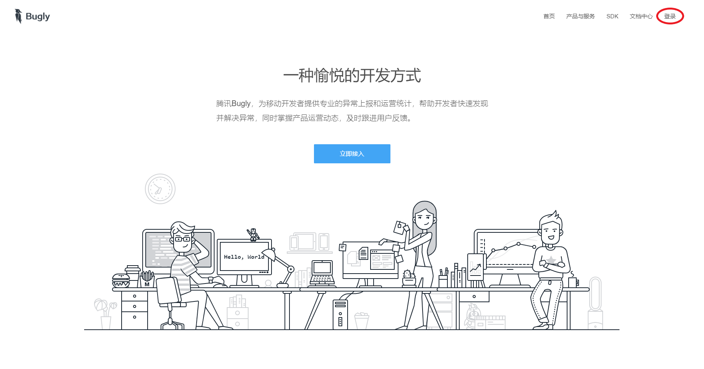
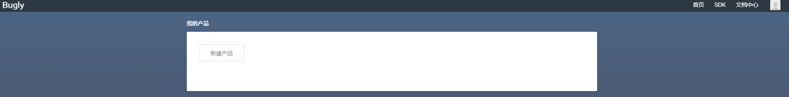
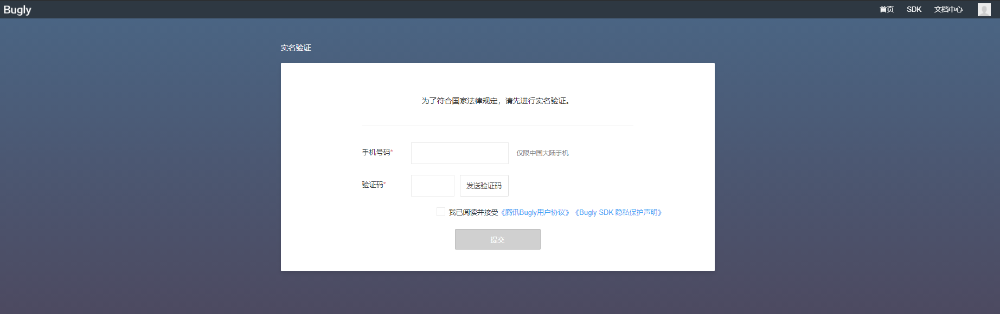
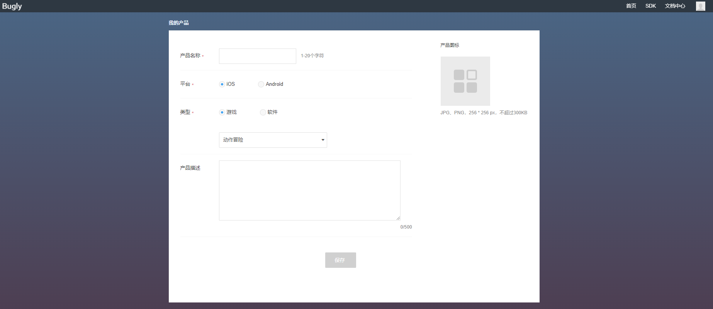
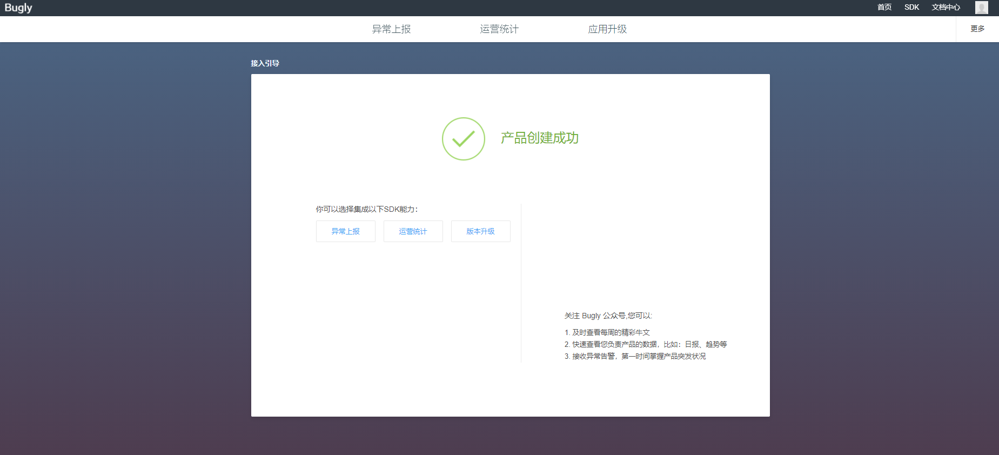
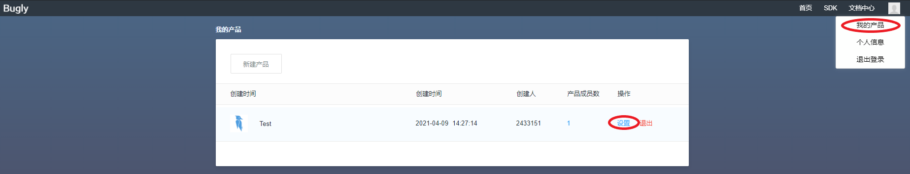

腾讯Bugly是一个基于微信[Tinker](https://github.com/Tencent/tinker)的热修复框架，可实现自动下载补丁包、合成以及应用补丁的功能，并提供了热更新管理后台让开发者对每个版本补丁进行管理。

所谓热修复，是指通过服务端下发补丁包，让已安装的客户端接收后进行动态更新，从而在不用重新安装APP的情况下修复应用缺陷。热修复在缺陷修复效率上要高于应用分发平台，但是由于绕开了应用分发平台的审核机制，该技术可能会成为某些企业或开发人员入侵用户设备的跳板。

对于审核机制严格的应用分发平台，比如Google Play和App Store，最好不要使用Tinker之类的热修复技术，否则将会面临违规和应用下架的风险。

尽管腾讯Bugly号称比Tinker简单方便，但是由于官方提供的[接入指南](https://bugly.qq.com/docs/user-guide/instruction-manual-android-hotfix/?v=20200312155538#sdk)实在是过于老旧，以至于实际操作当中经常出现各种问题，集成难度远不下于直接使用Tinker。因此以下内容可以视为官方接入指南的修正版。

## 注册Bugly账号

注册Bugly账号的目的，是为了使用Bugly管理平台对接入该SDK的应用进行管理。平台会为开发者所要接入的应用进行注册登记，并生成凭证，接入Bugly的应用必须包含有这一凭证信息才能受平台管理。

首先进入[Bugly注册页面](https://bugly.qq.com/v2)，使用QQ号登录：



然后点击“新建产品”，并进行实名验证：




完成实名验证之后，就进入了创建产品的界面，然后填写相关信息并保存：




可以看到，Bugly SDK提供了异常上报、运营统计以及版本升级三大功能，其中版本升级功能由Tinker热修复框架提供支持，这就是为什么不建议在上架Google Play等审核机制严格的应用分发平台的应用中集成使用Bugly的主要原因。

点击右上角用户头像，选择“我的产品”进入产品列表，然后选择其中一个产品，点击设置进入产品信息界面：




在产品信息当中，App ID和App Key是一个应用接入Bugly管理平台的唯一凭证，也是需要保密的关键信息。成员管理以及角色权限等部分与Bugly集成的内容没有太大关系，这里不做赘述。异常上报、运营统计以及应用升级功能，操作起来也相对简单，因此同样不做深入介绍。

## 添加插件依赖

首先在<font color=red>项目级</font>build.gradle文件中添加如下依赖：

```
buildscript {
    ···
    dependencies {
        ···
        classpath "com.tencent.bugly:tinker-support:1.1.9.3"
    }
}
```

>注意，截至2021年8月17日，官方旧指南中所添加的TinkerSupoort插件版本依然是1.1.5，而实际上，该插件在[JCenter](https://bintray.com/bugly/maven/TinkerSupport)和[Maven仓库](https://search.maven.org/)的最新版本已经达到1.2.3。**只有使用1.1.9.3版本及以上的TinkerSupport插件，才能够支持4.0以上版本的Gradle插件和Android Studio，以及5.0以上版本的Gradle**。考虑到JCenter已经宣布提供永久只读服务，而Gradle中的`jcenter()`又将被废弃（如果还要继续依赖JCenter，最好改为`maven { url 'http://jcenter.bintray.com/' }`），腾讯将不会继续在JCenter上更新这个依赖。

接着在app级build.gradle文件中引入依赖：

```
//需要添加tinker-support.gradle文件后才能生效
apply from: 'tinker-support.gradle'

android {
    ···
    defaultConfig {
        ···
        ndk {
            /*
            * 设置支持的SO库架构（armeabi、x86、armeabi-v7a、x86_64或arm64-v8a）
            * 请注意只设置支持的，不支持的不要添加；如果支持多个架构，用","进行分隔
            */
            abiFilters 'armeabi'
        }
    }
    ···
}

dependencies {
    //集成Tinker插件主体库，最新版本可访问Tinker的GitHub仓库进行了解
    implementation "com.tencent.tinker:tinker-android-lib:$specific_version"
    //集成Native Crash捕获功能，在引用SO库的情况下建议集成使用
    implementation "com.tencent.bugly:nativecrashreport:$specific_version"
    //集成crash上报功能
    implementation "com.tencent.bugly:crashreport_upgrade:$specific_version"
    ···
}
```

>注意，在集成使用了早期Bugly SDK的项目当中，可能会包含有`com.tencent.bugly:crashreport`这个依赖，在迁移到新版Bugly SDK时，需要将该依赖替换成`com.tencent.bugly:crashreport_upgrade`。

## 添加tinker-support.gradle文件

tinker-support.gradle是官方默认的Gradle脚本文件名称，实际上用别的名称也可以，只不过app级build.gradle文件的`apply from`部分也要跟着做一些改动。这个脚本文件的创建位置在app的目录下，和app级build.gradle文件处于**同级**。

官方给出了默认的配置内容：

```
apply plugin: 'com.tencent.bugly.tinker-support'

def bakPath = file("${buildDir}/bakApk/")

/**
 * 此处填写每次构建生成的基准包目录
 */
def baseApkDir = "app-0208-15-10-00"

/**
 * 对于插件各参数的详细解析请参考
 * https://bugly.qq.com/docs/utility-tools/plugin-gradle-hotfix/
 */
tinkerSupport {

    //开启tinker-support插件，默认值true
    enable = true

    //指定归档目录，默认值当前module的子目录tinker
    autoBackupApkDir = "${bakPath}"

    //是否启用覆盖tinkerPatch配置功能，默认值false
    //开启后tinkerPatch配置不生效，即无需添加tinkerPatch
    overrideTinkerPatchConfiguration = true

    //编译补丁包时，必需指定基线版本的apk，默认值为空
    //如果为空，则表示不是进行补丁包的编译
    //@{link tinkerPatch.oldApk }
    baseApk = "${bakPath}/${baseApkDir}/app-release.apk"

    //对应tinker插件applyMapping
    baseApkProguardMapping = "${bakPath}/${baseApkDir}/app-release-mapping.txt"

    //对应tinker插件applyResourceMapping
    baseApkResourceMapping = "${bakPath}/${baseApkDir}/app-release-R.txt"

    //构建基准包和补丁包都要指定不同的tinkerId，并且必须保证唯一性
    tinkerId = "base-1.0.1"

    //构建多渠道补丁时使用
    //buildAllFlavorsDir = "${bakPath}/${baseApkDir}"

    //是否启用加固模式，默认为false.(tinker-spport 1.0.7起支持）
    //isProtectedApp = true

    //是否开启反射Application模式，设为true会方便一些
    enableProxyApplication = true

    //是否支持新增非export的Activity（注意：设置为true才能修改AndroidManifest文件）
    supportHotplugComponent = true

}

/**
 * 一般来说,我们无需对下面的参数做任何的修改
 * 对于各参数的详细介绍请参考:
 * https://github.com/Tencent/tinker/wiki/Tinker-%E6%8E%A5%E5%85%A5%E6%8C%87%E5%8D%97
 */
tinkerPatch {
    //oldApk ="${bakPath}/${appName}/app-release.apk"
    ignoreWarning = false
    useSign = true
    dex {
        dexMode = "jar"
        pattern = ["classes*.dex"]
        loader = []
    }
    lib {
        pattern = ["lib/*/*.so"]
    }

    res {
        pattern = ["res/*", "r/*", "assets/*", "resources.arsc", "AndroidManifest.xml"]
        ignoreChange = []
        largeModSize = 100
    }

    packageConfig {
    }
    sevenZip {
        zipArtifact = "com.tencent.mm:SevenZip:1.1.10"
        //path = "/usr/local/bin/7za"
    }
    buildConfig {
        keepDexApply = false
        //tinkerId = "1.0.1-base"
        //applyMapping = "${bakPath}/${appName}/app-release-mapping.txt" //可选，设置mapping文件，建议保持旧apk的proguard混淆方式
        //applyResourceMapping = "${bakPath}/${appName}/app-release-R.txt" //可选，设置R.txt文件，通过旧apk文件保持ResId的分配
    }
}
```

## 初始化SDK

初始化SDK的代码通常都在Application类当中执行。根据tinker-support.gradle文件中enableProxyApplication是否设为true，可以衍生出出两种配置Application的方式。在介绍它们之前，先了解一下接入Bugly SDK需要声明哪些权限：

```
<uses-permission android:name="android.permission.INTERNET" />
<uses-permission android:name="android.permission.ACCESS_NETWORK_STATE" />
<uses-permission android:name="android.permission.ACCESS_WIFI_STATE" />
<uses-permission android:name="android.permission.WRITE_EXTERNAL_STORAGE" />
```

+ **enableProxyApplication = true的情形**

如果将设为true，那么就会启用Application的代理，插件会动态替换AndroidMinifest文件中的Application为预先定义好用于反射真实Application的类，而开发者只需要编写自己的自定义Application类即可，这样能极大降低接入成本。示例代码如下：

```
class MyApplication: Application() {
    override fun onCreate() {
        super.onCreate()
        //SDK初始化，APP_ID填入Bugly平台中对应产品的App ID
        Bugly.init(this,APP_ID,BuildConfig.DEBUG)
        //Crash收集上传功能初始化，APP_ID填入Bugly平台中对应产品的App ID
        CrashReport.initCrashReport(this,APP_ID,BuildConfig.DEBUG)
        //检查是否存在新版本
        Beta.checkAppUpgrade()
        //检查是否存在热修复补丁
        Beta.checkHotFix()
    }

    override fun attachBaseContext(base: Context?) {
        super.attachBaseContext(base)
        //安装Tinker
        Beta.installTinker(this)
    }
}
```

+ **enableProxyApplication = false的情形**

将enableProxyApplication设置为false，表示不使用代理方式调用Application类，而是自行编写继承于TinkerApplication的Application子类，以及继承于DefaultApplicationLike的ApplicationLike子类，接入成本较高，但是具有更好的兼容性。示例代码如下：

```
/*自定义Application*/
class MyApplication(tinkerFlags: Int, delegateClassName: String,
                     loaderClassName: String, tinkerLoadVerifyFlag: Boolean):
    TinkerApplication(tinkerFlags, delegateClassName, loaderClassName, tinkerLoadVerifyFlag) {
        constructor(): this(ShareConstants.TINKER_ENABLE_ALL,
        "com.example.application.MyApplicationLike",
        "com.tencent.tinker.loader.TinkerLoader", false)
}
```

```
/*自定义ApplicationLike*/
class MyApplicationLike(
    application: Application?,
    tinkerFlags: Int, tinkerLoadVerifyFlag: Boolean,
    applicationStartElapsedTime: Long, applicationStartMillisTime: Long,
    tinkerResultIntent: Intent?
) : DefaultApplicationLike(
    application, tinkerFlags, tinkerLoadVerifyFlag,
    applicationStartElapsedTime, applicationStartMillisTime, tinkerResultIntent
){
    override fun onCreate() {
        super.onCreate()
        Bugly.init(application, APP_ID, BuildConfig.DEBUG)
        CrashReport.initCrashReport(application,APP_ID, BuildConfig.DEBUG)
        Beta.checkAppUpgrade()
        Beta.checkHotFix()
    }

    override fun onBaseContextAttached(base: Context?) {
        super.onBaseContextAttached(base)
        Beta.installTinker(this)
    }

    fun registerActivityLifecycleCallback(callbacks: ActivityLifecycleCallbacks?) {
        application.registerActivityLifecycleCallbacks(callbacks)
    }
}
```

## 其他配置

+ **Activity配置**

```
<activity
    android:name="com.tencent.bugly.beta.ui.BetaActivity"
    android:configChanges="keyboardHidden|orientation|screenSize|locale"
    android:theme="@android:style/Theme.Translucent" />
```

+ **FileProvider配置**

如果要兼容Android N或者以上的设备，必须要在AndroidManifest文件中配置FileProvider来访问共享路径的文件：

```
<provider
    android:name="android.support.v4.content.FileProvider"
    android:authorities="${applicationId}.fileProvider"
    android:exported="false"
    android:grantUriPermissions="true">
    <meta-data
        android:name="android.support.FILE_PROVIDER_PATHS"
        android:resource="@xml/provider_paths"/>
</provider>
```

+ **安装包签名**

无论是安装在设备上的应用还是上传到Bugly平台的更新包，都必须是**同样签名的Release版本apk文件**，否则就会出现能够下载但是无法安装的问题。