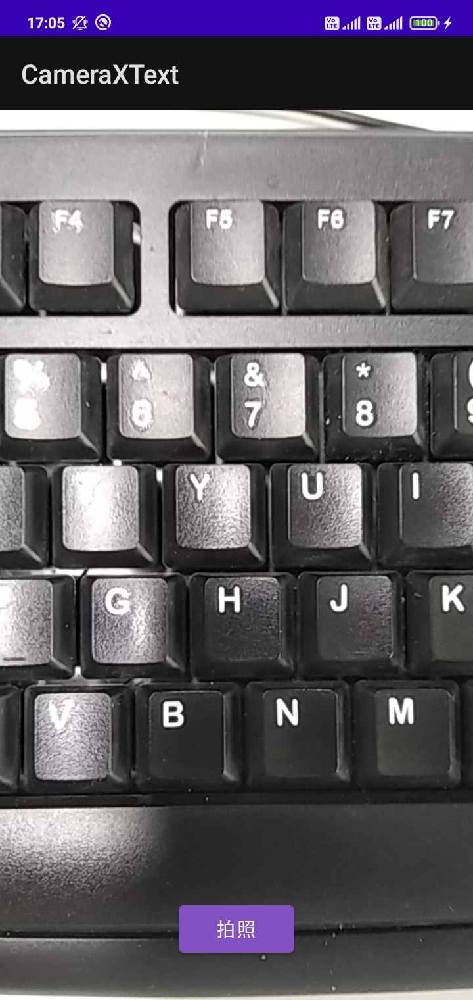
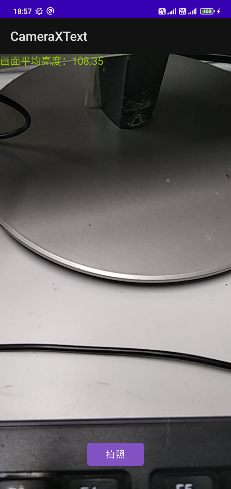

## 何为CameraX

[CameraX](https://developer.android.google.cn/training/camerax)是Google官方推出的一个Jetpack组件，其作用是简化相机功能API调用，从而降低那些使用到相机功能的应用的开发难度。目前CameraX所能兼容的最低系统版本为**Android 5.0**，因为CameraX是基于[Camera2](https://developer.android.google.cn/training/camera2)进一步开发的，而Camera2最低也只能支持到Android 5.0。

CameraX与Camera2相比，最重要的区别在于CameraX引入了生命周期感知能力，并且基于“用例”（Use cases）简化了预览、拍照、帧捕捉以及视频拍摄这四个方面的功能开发。除此之外，CameraX还自行处理了不同系统版本的兼容性问题，为开发者屏蔽掉诸多兼容适配方面的细节。除此之外，Google还提供了一些[扩展API](https://developer.android.google.cn/training/camerax/vendor-extensions)，通过调用它们，开发者可以在**满足要求**的设备上实现某些特效。

## 前置工作

由于CameraX没有集成到Android SDK中，因此需要另外引入：

```
// 基于Camera2实现的CameraX核心库
implementation "androidx.camera:camera-camera2:${specified_version}"

// CameraX Lifecycle支持库
implementation "androidx.camera:camera-lifecycle:${specified_version}"

// CameraX专用视图控件
implementation "androidx.camera:camera-view:${specified_version}"
```

> 截止2022年9月26日，CameraX最新发布的稳定版本为1.1.0。更多版本信息，可访问[https://developer.android.google.cn/jetpack/androidx/releases/camera](https://developer.android.google.cn/jetpack/androidx/releases/camera)查看。

相机和存储是敏感权限，因此必须在Android Manifest文件中声明，同时在高版本系统上需要[动态授权](Android/contpro?id=运行时权限)：

```
<!--声明与相机有关的权限和功能-->
<uses-permission android:name="android.permission.CAMERA"/>
<uses-feature android:name="android.hardware.camera" />
<uses-feature android:name="android.hardware.autofocus" />
<uses-feature android:name="android.hardware.camera.any" />

<!--声明访问存储空间的权限-->
<uses-permission android:name="android.permission.READ_EXTERNAL_STORAGE"/>
<uses-permission android:name="android.permission.WRITE_EXTERNAL_STORAGE" android:maxSdkVersion="29" />
```

## 基本使用

前面提到，CameraX基于“用例”（Use cases）简化了预览、拍照、帧捕捉以及视频拍摄功能的开发。所谓用例，实际上就是一些封装良好的类或者接口，只要开发者简单配置好这些实例对象，就能轻松开发出可以提供最基础功能的相机应用。目前Google官方提供的用例有四种：画面预览、拍照、帧捕捉以及视频拍摄。因此下面也会从这四个功能展开，介绍CameraX的基本使用方式。

### 画面预览

CameraX提供了专门的视图控件`androidx.camera.view.PreviewView`，只要在布局文件中摆放好即可。在Activity或Fragment中，完成相机功能初始化并展示画面预览的步骤如下：

首先要获取`ListenableFuture<ProcessCameraProvider>`对象（如下列代码所示）。该对象的主要用途是通过调用一个单例，完成相机设备与应用生命周期的绑定。

```
val cameraProviderFuture = ProcessCameraProvider.getInstance(this)
```

接着为ProcessCameraProvider对象设置监听器以及线程池（如下列代码所示）。监听器是`Runnable`类型，在下面代码中就是lambda表达式的部分；线程池一般会选择主线程，因此传入的参数为`ContextCompat.getMainExecutor(this)`。

```
cameraProviderFuture.addListener({···}, ContextCompat.getMainExecutor(this)）
```

画面预览功能在监听器中实现，如下面代码所示：

```
// 使用ProcessCameraProvider对象完成相机设备与生命周期所有者的绑定
val cameraProvider: ProcessCameraProvider = cameraProviderFuture.get()

// 配置画面预览
val preview = Preview.Builder()
    .build()
    .also {
        // 这里让PreviewView控件提供用于渲染画面的Surface
        it.setSurfaceProvider(binding.previewView.surfaceProvider)
    }
        

// 设置所要调用的相机，默认后置
val cameraSelector = CameraSelector.DEFAULT_BACK_CAMERA

// 设置画面预览用例
try {
    // 在重新绑定用例之前，把原来绑定过的用例全部解绑
    cameraProvider.unbindAll()
    // 为相机设备绑定画面预览用例
    cameraProvider.bindToLifecycle(this, cameraSelector, preview).apply {
        binding.previewView.setOnClickListener {
            // 此处设置点击预览画面进行重新对焦
            cameraControl.startFocusAndMetering(FocusMeteringAction.Builder(
                binding.previewView.meteringPointFactory.createPoint(it.x, it.y)
            ).build())
        }
    }
} catch(e: Exception) {
    // TODO: 捕获并处理异常
}
```

在执行完上述代码之后，开发者就能在应用上看到类似于下图的预览画面：



### 拍照

拍照功能的核心是`ImageCapture`对象（用例）的使用。`ImageCapture`对象的创建如下列代码所示：

```
val imageCapture = ImageCapture.Builder()
    .setCaptureMode(···)         // 设置照片质量
    .setTargetRotation(···)      // 设置照片旋转方向，如Surface.ROTATION_0
    .setIoExecutor(···)          // 设置照片保存IO操作所使用的线程池
    .setFlashMode(···)           // 设置闪光灯模式，如 FLASH_MODE_AUTO
    ···                          // 更多配置详见ImageCapture.java
    .build()
```

在调用`ImageCapture`对象的`takePicture()`方法之前，还需要对保存的照片进行配置，如保存位置和文件名：

```
// 注意在Android 10或更高版本上，不能通过路径名直接访问外部存储空间的多媒体文件，需要使用MediaStore
val photoFile = File(···)
val outputOptions = ImageCapture.OutputFileOptions.Builder(photoFile).build()
```

开始执行拍照动作：

```
imageCapture.takePicture(outputOptions, ContextCompat.getMainExecutor(this), 
    object : ImageCapture.OnImageSavedCallback {
        override fun onError(exc: ImageCaptureException) {
            // TODO: 捕获和处理照片保存过程中出现的异常
        }

        override fun onImageSaved(output: ImageCapture.OutputFileResults) {
            // 获取保存后的照片路径信息
            val savedUri = output.savedUri
            ···
        }
    })
```

### 帧捕捉

帧捕捉在Google官方文档中被称为“图像分析”，顾名思义，由于预览画面是实时动态变化的连续画面，因此必然会存在帧率的概念，图像分析就是对连续画面的其中若干帧或所有帧进行分析。

实现帧捕捉有两个要点：1）创建`ImageAnalysis`对象（用例）；2）实现`ImageAnalysis.Analyzer`接口。下面分别介绍具体操作。

+ **创建`ImageAnalysis`对象（用例）**

`ImageAnalysis`对象可将分析器（图像使用方）连接到CameraX（图像生成方）。应用可以使用`ImageAnalysis.Builder`来构建`ImageAnalysis`对象，如下列代码所示：

```
val imageAnalyzer = ImageAnalysis.Builder()
    .setOutputImageFormat(···)  // 设置输出的图像格式，默认YUV_420_888，支持RGBA_8888
    .setTargetResolution(···)   // 设置图像的分辨率，注意不能和setTargetAspectRatio同时使用
    .setTargetAspectRatio(···)  // 设置图像宽高比，注意不能和setTargetResolution同时使用
    .setTargetRotation(···)     // 设置图像的旋转方向
    .setTargetName(···)         // 设置用于调试的目标名称
    .setBackgroundExecutor(···) // 设置后台执行任务的线程池
    .setBackpressureStrategy()  // 设置背压策略，如STRATEGY_BLOCK_PRODUCER
    .setImageQueueDepth(···)    // 设置分析器和CameraX之间的图像队列深度
    .build()
```

+ **实现`ImageAnalysis.Analyzer`接口**

`ImageAnalysis.Analyzer`接口就是上面提到的分析器，通常情况下只需要重写其`analyze()`方法。

这个方法传入一个`ImageProxy`类型的对象，在源码注释中描述为“待分析的图片”。`ImageProxy`是一个继承`AutoCloseable`的接口，`analyze()`方法实际传入的对象应该是已经被实现了的子类，这个接口包含的方法可以参考Google的[API文档](https://developer.android.google.cn/reference/androidx/camera/core/ImageProxy#summary)。

`ImageAnalysis.Analyzer`接口的实现类似于下列代码：

```
val analyzer = object: ImageAnalysis.Analyzer {

    override fun analyze(image: ImageProxy) {
        image.use {
            // planes表示的是一张图像的YUV，其中planes[0] = Y，planes[1] = U，planes[2] = V
            it.planes.apply {
                ···
            }
        }
    }

    // 这是Google官方示例代码提供的一个把ByteBuffer转换成ByteArray()的方法，可用于处理成Bitmap
    private fun ByteBuffer.toByteArray(): ByteArray {
        // Rewind the buffer to zero
        rewind()
        val data = ByteArray(remaining())
        // Copy the buffer into a byte array
        get(data)
        // Return the byte array
        return data
    }
}
```

> YUV和RGB类似，也是一种图像采样和编码系统。其中Y表示亮度，UV组合表示色度。更多关于YUV的介绍，可以参考[这里](https://zhuanlan.zhihu.com/p/85620611)。


在经过上面两个步骤之后，还需要把实现好的`ImageAnalysis.Analyzer`接口通过`setAnalyzer()`传给之前创建好的`ImageAnalysis`对象：

```
// cameraExecutor是另外创建的线程池，不能使用UI线程池来代替
imageAnalyzer.setAnalyzer(cameraExecutor, analyzer)
```

`ImageAnalysis`对象作为用例，最后也是跟预览用例一样要传给`ProcessCameraProvider`对象使用：

```
cameraProvider.bindToLifecycle(this, cameraSelector, preview, imageAnalyzer)
```

下图展示的是应用从图像流中对各帧亮度（也就是image.planes[0]的数据）进行分析，并展示在界面左上角：



### 视频拍摄

