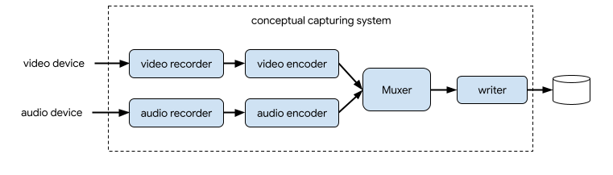
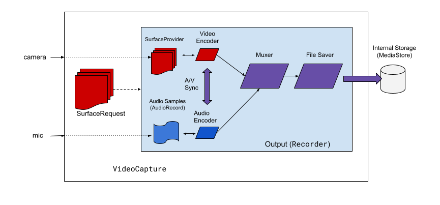
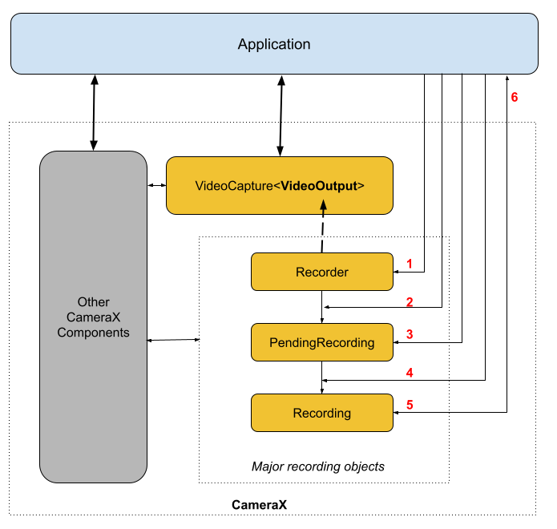

## 何为CameraX

[CameraX](https://developer.android.google.cn/training/camerax)是Google官方推出的一个Jetpack组件，其作用是简化相机功能API调用，从而降低那些使用到相机功能的应用的开发难度。目前CameraX所能兼容的最低系统版本为**Android 5.0**，因为CameraX是基于[Camera2](https://developer.android.google.cn/training/camera2)进一步开发的，而Camera2最低也只能支持到Android 5.0。

CameraX与Camera2相比，最重要的区别在于CameraX引入了生命周期感知能力，并且基于“用例”（Use cases）简化了预览、拍照、帧捕捉以及视频拍摄这四个方面的功能开发。除此之外，CameraX还自行处理了不同系统版本的兼容性问题，为开发者屏蔽掉诸多兼容适配方面的细节。除此之外，Google还提供了一些[扩展API](https://developer.android.google.cn/training/camerax/vendor-extensions)，通过调用它们，开发者可以在**满足要求**的设备上实现某些特效。

## 前置工作

由于CameraX没有集成到Android SDK中，因此需要另外引入：

```
// 基于Camera2实现的CameraX核心库
implementation "androidx.camera:camera-camera2:${specified_version}"

// CameraX Lifecycle支持库
implementation "androidx.camera:camera-lifecycle:${specified_version}"

// CameraX专用视图控件
implementation "androidx.camera:camera-view:${specified_version}"

// CameraX视频拍摄功能依赖库
implementation "androidx.camera:camera-video:${specified_version}"
```

> 截止2022年9月26日，CameraX最新发布的稳定版本为1.1.0。更多版本信息，可访问[https://developer.android.google.cn/jetpack/androidx/releases/camera](https://developer.android.google.cn/jetpack/androidx/releases/camera)查看。

相机和存储是敏感权限，因此必须在Android Manifest文件中声明，同时在高版本系统上需要[动态授权](Android/contpro?id=运行时权限)：

```
<!--声明与相机有关的权限和功能-->
<uses-permission android:name="android.permission.CAMERA"/>
<uses-feature android:name="android.hardware.camera" />
<uses-feature android:name="android.hardware.autofocus" />
<uses-feature android:name="android.hardware.camera.any" />

<!--声明访问存储空间的权限-->
<uses-permission android:name="android.permission.READ_EXTERNAL_STORAGE"/>
<uses-permission android:name="android.permission.WRITE_EXTERNAL_STORAGE" android:maxSdkVersion="28"/>

<!--声明访问麦克风权限-->
<uses-permission android:name="android.permission.RECORD_AUDIO"/>
```

## 基本使用

前面提到，CameraX基于“用例”（Use cases）简化了预览、拍照、帧捕捉以及视频拍摄功能的开发。所谓用例，实际上就是一些封装良好的类或者接口，只要开发者简单配置好这些实例对象，就能轻松开发出可以提供最基础功能的相机应用。目前Google官方提供的用例有四种：画面预览、拍照、帧捕捉以及视频拍摄。因此下面也会从这四个功能展开，介绍CameraX的基本使用方式。

### 画面预览

CameraX提供了专门的视图控件`androidx.camera.view.PreviewView`，只要在布局文件中摆放好即可。在Activity或Fragment中，完成相机功能初始化并展示画面预览的步骤如下。

首先要获取`ListenableFuture<ProcessCameraProvider>`对象（如下列代码所示）。该对象的主要用途是通过调用一个单例，完成相机设备与应用生命周期的绑定。

```
val cameraProviderFuture = ProcessCameraProvider.getInstance(this)
```

接着为`ProcessCameraProvider`对象设置监听器以及线程池（如下列代码所示）。监听器是`Runnable`类型，在下面代码中就是lambda表达式的部分；线程池选择**主线程**——而且必须是主线程，否则`ListenableFuture<ProcessCameraProvider>`没法回调处理——因此传入的参数为`ContextCompat.getMainExecutor(this)`。

```
cameraProviderFuture.addListener({···}, ContextCompat.getMainExecutor(this)）
```

画面预览功能在监听器中实现，如下面代码所示：

```
// 使用ProcessCameraProvider对象完成相机设备与生命周期所有者的绑定
val cameraProvider: ProcessCameraProvider = cameraProviderFuture.get()

// 配置画面预览
val preview = Preview.Builder()
    .build()
    .also {
        // 这里让PreviewView控件提供用于渲染画面的Surface
        it.setSurfaceProvider(binding.previewView.surfaceProvider)
    }
        

// 设置所要调用的相机，默认后置
val cameraSelector = CameraSelector.DEFAULT_BACK_CAMERA

// 设置画面预览用例
try {
    // 在重新绑定用例之前，把原来绑定过的用例全部解绑
    cameraProvider.unbindAll()
    // 为相机设备绑定画面预览用例
    cameraProvider.bindToLifecycle(this, cameraSelector, preview).apply {
        binding.previewView.setOnClickListener {
            // 此处设置点击预览画面进行重新对焦
            cameraControl.startFocusAndMetering(FocusMeteringAction.Builder(
                binding.previewView.meteringPointFactory.createPoint(it.x, it.y)
            ).build())
        }
    }
} catch(e: Exception) {
    // TODO: 捕获并处理异常
}
```

> 注意，画面预览是**最基础**的功能，后面介绍的其他三个功能，在正常情况下都应该跟画面预览组合使用。

### 拍照

拍照功能的核心是`ImageCapture`对象（用例）的使用。`ImageCapture`对象的创建如下列代码所示：

```
val imageCapture = ImageCapture.Builder()
    .setCaptureMode(···)         // 设置照片质量
    .setTargetRotation(···)      // 设置照片旋转方向，如Surface.ROTATION_0
    .setIoExecutor(···)          // 设置照片保存IO操作所使用的线程池
    .setFlashMode(···)           // 设置闪光灯模式，如 FLASH_MODE_AUTO
    ···                          // 更多配置详见ImageCapture.java
    .build()
```

在调用`ImageCapture`对象的`takePicture()`方法之前，还需要对保存的照片进行配置，如保存位置和文件名：

```
val name = "···"
// 使用MediaStore，以确保应用在高版本系统上也能正常访问到外部共享存储的文件
val outputOptions = ImageCapture.OutputFileOptions.Builder(contentResolver,
        MediaStore.Images.Media.EXTERNAL_CONTENT_URI,
        ContentValues().apply { put(MediaStore.Images.Media.DISPLAY_NAME, name) }).build()
```

设置拍照动作：

```
imageCapture.takePicture(outputOptions, cameraExecutor, object : ImageCapture.OnImageSavedCallback {
        override fun onError(exc: ImageCaptureException) {
            // TODO: 捕获和处理照片保存过程中出现的异常
        }

        override fun onImageSaved(output: ImageCapture.OutputFileResults) {
            // 获取保存后的照片路径信息
            val savedUri = output.savedUri
            ···
        }
    })
```

将用例传给到`ProcessCameraProvider`对象：

```
cameraProvider.bindToLifecycle(this, cameraSelector, preview, imageCapture)
```

上述步骤完成后，基础的拍照功能就实现了。

### 帧捕捉

帧捕捉在Google官方文档中被称为“图像分析”，顾名思义，由于预览画面是实时动态变化的连续画面，因此必然会存在帧率的概念，图像分析就是对连续画面的其中若干帧或所有帧进行分析。

实现帧捕捉有两个要点：1）创建`ImageAnalysis`对象（用例）；2）实现`ImageAnalysis.Analyzer`接口。下面分别介绍具体操作。

+ **创建`ImageAnalysis`对象（用例）**

`ImageAnalysis`对象可将分析器（图像使用方）连接到CameraX（图像生成方）。应用可以使用`ImageAnalysis.Builder`来构建`ImageAnalysis`对象，如下列代码所示：

```
val imageAnalyzer = ImageAnalysis.Builder()
    .setOutputImageFormat(···)  // 设置输出的图像格式，默认YUV_420_888，支持RGBA_8888
    .setTargetResolution(···)   // 设置图像的分辨率，注意不能和setTargetAspectRatio同时使用
    .setTargetAspectRatio(···)  // 设置图像宽高比，注意不能和setTargetResolution同时使用
    .setTargetRotation(···)     // 设置图像的旋转方向
    .setTargetName(···)         // 设置用于调试的目标名称
    .setBackgroundExecutor(···) // 设置后台执行任务的线程池
    .setBackpressureStrategy()  // 设置背压策略，如STRATEGY_BLOCK_PRODUCER
    .setImageQueueDepth(···)    // 设置分析器和CameraX之间的图像队列深度
    .build()
```

+ **实现`ImageAnalysis.Analyzer`接口**

`ImageAnalysis.Analyzer`接口就是上面提到的分析器，通常情况下只需要重写其`analyze()`方法。

这个方法传入一个`ImageProxy`类型的对象，在源码注释中描述为“待分析的图片”。`ImageProxy`是一个继承`AutoCloseable`的接口，`analyze()`方法实际传入的对象应该是已经被实现了的子类，这个接口包含的方法可以参考Google的[API文档](https://developer.android.google.cn/reference/androidx/camera/core/ImageProxy#summary)。

`ImageAnalysis.Analyzer`接口的实现类似于下列代码：

```
val analyzer = object: ImageAnalysis.Analyzer {

    override fun analyze(image: ImageProxy) {
        image.use {
            // planes表示的是一张图像的YUV，其中planes[0] = Y，planes[1] = U，planes[2] = V
            it.planes.apply {
                ···
            }
        }
    }

    // 这是Google官方示例代码提供的一个把ByteBuffer转换成ByteArray()的方法，可用于处理成Bitmap
    private fun ByteBuffer.toByteArray(): ByteArray {
        // Rewind the buffer to zero
        rewind()
        val data = ByteArray(remaining())
        // Copy the buffer into a byte array
        get(data)
        // Return the byte array
        return data
    }
}
```

> YUV和RGB类似，也是一种图像采样和编码系统。其中Y表示亮度，UV组合表示色度。更多关于YUV的介绍，可以参考[这里](https://zhuanlan.zhihu.com/p/85620611)。


在经过上面两个步骤之后，还需要把实现好的`ImageAnalysis.Analyzer`接口通过`setAnalyzer()`传给之前创建好的`ImageAnalysis`对象：

```
// cameraExecutor是另外创建的线程池，不能在主线程执行图像分析功能
imageAnalyzer.setAnalyzer(cameraExecutor, analyzer)
```

`ImageAnalysis`对象作为用例，最后也是跟预览以及拍照用例一样，传给`ProcessCameraProvider`对象使用：

```
cameraProvider.bindToLifecycle(this, cameraSelector, preview, imageCapture, imageAnalyzer)
```

### 视频拍摄

视频拍摄和上面三个功能相比要复杂得多，因为视频拍摄不光要考虑处理视频流，还要考虑处理音频流。下图是Google官方在其文档中所提供的视频与音频捕获系统的概念图。可以看到，视频和音频最开始是分别捕获和编码的，然后经过Muxer（Google官方称之为媒体复用器）对这两个流进行多路复用，最后才写入磁盘中。



在CameraX中，视频拍摄使用的是`VideoCapture`用例。下图为Google官方在其文档中所提供的概念图，用于描述这一解决方案所需的架构组件。




从图中可以看到，`VideoCapture`用例所包含的高级架构组件包括：

+ SurfaceProvider，表示视频来源；
+ AudioSource，表示音频来源；
+ 用于对视频/音频进行编码和压缩的两个编码器；
+ 用于对两个流进行多路复用的媒体复用器；
+ 用于输出结果的文件保存器。

#### VideoCapture API概述

VideoCapture API会对复杂的捕获引擎进行抽象化处理，为应用提供更加简单且直观的API。VideoCapture API包含可与应用通信的以下对象：

+ `VideoCapture`：顶级用例类，通过`CameraSelector`和其他`CameraX`用例绑定到`LifecycleOwner`。
+ `Recorder`：与`VideoCapture`紧密耦合的`VideoOutput`实现，用于视频和音频捕获，通过它创建录制对象。
+ `PendingRecording`：用于配置录制对象，提供启用音频和设置事件监听器等选项，必须使用`Recorder`来创建，否则不会录制任何内容。
+ `Recording`：用于执行实际录制操作，必须使用`PendingRecording`来创建。

下图展示了这些对象之间是如何交互的：



1. 使用`QualitySelector`创建`Recorder`；
2. 使用其中一个`OutputOptions`配置`Recorder`；
3. 如果需要，使用`withAudioEnabled()`启用音频；
4. 使用`VideoRecordEvent`监听器调用`start()`以开始录制；
5. 针对`Recording`使用`pause()`/`resume()`/`stop()`来控制录制操作；
6. 在事件监听器内响应`VideoRecordEvents`。

#### VideoCapture API的基本使用

+ **创建`Recorder`对象**

`Recorder`是一个实现了`VideoOutput`接口的类，其实例对象用于接收保存`VideoCapture`用例所捕获到视频帧（通常是MPEG4格式的）。`Recorder`可以将视频文件以`File`、`ParcelFileDescriptor`或者`MediaStore`的方式保存到磁盘上，按照现在的系统版本分布情况，通常建议使用`MediaStore`执行保存功能。`Recorder`会选择最适合系统的格式，最常见的视频编解码器是`H.264 AVC`，其容器格式为`MPEG-4`。

> 注意，截止2022年9月26日，`Recorder`仍然无法配置最终的视频编解码器和容器格式，因此默认录制的视频格式仅有mp4一种。

`Recorder`对象的构建采用的是[生成器模式](DesignPattern/创建型设计模式?id=三、builder)，并且需要跟`QualitySelector`搭配使用，类似于下列代码所示：

```
val qualitySelector = QualitySelector.fromOrderedList(listOf(
    Quality.UHD, Quality.FHD, Quality.HD, Quality.SD),
    FallbackStrategy.lowerQualityOrHigherThan(Quality.SD))

val videoRecorder = Recorder.Builder().setExecutor(cameraExecutor).setQualitySelector(qualitySelector).build()
```

首先来看`QualitySelector`。`QualitySelector`的作用是配置视频分辨率，Google提供的预定义分辨率有以下四种：

|预定义分辨率|描述说明|
|:--------:|:--------:|
|`Quality.UHD`|适用于**4K超高清**视频大小（2160p）|
|`Quality.FHD`|适用于**全高清**视频大小（1080p）|
|`Quality.HD`|适用于**高清**视频大小（720p）|
|`Quality.SD`|适用于**标清**视频大小（480p）|

目前市面上绝大多数手机都能支持上述四种分辨率当中的至少一种，因此`QualitySelector`对象一般采用的是上面示例代码的构建方式，即提供几个首选分辨率，并包含一个后备策略，以备在不支持任何首选分辨率时使用。在默认情况下，应用会请求设备所能支持的最高录制分辨率，如果所有请求分辨率都不受支持（这种情况极为少见），则授权CameraX选择最接近某一预定义标准的录制分辨率，比如示例代码中设置的`Quality.SD`。

在构建完`QualitySelector`对象之后，就可以将其传给`Recorder`对象。从上面的示例代码中还可以发现，`Recorder`对象的构建还需要传入一个线程池，这个线程池跟之前一样，也是不能选择UI线程，必须通过Java并发包创建专门的线程池，否则会导致应用主线程被阻塞引发ANR。

+ **创建`VideoCapture`用例**

`VideoCapture`用例的作用跟前面三个功能用例类似，也是要传给`ProcessCameraProvider`使用。但是要注意，<font color=red>`VideoCapture`用例不能跟`ImageAnalysis`用例同时使用</font>，否则它们会因为同时对图像帧进行处理而发生冲突，导致预览画面无法正常显示：

```
val videoCapture = VideoCapture.withOutput(videoRecorder)

cameraProvider.bindToLifecycle(this, cameraSelector, preview, imageCapture, videoCapture)
```

+ **创建`Recording`对象**

从实际开发来看，真正执行录制操作的其实不是`Recorder`对象，而是`Recording`对象（更确切地说是`PendingRecording`）。`Recording`对象的创建方式有两种（如此下列代码所示），但在本质上都相同；一个`Recorder`一次仅支持一个`Recording`对象。

```
// 从Recorder对象直接创建
val recording = videoRecorder.prepareRecording(context, mediaStoreOutput)
    .withAudioEnabled() // 录制视频的同时进行录音
    .start(cameraExecutor)) {
        // TODO: 监听VideoRecordEvent
    }

// 从VideoCapture用例获得Recorder对象再创建
val recording = videoCapture.output.prepareRecording(context, mediaStoreOutput)
    .withAudioEnabled() // 录制视频的同时进行录音
    .start(cameraExecutor) {
        // TODO: 监听VideoRecordEvent
    }
```

注意到在调用`prepareRecording()`时还传入了一个mediaStoreOutput参数，这个参数的类型为`MediaStoreOutputOptions`。从类名就可以看出，它和上面三个功能的“XXXOptions”一样，也是用来配置输出文件属性的。`MediaStoreOutputOptions`参数的配置方式可参考下列示例代码：

```
val name = "XXXX.mp4"

// 为文件配置属性，比如这里的DISPLAY_NAME
val contentValues = ContentValues().apply { put(MediaStore.Video.Media.DISPLAY_NAME, name) }

// contentResolver可以从Context对象中直接获取
val mediaStoreOutput = MediaStoreOutputOptions.Builder(contentResolver, MediaStore.Video.Media.EXTERNAL_CONTENT_URI)
            .setFileSizeLimit(···)            // 设置文件大小限制
            .setContentValues(contentValues)  // 设置文件属性
            .build()
```

在`Recording`对象创建的示例代码部分，可以看到它被创建之后调用了`start()`开始进行视频录制，这个函数传入了一个线程池（同样地，如果不想引发ANR，就不要传入主线程）和监听器的lambda表达式作为参数。监听器的唯一参数是`VideoRecordEvent`类型，主要提供`RecordingStats`和`OutputOptions`两个类型的字段，前者用于了解录制状态，后者用于了解录制文件的一些属性。监听器入参还可以通过检测类型是否属于`VideoRecordEvent.Finalize`，来判断录制是否已经结束。

除了`start()`之外，`Recording`对象还可以调用`pause()`、`resume()`以及`stop()`来分别让视频录制过程暂停、恢复以及终止。值得注意的是，当调用`stop()`时，不光录制过程会停止，所有关联的对象也会被自动清空，以免发生内存泄漏问题。因此一旦调用过`stop()`，在重新开始录制工作之前，应用必须重新配置`Recording`对象，防止发生NPE。

