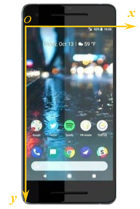
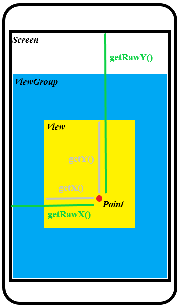

在Android的UI界面开发中，所有控件都是直接或间接继承自**View**（视图），而所有布局都是直接或间接继承自**ViewGroup**（事实上ViewGroup也是继承自View）。View作为Android中最基本的UI组件，可以在屏幕上绘制一块区域，并响应这块区域的各种事件。当单个原生控件远远不能满足开发需求的时候，可以构建自定义View来解决这一问题。

根据不同的实现方案，自定义View大致可以划分成两大类：一种是基于原生控件组合而成，另一种则是纯粹利用代码“绘制”出来（包括继承原生控件直接修改其内部实现机制）。毫无疑问，前者的实现难度较低，而后者需要开发者对视图绘制的机制有较多的理解和运用经验。换句话说，只有在原生控件完全无法满足开发需求的情况下，才需要考虑自己创建一个全新的自定义View。

## 基于原生控件组合的自定义View

一些具有固定排布位置和操作的原生控件可以封装成一个组合，在要调用的时候只需要将整个组合导入就能使用，减少重复代码。

### 编写布局文件

在项目指定模块的`res/layout`目录下，仿照Activity或Fragment被创建时附带生成的`.xml`文件，创建一个包含若干系统原生控件的布局。在这个布局文件中，系统控件被安排在相应的位置上，相应的控件ID和一些固有属性也被设置好。至此，基于原生控件组合的自定义View已经完成三分之一的工作。

当然，如果这些控件不需要跟用户交互，也不需要改变其样式和内容，实际上后面的步骤都不用再看下去了，只要在需要使用的地方，通过下面这种方式**直接引用该布局文件**即可：

```
<include layout="@layout/xxxx" 
    ···
    />
```

### 创建自定义View类

新建一个继承于特定Layout的类，用于更方便地控制自定义View，如下面示例代码所示：

```
// 用什么Layout无所谓，重要的是要继承一个ViewGroup；
// 使用下面这种形式的构造函数，相当于一次性重写所有形式的View构造函数，IDE可以帮助补全
class ExampleView @JvmOverloads constructor(
    context: Context, attrs: AttributeSet? = null, defStyleAttr: Int = 0
) : ConstraintLayout(context, attrs, defStyleAttr) {

    // 这里使用了View Binding，注意只能用bind，不能用inflate，
    // 否则会出现IDE渲染出来的界面全是一片空白的问题
    private val viewBinding = ViewExampleBinding.bind(
        LayoutInflater.from(context).inflate(R.layout.view_example, this)
    )
}
```

在编写完viewBinding的初始化逻辑之后，Android Studio就可以对这个自定义View进行渲染了，开发者将会在IDE中看到初步的渲染效果。

> 实际上，直接继承于ViewGroup也并无不可，但是开发者还要重写一个`onLayout`函数——通常情况下这是没必要花精力的；此外，**直接继承于View会导致View Binding的初始化不能正常执行**（原因未知），进而引起IDE只能渲染出一片空白的问题。

### 注册动作监听

注册动作监听是指调用原生控件的动作监听器，配置监听器的响应动作。注册动作监听有两种形式，一种是初始化阶段就写死，另一种是从外部接收动作。对于前者，可以在`init`函数中就写死，类似于下面的示例代码：

```
class ExampleView @JvmOverloads constructor(
    context: Context, attrs: AttributeSet? = null, defStyleAttr: Int = 0
) : ConstraintLayout(context, attrs, defStyleAttr) {
    private val viewBinding = ViewExampleBinding.bind(
        LayoutInflater.from(context).inflate(R.layout.view_example, this)
    )

    init {
        viewBinding.xxx.setOnClickListener { 
            // TODO: 设置动作监听响应
        }
    }
}
```

对于后者，则需要编写另外的函数供外部调用，以便传入响应动作，比如：

```
class ExampleView @JvmOverloads constructor(
    context: Context, attrs: AttributeSet? = null, defStyleAttr: Int = 0
) : ConstraintLayout(context, attrs, defStyleAttr) {
    private val viewBinding = ViewExampleBinding.bind(
        LayoutInflater.from(context).inflate(R.layout.view_example, this)
    )

    fun onClocked(action: () -> Unit) {
        viewBinding.xxx.setOnClickListener { 
            action()
        }
    }
}
```

实际上，不光是动作响应，控件的一些静态属性（比如颜色和文本之类的）也可以参考上面两种方式进行初始化或动态设置。至此，基于原生控件组合的自定义View已经完成开发，可以像原生控件一样直接被调用了。

## 基于代码绘制的自定义View

前面已经提到过，基于原生控件组合而成的自定义View，其实现门槛很低，因为绝大多数细节已经由封装良好的原生控件所屏蔽，开发者只需要关注这些原生控件可以提供什么功能就够了。事实上，基于原生控件组合而成的自定义View，跟直接往布局里拖对应的原生控件在本质上是一样的，这种自定义View并没有什么完全超出原生控件能力范围的地方。

但是有一些场景，比如画一个折线图，纯粹用原生控件是无法满足开发需求的（当然也可以用一个WebView加载画有折线图的网页，但那可能不是个很好的解决方案）。因此，开发者就要另辟蹊径，从最基本的代码开始，创建一个属于自己的自定义View。

基于代码绘制出来的自定义View，从一开始就没有什么布局文件，完全依靠Android SDK所提供的“画笔”和“画布”，在屏幕上直接绘制出开发者所需要的东西。因此无论是直接继承View、ViewGroup还是特定的原生控件，开发者都要在没有“所拖即所见”这种便利条件的情况下，仅凭代码和IDE提供的基础渲染功能，完成自定义View的开发。这就是为什么说基于代码绘制自定义View的技术门槛要高得多的根本原因。

### 坐标系

和数学教科书中的直角坐标系不同，**移动设备的屏幕坐标系**以其左上角为原点，X轴以水平向右为正方向，Y轴以竖直向下为正方向，如下图所示：



在实际开发中，View所参考的坐标系并不是屏幕坐标系，而是父控件（ViewGroup、容器）的坐标系。View在屏幕上的位置，都是相对于ViewGroup坐标系进行描述的。从某种角度来说，父控件坐标系可以视作屏幕坐标系原点沿Y轴正方向平移了一小段距离——这段纵向距离所形成屏幕空间，主要就是用来容纳系统状态栏和ActionBar。

View本身提供了`getLeft()`、`getTop()`、`getRight()`和`getBottom()`这四个方法，用于获取**相对坐标**。它们分别描述View左侧到ViewGroup坐标系Y轴的距离、View顶部到ViewGroup坐标系X轴的距离、View右侧到ViewGroup坐标系Y轴的距离以及View底部到ViewGroup坐标系X轴的距离。利用这四个相对坐标，View的尺寸就可以被计算出来。

最后要说的是View上任意一点的定位。View上任意一点都可以用`getX()`、`getY()`或者`getRawX()`、`getRawY()`来描述，这两组方法的差异在于：前面一组返回的是该点**相对于View左侧和顶部**的距离，后面一组返回的是该点**相对于屏幕坐标系X轴和Y轴**的距离。具体参考下图：



了解View上任意一点的定位机制，对于开发者在实际开发中使用MotionEvent处理屏幕点击等事件会有不小的帮助。

### `Paint`对象的使用

顾名思义，`Paint`对象就是起到“画笔”作用的，它控制着绘制样式和颜色等重要信息。无论是绘制几何图形、文本还是渲染Bitmap，都离不开`Paint`对象的参与。需要注意的是，在自定义View中，`Paint`对象通常在View初始化阶段就已经创建好备用，基本不会现用现创建一个。尤其是在`onDraw()`方法中，重复创建临时的`Paint`对象会给帧的绘制带来极大性能压力（其实也不光是`Paint`对象，任何临时对象都是如此），严重时会引起界面卡顿，影响使用体验。

```
class ExampleView2 @JvmOverloads constructor(
    context: Context, attrs: AttributeSet? = null, defStyleAttr: Int = 0
) : View(context, attrs, defStyleAttr) {
    // ✔推荐做法
    private val paint = Paint().apply {
        ···
    }

    ···

    override fun onDraw(canvas: Canvas?) {
        super.onDraw(canvas)
        // ❌错误做法
        val paint = Paint().apply {
            ···
        }
    }
}
```

`Paint`常用配置如下表所示：

|配置|用途描述|
|:-----:|:-----:|
|`color`|画笔颜色，输入Int类型的颜色值|
|`style`|描绘样式，`Paint.Style.FILL/STROKE/FILL_AND_STROKE`，表示只填充、只描边、填充并描边|
|`strokeWidth`|描边宽度|
|`typeface`|文本字体，比如等宽、加粗等等|
|`textSize`|文本大小，单位**像素**|
|`pathEffect`|路径效果，比如可以画出实线或者虚线等|

> `Paint`类的详细资料可以参考Google官方文档：https://developer.android.google.cn/reference/android/graphics/Paint

### `Canvas`对象的使用

上面已经介绍过“画笔”`Paint`，这里当然就要介绍与之相配合的“画布”`Canvas`了。按照源码注释的说法，`Canvas`对象主要负责在绘制过程中提供一些方法调用（或者说“持有这些调用”）。实际上，`Canvas`提供了大量`drawXXX()`形式的方法，开发者可以调用这些方法在“画布”上绘制出图像来。`Canvas`对象通常只在`onDraw()`方法中被调用，即：

```
class ExampleView2 @JvmOverloads constructor(
    context: Context, attrs: AttributeSet? = null, defStyleAttr: Int = 0
) : View(context, attrs, defStyleAttr) {
    ···
    override fun onDraw(canvas: Canvas?) {
        super.onDraw(canvas)
        // TODO: 这里调用Canvas对象进行绘制
        ···
    }
}
```

`Canvas`常用的方法如下表所示：

|方法|用途说明|
|:-----:|:-----:|
|`translate`|平移画布|
|`rotate`|旋转画布|
|`scale`|缩放画布|
|`save`|保存画布当前状态|
|`restore`|将画布还原成最近一个状态|
|`restoreToCount`|将画布还原成某一状态，传入的参数在调用`save()`时可获取到|
|`drawLine`|绘制线段|
|`drawCircle`|绘制圆形|
|`drawArc`|绘制弧线|
|`drawText`|绘制文字|
|`drawOval`|绘制椭圆|
|`drawRect`|绘制矩形|
|`drawPoint`|绘制点|
|`drawBitmap`|绘制图片|
|`withTranslation`|Kotlin扩展函数，将画布平移到某一位置并自动保存画布状态|
|`withRotation`|Kotlin扩展函数，将画布旋转一定角度并自动保存画布状态|
|`withScale`|Kotlin扩展函数，将画布缩放一定倍数并自动保存画布状态|

> `Canavs`类的详细资料可以参考Google官方文档：https://developer.android.google.cn/reference/android/graphics/Canvas

有一些开发者习惯先平移画布再绘制图像，而有一些则习惯直接绘制，这两种方法在本质上并没有什么区别，无非就是参考的坐标系有所不同：先平移画布再绘制图像，表示将画布作为绘制的参考系，**以画布所在当前位置作为绘制起点**；直接绘制则表示采用的是上文所述的“相对坐标系”，**以相对坐标系原点作为绘制起点**。无论是采用什么作为参考系，只要选择恰当的图像绘制位置参数，最终绘制出来的效果都是一样的。

最后需要强调的是，所有调用`Canvas`对象进行绘制的操作，都应当封装成相应方法函数，再统一放在`onDraw`当中调用。

### 基于SurfaceView的自定义视图

SurfaceView是View的子类，具备一切View所拥有的特性。跟一般的View相比，SurfaceView有一些不同之处：

1. SurfaceView拥有**独立**的绘图表面，可以在主线程之外的独立线程中进行绘制，**不占用主线程资源**；
2. 由于第一点的缘故，SurfaceView的绘图效率比一般View要高，适用于**界面更新较为频繁**的场景；
3. SurfaceView使用**双缓冲**机制，因此在播放视频时画面更流畅。

> 所谓双缓冲机制，是指SurfaceView在绘制图像时，采用前后台交替解析渲染展示的方式，确保图像绘制完整、流畅。简单理解就是类似于两个线程交替执行图像数据解析渲染的工作，一个线程在展示时，另一个线程已经解析渲染好数据准备展示，如此反复交替，SurfaceView的绘制效率就得到了提高。

基于SurfaceView的自定义视图，其一般的绘制步骤如下：

首先通过`getHolder()`获取到`SurfaceHolder`对象。这是一个SurfaceView的内部类，按照其文档说明，该类主要负责持有并控制绘图表面，开发者可以通过它来控制绘图表面的尺寸与格式，编辑绘图表面的像素点并监听绘图表面的变化。

接着**建议**使用`holder.surface.isValid`判断`SurfaceHolder`对象所持有的绘图表面是否已创建。如果绘图表面尚未创建出来即开始绘图，那么会引发应用崩溃，因此出于降低应用崩溃率的考量，建议在绘制之前先判断绘图表面是否正常存在。也可以在视图初始化阶段为`SurfaceHolder`对象调用`addCallback`方法，添加`SurfaceHolder.Callback`回调，这样就能准确掌握绘图表面的创建与销毁状态。

最后采用类似下面示例代码的形式进行绘制：

```
// 锁定缓冲区以在CPU上渲染，并返回画布供开发者绘图用（但不会获得硬件加速），必要步骤
val canvas = holder.lockCanvas()

// 锁定缓冲区以在GPU上渲染（可获得硬件加速），并返回画布供开发者绘图用，仅在Android O以上系统版本调用
val canvas = holder.lockHardwareCanvas()

// 在某些情形下，开发者可能还需要先调用Canvas对象的drawXXX方法，将上一次绘制的内容全部清理掉才能正常展示当前内容
canvas.drawXXX()

// 开发者使用获取到的Canvas对象绘制图像
···

// 释放缓冲区并将其发送到合成器，必要步骤
holder.unlockCanvasAndPost(canvas)
```

根据开发文档说明，`holder.lockCanvas()`通常返回的是可用于绘图的画布，当绘图表面尚未创建或处于不可编辑状态时，它会返回null。任何在`holder.lockCanvas()`和`holder.unlockCanvasAndPost()`这两个语句之间执行的绘图操作，其内容都不会被保留。

> 根据[Google官方文档的说明](https://source.android.google.cn/docs/core/graphics/arch-sh#canvas)，如果开发者曾调用过`holder.lockCanvas()`，则无法使用GLES在绘图表面上绘图或从视频解码器向其发送帧。`holder.lockCanvas()`会将CPU渲染程序连接到缓冲队列的生产方，直到绘图表面被销毁时才会断开连接。与大多数生产方（如GLES或Vulkan）不同，基于画布的CPU渲染程序**无法在断开连接后重新连接到绘图表面**。

## 自定义View属性

在Android Studio上开发应用UI界面时，可视化界面编辑器的右侧往往会有一个Attributes窗口（如下图所示），里面包含有许多当前选中视图的属性，比如宽高尺寸等等。出现在Attributes窗口里面的属性，绝大部分都是由Android SDK预置提供的，通常情况下配置好这些属性就可以满足开发需要。但是自定义View跟原生控件还是有差别的，个性化的内容可能就无法使用预置属性来满足了——比如一个继承IamgeView所开发的圆形ImageView的stroke，其宽度和颜色在预置属性中就找不到可以直接配置的地方，这种情况下需要配置自定义属性才行。


### 编写属性配置文件

配置自定义View属性的主要步骤有两个，第一步是在`res/values`目录下编写`attr.xml`文件，如下列示例代码所示：

```
<?xml version="1.0" encoding="utf-8"?>
<resources>
    <declare-styleable name="WatchView">
        <attr name="time_format" format="string"/>
        <attr name="color_hour_hand" format="color|reference"/>
    </declare-styleable>
</resources>
```

上面有几点需要注意。首先，自定义View属性的根节点必须声明为`declare-styleable`，其名称也要与自定义View的类名保持一致（比如自定义View的类名为WatchView，对应声明的自定义属性根节点名称也必须是WatchView）；其次，自定义View属性的具体项目必须声明为`attr`，名称必填且不应和预置属性相同以免造成混乱；最后，自定义View属性声明时必须通过配置`format`明确属性类型。

目前自定义View属性的命名并未有强制性的规范，通常情况下是参考Android SDK预置属性的命名风格。自定义View的属性类型，目前所支持的有以下几种：

|属性类型|描述说明|
|:-----:|:-----:|
|`string`|字符串类型|
|`color`|颜色类型，仅支持单色|
|`boolean`|布尔类型|
|`reference`|引用类型，一般表示`res`目录下的资源文件引用|
|`integer`|整数类型|
|`float`|浮点数类型|
|`dimension`|尺寸类型，比如视图宽高和字号等|
|`enum`|枚举类型，一次只能设置一种|
|`flags`|位或运算类型，一次可以设置若干个，使用`\|`进行分隔|
|`fraction`|百分数类型|

这里需要稍微关注一下枚举类型和位或运算类型这两种属性的声明方式。它们的声明方式实际上非常相似，如下面代码所示：

```
<declare-styleable name="···">
    <attr name="windowSoftInputMode">
        <flag name = "stateUnspecified" value = "0" />
        <flag name = "stateUnchanged" value = "1" />
        <flag name = "stateHidden" value = "2" />
        ···
    </attr>         
</declare-styleable>

<declare-styleable name="···">
    <attr name="orientation">
        <enum name="horizontal" value="0" />
        <enum name="vertical" value="1" />
    </attr>            
</declare-styleable>
```

可以看到，这两种属性不光要声明，还要提供有限数量的几个预设值供开发者使用。如果自定义View的某个属性仅能在有限数量的配置中选择其一或选择若干个配置组合使用，这种场景就比较适合将该属性声明成枚举类型或者位或运算类型。

最后需要强调的是，自定义View属性在UI开发界面当中使用的命名空间为`app:`，而不是`android:`。前者一般是视图独有的属性，后者是Android SDK提供的预置基础属性。只要不是在Android SDK当中预置的属性（尤其是开发者自定义的属性），都要使用`app:`作为命名空间。

### 自定义View解析属性资源

`attr.xml`文件编写完成之后，就需要在自定义View中完成属性资源的解析与赋值工作。这些工作通常需要在初始化阶段完成，如果使用Java开发，就要写在相关的构造方法中，使用Kotlin开发则采用类似下面示例代码的方式进行初始化：

```
init {
    val typeArray: TypedArray = context.obtainStyledAttributes(attrs, R.styleable.XXX)
    // 读取对应属性资源的值，并赋给自定义View的相应字段属性，此处省略赋值的步骤
    typeArray.apply {
        // 检索名为“time_format”的属性所对应的字符串值
        getString(R.styleable.WatchView_time_format)
        // 检索名为“color_hour_hand”的属性所对应的颜色值
        getColor(R.styleable.WatchView_color_hour_hand, Color.BLUE)
        ··· 
    }
    // 调用完之后必须回收该对象
    typeArray.recycle()
}
```

可以看到，初始化阶段必须调用`TypedArray`对象，读取自定义View所关联的属性，并检索指定属性以确定其是否已经在UI开发界面当中被赋过值，若有则配置相关的View属性，**初始化完成后还要回收`TypedArray`对象**。在检索属性时，开发者需要传入`R.styleable.View名称_View属性`格式的键值。一般而言，只要`attr.xml`文件编写正确，Android Studio就会为当前自定义View检索到对应的属性配置和属性项目，并给出智能提示，不用开发者记忆具体有哪些属性。

`TypedArray`对象提供以下几种方法读取相应的属性值，这些方法总体上跟`attr.xml`文件当中声明限定的属性类型是一一对应的：

|方法|描述说明|
|:-----:|:-----:|
|`getString()`|获取字符串类型属性值，可能返回null|
|`getDimension()`|获取浮点类型尺寸|
|`getDimensionPixelOffset()`|获取整型尺寸，舍弃小数位，通常用于有正负且对称的点的距离的长度|
|`getDimensionPixelSize()`|获取整型尺寸，四舍五入，通常用于不考虑位置偏移等因素的情景，如控件中某个元素的宽度和高度|
|`getColor()`|获取颜色值，仅支持单一颜色|
|`getColorStateList()`|获取不同状态值下的颜色列表属性值|
|`getInteger()`|获取整型属性值|
|`getFloat()`|获取浮点类型属性值|
|`getFraction()`|获取百分数类型属性值|
|`getInt()`|获取位或运算类型或枚举类型属性值|
|`getBoolean()`|获取布尔类型属性值|
|`getResourceId()`|获取资源引用ID，属性值类型为引用类型|
|`getDrawable()`|获取Drawable资源，属性值类型为引用类型|
|`getTextArray()`|获取文本列表，属性值类型为引用类型|

## 番外篇：动态调整View尺寸

这部分内容与自定义View并没有太多关联，但是在实际开发工作中有不少用处，所以值得一写。这里的View并不局限于“UI控件”这一概念，它还包括Dialog乃至Activity或Fragment等所有直接与用户交互的部分。

### 控件尺寸的动态调整

动态调整控件尺寸的一种方式是直接修改控件的`layourParams`参数，如下面代码所示：

```
// 设置方式一
controller.layoutParams = XXX.LayoutParams(···)

// 设置方式二
(controller.layoutParams as XXX.LayoutParams).apply {
    ···
}
```

在上面的示例代码中，**控件从属于哪种父布局，其被转换/赋予的LayoutParams类型前面要加上该父布局的类型名称**，这就是XXX所代表的含义。因此一个控件用到的LayoutParams参数可以有以下几种类型：

|**控件所属父布局**|**对应LayoutParams类型**|
|:-----:|:-----:|
|`ConstraintLayout`|`ConstraintLayout.LayoutParams`|
|`LinearLayout`|`LinearLayout.LayoutParams`|
|`RelativeLayout`|`RelativeLayout.LayoutParams`|
|`FrameLayout`|`FrameLayout.LayoutParams`|

不同布局对应的LayoutParams参数有各自的构造方法，但一般来说都是大同小异。

### Dialog尺寸的动态调整

严格来说，Dialog一旦展示，其尺寸就是固定的，因此所谓“动态调整”要在Dialog展示之前完成。Dialog的尺寸调整依赖于一个`WindowManager.LayoutParams`类型的参数，其获取方式为：

```
val layoutParams: WindowManager.LayoutParams = dialog.window.attributes

// 设置尺寸
layoutParams.width = xxx
layoutParams.height = xxx

// 重新设置Dialog属性
dialog.window.attributes = layoutParams
```

此外，Dialog的父布局跟子布局之间默认是有一圈padding的，如果想要去掉padding，可以按照下面代码进行操作：

```
dialog.window.decorView.setPadding(0, 0, 0, 0)
```

### Activity/Fragment尺寸的动态调整

Activity/Fragment的尺寸调整和Dialog基本一样，都是通过`WindowManager.LayoutParams`类型参数来完成的，其操作方式如下：

```
val layoutParams: WindowManager.LayoutParams = window.attributes

// 设置尺寸
layoutParams.width = xxx
layoutParams.height = xxx

// 重新设置Dialog属性
window.attributes = layoutParams
```