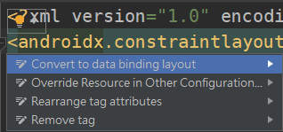

DataBinding可以实现界面与代码逻辑的进一步解耦，不仅能够简化代码， 而且当开发者对应用界面进行大规模改动时，代码逻辑只需要进行很少改动甚至不用改动， 极大提高了项目的可维护性。

这里接着使用[LiveData](Android/ld)中的开发例子， 但需要稍作修改：UI部分将滑动条换成按钮，代码部分的修改在下面进行详细说明。本实例要实现的功能是， 当用户按下按钮时，应用界面上的文本框内的数字会+1，同时继续保持屏幕旋转后内容不变。

首先要在build.gradle(Module:app)文件中找到defaultConfig代码块，然后加入如下语句并同步Gradle文件：

```
dataBinding.enabled = true
```

同步成功之后，activity_main.xml文件的左上角会出现系统提示（如下图所示的黄色灯泡图标）， 点进去之后选择"Convert to data binding layout"，布局文件就会自动转换为DataBinding的布局。




布局转换完成后，就会出现一对data标签，里面具体要填入什么内容会在稍后介绍。现在先往myViewModel文件里面添加一个执行函数， 这个函数将负责响应按钮点击事件，使得文本框内的数字+1：

```
fun add(){
        number.value = number.value!!.plus(1)
}
```

执行函数写完以后，再转到MainActivity文件，把onCreate()函数中ViewModel以外的语句都删掉，只剩下这个部分：

```
override fun onCreate(savedInstanceState: Bundle?) {
        super.onCreate(savedInstanceState)
        val myViewModel = ViewModelProvider(this)[MyViewModel::class.java]
}
```

接着在myViewModel语句后面添加如下内容，MainActivity文件的修改就完成了：

```
val binding: ActivityMainBinding = DataBindingUtil.setContentView(this,R.layout.activity_main)
binding.data = myViewModel
binding.lifecycleOwner = this
```

注意，binding的类型是ActivityMainBinding， 其中，ActivityMain是当前界面布局文件的名称，如果之后使用到带有DataBinding的Fragment， 就要在Binding前添加对应Fragment的布局文件的名称。

此外，由于binding已经通过自己的setContentView()， 将MainActivity文件和当前对应的界面布局文件绑定，所以可以把原先onCreate()中的setContentView()注释掉或删除掉。 通过binding.data，应用可以把MyViewModel中的数据变化传递给布局文件； 而binding.lifecycleOwner则取代了先前LiveData的Observer，以更为简洁的语法实现了Live Data的自我监听，以及数据更新-界面刷新功能。

现在要继续完成activity_main.xml文件的修改工作。之前已经提到，这个文件进行布局转换之后，就出现了一对data标签，里面要填上一些内容， 而这些内容与MainActivity文件里面的binding息息相关。首先给出data标签当中要填写的内容如下：

```
<variable
        name="data"
        type="com.example.databinding.MyViewModel" />
```

这个部分的主要作用是实现布局文件和MyViewModel文件的关联，在关联之后，就可以进行这样的修改： 文本框（TextView）部分，将android:text修改为“@{data.number.toString()}”，表示文本框内容由MyViewModel文件中的number负责提供和展示； 按钮（Button）部分，需要添加android:onClick="@{()->data.add()}"，以实现按钮的点击事件响应，执行MyViewModel文件中的add()函数， 其中()->是一种匿名函数的写法：

```
<TextView
        ···
        android:text="@{data.number.toString()}"
        ···
        />
<Button
        ···
        android:onClick="@{()->data.add()}"
        ···
         />
```
在完成上述所有步骤之后，可以编译运行，检查效果。