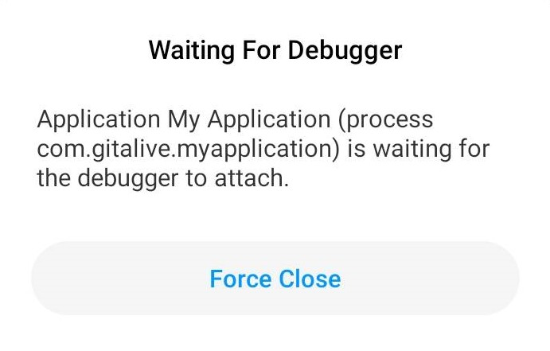

调试（debug）是开发流程中不可或缺的一环，它的主要作用在于查找和定位bug根源。Android应用调试主要有两种模式，一种是“断点+逐行执行代码”，另一种则是“运行时接入”，**前者适用于代码量少、调试位置靠前的情形，后者适用于代码量较多、调试位置靠后的情形**。

## 第一种调试模式

第一种调试模式有三个主要步骤，即打断点、开调试、逐行执行。打断点在常见IDE中的操作基本都是一样的，只要在某行待调试的代码左侧边栏里点击左键即可。开调试则需要找到下图红框所示的按钮，然后点击之：

开启调试会话之后，设备会弹出一个类似于下图的提示框，该提示框过一小段时间会自动消失：

接着就进入逐步调试的阶段，Android Studio下方的Debug窗口自动打开：

上图用红框圈起的四个按钮，从左往右依次是“Step Over”、“Step Into”、“Force Step Into”以及“Step Out”。

“Step Over”代表程序向下执行一行，如果当前行有方法调用，则将整个方法视为一步执行完毕（无论该方法实际有多少行代码），接着执行下一行；

“Step Into”代表程序向下执行一行，如果当前行有方法调用，则进入该方法并继续逐行执行直至退出该方法，接着执行下一行；

“Force Step Into”代表在调试的时候能进入任何方法；

“Step Out”代表单步执行到方法内部时，如果不需要逐步执行完方法内所有代码，则将剩余部分视为一步执行完毕并退出方法，接着执行下一行。

在调试完毕后，可以点击Debug窗口左侧边栏的停止按钮退出调试模式。

## 第二种调试模式

第二种调试模式先让应用运行起来，然后在准备执行某个操作（比如点击按键）前，点击下图红框所示的按钮：

接着Android Studio就会弹出一个窗口，在里面选择当前运行的应用程序，点击“OK”进入调试阶段：

进入调试阶段后的操作跟第一种调试模式基本一样，这里不再赘述。