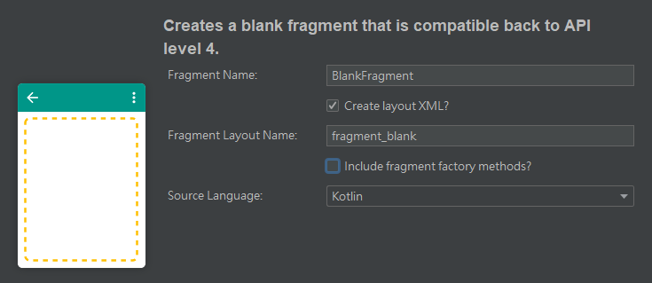
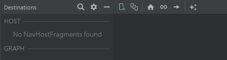
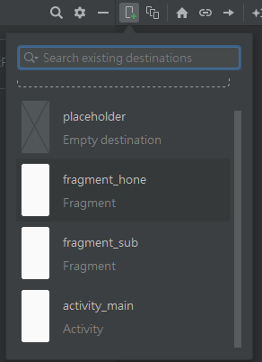
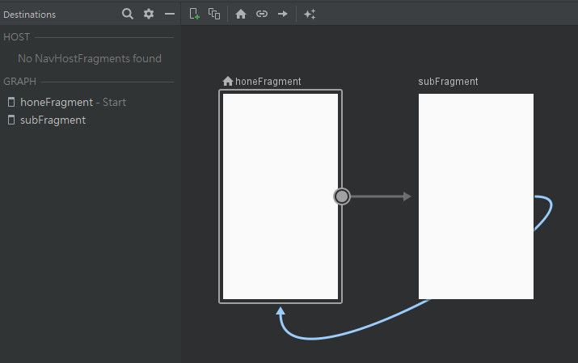
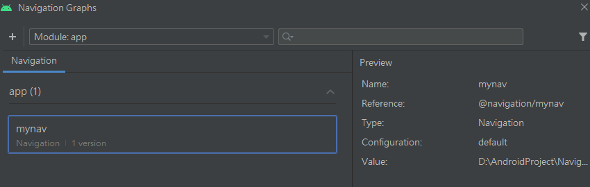
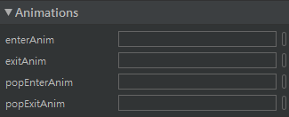
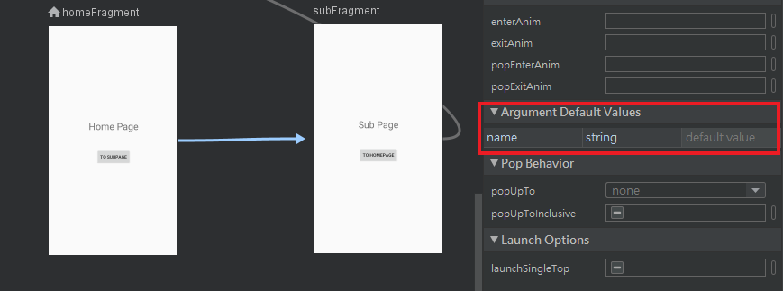

Fragment作为Activity的一部分，本应该合并到[Activity](Android/activity)当中进行介绍，但是实际上，Fragment发展至今已经具有相当广泛的用途，因此有必要将它单独拎出来详细讲讲。

Fragment具有以下特点：

+ 依赖于Activity，不能独立存在；
+ 一个Activity里可以有多个Fragment；
+ 一个Fragment可以被多个Activity重用；
+ Fragment有自己的生命周期，并能接收输入事件；
+ Activity运行时，可以动态地添加或删除Fragment。

使用Fragment的优势有：

+ 模块化（Modularity）：不必把所有代码全部写在Activity中，而是把代码写在各自的Fragment中；
+ 可重用（Reusability）：多个Activity可以重用一个Fragment；
+ 可适配（Adaptability）：根据硬件的屏幕尺寸、屏幕方向，能够方便地实现不同的布局，这样用户体验更好。

按照Google官方的说法，Fragment可以被视为轻量级的Activity，因此在性能和资源占用上具有一定的优势。

## 基本用法

### 创建

和四大基本组件一样，Fragment也可以使用Android Studio快捷方式，通过`File`➡`New`➡`Fragment`创建Fragment文件。 如果是第一次接触Fragment，那么建议使用Fragment(Blank)。



在创建好之后，需要在res目录下创建一个Android Resource File， 该资源文件的类型（Resource type）默认是Values，需要改成Navigation。注意xml文件的名称中应该只包含小写字母和下划线。

创建这个资源文件以后，IDE会提示要添加依赖才能显示一个可视化操作的图形界面，选择添加即可。 之后就可以通过下面所示的界面对Fragment之间的导航动作等进行编辑。



如下图所示，首先将两个布局拖入操作窗口，然后用箭头指示导航方向。先拖入的布局被默认为起始页面， 如果需要更换起始页面，就右键点击指定布局，选择“Set as Start Destination”。



接着设置Fragment间的导航方向，使用图形化界面的好处就在于，仅仅通过一个符合直觉的操作，就能完成若干行代码才能实现的东西：



接着前往layout目录下对三个布局文件进行配置。首先在activity_main布局中找到`Containers`➡`NavHostFragment`，将其拖入布局，IDE会弹出下图所示的窗口：



选定Navigation资源文件之后，再为它添加约束，activity_main.xml文件的配置就完成了。

Fragment的布局文件建议将FragmentLayout改成ConstraintLayout，这样便于布置控件。Fragment的界面控件设置与使用和Activity类似，这里不作赘述，但是有一些地方需要注意：

Fragment特有的控件、元素以及动作等要在对应的Fragment源文件中编写代码，而不是在Activity文件中编写，原因有两个：

+ 第一，Activity文件对应的布局中是没有指定Fragment的控件的。如果在想依靠import强行引用， it:View!就会唯一地指向Activity文件的布局，而这个布局上不存在对应控件，因此就会出现**空引用**，导致应用崩溃。

+ 第二，Activity统管全局，任何在里面编写的有效内容都会被应用到所有归属于这个Activity的Fragment上。

### 简单使用

#### Fragment间跳转

Fragment之间的跳转和Activity不同，前者采用的是Navigation，后者使用Intent。Navigation的核心代码非常简单：

```
// onViewCreated()：
Navigation.findNavController(view).navigate(R.id.action_aFragment_to_bFragment)

// onActivityCreated()：
Navigation.findNavController(it).navigate(R.id.action_aFragment_to_bFragment)
```

注意，Navigation的调用是有限制的，通常要么在`onViewCreated()`方法中，要么就在`onActivityCreated()`方法中，最好不要在`onCreateView()`里面。因为应用刚启动时，View还没有加载出来， 此时在`onCreateView()`调用Navigation很有可能会发生空异常。

此外，无论传入Navigation.findNavController()的是view还是it，它们都指向同一个东西——那就是当前Fragment所对应的布局。

此外，通过Navigation的图形界面，选中页面间的导航动作箭头， IDE右侧会出现该导航动作的属性栏，里面有一个Animations，在这里就能设置页面进入退出等动作的动画效果，如下图所示。



除了使用IDE自带的动画效果以外， 还可以在res目录下创建Animation资源，编写相关的动画效果xml文件，然后引用即可。

#### 动态添加Fragment

动态添加Fragment可以让应用界面更为多样化，而且不需要像Activity那样需要考虑AndroidManifest文件注册等诸多问题。要实现Fragment的动态添加，主要有以下几个步骤：

1. 创建待添加的Fragment实例；
2. 在Activity中调用`getSupportFragmentManager()`方法获取一个FragmentManager（Kotlin可以直接调用`supportFragmentManager`）；
3. 调用`beginTransaction()`方法开启一个事务（transaction）；
4. 通过`replace()`方法传入Fragment容器id和待添加的Fragment实例；
5. 调用`commit()`方法提交事务，完成Fragment的替换。

上述步骤的代码示例如下：

```
val someFragment = SomeFragment()
val fragmentManager = supportFragmentManager
val transaction = fragmentManager.beginTransaction()
transaction.replace(R.id.xxxLayout, someFragment)
transaction.commit()
```

>注意：动态添加Fragment需要在布局文件中添加使用一个FrameLayout，所有的动态添加都会在这个FrameLayout中进行。

#### Fragment的返回栈

FragmentTransaction中提供了一个`addToBackStack()`方法，可以用于将一个事务添加到返回栈中，从而实现类似于Activity任务栈的Fragment返回栈。具体实现代码非常简单：

```
transaction.addToBackStack(null)
```

`addToBackStack()`方法可以接收一个用于描述返回栈状态的名字，一般传入`null`即可。

## Fragment的生命周期

Google官方所给出的Fragment生命周期如下图所示：


可以看到，Activity所包含的部分回调方法，Fragment中也有。Fragment的状态与Activity息息相关：

+ **运行状态**：当一个Fragment所关联的Activity处于运行状态时，该Fragment也处于运行状态。
+ **暂停状态**： 当一个Activity进入暂停状态时，与之关联的Fragment也会进入暂停状态。
+ **停止状态**：当一个Activity进入通知状态，或是将一个Fragment从Activity中移除前调用了`addToBackStack()`方法，该Fragment即进入用户完全不可见、可以被回收的停止状态。
+ **销毁状态**：当一个Activity被销毁，或是将或是将一个Fragment从Activity中移除前**不调用**`addToBackStack()`方法，该Fragment即处于销毁状态。

## Fragment数据的传递、保存与复现

### Argument

利用Fragment属性中的Arguments，


或是指向该页面的action自带的Argument Default Values，



都可以让静态数据随着动作传递。目的Fragment可以通过`requireArguments()`调用get方法来读取数据：

```
var variable = requireArguments().getString(keyName, defValue)
```

这种方式虽然简单，但是通常只用来传递一些不会发生变化的静态数据。

### Bundle

依靠Bundle保存一个键值对，然后跟随action传递到目的Fragment，再由目的Fragment读取Bundle里面的数据。使用Bundle时， 要先在一个Fragment当中创建Bundle类型的变量，接着通过调用put方法保存一个键值对，之后将Bundle变量当作参数放进动作语句，如下面代码所示：

```
val bundle = Bundle()
bundle.putString(keyName, value)
Navigation.findNavController(it).navigate(R.id.action_aFragment_to_bFragment,bundle)
```

和使用Argument一样，目的Fragment也要通过`requireArguments()`，调用get方法来读取传递过来的Bundle对象里的数据。

### ViewModel

利用ViewModel（或者AndroidViewModel）来让各个页面共享数据， 同时还能提供数据保存与复现的功能，具体步骤如下：

首先新建一个继承于ViewModel的自定义ViewModel：

```
class MyViewModel: ViewModel() {
    private var number = MutableLiveData(0)

    fun getNumber(): MutableLiveData< Int> {
        return number
    }

    fun add(x: Int) {
        number.value = number.value!!.plus(x)
    }
}
```

在Fragment对应源文件的onCreateView()中添加ViewModel类型对象和Data Binding对象：

```
private lateinit var myViewModel: MyViewModel
private lateinit var binding: FragmentSubBinding
override fun onCreateView(
        inflater: LayoutInflater, container: ViewGroup?,
        savedInstanceState: Bundle?
    ): View? {
        myViewModel = ViewModelProvider(requireActivity())[MyViewModel::class.java]
        binding = Data BindingUtil.inflate(inflater, R.layout.fragment_???, container, false)
        binding.data = myViewModel
        binding.lifecycleOwner = requireActivity()
        return binding.root
}
```

注意，Data Binding对象的类型名称为<font color=red>“布局文件名称+Binding”</font>。例如MainActivity对应的Data Binding类型为ActivityMainBinding，HomeFragment对应的则是FragmentHomeBinding。

此外，在Fragment中调用ViewModelProvider时，带入的参数是`requireActivity()`， 而不是和Activity一样的this，否则会报错。同理，使用AndroidViewModel时，传入的是`requireActivity().application`。


