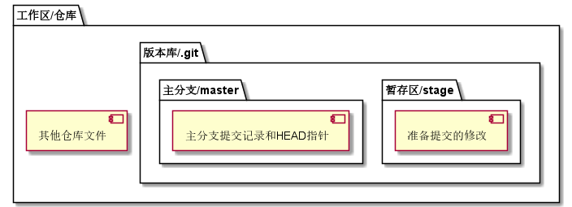
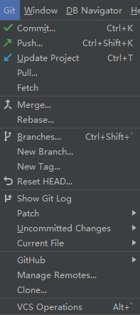
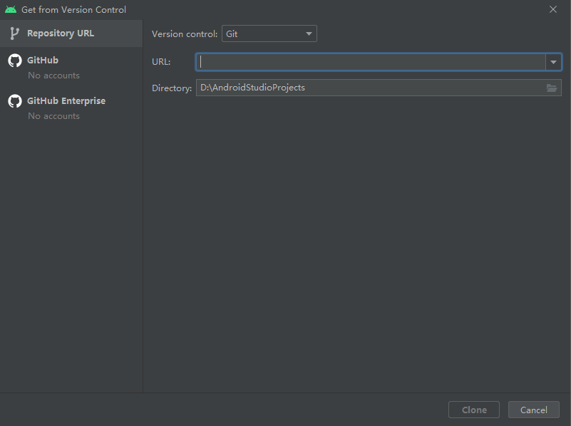
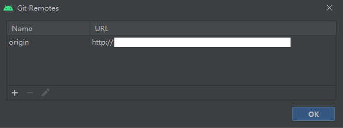
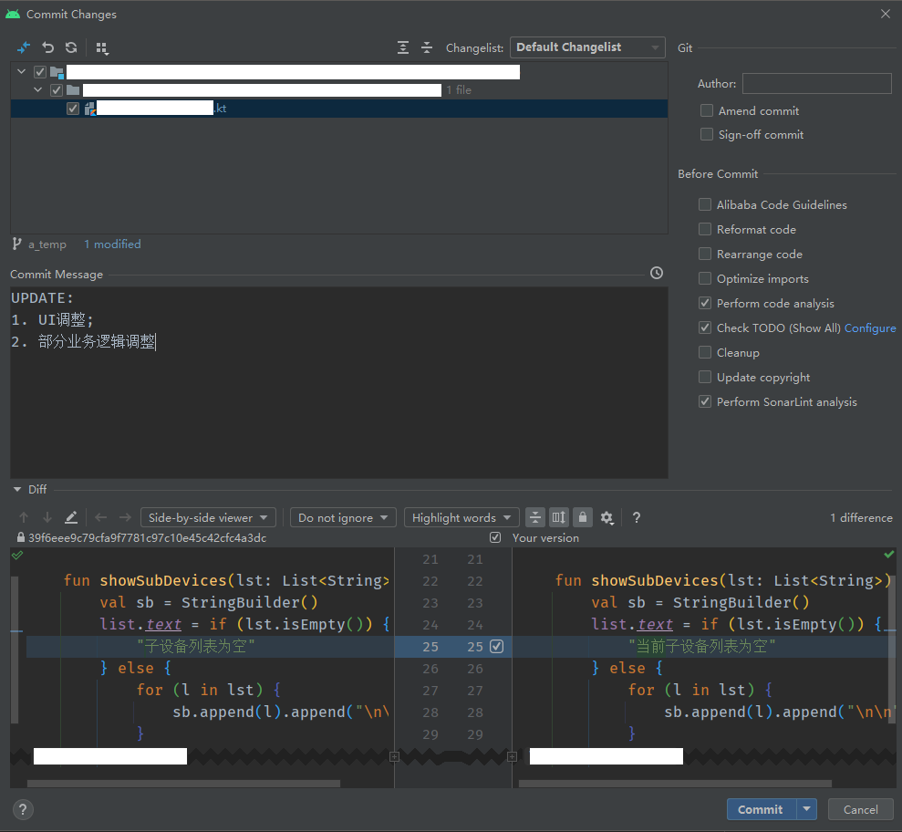
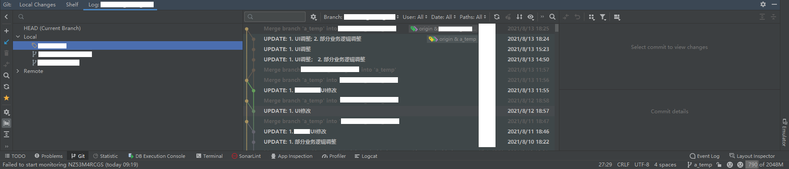
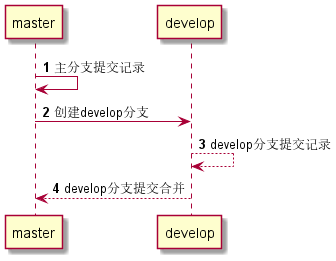

## 基本概念

1. **版本控制**

在实际开发工作当中，项目往往需要进行版本控制。所谓版本控制，是指在软件开发过程中对各种程序代码、配置文件及说明文档等文件变更的管理，版本控制系统就在此基础上随着时间的推进记录一系列文件的变化，以便将来查阅特定版本修订情况，同时也方便以后随时回退到某个版本。通过版本控制，开发者可以掌握项目发生了哪些变化以及谁引起的变化等情况，这样对于团队协作开发的项目而言就具有极大的便利性。

2. **版本控制系统**

目前常见的免费版本控制系统有SVN和Git等，主要分为**集中式**和**分布式**两大类。集中式版本控制系统将源码全部存储在一个特定的中央服务器上，开发者在进行开发前需要联网从服务器上拉取最新版本内容，待开发任务完成后再提交到中央服务器，开发者并不会在本地保留完整的版本库；分布式版本控制系统则相反，它的源码存储并不依赖某个特定服务器，每个参与项目开发的开发者都可以在本地保存完整的版本库，而且不需要强制联网才能进行开发工作。集中式版本控制系统的缺陷在于要求联网和集中存储项目文件，一旦网络出现问题或是中央服务器无法正常工作，那么所有的开发工作都将不得不停滞，因此越来越多的开发者和企业选择使用分布式版本控制系统。

[Git](https://git-scm.com/downloads)是Linus本人开发的分布式版本控制工具，基于该工具的运作方式提供分布式版本控制服务（代码仓库托管）的厂商有很多，最出名的就是[GitHub](https://github.com)和[GitLab](https://gitlab.com/explore/projects)，当然，开源项目通常会选择用Github，而商业开发项目则会使用GitLab。

3. **仓库**

仓库（Repository）本质上就是一个用于存放项目文件且能够执行版本控制功能的目录，里面存放的不一定只有源码，也可以是图片、音频、视频以及文档等不同类型格式的非源码文件。从这个角度来讲，哪怕一个文件夹采用手工方式对项目文件进行版本控制，也可以称之为仓库——就是管理起来比较头疼。

4. **工作区、版本库和暂存区**

一个Git仓库（项目文件夹）被称作一个工作区（Working Directory），仓库里面有一个隐藏目录`.git`，用于保存分支管理相关的数据记录，这就是所谓的版本库。版本库里面还划分了一个暂存区（stage/index），用于存放开发者准备要提交（commit）的修改。它们之间的关系如下图所示。

5. **分支**

在Git中，分支（branch）用来代表一系列提交所形成的连续时间线（或者用科幻的说法就是“平行宇宙”）。通常一个仓库里会包含一个主分支master和若干根据开发需要分化出来的其他分支。在一般情况下，每个分支都承担不同的任务，比如master常用于发布正式版本，其他分支有的用于负责修复bug，有的用于开发新功能等等。主分支和其他分支的地位并非一成不变，比如一些项目的早期版本和重构版本的主分支地位可能会随着开发进度的推移而发生互换，这样前者就只用于维护，而后者作为主力版本继续开发。

## 准备工作

1. **下载安装Git**

Git有专门的下载地址：[https://git-scm.com/downloads](https://git-scm.com/downloads)，从官网上选择对应系统类型的安装包下载安装即可。由于GFW的干扰，官网时常会出现无法访问的情况，因此需要开发者掌握一定的突破网络封锁的技能。在安装完Git软件之后，可以通过系统上已有的命令行工具，输入`git --version`来查看当前安装的Git软件版本号，同时确认系统环境变量的配置情况（配置正确的前提下，在任何命令行工具上执行该命令都能输出版本号）。

2. **创建本地仓库**

创建本地仓库（local repository）简单来说就是在开发者自己的计算机上创建一个存放项目文件的文件夹，然后用Git工具进行管理。本地仓库创建之后，需要启动命令行工具，将目录切换到仓库，然后执行`git init`命令完成本地仓库的初始化工作。以Windows系统为例，开发者在D盘根目录下创建了一个名为“Test”的仓库，利用CMD或Power Shell将目录切换到该仓库，执行`git init`命令，待提示`Initialized empty Git repository in D:/Test/.git/`之后，就表明当前作为本地仓库的文件夹已经纳入Git管理了。

3. **创建远程仓库**

创建远程仓库（remote repository），是指在提供Git服务的厂商网站（仓库托管服务器）上创建存放项目文件的文件夹，不同的服务提供商可能有不同的创建流程，但基本上大同小异，创建完成以后会提供两种类型的链接（HTTP和SSH）以便开发者通过本地安装的Git工具关联远程仓库，进行更多的操作。

## 常用命令

|用途|命令|说明|
|:-----|:-----|:-----|
|本地仓库初始化|`git init`||
|克隆远程仓库到本地|`git clone 远程仓库链接`|远程仓库链接包括HTTP和SSH两类，SSH需要进行额外配置|
|关联远程仓库|`git remote add origin 远程仓库链接`|origin是默认的远程仓库名称|
|查看远程仓库|`git remote -v`||
|解绑远程仓库|`git remote rm 远程仓库名`|通常情况下，默认的远程仓库名是origin|
|配置开发者使用的用户名|`git config --指定参数 user.name "Your Name"`|常用指定参数有global（全局）、system（系统）以及local（仓库）|
|配置开发者使用的邮箱|`git config --指定参数 user.email "email@example.com"`||
|清除本地验证信息|`git config --指定参数 --unset credential.helper`|开发者身份信息配置错误时使用|
|清除本地验证信息|`git config --指定参数 http.emptyAuth true`|上一条命令不起作用时尝试使用该命令|
|往仓库中添加文件|`git add 文件名.扩展名`|如果是添加多个文件，每个文件之间用空格隔开|
|一次性添加所有文件|`git add .`||
|从版本库中删除文件|`git rm 文件名.扩展名`|删除之后要执行提交操作|
|提交更改至工作区|`git commit -m "提交说明"`|在通常情况下，应该撰写有意义的提交说明，以便其他开发者查阅|
|克隆远程仓库指定分支|`git clone -b 分支名 远程仓库链接`|不带-b参数和分支名表示克隆master分支|
|本地仓库创建并切换分支|`git checkout -b 分支名`||
|本地仓库切换开发分支|`git switch 分支名`||
|拉取远程分支进行更新|`git pull --rebase origin 远程分支名称`|rebase参数表示将本地提交合并到拉取下来的分支，后续提交以此为基础|
|推送提交至远程分支|`git push origin 本地分支名称 : 远程分支名称`||
|将本地分支关联到远程分支|`git branch --set-upstream-to=origin/远程分支名`||
|查看本地当前分支|`git branch`||
|删除本地分支|`git branch -d 分支名`||
|查看远程分支|`git branch -r`||
|查看本地分支与远程分支的映射关系|`git branch -vv`||
|查看本地各分支最新提交|`git branch -v`||
|查看远程各分支最新提交|`git branch -r -v`||
|查看本地仓库当前状态|`git status`||
|查看指定文件的修改情况|`git diff 文件名.扩展名`||
|查看历史提交记录|`git log`|记录按从新到旧排序，开头的SHA1字符串就是提交记录ID|
|查看历史命令记录|`git reflog`||
|撤销修改|`git checkout -- 文件名.扩展名`|注意--必须要加；仅在未执行`git add`命令的情况下生效|
|撤销修改|`git reset HEAD 文件名.扩展名`|仅在已执行`git add`命令，但未推送到远程的情况下生效|
|版本回退|`git reset --hard 提交记录ID`|hard表示撤销所有未提交内容，并删除指定提交记录ID之后的提交信息|
|合并指定分支到当前分支|`git merge --no-ff 分支名`|no-ff参数表示合并后不删除指定分支以保留演进信息，推荐使用|

## 与Android Studio的协同

在Android Studio的工具栏中有一个“Git”选项，如下图所示：

打开该选项可以看到基本涵盖了Git工具的常用操作：

点击“Clone...”选项，可以调出窗口执行克隆仓库的操作：

点击“Manage Remote...”选项，调出窗口可执行关联远程仓库的操作：

在修改完项目文件之后，使用快捷键`Ctrl + K`，或是通过`Git➡Commit`，就能调出类似下图的提交管理窗口：

在窗口位置，可能还会找到同样名为“Git”的管理窗口，可以用来查看各分支提交日志和管理分支：

还有许多Git工具功能可以使用，但是限于篇幅这里不做赘述。通过这些，开发者可以使用更为方便的图形界面对项目进行版本控制，而不必总是要手动输入各类命令。

## 分支管理策略

每一个项目仓库都应当有且仅有一个主分支master，并常设若干develop分支。主分支用于发布重大版本，因此变动频率是常设分支中最低的，反映在提交日志上就是提交记录最少；日常开发就在develop分支上进行，在有需要的时候就将develop分支上的提交内容合并到主分支上进行正式发布——注意develop分支不宜过多，否则管理工作量会非常大。主分支与develop分支之间的互动关系如下图所示：

除了两类常设分支以外，针对不同目的进行开发的版本需要建立相应的临时性分支，临时性就表示在完成开发任务之后，这些分支要被清理掉，而非继续保存在版本库中。常用的临时性分支有以下三类：

|分支类型|描述说明|使用建议|
|:-------|:------|:------|
|功能分支（feature）|为开发某种特定功能，基于develop分支创建，开发完成后再并入develop|分支名建议使用`feature-somefeature`|
|预发布分支（release）|基于develop分支创建，用于发布正式版本之前的测试工作，测试结束后并入master和develop|分支名建议使用`release-版本号`|
|修复分支（fixbug）|基于master分支创建，用于修复正式发布后发现的bug，修复后并入master和develop|分支名建议使用`fixbug-版本号`|