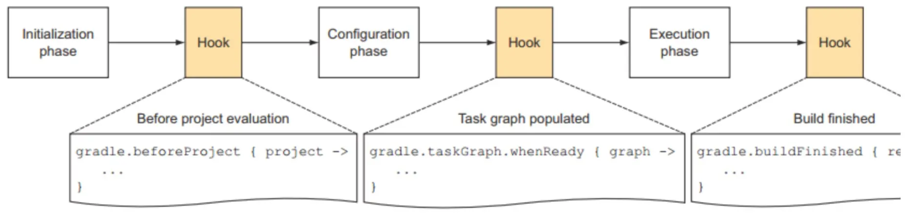
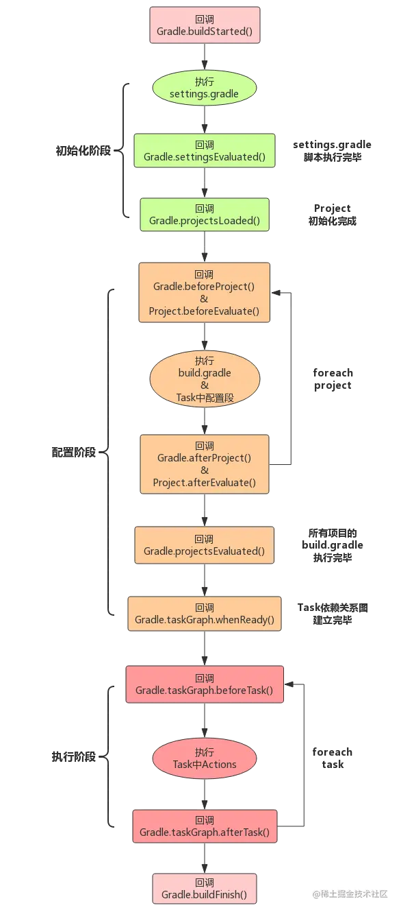
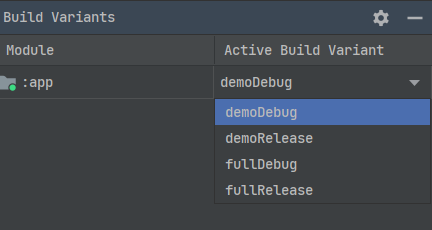

## 何为Gradle

[Gradle](https://docs.gradle.org/current/userguide/what_is_gradle.html)是一种项目构建工具，用于管理项目编译构建所需的依赖，并通过运行一系列构建任务，生成开发者需要的目标格式的最终产物，比如`.apk`或`.jar`文件。Gradle支持使用基于Java、[Groovy](https://groovy-lang.org/documentation.html)以及Kotlin语言开发的[DSL](/Kotlin/func?id=dsl)。如果使用的是Groovy，那么构建用的脚本文件以`.gradle`结尾；如果使用的是Kotlin DSL，那么脚本文件以`.kts`结尾。事实上，无论采用何种语言，Gradle的基本功能都是一样的，这里出于习惯都用Groovy来描述。

> 如果想了解Groovy和Kotlin DSL编写的Gradle文件在语法上有哪些差异，可以查看
[Google官方文档](https://developer.android.google.cn/studio/build/migrate-to-kts#apply-plugins)以及[Gradle官方文档](https://docs.gradle.org/current/userguide/migrating_from_groovy_to_kotlin_dsl.html)。

目前Gradle在Android Studio和Intellij IDEA等IDE上都有集成使用。通常Java项目多会采用[Maven](https://maven.apache.org/)作为项目管理与构建工具，而Android项目则使用Gradle。一些早期的项目可能还会用[Ant](https://ant.apache.org/)。当然，随着时间的推移，越来越多的Java项目也开始使用Gradle。Gradle相对于Maven和Ant的优势主要在于以下几点：

1. 使用DSL而不是XML，来表述构建过程与依赖关系，定义简洁，使用简单；

2. 支持多种类型项目的使用，最典型的就是Android项目和Java项目都能支持；

3. 在灵活性和统一性上比较平衡，既能自定义业务逻辑，又能确保依赖和构建过程的统一和标准化；

4. Gradle支持增量构建，即可以只运行新增的构建任务，这样就能大幅缩减构建时间。

Gradle中有两个非常重要的概念：**Project**和**Task**。

Project是指**构建产物**（比如`.jar`包和`.apk`文件）或**实施产物**（将应用程序部署到生产环境），通常由一些组件组成，如一个Project可以代表一个`.jar`包、`.aar`包或者一个WEB应用程序，也可能包含其他项目生成的`.jar`包或`.aar`包。

Task是指**不可分割的最小工作单元**，用于执行构建工作（比如编译项目或执行测试）。Task可以是编译一些Java类，或者创建一个`.jar`包，或者是生成JavaDoc，或者是发布文档到仓库。总之是作为<u><font color=red>原子操作</font></u>一类的存在。

由此可以得到如下关系：

· 每个Gradle build由若干个Project组成；

· 每个Project由若干个Task组成。

具体到Android项目来说，每一个待构建的Module是一个Project，构建一个Project需要执行一系列Task，比如编译、打包这些构建过程的子过程都对应着一个Task。一个apk文件的构建包含以下Task：源码编译、资源文件编译、Lint检查、打包以生成最终的`.apk`文件等等。在通常情况下，IDE在项目创建时提供的Gradle构建脚本文件就能满足开发者基本的构建管理需要，但是如果想让Gradle在构建过程中执行一些开发者自定义的构建逻辑，就需要了解如何编写Task。

Android开发主要参考Google关于如何使用Gradle构建系统的说明文档：https://developer.android.google.cn/studio/build#settings-file

一般的JVM项目开发可能需要参考Gradle官方整套指南：https://docs.gradle.org/current/userguide/userguide.html

## Gradle工作流程

如下图所示，Gradle的工作流程可划分为初始化、配置和执行三大阶段。



### 初始化阶段

初始化阶段的主要任务是创建项目的层次结构，为每一个module创建一个Project对象，对应操作就是执行`setting.gradle`里面的配置。一个`setting.gradle`文件对应一个setting对象，在`setting.gradle`中可以直接调用其中的方法。`setting.gradle`文件可调用的API详情可参考[Gradle官方文档](https://docs.gradle.org/current/javadoc/org/gradle/api/initialization/Settings.html)。

### 配置阶段

配置阶段的主要任务是配置每个Project中的`build.gradle`文件，每个`build.gradle`文件对应一个Project对象。Project对象能够调用的API可以参考[官方文档内容](https://docs.gradle.org/current/javadoc/org/gradle/api/Project.html)。配置阶段执行的代码包括`build.gralde`文件中的各种语句、闭包以及Task中的配置段语句。需要注意的是，无论执行何种Gradle命令，初始化阶段和配置阶段的代码都会被执行，在排查构建速度问题的时候可以留意，是否可以将部分代码写成Task，从而减少配置阶段消耗的时间。

### 执行阶段

最后一个阶段就是执行阶段，这一阶段的主要是执行`build.gradle`文件里面所定义的Task。在配置阶段结束后，Gradle会根据任务Task的依赖关系创建一个有向无环图，可以通过Gradle对象的`getTaskGraph`方法访问，对应的类为`TaskExecutionGraph`（API详情可参考[Gradle官方文档](https://docs.gradle.org/current/javadoc/org/gradle/api/execution/TaskExecutionGraph.html)），然后通过调用`gradle <任务名>`执行对应任务。如前面阶段图所示，这里也可以加Hook，当任务执行完之后可以通过Hook来做一些自定义的事情。

## Gradle使用方式

如果使用Android Studio进行开发，那么在创建Android项目的时候，Android Studio就会自动创建好Gradle相关的工具目录和构建脚本；或者在Intellij IDEA中创建项目时，选用Gradle作为构建工具，Intellij IDEA也同样会准备好这些东西。无论是Android项目还是一般的JVM项目，只要使用Gradle这个构建系统，那么很多东西基本上是通用的。

### Gradle文件

下表是一般项目中所涉及到的比较重要的Gradle构建系统文件：

|文件名|用途说明|
|:-----:|:-----:|
|`gradle/wrapper/gradle-wrapper.jar`|用于执行下载Gradle发行版任务的程序|
|`gradle/wrapper/gradle-wrapper.properties`|一个属性文件，负责配置Gradle的下载源和本地存储位置|
|`gradlew`|一个shell脚本，用于通过Wrapper程序执行构建任务|
|`gradlew.bat`|一个Windows批处理脚本，作用同上|
|`settings.gradle`|Gradle 7.0以前仅用于指示项目中包含多少个module，Gradle 7.0开始增加了配置仓库地址的功能|
|`gradle.properties`|为Gradle构建系统配置一些全局属性，默认使用String类型|
|`build.gradle`|Gradle 7.0以前主要负责配置编译时要用到的仓库地址、全局性插件以及一些只在`module/build.gradle`中使用到的属性，Gradle 7.0开始将配置仓库地址迁移到`settings.gradle`|
|`module/build.gradle`|负责配置模块使用到的插件和依赖库，还有项目编译时要设置的属性选项以及要执行的任务等等|
|`local.properties`|为Gradle构建系统配置本地环境属性|

### Gradle构建流程监听

Gradle提供了非常多的Hook点供开发人员修改构建过程中的行为，为了方便说明，先看下面这张图：



Gradle在构建的各个阶段都提供了很多回调，开发者在添加对应监听时务必要注意，**监听器一定要在回调的生命周期之前添加**，否则过了某个生命周期就不会执行。一种最简单的监听方式，就是在`settings.gradle`文件中新增一个构建流程监听器，参考下面的示例代码：

```
// 在settings.gradle文件中执行监听任务
gradle.addBuildListener(new BuildListener() {
    @Override
    void settingsEvaluated(Settings settings) {
        ···
    }

    @Override
    void projectsLoaded(Gradle gradle) {
        ···
    }

    @Override
    void projectsEvaluated(Gradle gradle) {
        ···
    }

    @Override
    void buildFinished(BuildResult buildResult) {
        ···
    }
})
```

当然，从上面的示例代码中可以看到，在`settings.gradle`文件添加一个监听回调，似乎还是太简单了，只覆盖到几个生命周期。如果还想监听别的生命周期，那就需要考虑在项目级`build.gradle`直接调用Project对象提供的生命周期监听API，来执行相应的Hook操作。例如，想要为所有module应用Java插件，那么就要在项目级`build.gradle`文件中加入以下代码：

```
// 通过Gradle对象直接设置监听动作
gradle.beforeProject { project ->
    apply plugin: 'java'
}

// 等效写法
allprojects {
    beforeEvaluate { project ->
        apply plugin: 'java'
    }
}
```

> 注意，在上面的示例代码中，`gradle.beforeProject`和`gradle.beforeEvaluate`的执行时机是一样的，但前者可以应用于所有项目，而后者只应用于当前被调用的Project对象。

### Gradle仓库配置

Gradle的核心功能中就包含了依赖管理，而通常情况下，大多数依赖库是从远程仓库拉取到本地的，因此有必要了解如何在Gradle中配置仓库地址。

在Gradle 7.0以前，仓库配置是放在项目级`build.gradle`文件当中的，如下列代码所示：

```
buildscript {
    repositories {
        google()
        mavenCentral()
        ···
    }
    dependencies {
        ···
    }
}
allprojects {
    repositories {
        google()
        mavenCentral()
        ···
    }
}
```

但是从Gradle 7.0开始，仓库配置就转移到`settings.gradle`:

```
pluginManagement {
    // 此处配置的仓库地址，主要用于拉取Gradle插件
    repositories {
        google()
        mavenCentral()
        gradlePluginPortal()
        ···
    }
}
dependencyResolutionManagement {
    repositoriesMode.set(RepositoriesMode.FAIL_ON_PROJECT_REPOS)
    // 此处配置的仓库地址，主要用于项目所有module拉取依赖库
    repositories {
        google()
        mavenCentral()
        ···
    }
}
```

由于GFW的干扰，Google、Maven以及Gradle的官方仓库并不总是能被中国大陆的开发者们正常访问，因此有时候就需要用到下面列出的一些镜像地址：

|镜像名称|镜像地址|
|:-----:|:-----:|
|阿里云Maven中央仓库镜像|https://maven.aliyun.com/repository/central|
|阿里云JCenter仓库镜像|https://maven.aliyun.com/repository/public|
|阿里云Maven公共仓库镜像|https://maven.aliyun.com/repository/public|
|阿里云Google Maven仓库镜像|https://maven.aliyun.com/repository/google|
|阿里云Gradle插件仓库镜像|https://maven.aliyun.com/repository/gradle-plugin|

对于一些只提供`.jar`、`.aar`或`.so`格式二进制文件的依赖，由于没有远程仓库能解析，因此通常采用下面这种方式导入依赖：

```
implementation fileTree(dir: 'libs', include: ['*.jar','*.aar'])
```

如果是`.so`文件，那么只要把文件放到默认路径`src/main/jniLibs`下面就可以被自动识别出来，不用进行额外配置。有部分开发者可能不喜欢用默认路径，他们通常会采用类似下面的方式去修改`.so`文件的路径：

```
android{
   sourceSets {
        main {
            jniLibs.srcDirs = ['libs']
        }
    }
}
```

#### 依赖冲突

依赖冲突是指在一个项目中，由于不同module或依赖库都引用了同一个依赖项，但属于不同版本，导致Gradle编译时不一定能按照开发者的意愿，确定到底用哪个版本的依赖项的情况。

当发生依赖冲突的时候，Gradle构建系统会自动选择发生冲突的依赖的最新版本。如果开发者也倾向于使用最新版本，且module或依赖库中未用到新旧版本互不兼容的变更内容，那么就随意了。如果不想用最新版本，那么就要参考以下几种方式来解决依赖冲突。

+ **强制指定版本**

强制指定依赖版本的操作，通常有以下两种：

```
// strictly配置
dependencies {
    implementation 'org.apache.httpcomponents:httpclient:4.5.4'
    implementation('commons-codec:commons-codec') {
        version {
            strictly '1.9'
        }
    }
}

// resolutionStrategy.force配置
android {
    ···
    configurations {
        compileClasspath {
            resolutionStrategy.force 'commons-codec:commons-codec:1.9'
        }
    }
}

dependencies {
    implementation 'org.apache.httpcomponents:httpclient:4.5.4'
}
```

如果还想了解更多限制依赖版本的方法，可以参考https://docs.gradle.org/current/userguide/rich_versions.html#sec:strict-version

+ **排除特定依赖**

排除特定依赖的语法参考下面的示例代码：

```
dependencies {
    implementation('commons-beanutils:commons-beanutils:1.9.4') {
        // 要排除多少个依赖，就执行多少个类似的语句
        exclude group: 'commons-collections', module: 'commons-collections'
    }
}
```

这个方式适用于远程依赖，因为远程依赖当中用到的一些库版本通常是无法被使用者所干涉的。并且在一般情况下，这些“被依赖的依赖”还是默认可被传递到项目当中的。**如果Gradle构建系统由于存在这些依赖而不能正常完成编译，且开发者确定排除它们也能让项目正常运行，那么就采用这种方式来解决依赖冲突问题**。

更多关于排除依赖的资料，可以参考https://docs.gradle.org/current/userguide/dependency_downgrade_and_exclude.html#sec:excluding-transitive-deps

+ **禁止依赖传递**

禁止依赖传递可以参考下面的示例代码：

```
dependencies {
    ···
    implementation("io.coil-kt:coil-compose:2.2.2") {
        transitive = false
    }
}
```

由于依赖都是默认可传递的，也就是说如果A使用了依赖项B，而B使用了依赖项C，那么A就可以调用到C。假设C取消了可传递性，那么它只能在B中使用。这种禁止依赖传递的方式，适用于开发者对项目所使用的依赖库掌控程度较高的情形。

> 注意，在某个module中使用`implementation`导入的依赖，实际上已经不能传递使用了，想要能够传递，得调用`api`来取代`implementation`完成依赖导入。

+ **调用阶段隔离**


调用阶段隔离适用于这样一种场景：项目引用的`.aar`依赖库中包含有特定的`.jar`依赖，而项目本身又直接引用了这个`.jar`文件，在编译时就会不可避免地发生冲突。调用阶段隔离就是指让这两个发生冲突的`.jar`依赖，分别使用不同的导入语句，比如一个用`compileOnly`（编译时有效，不参与打包），另一个用`implementation`，这样它们的调用阶段就直接分离了，不会再发生冲突。类似的语句还有`runtimeOnly`（打包时有效，不参与编译）。

### Gradle Plugin

Gradle本身只是提供了基本的核心功能，其他的特性比如编译Java源码的能力，或是编译Android工程的能力等等就需要通过插件来实现了。在Gradle中一般有两种类型的插件，分别叫做**脚本插件**和**二进制插件**。脚本插件是一种额外的构建脚本，它会进一步配置构建，可以把它理解为一个普通的`build.gradle`；而二进制插件就是指已经由官方或第三方实现了`org,gradle.api.plugins`接口，并发布成二进制文件的插件。

项目要应用Gradle插件，通常只在项目级`build.gradle`和模块级`build.gradle`当中执行相应的代码。在Gradle 7.0以前，配置插件的代码如下面所示：

```
// 项目级build.gradle文件
buildscript {
    repositories {
        ···
    }
    dependencies {
        classpath 'com.android.tools.build:gradle:X.Y.Z'
        ···
    }
}

// 模块级build.gradle文件
apply plugin: 'com.android.application'
```

Gradle 7.0开始，配置插件的代码就成了下面这种的：

```
// 项目级build.gradle文件
plugins {
    id 'com.android.application' version '7.4.2' apply false
    id 'com.android.library' version '7.4.2' apply false
    id 'org.jetbrains.kotlin.android' version '1.7.0' apply false
    ···
}

// 模块级build.gradle文件
plugins {
    id 'com.android.application'
    id 'org.jetbrains.kotlin.android'
}
```

可以发现，在应用插件的代码中，有时候会采用`id «plugin id»`的格式，有时候又会采用`id «plugin id» version «plugin version» [apply «false»]`格式，那么这两种格式的差别是什么？按照[Gradle官方文档](https://docs.gradle.org/current/userguide/plugins.html#sec:constrained_syntax)的说法，前一种格式用在核心Gradle插件（core Gradle plugins），或是构建脚本中已经存在的插件（比如上面示例代码中的`com.android.application`插件）。后一种格式，用在那些需要从远程仓库解析拉取下来的二进制插件。此外，`apply`语句后面的布尔值，作用是阻止项目**立即应用**该插件的默认行为（比如开发者只想在特定module构建时才调用该插件）。

更多有关Gradle插件的详细介绍，可以参考Gradle官方文档：https://docs.gradle.org/current/userguide/plugins.html

#### Android Plugin for Gradle

在Android项目的模块级`build.gradle`文件中，有一段配置内容是一般JVM项目所没有的，类似于下面代码所示：

```
android {
    namespace 'com.example.app'
    compileSdk 33

    defaultConfig {
        applicationId "com.example.app"
        minSdk 23
        targetSdk 33
        versionCode 1
        versionName "1.0"

        testInstrumentationRunner "androidx.test.runner.AndroidJUnitRunner"
        vectorDrawables {
            useSupportLibrary true
        }
    }

    ···
}
```

这段配置内容来自Android Plugin for Gradle，官方也称之为Android Gradle Plugin（AGP）。显而易见，这是专门用于Android项目的。接下来就介绍如何利用AGP为Android项目配置一些有趣的东西。

##### 更改源码目录

Android项目默认的源码目录是`src/main/java`，通过仿照下面示例代码的操作，就可以更改源码目录了：

```
android {
    ...
    sourceSets {
        main {
            // 更改Java / Kotlin代码的存储目录
            java.srcDirs = ['other/java']
            // 更改资源文件的存储目录
            res.srcDirs = ['other/res1', 'other/res2']
            // 更改AndroidManifest.xml文件的存储目录
            manifest.srcFile 'other/AndroidManifest.xml'
            // 更改so文件的存储目录
            jniLibs.srcDirs = ['other/libs']
            ...
        }
        // 设置插桩测试源码文件的存储目录
        androidTest {
            setRoot 'src/tests'
            ...
        }
    }
}
```

##### 配置应用签名

虽然Android Studio提供了一种从可视化界面中为正式发布的应用配置签名的简单方式，但开发者也可以在`signingConfigs`代码块中手动配置签名：

```
android {
    ...
    defaultConfig { ... }
    signingConfigs {
        release {
            // 指示开发者使用的keystore文件的路径
            storeFile file("my-release-key.jks")
            // 指示开发者使用的keystore文件的密码
            storePassword "password"
            // 为签名使用的key设置别名
            keyAlias "my-alias"
            // 为签名使用的key设置密码，通常跟keystore文件的密码保持一致
            keyPassword "password"
        }
    }

    buildTypes {
        release {
            // 在构建特定变体时调用对应的签名配置
            signingConfig signingConfigs.release
            ...
        }
    }
}
```

为了提高签名配置的保密性，开发者还可以在**项目的根目录下**创建一个名为`keystore.properties`的文件（注意要在`.gitignore`文件当中将其排除掉，否则会被上传到版本控制系统直接公开），其内容类似于下面所示：

```
storePassword=myStorePassword
keyPassword=myKeyPassword
keyAlias=myKeyAlias
storeFile=myStoreFileLocation
```

接着按照下面的方式完成签名配置：

```
// 在执行android代码块之前，需要先对调用keystore.properties文件的一些操作进行初始化
def keystorePropertiesFile = rootProject.file("keystore.properties")
def keystoreProperties = new Properties()

android {
    ...
    defaultConfig { ... }
    signingConfigs {
        config {
            keyAlias keystoreProperties['keyAlias']
            keyPassword keystoreProperties['keyPassword']
            storeFile file(keystoreProperties['storeFile'])
            storePassword keystoreProperties['storePassword']
        }
    }
    ···
}
```

##### 压缩项目代码

Android Studio通过使用ProGuard规则文件的`R8`来缩减代码。对于新项目，Android Studio将使用Android SDK的`tools/proguard/folder`中的默认设置文件`proguard-android.txt`。如需进一步缩减代码，开发者应尝试使用位于同一位置的`proguard-android-optimize.txt`文件。具体配置方式如下：

```
android {
    ···
    buildTypes {
        release {
            // 
            minifyEnabled true
            proguardFiles getDefaultProguardFile('proguard-android-optimize.txt'), 'proguard-rules.pro'
        }
    }
    ...
}
...
```

通常情况下，缩减代码往往是跟混淆配合使用的。限于篇幅，这里不对代码混淆等内容展开介绍，更多关于缩减代码的说明，可参考Google官方文档：https://developer.android.google.cn/studio/build/shrink-code#shrink-code

##### 配置产品变体

+ **配置构建类型**

Android Studio默认提供有`release`和`debug`两种项目构建类型，它们的配置方式如下列代码所示：

```
android {
    defaultConfig {
        ...
    }
    buildTypes {
        release {
            ···
        }

        debug {
            ···
        }
    }
}
```

更多与构建类型相关的API，可以查看Google官方文档：https://developer.android.google.cn/reference/tools/gradle-api/7.3/com/android/build/api/dsl/BuildType

+ **配置产品变体**

产品变体的配置主要是在`productFlavors`代码块中进行，同时还需要搭配`flavorDimensions`一起使用，如下列代码所示：

```
android {
    defaultConfig { ··· }
    buildTypes { ··· }
    ···

    // 配置变体维度，这一步骤是必需的，否则编译时会遇到“All flavors must now belong to a named flavor dimension”的报错；
    // 此外，变体维度不能出现相同的名称；变体维度是有优先级的，越靠近flavorDimensions属性的维度，构建变体时的优先级就越高。
    // 如果给定的模块仅指定一个变体维度，那么AGP就会自动将该模块的所有产品变体都分配给该维度。
    flavorDimensions "your_custom_dimension_name_1", "your_custom_dimension_name_2", ···, "your_custom_dimension_name_N"

    productFlavors {
        // 变体名称可以自定义
        flavor1 {
            // 不同变体使用的维度可以是相同的，但是其他配置不能完全一样
            dimension "your_custom_dimension_name_1"
            ···
        }
        flavor2 {
            dimension your_custom_dimension_name_2"
            ···
        }
        ···
    }
}
```

在配置完产品变体，并执行过Gradle同步操作之后，Android Studio的`build - Select Build Variant...`当中就会出现格式为`<product-flavor><Build-Type>`的变体选项（如下图所示），而不再只是默认的`release`和`debug`。同一个项目中，产品变体的总数等于`构建类型总数 × 变体维度总数 × 变体名称总数`，通过简单的排列组合就能轻松计算出来了。Gradle在打包这些变体时，其命名方式为：`app-高优先级变体维度的变体名称-低优先级变体维度的变体名称-项目构建类型.apk`。



此外，Google官方在文档中提到，`productFlavors`跟`defaultConfig`都属于`ProductFlavor`类。这意味着`productFlavors`代码块里配置的产品变体，是支持使用`defaultConfig`代码块中的那些属性的，比如`applicationId`和`versionName`。这样不同的产品变体就可以配置不同的`applicationId`和`versionName`，至少能让它们一起安装到同一台设备上而不会相互覆盖。

不同产品变体有什么作用呢？举一个简单的例子，假设有个开发者开发了一款App，但是TA想同时上架免费版和付费版的，如果没有掌握配置产品变体的技巧，那么TA可能就会采用同时维护两个分支（或两套代码）的方案分别编译打包，这就不够优雅了。而在了解如何配置产品变体之后，TA就可以在同一个项目中给不同变体编写不同的业务逻辑，编译打包时也只需要选择对应的变体即可。

若要为特定产品变体或测试类型配置依赖项，可以在`Implementation`关键字前面加上产品变体或测试类型的名称作为前缀，如以下面代码所示：

```
dependencies {
    // 为free这一产品变体添加mylibrary模块依赖
    freeImplementation project(":mylibrary")

    // 为本地测试添加一个远程依赖
    testImplementation 'junit:junit:4.12'

    // 为插桩测试添加一个远程依赖
    androidTestImplementation 'com.android.support.test.espresso:espresso-core:3.5.1'
}
```

更多与`productFlavors`相关的API，可以查看Google官方文档：https://developer.android.google.cn/reference/tools/gradle-api/7.3/com/android/build/api/dsl/ProductFlavor

##### 配置出包名称

前面在介绍配置产品变体的时候曾提到，Gradle在打包不同产品变体时，其命名方式为：`app-高优先级变体维度的变体名称-低优先级变体维度的变体名称-项目构建类型.apk`。如果开发者想要自定义打包出来的apk文件名称，那就需要参考下面示例代码的操作了：

```
// 没有其他产品变体时的操作
android {
    defaultConfig { ··· }
    buildTypes { ··· }
    ···

    applicationVariants.all { variant ->
        variant.outputs.all {
            outputFileName = "XYZ.apk"
        }
    }
}

// 有其他产品变体时的操作
android {
    defaultConfig { ··· }
    buildTypes { ··· }
    ···

    variantFilter { variant ->
        // 在这里获取变体名称列表
        def names = variant.flavors*.name
        applicationVariants.all { variant2 ->
            // variant使用不同引用名称是为了防止作用域被覆盖
            variant2.outputs.all {
                // 这里可以对变体名称或者构建类型进行判断，从而执行不同的命名逻辑
                if (···) {
                    outputFileName = "XXX.apk"
                } else if (···) {
                    outputFileName = "YYY.apk"
                } else {
                    outputFileName = "ZZZ.apk"
                }
            }
        }
    }
}
```

### Gradle Task

前文已经提到过，Task是Gradle构建系统当中一个非常重要的概念，下面就开始介绍Task的一些重要内容。当然，这些内容主要来源于https://docs.gradle.org/current/userguide/more_about_tasks.html#sec:configuring_tasks

#### 创建Task

定义一个Gradle Task的方式有以下几种：

```
// 在tasks集合当中增加一个Task，Gradle构建时通常会自动执行到
tasks.register('thisIsATaskName') {
    ···
}

// 在tasks集合中增加一个Task，并指定其所属的类型（如Copy），
// 这样该Task就可以直接被赋予指定类型任务提供的默认行为。
tasks.register('thisIsATaskName', SomeClassType) {
    ···
}
```

> 注意，上面示例代码中所提到`tasks`集合，实际上是一个`TaskContainer`对象，其底层实现是一个`Set`。

[Gradle官方文档](https://docs.gradle.org/current/userguide/more_about_tasks.html#sec:defining_tasks)提到，除了`tasks.register`之外，开发者还可以使用`tasks.create`来创建Gradle Task，但是这种方式目前正逐渐被废弃，目前保留的唯一原因就是为了向下兼容。

在创建Task阶段，开发者通过`tasks.register`往`tasks`集合里面添加Task。而如果想要设法持有该Task，通常使用以下两种方式：

```
// 定义一个变量持有该Task，然后在其他位置使用该变量
def myTask = tasks.register('thisIsATaskName') {
    ···
}

// 从tasks集合中检索该Task的名称，然后获取到该Task执行相应操作
tasks.named('thisIsATaskName').get()···
```

> 注意，两种方式实际上返回的都是同一种类型的对象——`TaskProvider<T>`。此外，在调用`tasks.named`方法时，如果`tasks`集合没有找到指定名称的Task，那么就会直接抛出异常，并且有可能会中断其他Task的执行。

持有Task引用之后，还可以通过以下方式来配置Task，这样就实现了Task的创建与配置的分离：

```
// 通过检索特定Task来进行配置
def myCopy = tasks.named('myCopy')  {
    from 'resources'
    into 'target'
}

// 通过调用configure方法来进行配置
myCopy.configure {
    include('**/*.txt', '**/*.xml', '**/*.properties')
}
```

如果看过Gradle官方提供的一些例子，就会发现Task的闭包里面有时会出现`doFirst`和`doLast`这样的代码块，这两种代码块要在**执行阶段**才会被调用，而Task里面位于`doFirst`和`doLast`代码块以外的业务逻辑，则是在**配置阶段**调用。

> 如果仅仅是对项目的Gradle文件做了`Sync Now`操作，那显然还只是配置阶段而已。Task被执行的重要标志，就是在IDE中看到类似于`> Task :app:hello`的日志被打印输出）。以Android Studio为例，Gradle窗口中可见的所有Task，都是要在双击之后才会从初始化到执行阶段完整地运行一遍。

#### Task间的依赖关系

Gradle Task间可以存在依赖关系，即Task A执行与否可能取决于Task B是否执行。这种依赖关系在时序上就体现为某个Task必须在特定Task执行之后才能执行。Gradle设置Task间的依赖关系可以参考下面的示例代码。

跨Project的依赖关系配置：

```
project('project-a') {
    tasks.register('taskX')  {
        // 注意，dependsOn通常会跟doLast搭配使用以确保依赖关系的时序性
        dependsOn ':project-b:taskY'
        doLast {
            println 'taskX'
        }
    }
}

project('project-b') {
    tasks.register('taskY') {
        doLast {
            println 'taskY'
        }
    }
}
```

通过Task引用配置依赖关系：

```
def taskX = tasks.register('taskX') {
    doLast {
        println 'taskX'
    }
}

def taskY = tasks.register('taskY') {
    doLast {
        println 'taskY'
    }
}

taskX.configure {
    dependsOn taskY
}
```

更多用法，详见[Gradle官方文档](https://docs.gradle.org/current/userguide/more_about_tasks.html#sec:adding_dependencies_to_tasks)。

#### Task执行顺序

在某些场景下，各个Task的执行顺序是很有讲究的，比如下面列出的一些情形：

+ `build`不能在`clean`之前执行；
+ `validate`必须在`build`之前执行；
+ 短耗时验证任务（比如单元测试）应当在长耗时验证任务（比如集成测试）之前执行；
+ 汇总性质的任务要在其他分项任务执行之后才能运行。

由此可以引申出两种顺序安排规则：`must run after`和`should run after`。

对于`must run after`的情形，可以参考下面的示例代码：

```
def taskX = tasks.register('taskX') {
    doLast {
        println 'taskX'
    }
}
def taskY = tasks.register('taskY') {
    doLast {
        println 'taskY'
    }
}
taskY.configure {
    mustRunAfter taskX
}
```

对于`should run after`的情形，则基本上跟`must run after`大同小异：

```
taskY.configure {
    shouldRunAfter taskX
}
```

需要注意的是，`should run after`的强制性低于`must run after`和`dependsOn`，如果出现了下面这种情况，`should run after`就会被忽略掉：

```
taskX.configure { dependsOn(taskY) }
taskY.configure { dependsOn(taskZ) }
taskZ.configure { shouldRunAfter(taskX) }

// Output of gradle -q taskX
> gradle -q taskX
taskZ
taskY
taskX
```

#### Finalizer Task

在Gradle当中，有一种稍微特殊一些的Task，它们的声明方式类似于下面的示例代码：

```
def taskX = tasks.register('taskX') {
    doLast {
        println 'taskX'
    }
}
def taskY = tasks.register('taskY') {
    doLast {
        println 'taskY'
    }
}

// 调用finalizedBy方法即可将一个Task声明成finalizer
taskX.configure { finalizedBy taskY }
```

这种被称为finalizer的Task，从它的实际用途来看，就是发挥一种类似“兜底”的作用。按照Gradle官方的说法，当一个Task被声明成finalizer之后，**无论在它之前的Task运行成功还是失败，最后都一定会执行到**，不会因为其他Task抛出异常而被阻断。可以发现，这套逻辑跟`try - catch - finally`基本上是一样的，理解这点对如何运用好finalizer是非常重要的。

> Gradle官方文档描述finalizer task使用场景的原文如下：
> 
> Finalizer tasks are useful in situations where the build creates a resource that has to be cleaned up regardless of the build failing or succeeding. An example of such a resource is a web container that is started before an integration test task and which should be always shut down, even if some of the tests fail.

#### Task执行结果一览

当Gradle执行一个Task的时候，它会通过一些工具类的API，在控制台输出该Task的执行结果，作为其标记。这些标记和含义均已在下表列出：

|结果|含义说明|
|:-----:|:-----:|
|`EXECUTED`或没有标记|表明Task已经执行，但是只有设置过Task action或是只包含一些依赖的，才会输出`EXECUTED`，否则就没有任何提示|
|`UP-TO-DATE`|表明Task的输出产物没有变化，这种情形通常就是指Task执行过程中没有发生增量变更|
|`FROM-CACHE`|表明当前Task的输出产物来源于上一次Task执行|
|`SKIPPED`|表明Task被跳过了而未执行，通常出现在Task已经显式排除，或是未满足触发执行条件的情形当中|
|`NO-SOURCE`|表明Task不需要执行它的action，通常出现在Task有输入输出，但是没有对应资源文件的情形，比如JavaCompile这个Task找不到`.java`文件来编译|