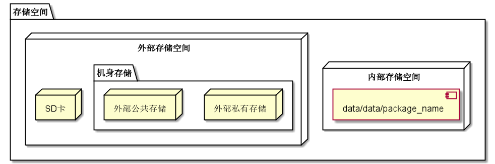

不管是SharedPreferences，还是Room/SQLite，它们都为本地数据持久化提供了行之有效的途径。然而新的问题也随之出现了，如果要保存的数据是图片，或是一大段极长的文字，甚至是一段音视频，单单用SharedPreferences或Room/SQLite就会让开发者感到十分为难。

因为把这类数据往往体积较大，把它们转化成二进制之后再以键值对之类的形式进行存储显然是不合适的，尤其是进行大数据量的下载任务时，SharedPreferences或Room/SQLite更是无法胜任。因此在这种情况下，IO就派上用场了。

## 基本概念

### 何为IO

IO是指Input/Output，即输入和输出。IO以内存为中心：

+ Input指**从外部读入数据到内存**，例如，把文件从磁盘读取到内存，从网络读取数据到内存等等。

+ Output指**把数据从内存输出到外部**，例如，把数据从内存写入到文件，把数据从内存输出到网络等等。

IO流是一种顺序读写数据的模式，它的特点是单向流动。IO流以byte（字节）为最小单位，因此也称为字节流。如果需要读写的是字符，并且字符不全是单字节表示的ASCII字符，那么，按照char来读写显然更方便，这种流称为字符流。

IO功能由Java的`java.io`包提供相应API支持。

### 存储空间

Android将设备的存储空间划分为内部存储空间和外部存储空间。

+ **内部存储空间**

内部存储空间（internal storage）是手机ROM当中的一块存储区域，主要用于<font color=red>存储应用程序的数据</font>。它跟“内存”（RAM）不是同一个东西，不能混淆。

在Android系统中，内部存储空间对应的是`data/data/package_name`，它是一个属于应用程序的私有目录，系统通常不会允许其他应用访问，但是可以通过Android Studio的Device File Explorer来查看。此外，从Android 10开始，系统会对这些私有目录实施加密，以确保只有对应的应用程序在不用申请任何权限的情况下访问里面的数据。

当应用程序被卸载，对应的内部存储空间目录也会跟着被删除，里面的数据也随之被清除掉。因此，如果不希望某些数据在应用卸载的时候跟着被清除，那就不要把它们保存在内部存储空间的目录下面。

+ **外部存储空间**

外部存储空间（external storage）是跟内部存储空间相对应的一个概念，它可以被各种应用程序和用户访问，里面的数据也不会随着应用程序卸载而被清除。在Android 4.4以前，外部存储空间专指SD卡，但随着机身存储容量的提升，除内部存储空间以外的部分也被称为外部存储空间。<font color=red>这里仅讨论机身存储部分的外部存储空间</font>。

外部存储空间又分为外部私有存储和外部公共存储，前者对应的目录是`/storage/emulated/0/Android/data/package_name`或`/storage/sdcard/Android/data/package_name`，和内部存储空间相似，后者对应的就是前者以外的目录。

>外部私有存储

外部私有存储和内部存储有些类似，除了对应程序不用申请权限即可访问、数据会跟着应用卸载一同被清除之外，它还有两个特点：1） 只有在应用中调用API访问外部私有存储目录时，才会创建以package_name命名的私有存储目录；2）Android 7.0之前，其他应用程序可以采用`file://`格式的Uri直接访问某个程序的外部私有存储目录下的数据，Android 7.0之后就必须使用FileProvider。

>外部公共存储

外部公共存储主要存放和应用无关的数据，这些数据在卸载App的时候不会被删除。它还具有这些特点：1）应用要申请权限才能访问，在Android 6.0以后，外部存储权限还要动态申请；2）任何应用只要有外部存储权限，都可以访问公共存储目录下的数据；3）外部公共存储和外部私有存储一样，只占机身存储的一部分，<font color=red>其余的受系统限制无法直接访问</font>。

综上，各种存储空间之间的关系可以用下图来概括：



Google[官方文档](https://developer.android.com/training/data-storage)将<u>内部存储空间和外部私有存储</u>统称为<font color=green>“应用专属存储（App-specific storage）”</font>，而<u>外部公共存储</u>称为<font color=blue>“共享存储（Shared storage）”</font>，在后面的内容中也以此为依据进行分析介绍。

#### 标准存储目录

系统预置了以下标准存储目录，用于存储对应类型的文件：

|目录|调用值|说明|
|:--|:--|:--|
|`···/Music`|DIRECTORY_MUSIC||
|`···/Podcasts`|DIRECTORY_PODCASTS||
|`···/Ringtones`|DIRECTORY_RINGTONES||
|`···/Alarms`|DIRECTORY_ALARMS|存储用于闹钟响铃的音频文件|
|`···/Notification`|DIRECTORY_NOTIFICATIONS|存储用于通知提示音的音频文件|
|`···/Pictures`|DIRECTORY_PICTURES||
|`···/Movies`|DIRECTORY_MOVIES||
|`···/Downloads`|DIRECTORY_DOWNLOADS||
|`···/DCIM`|DIRECTORY_DCIM||
|`···/Documents`|DIRECTORY_DOCUMENTS||
|`···/Screenshots`|DIRECTORY_SCREENSHOTS|存储截屏图片，Android Q（API = 29）以上使用|
|`···/Audiobooks`|DIRECTORY_AUDIOBOOKS|存储有声电子书，Android Q（API = 29）以上使用|

这些目录可以在应用专属存储和共享存储当中进行创建和文件存取操作。

#### 判断外部存储空间状态

Android提供了`Environment.getExternalStorageState(···)`来判断指定外部存储目录（**如果不传参数就默认是外部私有存储**）的状态，它会以String的形式返回10种状态中的一种：

|状态|返回值|说明|
|:--|:--|:--|
|MEDIA_UNKNOWN|unknown|状态不明|
|MEDIA_REMOVED|removed|媒介已移除|
|MEDIA_UNMOUNTED|unmounted|媒介未挂载|
|MEDIA_CHECKING|checking|媒介检测中|
|MEDIA_NOFS|nofs|媒介为空或使用了不支持的文件系统格式|
|MEDIA_MOUNTED|mounted|媒介已挂载，可以读写|
|MEDIA_MOUNTED_READ_ONLY|mounted_ro|媒介已挂载，只读|
|MEDIA_SHARED|shared|媒介未挂载，而是通过USB进行共享|
|MEDIA_BAD_REMOVAL|bad_removal|媒介在未脱离挂载的情况下被移除|
|MEDIA_UNMOUNTABLE|unmountable|媒介无法挂载，通常是因为文件系统损坏|
|MEDIA_EJECTING|ejecting|媒介正在退出|

如果返回的是`MEDIA_MOUNTED`或`MEDIA_MOUNTED_READ_ONLY`，那么至少是可以访问的。

## File类

File是`java.io`包提供的一个核心类，用于操作文件和目录。在Android设备上访问和存取文件，都必须经过File对象。

### 对象构建与路径

最简单的File对象构建方式如下：

```
val file = File("file_path") //传入一个文件路径字符串
```

File的构造器可接收绝对路径和相对路径，所谓绝对路径，就是以根目录为开头的完整路径，比如Windows上的`C:\Program Files\Google\Chrome`，Linux上的`/usr/bin/javac`（Android基于Linux内核自然使用Linux格式的路径）。

相对路径就是省略了根目录的路径，此时根目录就默认为是应用程序所在的当前目录，比如`/`。相对路径的表示方法有`mnt`、`./mnt`以及`../mnt`，其中`.`表示当前目录，`..`表示上级目录。

通过File对象还能获取到路径。File对象提供了三种形式的路径：1）从`getPath()`方法拿到传入构造器的路径；2）从`getAbsolutePath()`方法拿到绝对路径；3）从`getCanonicalPath()`拿到把相对路径转换成绝对路径的规范路径。这三种路径可以根据需要选用。

值得注意的是，构造一个File对象，即使传入的文件或目录不存在，代码也不会出错。因为构造一个File对象，并不会导致任何磁盘操作。只有在调用File对象的某些方法的时候，才会真正进行磁盘操作。

### 文件和目录

File对象操作文件和目录，主要通过以下方法来执行：

|方法名|用途|方法名|用途|
|:--|:--|:--|:--|
|list()|遍历指定路径下的目录和文件，返回一个String列表|listFiles()|遍历指定路径下的目录和文件，返回一个File列表|
|getName()|获取文件或目录的名称|exists()|判断文件或目录是否存在|
|isAbsolute()|判断是否为绝对路径|isDirectory()|判断是否为目录|
|isFile()|判断是否为文件|isHidden()|判断文件是否被隐藏|
|canExecute()|判断文件能否执行|canRead()|判断文件能否读取|
|canWrite()|判断文件能否写入|length()|获取目录和文件的字节大小|
|createNewFile()|在指定路径下创建一个文件|delete()|删除File对象所表示的文件或目录|
|deleteOnExit()|应用程序退出时删除File对象所表示的文件或目录|mkdir()|在指定路径下创建一个目录|
|mkdirs()|根据传入的路径创建一系列多级目录，包括可能并不存在的父目录|setExecutable()|设置文件是否可执行|
|setReadable()|设置文件或目录是否可读|setWritable()|设置文件或目录是否可写|
|setReadOnly()|设置文件或目录为只读|getFreeSpace()|获取文件或目录所在磁盘分区的未分配字节数，不保证准确|
|getUsableSpace()|获取文件或目录所在磁盘分区的可用字节数，不保证准确|getTotalSpace()|获取文件或目录所在磁盘分区的总字节数|

### File的扩展函数

Kotlin对File实施了扩展，为File设计了以下[扩展函数](Kotlin/late?id=扩展函数)：

|函数名|用途|
|:--|:--|
|readBytes()|将文件里的所有数据以Byte数组形式读出，只适用于小文件|
|writeBytes(array: ByteArray)|将数据以Byte数组形式写入文件，只适用于小文件，若文件已存在会被覆盖|
|appendBytes(array: ByteArray)|将数据以Byte数组形式添加到文件末尾|
|forEachBlock(action: (buffer: ByteArray, bytesRead: Int) -> Unit)|将文件以指定buffer大小分块读出，适用于大文件|
|readText(charset: Charset = Charsets.UTF_8)|将文件内容以String形式一次性读入，可指定字符编码格式，只适用于小文件|
|writeText(text: String, charset: Charset = Charsets.UTF_8)|将内容以String形式写入文件，可指定字符编码格式，若文件已存在会被覆盖|
|forEachLine(charset: Charset = Charsets.UTF_8, action: (line: String) -> Unit)|将文件内容以String形式逐行读入，可指定字符编码格式，适用于大文件|
|readLines(charset: Charset = Charsets.UTF_8)|将文件内容逐字读进一个String列表中，可指定字符编码格式，仅适用于小文件|
|useLines(charset: Charset = Charsets.UTF_8, block: (Sequence\<String>) -> T)|将文件内容以Sequence\<String>形式读入，可指定字符编码格式，会引起阻塞|

这些扩展函数都是间接调用了Kotlin专门为IO流封装设计的扩展函数`use`，因此不需要过多关注异常处理和释放资源的问题，可以放心使用。至于`use`函数怎么用，会在下面的内容中进行介绍。

### Files和Paths

Files和Paths都是Java 7开始由`java.nio`包提供的两个工具类，用于简单的文件读写操作，但是只有在<font color=red>Android O（API = 26）</font>以上才能使用，<font color=red>且仅适用于操作小文件和包含少量小文件的目录</font>。

Files主要封装了`copy()`、`delete()`、`exists()`、`move()`、`find()`以及`readAllBytes()`等静态方法以供调用；而Paths提供了两种重载形式的`get()`方法。

在简单读写小文件的场景下，使用Files和Paths可以有效简化代码。

## 输入输出流

InputStream和OutputStream都是Java标准库提供的基本输入输出流，位于`java.io`内。它们都是抽象类，也是所有输入输出流的超类。

二者通常在try-catch-finally代码块中使用，并在finally处调用`close()`方法释放资源，或是利用Java 7推出的try-with-resource工具进行自动管理。然而用try还是比较麻烦，用Kotlin开发的话，还可以选择专门为IO流封装设计的扩展函数`use`。

>注意，IO流是以同步的方式进行的，这意味着会阻塞主线程。

### InputStream

InputStream顾名思义就是输入流，它提供了一个非常重要的方法`read()`。这个方法有三种重载形式：一种是`int read()`，每次只读取一个字节，返回的是这个字节的整型值；第二种是`int read(byte b[])`，接收一个Byte类型的数组作为缓冲区，返回的是每次读取到的字节数；第三种是`int read(byte b[], int off, int len)`，功能上跟第二种类似。三种重载形式都会以返回`-1`作为输入流读取完毕的标志。

InputStream作为一个抽象类，其功能只能由具体的子类来实现。常用的子类有FileInputStream、ByteArrayInputStream以及FilterInputStream。

#### FileInputStream

FileInputStream用于从<font color=red>文件流</font>当中读取数据。它的典型用法如下：

```
/*使用try-catch-finally*/
var input: InputStream? = null
try {
    input = FileInputStream(···)

    //第一种read()
    while(input.read() != -1) { 
        //TODO
    }

    //第二种read()
    val byteArray = ByteArray(···)
    while(input.read(byteArray) != -1) {
        //TODO
    }

    //第三种read()
    val byteArray = ByteArray(···)
    while(input.read(byteArray,offSet,length) != -1) {
        //TODO
    }

} catch(e: Exception) {
    //TODO
} finally {
    input?.close()
}

/*在Java中使用try-with-resource*/
try(InputStream input = new FileInputStream(···)) {
    //TODO
} //对于实现了AutoCloseable接口的类型，编译器会自动加入finally并调用close()
```

原始的try用起来非常繁琐，而Kotlin又不支持try-with-resource的用法，这种时候扩展函数`use`就排上用场了：

```
FileInputStream(···).use { it:FileInputStream
    //第一种read()
    var r = it.read()
    while(r != -1) { 
        //TODO
        r = it.read
    }

    //第二种read()
    val byteArray = ByteArray(···)
    var r = it.read(byteArray)
    while(r != -1) {
        //TODO
        r = it.read
    }

    //第三种read()
    val byteArray = ByteArray(···)
    var r = it.read(byteArray,offSet,length)
    while(r != -1) {
        //TODO
        r = it.read(byteArray,offSet,length)
    }
}
```

`use`函数发挥的作用和try-with-resource类似，只能由实现了AutoCloseable接口的类型对象来调用，而且会自动关闭IO流——无论在此过程中FileInputStream是否会读取失败——其他的输入输出实现类也是如此。

#### ByteArrayInputStream

ByteArrayInputStream用于在内存中模拟字节流的输入。当创建真实文件比较麻烦的时候，就可以考虑使用ByteArrayInputStream，它的用法跟FileInputStream基本一样，只不过需要把传入的参数从路径字符串换成<font color=red>Byte数组</font>：

```
ByteArrayInputStream(···).use {
    //TODO
}
```

#### FilterInputStream

FilterInputStream是一种在直接提供数据的基础上增添额外功能的输入流，但是很少被直接使用。因为它仅仅只是简单地重写了那些将所有请求传递给所包含输入流的InputStream的所有方法，而更复杂的实现是交由子类去做的。FilterInputStream的常用子类包括：BufferedInputStream、InflaterInputStream以及DataInputStream等。

> *BufferedInputStream*

BufferedInputStream提供的是缓冲输入流的功能，它在内部维护了一个Byte类型的缓冲数组。在每次调用`read()`方法的时候，它会首先尝试从缓冲区里读取数据，若缓冲区内无数据可读，则选择从物理数据源（譬如文件）读取新数据放入到缓冲区中，最后再将缓冲区中的内容部分或全部返回给用户。这样读取效率就相对高了不少。BufferedInputStream对象的创建需要向构造器传入一个InputStream类型的参数，例如：

```
val bis = BufferedInputStream(ByteArrayInputStream(byteArrayOf(1,2,3,4,5,6)))
```

> *InflaterInputStream*

InflaterInputStream和FilterInputStream一样也是很少直接使用，更常用的是由它派生出来的ZipInputStream及其子类JarInputStream，还有GZIPInputStream这几个子类。从名字上看就知道，它们都是负责将数据从特定格式压缩包里面解压出来，然后再进行读取的。

要创建一个ZipInputStream，通常是传入一个FileInputStream作为数据源，然后循环调用`getNextEntry()`方法，直到返回null，表示zip流结束：

```
val zis = ZipInputStream(FileInputStream(···))
zis.use {
    var zip = it.nextEntry
    if (!zip.isDirectory) {
        while (zip != null) {
            //TODO
            zip = it.nextEntry
        }
    }
}
```

其他的InflaterInputStream子类在使用上与ZipInputStream基本一样，这里不再做赘述。

> *DataInputStream*

DataInputStream用于从输入流中读取Java基本数据类型，且采用的是与机器无关方式——这句话的含义是，DataInputStream可以从输入流中识别出Java的基本数据类型——但这是有前提的，**输入流的来源必须是那些通过DataOutputStream所输出的做过特殊标记的文件**，否则就无法识别，而且会引起EOFException。DataInputStream除了提供一般的`read()`方法外，还提供了`readBoolean()`、`readByte()`、`readChar()`、`readDouble()`、`readFloat()`、`readInt()`、`readLong()`以及`readShort()`等方法来读取特定的基本类型数据。在后面介绍DataOutputStream的时候会展示其典型用法。

### OutputStream

和InputStream相反，OutputStream是输出流，提供的是`write()`方法。这个方法同样也有三种重载形式：一种是`void write(int b)`，每次只会写入一个字节；第二种是`void write(byte b[])`，接收Byte数组作为缓冲区；最后一个是`void write(byte b[], int off, int len)`，用法上跟输入流差不多，只不过是写入文件的。

除了`write()`方法，OutputStream还提供了一个`flush()`方法，用于<font color=red>强制输出缓冲区的内容</font>。一般情况下，缓冲区写满了就会自动调用该方法，要是缓冲区没满但是又得输出内容的话就得手动调用了。

同InputStream一样，OutputStream作为一个抽象类也是不能直接使用的，其功能同样得交由子类来实现。常用的子类包括：FileOutputStream、ByteArrayOutputStream以及FilterOutputStream等。

#### FileOutputStream

FileOutputStream用于将输出流写入文件当中，它的典型用法如下：

```
val fos = FileOutputStream(File(···))
fos.use {
    it.write(···)
}
```

通常使用比较多的`write()`方法是第二种重载形式，即接收一个Byte数组。但是手动构建一个Byte数组并不总是可行的，因而也可以选择将字符串转换成Byte数组：

```
val fos = FileOutputStream(File(···))
fos.use {
    it.write("Some String".toByteArray())
}
```

#### ByteArrayOutputStream

ByteArrayOutputStream和ByteArrayInputStream相反，是将字节流写入内存中：

```
val bos = ByteArrayOutputStream()
bos.use {
    it.write(···)
}
Toast.makeText(context, String(bos.toByteArray()),Toast.LENGTH_SHORT).show()
```

#### FilterOutputStream

FilterOutputStream的常用子类有：BufferedOutputStream、DataOutputStream、DeflaterOutputStream、InflaterOutputStream以及PrintStream等。

> *BufferedOutputStream*

BufferedOutputStream是一个缓存输出流，当缓冲区写满的时候就会自动调用`flush()`方法将里面的数据全部输出，如果没满的话就要手动调用以防有数据残留在缓冲区未输出。一个比较好的做法就是，任何情况下，在BufferedOutputStream关闭之前都要手动调用`flush()`：

```
val bufferedos = BufferedOutputStream(···)
bufferedos.use {
    it.write(···)
    it.flush()
}
```

> *DataOutputStream*

DataOutputStream用于将数据流附上特殊标记再写入文件，这样当用户使用对应的DataInputStream时，就可以从文件中读出特定类型的数据：

```
//写入
val dos = DataOutputStream(···)
dos.use {
    it.writeBoolean(true)
    it.writeInt(1)
    it.writeUTF("Fuck you")
    it.writeFloat(1.2F)
    ···
    it.flush()
}

//读取
val dis = DataInputStream(fis)
dis.use {
    val b: Boolean = it.readBoolean()
    val i: Int = it.readInt()
    val u: String = it.readUTF()
    val f: Float = it.readFloat()
    ···
}
```

> *DeflaterOutputStream*

DeflaterOutputStream用于将数据输出并打包成指定格式的压缩包。同样地，它的具体实现也是由ZipOutputStream、GZIPOutputStream以及JarOutputStream等子类来完成，这里仍然以Zip格式压缩包为例：

```
val zos = ZipOutputStream(···)
val z = ZipEntry(···)
zos.use {
    it.putNextEntry(z)
}
```

值得注意的是，ZipOutputStream不是用`write()`方法，而是用`putNextEntry()`将数据写入压缩包。

> *InflaterOutputStream*

InflaterOutputStream用于将数据从通过DeflaterOutputStream压缩好的特定格式压缩包里解压出来，再输出到内存或文件当中。

> *PrintStream*

PrintStream在实现OutputStream接口的基础上又额外添加一些写入各种数据类型的方法，比如`print()`和`println()`。在Java中，`System.out`跟`System.err`都是系统默认提供的PrintStream对象，分别表示标准输出和标准错误输出，它们在使用的时候不会抛出`IOException`。

## Reader/Writer

Reader和Writer都是`java.io`包提供的另一种输入输出流接口，它们跟InputStream及OutputStream的主要区别在于：后者都是处理**字节流**，而前者专门处理**字符流**。

### Reader

Reader作为处理输入字符流的超类，其功能主要由FileReader、CharArrayReader、StringReader以及InputStreamReader等常用子类来实现。Reader对象主要通过`read()`方法来处理输入字符流。

#### FileReader

FileReader负责从文件读取字符流，其典型用法如下：

```
val reader: Reader = FileReader(···)

/*逐个字符读取*/
while (true) {
    val s = reader.read()
    if (s == -1) {
        break
    }
    //TODO
}

/*带有缓冲的字符读取*/
val buffer = CharArray(1000)
while (true) {
    val s = reader.read(buffer)
    if (s == -1) {
        break
    }
    //TODO
}
```

如果读取正常文件出现了乱码，则可以在FileReader构造方法中传入字符编码格式，比如`StandardCharsets.UTF_8`——经验证，在Java 8环境下没有这个构造方法，但是Java 15可以用。

#### CharArrayReader

CharArrayReader的作用和ByteArrayInputStream相似，都是在内存中利用一个Char数组模拟数据源进行读入，这样就不用在磁盘上创建真实存在的文件了：

```
val reader: Reader = CharArrayReader(charArrayOf('A','B','C','D'))
```

其他用法跟FileReader基本一样，此处不做赘述。

#### StringReader

StringReader把字符串作为输入的数据源，在用法上跟CharArrayReader也是基本一样：

```
val reader: Reader = StringReader("Surprise, motherfucker")
```

#### InputStreamReader

Reader在本质上是一个基于InputStream的把Byte类型数据转换为Char的转换器。InputStreamReader要做的事情就是如此，把一个InputStream对象转换成Reader对象，比如：

```
val reader: Reader = InputStreamReader(FileInputStream(···))
```

上述例子可以视为FileReader的一种实现方式。

>注意，尽管传进去一个InputStream对象，但只要确保InputStreamReader对象能够关闭，InputStream对象也会跟着关闭释放资源，不需要再手动进行管理。

### Writer

Writer作为处理输出字符流的超类，其功能主要由FileWriter、CharArrayWriter、StringWriter以及OutputStreamWriter等常用子类来实现。Writer对象主要通过`write()`方法来处理输出字符流。

#### FileWriter

FileWriter用于将字符流写进文件：

```
val writer: Writer = FileWriter(···)
writer.use {
    it.write(···)
    it.flush()
}
```

注意到FileWriter也可以调用`flush()`方法，其原因是父类Writer实现了Flushable接口，而非继承了OutputStream。

#### CharArrayWriter

CharArrayWriter可以在内存中创建一个Writer，它的作用实际上是构造一个缓冲区，可以写入Char类型数据，最后得到写入的Char数组，这和之前的ByteArrayOutputStream非常类似：

```
val writer = CharArrayWriter() //注意，如果将writer类型设置为父类Writer，就无法调用toCharArray()方法
writer.use {
    it.write(66)
    it.write(67)
    it.write(68)
    it.write("ABC".toCharArray())
    ···
    //TODO
}
```

#### StringWriter

StringWriter也是一个基于内存的Writer，它和CharArrayWriter类似。实际上，StringWriter在内部维护了一个StringBuffer，并对外提供了Writer接口：

```
val writer = StringWriter(···) //可以传入一个缓冲区大小的值
writer.use {
    it.write(66)
    it.write(67)
    it.write(68)
    it.write("Fuck you")
    ···
    //TODO
}
```

#### OutputStreamWriter

和InputStreamReader相反，OutputStreamWriter是一个将任意的OutputStream转换为Writer的转换器，比如：

```
val writer = OutputStreamWriter(FileOutputStream(···))
```

#### PrintWriter

PrintWriter在用法上跟PrintStream几乎是完全一样的，只不过前者输出的是Char类型的数据，后者输出的是Byte类型的数据。

## 在Android上使用IO

### 访问应用专属存储的数据文件

前面已经提到过，应用程序访问专属存储的数据文件是不需要申请权限的，而且Android为应用专属存储提供了以下方法用于获取文件所在的目录：

|方法|用途|
|:--|:--|
|getFilesDir()|获取`/data/data/package_name/files`目录|
|getCacheDir()|获取`/data/data/package_name/cache`目录|
|getExternalCacheDir()|获取`/storage/sdcard/Android/data/package_name/cache`目录|
|getExternalFilesDir()|获取`/storage/sdcard/Android/data/package_name/files`目录|

配合调用这些方法构建File对象，就可以开始操作文件和目录了：

```
val file = File(fileDir,fileName)
```

+ **存储文件**

```
/*使用File对象*/
file.writeBytes(···)
file.writeText(···)

/*不使用File对象*/
context.openFileOutput(fileName, MODE_PRIVATE).use { it:FileOutputStream!
    it.write(···)
    it.flush()
}
```

+ **读取文件**

```
/*使用File对象*/
val s: String = file.readText()
val l: List<String> = file.readLines()
val b: ByteArray = file.readBytes()


/*不使用File对象*/
context.openFileInput("test.txt").bufferedReader().useLines { lines ->
    lines.fold("") { some,text ->
        //TODO
        "$some\n${text}"
    }
}
```

+ **创建和删除缓存文件**

创建缓存文件有两种方式，一种通过调用File的扩展函数，另一种则是构建File对象：

```
/*方式一*/
File.createTempFile(fileName,fileExtension,cacheDir)

/*方式二*/
File(cacheDir,fileName).apply {
    if (!exists()) {
        createNewFile()
    }
}
```

方式一中，需要用户传入文件名、文件扩展名以及cache目录路径，如果文件扩展名为空，系统会自动为文件添加`.tmp`扩展名。此外，系统还会在文件名后面自行添加一串数字。如果介意的话就使用方式二，这样可以确保文件名和文件扩展名都是由用户自行决定的。

删除缓存文件也有对应的两种方式：

```
/*方式一*/
File(cacheDir,fileName).delete()

/*方式二*/
context.deleteFile(cacheFileName)
```

>注意，方式二不光能删除缓存文件，只要在应用专属存储范围内能搜索到的文件都可以删。

上面两种方式都是用于删除**单个**缓存文件，如果要清理cache目录下的所有文件，那么就得构建一个File对象遍历目录然后删除：

```
File(cacheDir.toString()).listFiles()?.let { 
    for (i in it) {
        i.delete()
    }
}
```

还有一种情况是存储空间不足，需要清理**所有**应用的缓存文件，那么就可以发送一条携带有action参数`ACTION_CLEAR_APP_CACHE`的隐式Intent广播。Google官方对此作出了一个提醒：

>The ACTION_CLEAR_APP_CACHE intent action can substantially affect device battery life and might remove a large number of files from the device.
>
>以`ACTION_CLEAR_APP_CACHE`作为action参数的Intent会对设备电量产生显著影响并移除大量文件。

### 访问共享存储的数据文件

共享存储的数据文件包括多媒体、文档以及其他可以被共享使用的文件（Shared Preferences和数据库不在此列），如果要访问它们，就必须在AndroidManifest当中声明以下权限：

|版本|申请权限|说明|
|:--|:--|:--|
|Android 6.0以下|`READ_EXTERNAL_STORAGE`<font color=red>和</font>`WRITE_EXTERNAL_STORAGE`|不需要动态申请|
|Android 6.0到Android 9|`READ_EXTERNAL_STORAGE`<font color=red>和</font>`WRITE_EXTERNAL_STORAGE`|需要动态申请|
|Android 10|`READ_EXTERNAL_STORAGE`<font color=blue>或</font>`WRITE_EXTERNAL_STORAGE`|同上|
|Android 11起|`READ_EXTERNAL_STORAGE`|同上|

+ **访问多媒体文件**

访问**位于共享存储**当中的多媒体文件需要用到一个非常重要的类：MediaStore。按照Google官方的说法，Android系统会自动扫描磁盘中的多媒体文件并进行分类，然后将它们的信息分别存进对应的表中进行维护，这样就提供了一个经过优化的媒体集合索引，称为媒体库：

+ 图片类：保存在`MediaStore.Images`表中
+ 视频类：保存在`MediaStore.Video`表中
+ 音频类：保存在`MediaStore.Audio`表中
+ 下载类：保存在`MediaStore.Downloads`表中，**Android 9（API = 28）开始使用**

在针对Android 10（API = 29）及其以上版本开发的应用中，如果开发者使用了Scoped Storage（分区存储），通过File是没法查看特定文件的，只能通过`MediaStore.Files`来查看那些**由该应用创建的**图片和音视频文件。如果没使用Scoped Storage，`MediaStore.Files`会展示所有类型的多媒体文件。要

>按照Google的说法，为了让用户更好地管理自己的文件并减少混乱，以 Android 10（API 级别 29）及更高版本为目标平台的应用，在默认情况下被赋予了对外部存储空间的分区访问权限（即分区存储）。<font color=red>此类应用只能访问外部存储空间上的应用专属目录，以及本应用所创建的特定类型的媒体文件</font>。

+ **访问文档和其他类型文件**
+ **访问共享数据集**