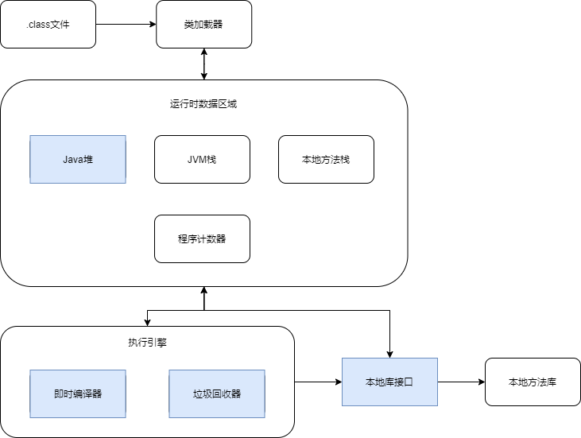
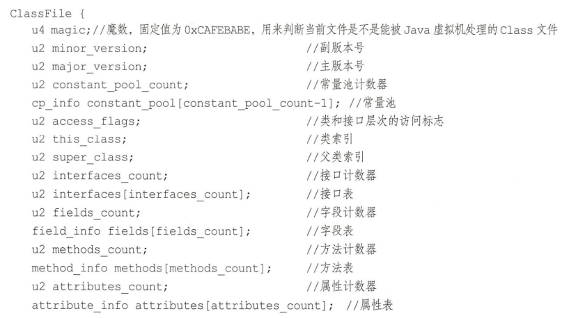
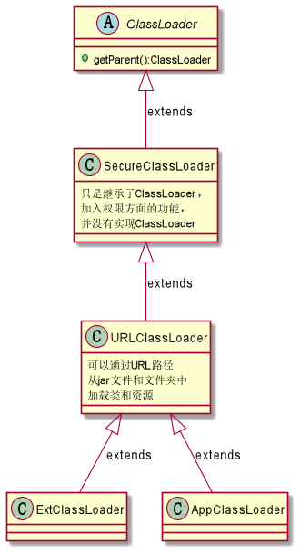
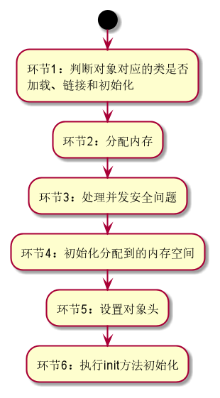
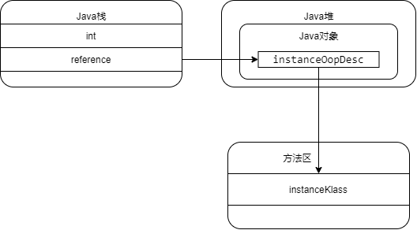
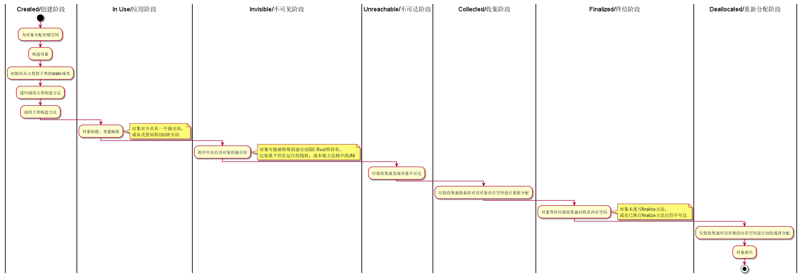
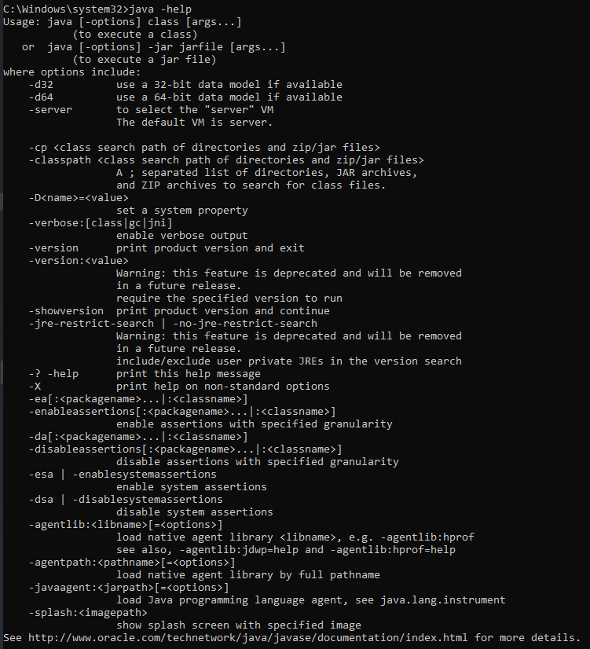
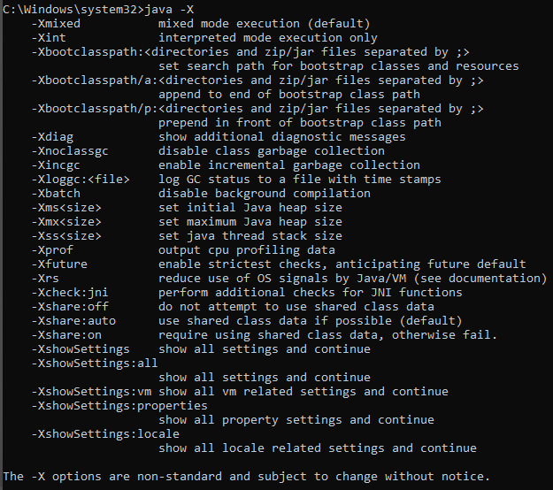

## 跨平台原理

Java是一门跨平台的语言。所谓跨平台，是指无论在Linux、Windows还是Mac OS等桌面操作系统上，Java都可以编译运行，不需要考虑各个平台之间的差异。一门编程语言要实现跨平台特性，主要通过两种途径：一是依靠编译器将相同的代码根据平台直接转换成对应的机器码，二是将代码先翻译成中间语言（Middle Language，ML），再由虚拟机根据平台转换成对应的可以被CPU执行的机器码指令。C和C++等语言采用的是前者，而Java和C#等语言则采用后者。

### Java虚拟机简介

Java虚拟机（Java Virtual Machine，JVM）是专门用于解释执行字节码指令的工具。严格来说，它不是指某一个具体的Java虚拟机，而是一整个Java虚拟机家族，其中包括有HotSpot VM、J9 VM以及Zing VM等。在通常情况下，大家主要讨论的是HotSpot VM，因为Oracle JDK和OpenJDK是使用最为广泛的两种JDK，尤其是OpenJDK自己实现的JVM大多也是基于HotSpot VM，因此HotSpot JVM自然而然也就成为了主流虚拟机。

按照Java虚拟机规范，抽象的Java虚拟机体系结构如下图所示：



图中的蓝色部分表示所有线程**共享**的数据区域，白色的就是线程**私有**的数据区域。

>注意，上图仅仅是描述了Java虚拟机的抽象行为，而不是某个特定JVM的具体实现。

### 字节码简介

Java使用的中间语言被称为字节码，它是一套运行在虚拟机上的指令集。当然，软件层面的指令集要比硬件层面的指令集更加抽象，否则就不能实现真正的跨平台。字节码的载体是`.class`文件，这是一种不依赖于特定硬件和操作系统的二进制文件，它是所有基于Java虚拟机的语言，比如Java、Kotlin、Groovy以及Scala等，经过编译器处理后生成的最终产物。字节码指令集中每一条指令都可以用一串8位二进制数来描述，也就是说，整个指令集不会超过255条指令。如果用支持十六进制编码的文本编辑器打开`.class`文件，可以看到其内容是以`cafe babe`开头的一大堆十六进制数文本，这些文本在专门的IDE上（比如IntelliJ IDEA和Android Studio）会被转换成稍微便于阅读理解的内容，至少在感觉上大致类似于读源码。

每一个`.class`文件都对应着唯一的类或者接口的定义信息，但是类或者接口并不一定定义在文件中，因为有些类和接口都可以通过类加载器来直接生成。`.class`文件的格式如下：



可以看到`.class`文件具有很强的描述能力，包含了很多关键信息，其中的u4、u2表示**基本数据类型**。除此之外，`.class`文件还有u1和u8两种基本数据类型。在这些基本数据类型的代号中，u表示无符号类型，后面跟着的数字代表该类型的字节长度。

Java虚拟机和字节码指令集共同构成了Java跨平台的基石。尽管现在大多数的Android设备上使用的虚拟机不是Java虚拟机，Android应用也不是转换成`.class`文件才执行，但是两者的思路基本上是一致的。

## JVM工作原理

### 类加载器

#### 类加载器种类

1. **Bootstrap ClassLoader**

Bootstrap ClassLoader是引导类加载器，采用C/C++实现，用于加载指定JDK的核心类库，比如位于`$JAVA_HOME$/jre/lib`目录和`-Xbootclasspath`参数指定目录下的类。JVM的启动就是通过Bootstrap ClassLoader创建一个初始类来完成的。该加载器不能通过Java代码访问到，但是可以查询到某个类是否被它加载过。

2. **Extensions ClassLoader**

Extensions ClassLoader是扩展类加载器，用于加载位于`$JAVA_HOME$/jre/lib/ext`目录和系统属性java.ext.dir所指定目录下的扩展类，提供除系统类之外的额外功能。

3. **Application ClassLoader**

Application ClassLoader是应用程序类加载器，也称System ClassLoader（系统类加载器），用于加载当前应用程序Classpath目录和系统属性java.class.path指定目录下的类库。该加载器可以通过`getSystemClassLoader`方法获取到。

#### 继承关系与双亲委派模式

在一个Java程序中，ClassLoader的继承关系如下图所示：



上图中，ExtClassLoader是扩展类加载器的实现类，AppClassLoader是应用程序类加载器的实现类，两者都是Launcher（JVM的入口应用）的内部类，并且都是在Launcher中进行初始化。

双亲委派（parents delegate）是类加载器查找某个Class所采用的一种机制，其工作流程为：

+ 首先判断该Class是否已加载，如果没有就委托给父加载器进行查找，如此递归下去，直到委托到最顶层的Bootstrap ClassLoader；
+ 若Bootstrap ClassLoader找到了该Class，就直接返回，否则就继续依次向下查找；
+ 如果Bootstrap ClassLoader仍未找到，就交由自定义类加载器去查找，直至找到该Class或抛出ClassNotFound异常。

采取双亲委派的好处有：（1）避免重复加载Class；（2）避免自定义同名类替代系统类造成安全隐患。

>注意，双亲委派的含义是：将查找Class的工作委托给父加载器。parents在这里引申表示为“上一层级的”，并不是代表“有一对类似于父母的类加载器”。

### 运行时数据区域

运行时数据区域实际上是指Java的内存区域，有人将其简单地划分为堆内存（Heap）和栈内存（Stack），但JVM在执行Java程序的过程中会将其所管理的内存划分为不同的数据区域，分法远远要复杂得多。下面一一进行讨论。

1. **程序计数器**

程序计数器（Program Counter Register）也称PC寄存器，是一块较小的内存空间，用于确保处理器确定下一条指令的地址。字节码解释器工作时就是通过改变程序计数器来选取下一条需要执行的字节码指令；而JVM的[多线程](/Kotlin/coroutine?id=线程)为了在线程切换后能恢复到正确的执行位置，需要各自持有一个程序计数器。若线程执行Native方法，则程序计数器的值为`Undefined`，否则就保存正在执行的字节码指令地址。

程序计数器是Java虚拟机规范中唯一没有规定任何`OutOfMemoryError`情况的数据区域。

2. **JVM栈**

JVM栈是一个线程私有的栈，用于存储线程中Java方法调用的状态，如局部变量、参数、返回值以及运算的中间结果等。JVM栈与线程同时创建，其生命周期与线程相同。当线程调用一个Java方法时，JVM压入一个新的栈帧（存储有局部变量表、操作数栈、动态链接和方法出口等信息）到该线程的JVM栈中，在该方法执行完成后，这个栈帧就从JVM栈中弹出。

JVM栈规定了`StackOverFlowError`和`OutOfMemoryError`两种异常情况。前者表示线程请求分配的站容量超过JVM所允许的最大容量，后者则代表JVM没有足够的内存分配给线程使用（不管是动态扩展还是新创建线程）。

3. **本地方法栈**

本地方法栈（Native Method Stack）并不是一个强制要求支持的数据区域，因为它只有在JVM用到C Stacks来支持Native语言和Native方法时才用到，而且可以自由实现，有些虚拟机并不将其单独划出，而是合并到JVM栈里面。类似地，本地方法栈也会抛出`StackOverFlowError`和`OutOfMemoryError`两种异常情况。

4. **Java堆**

Java堆（Java Heap）是被所有线程共享的运行时内存区域，用于存放对象实例。几乎所有的对象实例都在这里分配内存，同时存储在这里的对象实例被垃圾收集器管理，垃圾收集（Garbage Collection，GC）机制会在后面详细介绍。Java堆定义了`OutOfMemoryError`这一种异常情况。

Java堆里有一个逻辑组成部分——**方法区**（Method Area），用于存储已经被JVM加载的类的结构信息，包括运行时常量池、字段和方法信息、静态变量等数据。在方法区中，可以选择不实现垃圾收集。**运行时常量池**作为方法区的一个组成部分，其与`.class`文件的常量池信息关系密切，用于存放编译时期生成的字面量和符号引用。

### Java堆中的对象

#### 对象创建

在Java中，使用`new`关键字创建一个对象时，JVM的操作流程如下：



在环节1，JVM首先会去检查这个指定的参数能否在常量池中定位到一个类的符号引用，并且检查该符号引用代表的类是否已被类加载器加载、链接和初始化过。

在环节2，根据Java堆是否规整，JVM会采取两种方式分配内存。如果是规整的，就采用**指针碰撞**，即位于中间的指针指示器向空闲内存移动一段与对象大小相等的距离；如果是不规整的，就采用**空闲列表**，即从可用内存列表中查询到足够大的内存进行分配，然后更新列表记录。

>内存规整的含义是所有用过的内存划到一边，所有空闲的内存划到另一边。不规整的内存需要JVM维护一个列表来记录哪些内存是可用的。

在环节3，JVM同样会采取两种措施来解决并发问题。一种是对分配内存空间的动作进行同步处理（保证原子性），另一种则是利用本地线程分配缓冲（Local Allocation Buffer，TLAB）。TLAB是每个线程在Java堆中预先分配的一小块内存，可以通过`-XX:+/-UserTLAB`参数来设定虚拟机是否使用。线程需要分配内存时，就在自己的TLAB上分配，当TLAB用完且被分配到新的TLAB时才需要进行同步锁定。

在环节4，JVM将分配到的内存初始化为零值（对象头除外）。

在环节5，JVM把对象所属类、对象的HashCode和对象的GC分代年龄的数据存储在对象头中。

在环节6，JVM执行init方法，初始化对象的成员变量、调用类的构造方法，这样一个对象就完成了创建。

#### 对象信息

HotSpot VM的对象实例在Java堆中由三部分构成：对象头（Header）、实例数据（Instance Data）和对齐填充（Padding）。

对象头包含两部分信息，分别是Mark World和元数据指针。前者用于存储对象运行时的数据，比如HashCode、锁状态标志、GC分代年龄以及线程持有的锁等。而元数据指针用于指向方法区中的目标类的元数据，从而确定对象的具体类型。

实例数据用于存储对象中各种类型的字段信息（包括从父类继承来的）。由于HotSpot VM的自动内存管理系统要求对象的起始地址必须是8字节的整数倍，因此在实例数据部分未对齐的情况下就需要进行对齐填充。如果有一些虚拟机并不要求这种字节对齐，那么就可以不用对齐填充。

对象头元数据指针所指向的元数据，是oop-klass模型的重要组成部分。oop-klass模型是一种在HotSpot VM中用于描述Java对象实例的模型，oop（Ordinary Object Pointer）代表普通对象指针，用于表示一个对象的实例信息；klass用于描述元数据。oop实际是一个家族，JVM内部定义有很多oop类型和klass家族，比如在oopsHierarchy.hpp文件中就定义有这些内容：

```
typedef class markOopDesc* markOop; //oop标记对象
typedef class oopDesc* oop; //oop家族的顶级父类
typedef class instanceOopDesc* instanceOop; //表示Java类实例，可用于描述对象头
typedef class arrayOopDesc* arrayOop; //数组对象，是objArrayOopDesc和typeArrayOopDesc的父类，可用于描述对象头
···
class Klass; //klass家族的父类
class InstanceKlass; //描述Java类的数据结构
class InstanceMirrorKlass; //描述java.lang.Class实例
class InstanceClassLoaderKlass; //特殊的InstanceKlass，不添加任何字段
class InstanceRefKlass; //描述java.lang.ref.Reference的子类
class ArrayKlass; //描述Java数组信息
class ObjArrayKlass; //描述Java中引用类型数组的数据结构
class TypeArrayKlass; //描述Java中基本类型数组的数据结构
```

前面已经提到，klass是用来描述元数据的，具体含义就是指Java类在JVM中对等的C++类型描述。与klass紧密相关的klass.hpp文件，其内部定义的部分字段如下：

```
jint _layout_helper; //对象布局的综合描述符
Symbol* _name; //类名
oop _java_mirror; //类的镜像类
Klass* _super; //父类
Klass* _subklass; //第一个子类
Klass* _next_sibling; //下一个兄弟节点
jint _modifier_flags; //修饰符标识
AccessFlags _access_flags; //访问权限标识
```

JVM通过栈帧中的对象引用找到Java堆中的instanceOopDesc，从而访问到Java对象的实例信息。当需要访问对象的具体类型等信息时，即可通过instanceOopDesc中的元数据指针找到方法区中对应的instanceKlass，如下图所示：



### 垃圾收集机制

垃圾收集机制的出现时间要早于Java语言本身，其主要任务之一是完成内存的划分和分配，另一个就是对垃圾进行回收。目前JVM的内存划分就依赖于GC的机制设计。

#### Java引用类型

目前Java有四种引用类型：强引用、软引用、弱引用和虚引用。这四种引用类型的划分依据就是对象**对于内存使用的敏感程度**。

|引用类型|描述|示例|
|:-----|:-----|:-----|
|强引用|即便发生OOM异常也绝不会回收该类型引用对象的内存|Java中通过`new`新建的对象|
|软引用|内存不够时就先回收该类型引用对象的内存，此后仍然不够的就抛出OOM异常|Java中实现了`SoftReference`类的对象|
|弱引用|无论内存是否足够，一旦发现存在该类型应用的对象即回收其内存|Java中实现了`WeakReference`类的对象|
|虚引用|随时有可能会被回收，且回收时会收到一个系统通知（主要作用）|Java中实现了`PhantomReference`类的对象|

目前主流的JVM采用的是**根搜索算法**来判断一个对象是否已经死亡可被回收。根搜索算法的基本思想为：选定一些对象作为GC Roots组成根对象集合，以这些GC Roots对象作为起始点向下搜索。若目标对象在逻辑拓扑上有路径与GC Roots相连，就标记为“可达”，否则就是“不可达”，可以在进行GC时将其回收。一个目标对象可以属于多个GC Roots。

在Java中，可作为GC Roots的对象主要有以下几种：

+ Java栈中引用的对象；
+ 本地方法栈中JNI引用的对象；
+ 方法区中运行时常量池引用的对象；
+ 方法区中静态属性引用的对象；
+ 运行中的线程；
+ 由Bootstrap ClassLoader加载的对象；
+ 垃圾收集器控制的对象。

>注意，被标记为不可达的对象并不会立即就被清理。

#### 垃圾标记与收集

1. **标记-清除算法**

标记-清除（Mark-Sweep）算法是一种基础的垃圾收集算法，它将垃圾收集分为两个阶段：标记阶段和清除阶段。在标记阶段，所有可回收的对象都会被标记出来；在清除阶段，所有被标记的对象所占用的空间会被回收。该算法的优点是简单，缺点是效率低且容易产生大量不连续的内存碎片，从而导致连续内存空间不足，提前触发新的一次垃圾收集动作。

2. **复制算法**

复制算法主要是解决标记-清除算法效率不高的问题，其基本思路为：将内存空间划分为两个相等的区域，每次只使用一个区域。在进行垃圾收集时，遍历当前使用的区域，把存活的对象复制到另外一个区域中，最后将当前使用的区域的可回收对象进行回收。复制算法每次都对整个半区进行内存回收，不需要考虑内存碎片的问题，但代价就是使用内存变成原来的一半。此外，复制算法的效率只有在存活对象数量较少的情况下比较高，换言之，短生命周期对象大量聚集的区域更适合使用复制算法。

3. **标记-压缩算法**

标记-压缩（Mark-Compact）算法对标记-清除算法的改进之处在于，在标记可回收第项后将所有存活的对象压缩到内存的一段，使它们紧凑地排列在一起，然后对边界以外的内存进行回收，使已用和未用的内存都各自一边，解决了不连续内存碎片产生的问题。

4. **分代收集算法**

在Java堆中，各种对象的生命周期千差万别，因此需要对不同生命周期的对象采用不同的垃圾收集策略。目前被广泛应用于主流JVM的分代收集算法，其基本思路就是**根据生命周期长短将对象划分到不同区域，并在不同区域采用不同的收集算法**。Java堆将对象划分为<font color=red>新生代</font>（Young Generation）和<font color=red>老年代</font>（Tenured Generation），在HotSpot虚拟机中，新生代还会再细分为*Eden*、*From Survivor*和*To Survivor*三大空间，三者的默认比例是**8 : 1 : 1**。

新生代的垃圾收集被称作Minor Collection，而老年代的垃圾收集则被称为Full Collection或Major Collection。后者收集频率较低且耗时较长，通常情况下会伴随至少一次前者，主要采用标记-压缩或标记-清除算法。在执行Minor Collection时，Eden空间的存活对象，以及之前经过一次Minor Collection并在From Survivor空间中存活的年轻对象，会被复制到To Survivor空间（这就是复制算法的应用）。如果一个存活对象的分代年龄超过了`-XX:MaxTenuringThreshold`所指定的阈值（该阈值用于控制对象经历多少次Minor Collection后可以晋升老年代），或是To Survivor空间容量已满，那么它就会晋升至老年代。当所有存活对象被复制到To Survivor空间或是晋升至老年代后，在Eden和From Survivor空间里剩下的都是可回收对象。执行Minor Collection时，Eden和From Survivor空间都会被清空，然后原来的To Survivor空间就转换成From Survivor空间，而已经被清空的原From Survivor空间就变成To Survivor空间，也就是二者互换。

在了解了Java对象如何创建和回收之后，再来了解一下一个Java对象的生命周期。Java对象的生命周期可以通过下图来描述。可以看到，当对象处于不可达阶段时，JVM不一定马上就回收其内存，有可能还要再经历几个阶段才会真正被回收。



## 附录：JVM启动参数简介

Java程序的运行离不开JVM。很多时候，Java程序的启动运行可能就是执行一条命令`java -jar xxxx.jar`，但是某些时候，这个命令会包含有一大堆见所未见的内容在里面。这些“见所未见的内容”，实际上就是JVM的启动参数。之所以会使用到启动参数，是因为单纯的`java -jar xxxx.jar`并不能保证Java程序以最佳性能状态运行，必须通过额外的干预和配置才行。

JVM启动参数有几种类型。如果按照功能划分，可以分为系统属性、运行模式、堆内存设置以及GC设置等类型的启动参数；如果按照调用方式划分，又可以分为标准参数、非标准参数和非稳定参数。这里采用的是按调用方式划分，并且基于OpenJDK 1.8.0-262。

### 标准参数

标准参数是指所有厂商开发的JVM都**必须实现、且能够向后兼容**的功能参数。标准参数可以通过`java -help`来进行查看，顺带一提的是，`-help`本身也是标准参数。下图所展示的就是执行`java -help`之后列出的JVM标准启动参数：



一些比较常用的标准参数列出如下表所示：

|标准参数|用途|备注|
|:-----:|:----------:|:-----|
|`-help`|显示标准参数信息||
|`-version`|查看当前使用的Java版本信息||
|`-jar`|执行一个jar程序|jar文件中必须声明包含有main方法的Main-class才能被执行，否则会抛异常|
|`-server`|JVM使用server模式|JVM启动速度较慢，但运行时性能和内存管理效率很高，适用于生产环境，在具有64位能力的JDK环境下将默认启用该模式，并忽略可能存在的`-client`参数|
|`-client`|JVM使用client模式|JVM启动速度较快，但运行时性能和内存管理效率不高，适用于客户端应用程序或者PC应用开发和调试|
|`-D<name>=<value>`|设置系统属性键值对|运行在此JVM之上的应用程序可用System.getProperty("name")得到value的值，通常用于设置系统级全局变量值，如配置文件路径，以便该属性在程序中任何地方都可访问；如果value中有空格，则需要用双引号将该值括起来，如-Dname="space string"|
|`-cp`|设置class搜索路径|`-cp`是`-classpath`的缩写别名，用于告知JVM搜索目录名、jar文档名或zip文档名，各路径之间用分号;分隔；使用该参数后JVM将不再使用CLASSPATH中的类搜索路径；若该参数和CLASSPATH都没有设置，JVM就会使用当前目录作为类搜索路径|
|`-nogui`|不启用图形界面|在支持图形界面的操作系统（比如Windows）上，如果不设置该参数，程序运行时就会弹出图形界面|

### 非标准参数

非标准参数又被称作扩展参数，就是**不保证所有JVM都会实现、并且不会向后兼容**的功能参数。非标准参数的调用方式为`-X<参数名>`。某一款JVM所支持的非标准参数可以利用`java -X`来进行查看，类似于下图所示：



常用的非标准参数列出如下表所示：

|非标准参数|用途|备注|
|:-------:|:-----:|:------|
|`-Xint`|设置JVM以解释模式运行|强制JVM解释执行所有的字节码，会降低运行速度，通常低10倍或更多|
|`-Xcomp`|设置JVM以编译模式运行|在JVM第一次使用时会把所有的字节码编译成native code，从而带来最大程度的优化|
|`-Xmixed`|设置JVM以混合模式运行|将解释模式和编译模式进行混合使用，由JVM自己决定，这是JVM的默认模式，也是推荐模式|
|`-Xms<size>`|设置JVM堆的初始值|默认为物理内存的1/64，最小为1M；可指定单位，比如k、m，若不指定则默认为字节（b）|
|`-Xmx<size>`|设置JVM堆的最大值|默认为物理内存的1/4或者1G，最小为2M；单位与`-Xms<size>`一致|
|`-Xmn<size>`|设置新生代的初始值以及最大值|此值关系到JVM垃圾回收，对系统性能影响较大，官方推荐配置为整个堆大小的一半或四分之一|
|`-Xss<size>`|设置单个线程栈大小|一般默认为512k|
|`-Xbatch`|关闭后台代码编译|设置该参数将强制JVM在前台把代码编译成native code，只有全部编译完成之后才能开始执行代码|

>注意，在生产环境中，通常会将`-Xms`和`-Xmx`设置为相同大小，避免调整堆大小带来不必要的压力。此外，`-Xms`和`-Xmx`实际上分别对应的是非稳定参数中的`-XX:InitialHeapSize`和`-XX:MaxHeapSize`，这就是“设置JVM堆大小”的由来。

### 非稳定参数

非稳定参数就是**各个JVM的实现都会有所不同，且将来随时都可能会被取消**的功能参数，需要谨慎使用（虽说是非稳定参数，但是在实践中大家却用得都非常多😂）。非稳定参数的调用方式分成两种，一种是启用或禁用某种属性，形式为`-XX:[+-]<name>`，其中`+`表示启用，`-`表示禁用；另一种形式为`-XX:<name>=<value>`，表示设置某种属性为某个值。**再次强调，非稳定参数的使用在不同的厂家的JVM上可能存在差异，具体使用应当参考对应厂家JVM的相关文档，切忌不经任何判别就随意设置**。

+ **与内存相关的非稳定参数**

常用的与内存相关的非稳定参数如下表所示：

|参数|用途|备注|
|:------:|:------:|:------|
|`-XX:NewSize=<size>`|设置新生代初始值|当该参数未设置时，默认的年轻代初始值与`-Xmn`相同|
|`-XX:MaxNewSize=<szie>`|设置新生代最大值||
|`-XX:MaxPermSize=<size>`|设置老年代最大值||
|`-XX:NewRatio=<size>`|设置新生代与老年代的比值|默认为2，在`-Xms`与`-Xmx`相同且设置有`-Xmn`的情况下，该值不需要设置|
|`-XX:SurvivorRatio=<size>`|设置新生代中Survivor区与Eden区的比值|默认为8|
|`-XX:MaxTenuringThreshold=<size>`|设置对象从新生代进入老年代的阈值|若一个对象在新生代Survivor区中经历若干次GC仍然存活，就直接升入老年代，默认值15|
|`-XX:TargetSurvivorRatio=<size>`|设置Survivor区的最大使用比例|JVM默认为50，即最大使用比例为50%，增大该值可提高Survivor区的使用率|
|`-XX:+AlwaysPreTouch`|为JVM预分配物理内存|如果不设置该参数，`-Xms<size>`分配到的堆位于虚拟内存，只有代码运行时才开始分配物理内存，导致运行速度下降；启用该参数会导致JVM启动变慢，但能提高代码运行速度|
|`-XX:+UseLargePages`|启用大页内存|一般情况下，启用大页内存可以提高内存命中率，加快数据访问速度|

>注意，不是所有情形都可以启用大页内存，如果程序耗费内存很小或者程序的访存局部性很好（即某些数据在程序访问内存时基本上都能被命中），启用大页内存并不能为程序带来明显的性能提升。

+ **与GC相关的非稳定参数**

常用的与GC相关的非稳定参数如下表所示：

|参数|用途|备注|
|:------:|:-----:|:-----|
|`-XX:+UseSerialGC`|启用串行回收器|作用于新生代和老年代，适用于较小的简单的应用程序|
|`-XX:+UseParallelGC`|启用并行回收器|仅作用于新生代，具有高吞吐量的特性|
|`-XX:+UseParallelOldGC`|对老年代启用并行回收器|设置该参数时，新生代将自动采用并行回收器|
|`-XX:ParallelGCThreads=<size>`|设置并行GC所使用的线程数|一般与CPU核心数相同，当CPU核心数大于8时，采用公式`3 + (5 * CPU) / 8`来计算|
|`-XX:+UseConcMarkSweepGC`|使用CMS垃圾回收器|用于回收老年代，Oracle建议并行垃圾回收器无法满足应用延迟要求时使用CMS垃圾回收器或G1回收器|
|`-XX:+UseG1GC`|启用G1垃圾回收器|JDK 1.7引入的，用于服务器端的垃圾回收器，既能满足应用程序的低时延要求（垃圾回收器启动时会暂定应用程序），又能提高吞吐量|
|`-XX:G1NewSizePercent=<size>`|G1GC的新生代占比|默认值5，即新生代在JVM堆中占比为5%|
|`-XX:G1MaxNewSizePercent=<size>`|G1GC新生代最大占比|默认值60，即新生代在JVM堆中最大占比为60%|
|`-XX:G1HeapRegionSize=<size>`|G1GC堆内存区块大小|不小于1M，不大于32M，且数值为2的幂次方|
|`-XX:G1ReservePercent=<size>`|G1GC为分配担保预留的空间比例|默认为10，即预留10%的JVM堆内存空间，应对新生代的分配担保情形|
|`-XX:G1HeapWastePercent=<size>`|G1GC触发Mixed GC的可回收空间占比|默认为5，即每次YGC之后和再次发生Mixed GC之前会检查垃圾占比是否达到5%，若达到了，下次才会发生Mixed GC|
|`-XX:G1MixedGCCountTarget=<size>`|G1GC执行Mixed GC的次数|默认值为8，指一次global concurrent marking之后，最多执行Mixed GC的次数|
|`-XX:G1MixedGCLiveThresholdPercent=<size>`|G1GC会被Mixed GC的区块中的存活对象占比|默认值85，即老年代中存活对象的占比为85%，小于该值才会被选入回收集合（Collection Set）|
|`-XX:G1RSetUpdatingPauseTimePercent=<size>`|G1GC RSet更新暂停时间占比|RSet代表Remembered Set（记忆集），更新RSet可以避免全堆扫描，但是如果更新RSet暂停时间太长，就起不到降低GC耗时的作用|
|`-XX:InitiatingHeapOccupancyPercent=<size>`|G1GC老年代在整堆中触发Mixed GC的占比|默认值45，代表老年代占整堆45%。注意在<font color=red>JDK 8b12</font>之前，该参数代表的是**堆使用量与堆总量的占比**|
|`+XX:+UseZGC`|启用ZGC垃圾回收器|在JDK 11中引入的新一代垃圾回收器，解决G1垃圾回收器停顿时间过长、内存利用率不高以及不支持超大内存容量系统等问题|
|`-XX:-UsePerfData`|禁用PerfData文件|PerfData是一个与jstat功能相关的数据文件，用于查看JVM性能数据|
|`-XX:+PerfDisableSharedMem`|禁止PerfData文件内存共享|默认是支持共享，如果关闭共享，则jps和jstat等功能均无法运作|
|`-XX:+ParallelRefProcEnabled`|启用并行引用处理|除非在GC log里出现单线程中引用对象处理时间较长的日志，否则效果不会很明显|
|`-XX:MaxGCPauseMillis=<size>`|设置每次GC最大停顿毫秒数|默认情况下，JVM并没有暂停时间目标值，设置太小的值将导致系统花费过多的时间进行垃圾回收|

>注意，Mixed GC是一种新生代和老年代混合回收的垃圾回收方式。

+ **与调试相关的非稳定参数**

常用的与调试相关的非稳定参数如下表所示：

|参数|用途|描述|
|:-----:|:-----:|-----|
|`-XX:HeapDumpPath=<path>`|指定Dump堆内存时的文件路径||
|`-XX:+HeapDumpOnOutOfMemoryError`|首次OOM时导出JVM堆信息||
|`-XX:+PrintGC`|GC时打印相关信息||
|`-XX:+PrintGCDetail`|GC时打印详细信息||
|`-XX:+PrintGCTimeStamps`|打印每次GC的时间戳||
|`-XX:+TraceClassLoading`|跟踪类的加载信息||
|`-XX:+TraceClassLoadingPreorder`|跟踪被引用到的所有类的加载信息||
|`-XX:+TraceClassResolution`|跟踪常量池||
|`-XX:+TraceClassUnloading`|跟踪类的卸载信息||


