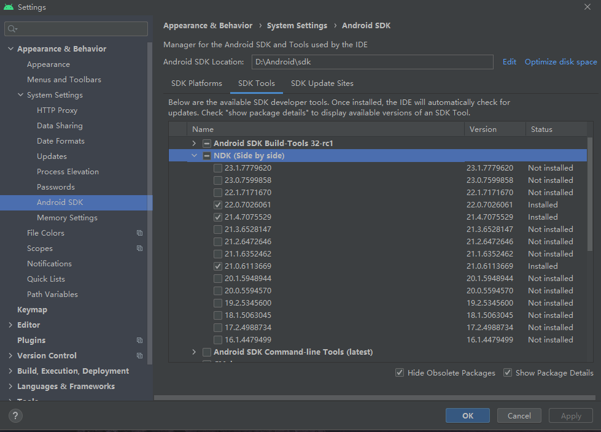
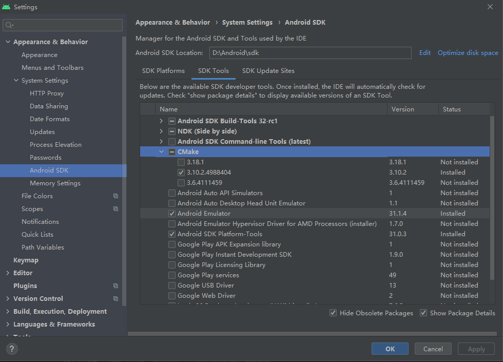

NDK（Native Development Kit，原生开发套件）是Android应用开发里面一项非常重要的技术，它的主要用途有：（1）直接调用系统底层代码以提升设备性能；（2）重复使用C/C++库。NDK的大致工作流程为：首先在Android Studio中将C/C++代码编译到Native Library，然后将Native Library通过Gradle打包进APK中，最后通过JNI（Java Native Interface）框架去调用Native Library中的C/C++函数，从而执行特定功能。由于NDK是建立在JNI基础上的开发技术（主要是增加了打包和编译相关的配置），因此有必要先简单了解JNI究竟为何物。

## JNI

JNI是Java与其他语言（尤其是C/C++）通信的桥梁。当出现一些仅靠Java无法处理的任务时，JNI技术就可以派上用场了。比如要使用Java语言不支持的某些依赖于操作系统平台特性的功能，整合以前使用非Java语言开发的系统，或是需要调用底层硬件提升运行效率等等。需要注意的是，JNI是双向的，即Java代码可以通过JNI访问Native代码，反过来Native代码也可以通过JNI访问Java代码。

由于JNI常用于Java与C/C++交互的场景，因此后面的Native代码在不做特殊说明的情况下均默认指代C/C++代码。Native代码在Android应用中的基本载体是`.so`文件，这是一种Linux下的可执行共享库文件，其文件格式称为ELF（Executable and Linking Format）文件格式。如果直接打开一个`.so`文件，那么可能会看到一堆二进制代码甚至是乱码，因此需要使用一些特定工具（比如极为昂贵的[IDA Pro](https://hex-rays.com/IDA-pro/)）才能将其反编译成具有一定可读性的内容（所以`.so`文件在某种程度上也可以起到防破解的作用）。

### Native方法注册

Native方法注册分为两种，一种是针对NDK开发所使用的静态注册，另一种则是针对Framework开发所使用的动态注册。值得注意的是，无论是静态注册还是动态注册，两者都是大同小异，它们都需要**一个Java类声明要用C/C++实现的Native方法，并加载`.so`文件（亦即动态库），同时还需要在若干C/C++文件中实现Native方法的具体业务逻辑**。两者的主要区别只在于：静态注册要求开发者**通过固定格式的方法名**关联起Java类当中声明的Native方法和实现具体逻辑的C/C++文件；而动态注册主要是通过`JNINativeMethod`这一[结构体](/CPP/complex?id=结构体)数组来动态添加映射关系进行关联，方法名没有强制的格式要求，比较灵活，但是用起来比静态注册要复杂。

#### 静态注册

以Android Studio提供的NDK模板项目为例来初步了解静态注册的方式。首先来看用于声明Native方法和加载`.so`文件的Java类，在模板项目中它是MainActivity：

```
class MainActivity : AppCompatActivity() {

    private lateinit var binding: ActivityMainBinding

    override fun onCreate(savedInstanceState: Bundle?) {
        super.onCreate(savedInstanceState)

        binding = ActivityMainBinding.inflate(layoutInflater)
        setContentView(binding.root)

        // Example of a call to a native method
        binding.sampleText.text = stringFromJNI()
    }

    /**
     * A native method that is implemented by the 'myapplication' native library,
     * which is packaged with this application.
     */
    external fun stringFromJNI(): String

    companion object {
        // Used to load the 'myapplication' library on application startup.
        init {
            System.loadLibrary("myapplication")
        }
    }
}
```

注意MainActivity中两处重要的代码，第一处是`external fun stringFromJNI(): String`，第二处是`System.loadLibrary("myapplication")`。

`external fun stringFromJNI(): String`的作用就是声明Native方法。可以看到，声明方式只是在普通方法的基础上加了修饰符`external`（Java中是`native`），它表示该方法不是在Kotlin/Java中实现的，需要在Java层以外进行访问或实现，因此使用该修饰符标记的方法跟接口或抽象类中的抽象方法一样，不需要加上方法体。

`System.loadLibrary("myapplication")`的作用就是加载名为myapplication的动态库。这里需要提前说明的是，C/C++代码在被构建工具编译成`.so`文件之后，其命名格式为`lib + 自定义Native Library名 + .so`，比如本例中动态库在构建完成后得到的是"libmyapplication.so"文件。之所以要这样命名，主要是为了遵循Linux上约定俗成的规则。通过加载动态库，也就是`.so`文件，Java类中声明的Native方法才能被正常调用。在一般情况下，`System.loadLibrary()`会放在一个类的初始化方法中调用，这样在类开始加载的时候就会顺带加载动态库，避免由于写到别的方法中可能忘记调用引发问题。

在大致介绍Java类之后，现在再来看一下模板项目中真正涉及到C/C++代码的部分。下面这份`native-lib.cpp`文件位于项目的`src/main/cpp`目录下，其内容为：

```
#include <jni.h>
#include <string>

extern "C" JNIEXPORT jstring JNICALL
Java_com_example_myapplication_MainActivity_stringFromJNI(
        JNIEnv* env,
        jobject /* this */) {
    std::string hello = "Hello from C++";
    return env->NewStringUTF(hello.c_str());
}
```

在这份C++代码文件里，由于是要实现声明在Java类中的Native方法，因此首先要导入`jni.h`这个头文件。如果打开`jni.h`，可以看到里面定义了很多内容，例如C/C++里的数据类型和Java中的数据类型的关联映射（上面的`jstring`和`jobject`都表示这种关联类型），`JNINativeMethod`、`JNIEnv`结构体等等。所有涉及到Java/Kotlin代码与C/C++代码交互的源码文件，都必须导入`jni.h`，否则会无法编译。

接下来是`extern "C"`这个修饰词，它的作用是修饰一句或一段C++代码，让编译器以处理C语言代码的方式来处理修饰过的C++代码，在本例中它的作用就是防止被修饰的函数在编译之后被改变名字导致无法识别。这么做的原因是C++支持函数重载，而C语言不支持，一个函数被C语言和C++编译后在符号库中的名称自然也就不一样，比如函数`void foo(int s, int y)`被C++编译后的符号库名称可能为“_foo_int_int”，而被C语言编译后是“_foo”，**在静态注册中，必须使用该修饰词以确保Native方法在编译之后仍能被Java层代码识别引用，而动态注册可以不使用**。`extern "C"`修饰一句C++代码只要直接放在该句代码前面即可，而修饰一段C++代码就要加上一对`{}`把它们包裹起来。

再来看关键字`JNIEXPORT`，它被定义在`jni.h`中，作用类似于Java中的`public`修饰符，使该函数可以被外部调用。`JNIEXPORT`在`jni.h`里面代表的是`__attribute__ ((visibility ("default")))`这样一个宏，如果不想让一个函数被外部调用，那么可以定义一个宏`__attribute__ ((visibility ("hidden")))`来修饰函数。

`JNICALL`跟`JNIEXPORT`一样也是个宏定义，它用来表示函数的调用规范。需要注意的是，该关键字在不同操作平台上所代表的宏可能是不一样的，比如在Linux上它代表的是一个空的宏，而Windows里面定义为`__stdcall`。在Android项目中这个关键字可以去掉（但是没必要），而非Android项目就不能随便删除了，因为开发者不能保证项目不会在Linux以外的平台被编译。

`Java_com_example_myapplication_MainActivity_stringFromJNI`这一长串的JNI函数名，通过固定格式与Java层声明的Native方法`stringFromJNI`建立起关联，这就是静态注册的关键步骤。JNI函数的命名格式为

```
Java_<PackageName>_<ClassName>_<MethodName>
```

由于`.`在C++中有特殊用途，因此都要被替换成`_`。如果上述PackageName、ClassName以及MethodName里面任何一个部分带有`_`，都要转换成`1`，相当于一个转义符。Java层在调用Native方法时，虚拟机就会根据这种命名规则来查找和调用C/C++文件里的具体实现函数。

在本例中，除了函数名变长以外，JNI函数的参数列表跟Natrive方法相比还多了两个东西：一个`JNIEnv`类型指针的env参数和一个`jobject`类型的“空”参数。JNIEnv会在后面进行详细介绍，这里只是简单说明一下，它的作用是代表Java环境，通过JNIEnv*就可以对Java端的代码进行操作。`jobject`类型参数用于指代调用该Native方法的对象，可以发现它是“空”的，没有任何名称，只有旁边的注释写了一个“this”，如果是在Android Studio上，可以看到它所实际指代的对象，本例中的指代对象如下图所示：


为什么这个参数是“空”的？因为在Java语言里，**类当中的方法**（包括Java静态方法和Kotlin的伴生对象函数，Kotlin顶层函数不属于任何一个类）在被调用时，系统都会自动地**隐式传递**一个参数进去（所以不是在类方法内部就不能调用它），尽管这个隐式参数在Java/Kotlin里面可以直接通过`this`调用，但传递的时候它并没有被赋予名称，所以当C/C++在实现Native方法时，虽然确实需要表明该方法实际上有几个入参，但由于没有显式名称，而且一般也用不到这个`this`参数，于是就直接置空了。此外，如果开发者自行为这个“空”参数加个显式名称然后尝试调用它的方法或变量，会发现它什么都调不出来，因为`jni.h`里面根本没有为`jobject`类型的对象定义任何东西。

最后就是函数内部的具体实现了，这些主要是C/C++编程的内容，因此不作展开，可以参考[C++入门](/CPP/helloworld)部分的内容。

#### 动态注册

静态注册根据固定格式方法名将JNI函数与Java方法关联起来，但是这很容易导致JNI函数名称过长，另一方面，如果项目中的包名、类名或方法名被更改，那么原有的JNI函数也将不得不一同随之修改名称，影响范围比较大。此外，Native方法在初次调用时，还需要虚拟机先查找一番再通过JNIEnv*指针跟JNI函数建立关联，影响效率。为了避免上述缺点，动态注册方式就出现了。动态注册的核心有两个，**一是利用`JNINativeMethod`这种结构体来记录Native方法和JNI函数的关联关系，二是在`JNI_OnLoad`函数当中直接或间接调用`env->RegisterNatives`实现注册逻辑**。

首先来看`JNINativeMethod`，它被定义于`jni.h`中，具体定义如下：

```
typedef struct {
    const char* name; // Native方法名
    const char* signature; // Native方法的签名信息
    void*       fnPtr; // JNI函数名
} JNINativeMethod;
```

可以注意到，和静态注册不同，`JNINativeMethod`结构体并没有对JNI函数名做强制的格式要求，因此开发者可以直接在C/C++文件中定义和使用更为简洁的函数名，这样就避免了静态注册导致函数名过长的问题。此外，由于`JNINativeMethod`结构体不包含任何有关Java层包名和类名的信息，因此只要不改变Native方法名，无论Java层如何改动都不会影响到这些注册信息，于是就解决了静态注册不够灵活的问题。

有多少个Native方法，就要构建多少个类似的结构体。通常的做法是利用一个`JNINativeMethod`类型的数组对这些结构体进行统一管理，比如Android系统Frameworks层的MediaRecorder在`android_media_MediaRecoder.cpp`里是这样组织的：

```
static const JNINativeMethod gMethods[] = {
    {"setCamera",            "(Landroid/hardware/Camera;)V",    (void *)android_media_MediaRecorder_setCamera},
    {"setVideoSource",       "(I)V",                            (void *)android_media_MediaRecorder_setVideoSource},
    {"setAudioSource",       "(I)V",                            (void *)android_media_MediaRecorder_setAudioSource},
    {"setPrivacySensitive",  "(Z)V",                            (void *)android_media_MediaRecorder_setPrivacySensitive},
    {"isPrivacySensitive",  "()Z",                             (void *)android_media_MediaRecorder_isPrivacySensitive},
    ··· // 其他相似的内容省略，下文同
};
```

从上面的例子可以看到，`JNINativeMethod`结构体的Native方法名称及其签名信息都是字符串（虽然它们实际上是char指针类型的），而JNI函数名需要通过强制转换变成void指针类型。这里要注意的是，Native方法签名信息是有格式要求的，具体内容会在后面进行介绍。

通过`JNINativeMethod`数组实现Native方法与JNI函数的关联和统一管理后，接下来就是要完成对这个数组的注册工作。仍以MediaRecorder的`android_media_MediaRecoder.cpp`文件为例，在定义完`JNINativeMethod`数组之后，紧接着就是定义了下面这个函数：

```
// This function only registers the native methods, and is called from
// JNI_OnLoad in android_media_MediaPlayer.cpp
int register_android_media_MediaRecorder(JNIEnv *env)
{
    return AndroidRuntime::registerNativeMethods(env,
                "android/media/MediaRecorder", gMethods, NELEM(gMethods));
}
```

这个函数的注释表明，该函数执行的是Native方法的注册工作，并且在位于`android_media_MediaPlayer.cpp`的`JNI_OnLoad`函数中被调用。但是`register_android_media_MediaRecorder`函数内部只是执行了一句代码，将`JNIEnv`对象指针、Native方法所属类的路径、`JNINativeMethod`数组指针以及`JNINativeMethod`数组中包含的待注册Native方法数量作为参数，传入`AndroidRuntime::registerNativeMethods`函数并获取返回值。而`AndroidRuntime::registerNativeMethods`函数又通过调用位于`JNIHelp.cpp`中的`jniRegisterNativeMethods`函数，才真正执行了`env->RegisterNatives`这句代码实现注册。也就是说，这种经过好几个中介的间接调用，跟一开始就在`register_android_media_MediaRecorder`函数或`JNI_OnLoad`函数里执行`env->RegisterNatives`的效果是一样的。

>注意，`env->RegisterNatives`是C++中指针对象调用方法的形式，等效于`object.method()`，所以`env->RegisterNatives`可以视为`jnienvObject.RegisterNatives`。

最后再来看看`JNI_OnLoad`函数，它的大致内容如下：

```
jint JNI_OnLoad(JavaVM* vm, void* /* reserved */)
{
    JNIEnv* env = NULL;
    jint result = -1;

    if (vm->GetEnv((void**) &env, JNI_VERSION_1_4) != JNI_OK) {
        ALOGE("ERROR: GetEnv failed\n");
        goto bail;
    }
    assert(env != NULL);

    ···

    if (register_android_media_MediaRecorder(env) < 0) {
        ALOGE("ERROR: MediaRecorder native registration failed\n");
        goto bail;
    }

    ···

    /* success -- return valid version number */
    result = JNI_VERSION_1_4;

bail:
    return result;
}

```

如果仔细阅读源码可以发现，`JNI_OnLoad`函数也不过是调用了`register_android_media_MediaRecorder`函数，并没有做更多的事情，那么实现它的意义在哪里？这里就要说明一下`JNI_OnLoad`函数的调用时机，它是在Java类调用`System.loadLibrary`方法之后被调用的，因此所有要执行注册功能的函数都必须统一集中到`JNI_OnLoad`里面运行。至此，动态注册的流程就已经结束了。整个动态注册的流程与静态注册相比复杂得多，因此需要开发者掌握一定的C/C++编程技能。

### JNI重要数据结构

#### 数据类型转换与方法签名

Java中有`int`、`double`以及`String`等数据类型，尽管它们在Native代码中也存在相似的类型，但是还需要进行专门的映射和转换，这种工作就是在`jni.h`中完成的。下表所展示的，就是Java中的数据类型在`jni.h`中对应的定义名称以及所映射的Native类型。

|Java类型|jni.h定义|C/C++类型|签名格式|
|:-----:|:-----:|:-----:|:-----:|
|byte|jbyte|signed char|B|
|char|jchar|unsigned short|C|
|double|jdouble|double|D|
|float|jfloat|float|F|
|int|jint|int|I|
|short|jshort|short|S|
|long|jlong|long long|J|
|boolean|jboolean|unsigned char|Z|
|void|void|void|V|
|所有对象|jobject|class _jobject|<font color=red>L<class名称>;|
|Class|jclass|class _jclass|<font color=red>Ljava/lang/Class;|
|String|jstring|class _jstring|<font color=red>Ljava/lang/String;|
|Throwable|jthrowable|class _jthrowable|<font color=red>Ljava/lang/Throwable;|
|Object[]|jobjectArray|class _jobjectArray|<font color=red>[L<class名称>;|
|bytep[]|jbyteArray|class _jbyteArray|[B|
|char[]|jcharArray|class _jcharArray|[C|
|double[]|jdoubleArray|class _jdoubleArray|[D|
|float[]|jfloatArray|class _jfloatArray|[F|
|int[]|jintArray|class _jintArray|[I|
|short[]|jshortArray|class _jshortArray|[S|
|long[]|jlongArray|class _jlongArray|[J|
|boolean[]|jbooleanArray|class _jbooleanArray|[Z|

Native方法在进行动态注册时需要构建`JNINativeMethod`结构体，里面就包含有方法签名的信息。方法签名的格式为`(参数签名格式···)返回值签名格式`，多个参数的签名格式直接并排，不需要依赖空格等符号进行分隔。比如MediaRecorder的Native方法`setCamera`，其方法签名为`(Landroid/hardware/Camera;)V`，那么在Java类MediaRecorder.java里对应的就是`public native void setCamera(Camera c);`。若某个Native方法为`fun foo(a: Int, b: Flaot, c: String): Demo`，且Demo类的定位路径为`com.example.app.Demo`，那么其方法签名就应当是`(IFS)Lcom/example/app/Demo;`。<font color=red>注意，这里不需要考虑`this`这个隐参数，显式参数有几个就填几个签名格式。</font>

如果不想因为手动编辑方法签名可能导致错误，可以先执行`javac .java文件所在路径`命令，在同一路径下生成一份对应的`.class`文件，或是直接在Android Studio编译完项目之后的`app/build`目录下查找已经输出的`.class`文件，然后再执行`javap -s -p .class文件所在路径`命令，最后终端会打印出这个`.class`文件所对应的类里面所有的方法、成员以及它们各自的描述信息。

仍以Android Studio提供的NDK模板项目为例，在编译完成之后，在`build/tmp/kotlin-classes`目录下就可以找到`MainActivity.class`文件，然后复制其**绝对路径**，到终端里执行`javap`的指令，最后就会得到类似于下面的打印结果：

```
Compiled from "MainActivity.kt"
public final class com.example.myapplication.MainActivity extends androidx.appcompat.app.AppCompatActivity {
  public static final com.example.myapplication.MainActivity$Companion Companion;
    descriptor: Lcom/example/myapplication/MainActivity$Companion;
  private com.example.myapplication.databinding.ActivityMainBinding binding;
    descriptor: Lcom/example/myapplication/databinding/ActivityMainBinding;
  public com.example.myapplication.MainActivity();
    descriptor: ()V

  protected void onCreate(android.os.Bundle);
    descriptor: (Landroid/os/Bundle;)V

  public final native java.lang.String stringFromJNI();
    descriptor: ()Ljava/lang/String;

  static {};
    descriptor: ()V
}
```

对于类当中的成员（field），descriptor部分的信息会展示其类型，而类方法则是展示其方法签名。通过这种方式拿到的方法签名是最为稳妥的，而且也更容易了解到各种各样的签名格式。

#### JNIEnv

JNIEnv是Java环境在Native世界的代表，通过JNIEnv*这一指针就可以在Native世界中访问Java世界的代码，包括调用Java方法和操作Java变量及对象等。JNIEnv只在创建它的线程中有效，无法跨线程传递，因此不同线程的JNIEnv是彼此独立的。在C语言和C++下，JNIEnv的定义是不同的，这里继续查看`jni.h`文件里的内容：

```
#if defined(__cplusplus)
// C++中JNIEnv的类型
typedef _JNIEnv JNIEnv;
typedef _JavaVM JavaVM;
#else
// C中JNIEnv的类型
typedef const struct JNINativeInterface* JNIEnv;
typedef const struct JNIInvokeInterface* JavaVM;
#endif
```

先来看JNIEnv在C++环境下的定义：

```
/*
 * C++ object wrapper.
 *
 * This is usually overlaid on a C struct whose first element is a
 * JNINativeInterface*.  We rely somewhat on compiler behavior.
 */
struct _JNIEnv {
    /* do not rename this; it does not seem to be entirely opaque */
    const struct JNINativeInterface* functions;

#if defined(__cplusplus)

    jint GetVersion()
    { return functions->GetVersion(this); }

    jclass DefineClass(const char *name, jobject loader, const jbyte* buf,
        jsize bufLen)
    { return functions->DefineClass(this, name, loader, buf, bufLen); }

    jclass FindClass(const char* name)
    { return functions->FindClass(this, name); }

    jmethodID FromReflectedMethod(jobject method)
    { return functions->FromReflectedMethod(this, method); }

    jfieldID FromReflectedField(jobject field)
    { return functions->FromReflectedField(this, field); }

    ··· // 限于篇幅省略部分内容

    /* added in JNI 1.6 */
    jobjectRefType GetObjectRefType(jobject obj)
    { return functions->GetObjectRefType(this, obj); }
#endif /*__cplusplus*/
};
```

`_JNIEnv`是一个结构体，里面最重要的工作就是调用`JNINativeInterface`提供的方法。`JNIEnv`封装了一系列`JNINativeInterface`方法并对外提供调用，常用的`JNIEnv`方法有：

|函数名称|用途|
|:-----:|:-----:|
|FindClass|找到Java层中指定名称的类|
|GetFieldID|获得Java层中的字段|
|GetMethodID|获得Java层中的方法|
|GetStaticMethodID|获得Java层中的静态方法|
|NewObject|创建Java类中的对象|
|NewString|创建Java类中的String对象|
|NewArray|创建类型为Type的数组对象|
|GetField|获得类型为Type的字段|
|SetField|设置类型为Type的字段|
|CallMethod|调用返回值类型为Type的类方法|
|CallStaticMethod|调用返回值类型为Type的静态方法|

最后再来看一下`JNINativeInterface`结构体的定义：

```
/*
 * Table of interface function pointers.
 */
struct JNINativeInterface {
    void*       reserved0;
    void*       reserved1;
    void*       reserved2;
    void*       reserved3;

    jint        (*GetVersion)(JNIEnv *);

    jclass      (*DefineClass)(JNIEnv*, const char*, jobject, const jbyte*,
                        jsize);
    jclass      (*FindClass)(JNIEnv*, const char*);

    jmethodID   (*FromReflectedMethod)(JNIEnv*, jobject);
    jfieldID    (*FromReflectedField)(JNIEnv*, jobject);
    /* spec doesn't show jboolean parameter */
    jobject     (*ToReflectedMethod)(JNIEnv*, jclass, jmethodID, jboolean);

    ···

    /* added in JNI 1.6 */
    jobjectRefType (*GetObjectRefType)(JNIEnv*, jobject);
};
```

`JNINativeInterface`结构体中定义了许多和JNIEnv结构体对应的函数指针，通过这些函数指针的定义，就能够定位到虚拟机中的JNI函数表，从而实现JNI层在虚拟机中的函数调用，进而实现Java世界的方法调用。

#### JNI引用类型

和Java的引用类型一样，JNI也有引用类型，分别是**本地引用**（Local References），**全局引用**（Global Refenrences）以及**弱全局引用**（Weak Global References）。

+ **本地引用**

本地引用是JNI中最常见的引用类型，比如`JNIEnv`提供的函数所返回的引用基本上都是本地引用。本地引用的主要特点有（1）当JNI函数返回时就会被自动释放；（2）只在创建它的线程中有效，不能跨线程使用；（3）受JVM管理。

+ **全局引用**

全局引用和本地引用大相径庭，其主要特点有（1）不会被自动释放，必须手动操作，且不会被GC回收，因为不受JVM管理；（2）可以跨线程使用。全局引用类型的对象通常需要开发者在代码中手动调用`JNIEnv.NewGlobalRef`函数来创建，以及`JNIEnv.DeleGlobalRef`函数来释放清理。

+ **弱全局引用**

弱全局引用跟全局引用相比有一个不同点，即可以被GC回收，回收之后会指向NULL。弱全局引用类型的对象通常使用`JNIEnv.NewWeakGlobalRef`函数来创建，以及`JNIEnv.DeleteWeakGlobalRef`函数来释放。在使用弱全局引用对象的时候，往往还需要先调用`JNIEnv.IsSameObject`函数来判断该对象是否已被GC回收，没有被回收才能进行后续的调用。

## NDK编译构建

### 准备工作

C/C++源码在不同的构建方式下可能会输出不同格式的构建结果，比如`.so`、`.exe`或者`.dll`等。对于NDK开发来说，就是要利用专门的构建工具将C/C++源码编译生成`.so`文件。NDK开发的主要构建方式有CMake和ndk-build，两者的相同点是都要编写[Makefile](https://makefiletutorial.com/)文件——正如Gradle之于Android项目，Maven之于Java项目那样，Makefile就是C/C++项目的Gradle和Maven。理解这一点，才能准确把握Makefile的使用方式。

NDK开发首先必须要安装NDK工具。在Android Studio Arctic Fox（2020.3.1 Patch 3）版本上，通过File - Settings... - Appearance & Behavior - System Settins - Android SDK - SDK Tools可以查看和下载NDK工具，如下图所示：



如果采用的是ndk-build的方式构建`.so`文件，那么只要下载NDK工具就可以了。如果要采用CMake的方式进行构建，那么就需要再下载CMake工具：




### 构建Native Libray

+ **基于CMake的构建方式**
+ **基于NDK-build的构建方式**