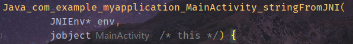

NDK（Native Development Kit，原生开发套件）是Android应用开发里面一项非常重要的技术，它的主要用途有：（1）直接调用系统底层代码以提升设备性能；（2）重复使用C/C++库。NDK的大致工作流程为：首先在Android Studio中将C/C++代码编译到Native Library，然后将Native Library通过Gradle打包进APK中，最后通过JNI（Java Native Interface）框架去调用Native Library中的C/C++函数，从而执行特定功能。由于NDK是建立在JNI基础上的开发技术（主要是增加了打包和编译相关的配置），因此有必要先简单了解JNI究竟为何物。

## JNI

JNI是Java与其他语言（尤其是C/C++）通信的桥梁。当出现一些仅靠Java无法处理的任务时，JNI技术就可以派上用场了。比如要使用Java语言不支持的某些依赖于操作系统平台特性的功能，整合以前使用非Java语言开发的系统，或是需要调用底层硬件提升运行效率等等。需要注意的是，JNI是双向的，即Java代码可以通过JNI访问Native代码，反过来Native代码也可以通过JNI访问Java代码。

由于JNI常用于Java与C/C++交互的场景，因此后面的Native代码在不做特殊说明的情况下均默认指代C/C++代码。Native代码在Android应用中的基本载体是`.so`文件，这是一种Linux下的可执行共享库文件，其文件格式称为ELF（Executable and Linking Format）文件格式。如果直接打开一个`.so`文件，那么可能会看到一堆二进制代码甚至是乱码，因此需要使用一些特定工具（比如极为昂贵的[IDA Pro](https://hex-rays.com/IDA-pro/)）才能将其反编译成具有一定可读性的内容（所以`.so`文件在某种程度上也可以起到防破解的作用）。

### Native方法注册

Native方法注册分为两种，一种是针对NDK开发所使用的静态注册，另一种则是针对Framework开发所使用的动态注册。值得注意的是，无论是静态注册还是动态注册，两者都是大同小异，它们都需要**一个Java类声明要用C/C++实现的Native方法，并加载`.so`文件（亦即动态库），同时还需要在若干C/C++文件中实现Native方法的具体业务逻辑**。两者的主要区别只在于：静态注册要求开发者**通过固定格式的方法名**关联起Java类当中声明的Native方法和实现具体逻辑的C/C++文件；而动态注册主要是通过`JNINativeMethod`这一[结构体](/CPP/complex?id=结构体)数组来动态添加映射关系进行关联，方法名没有强制的格式要求，比较灵活，但是用起来比静态注册要复杂。

#### 静态注册

以Android Studio提供的NDK模板项目为例来初步了解静态注册的方式。首先来看用于声明Native方法和加载`.so`文件的Java类，在模板项目中它是MainActivity：

```
class MainActivity : AppCompatActivity() {

    private lateinit var binding: ActivityMainBinding

    override fun onCreate(savedInstanceState: Bundle?) {
        super.onCreate(savedInstanceState)

        binding = ActivityMainBinding.inflate(layoutInflater)
        setContentView(binding.root)

        // Example of a call to a native method
        binding.sampleText.text = stringFromJNI()
    }

    /**
     * A native method that is implemented by the 'myapplication' native library,
     * which is packaged with this application.
     */
    external fun stringFromJNI(): String

    companion object {
        // Used to load the 'myapplication' library on application startup.
        init {
            System.loadLibrary("myapplication")
        }
    }
}
```

注意MainActivity中两处重要的代码，第一处是`external fun stringFromJNI(): String`，第二处是`System.loadLibrary("myapplication")`。

`external fun stringFromJNI(): String`的作用就是声明Native方法。可以看到，声明方式只是在普通方法的基础上加了修饰符`external`（Java中是`native`），它表示该方法不是在Kotlin/Java中实现的，需要在Java层以外进行访问或实现，因此使用该修饰符标记的方法跟接口或抽象类中的抽象方法一样，不需要加上方法体。

`System.loadLibrary("myapplication")`的作用就是加载名为myapplication的动态库。这里需要提前说明的是，C/C++代码在被构建工具编译成`.so`文件之后，其命名格式为`lib + 自定义Native Library名 + .so`，比如本例中动态库在构建完成后得到的是"libmyapplication.so"文件。之所以要这样命名，主要是为了遵循Linux上约定俗成的规则。通过加载动态库，也就是`.so`文件，Java类中声明的Native方法才能被正常调用。在一般情况下，`System.loadLibrary()`会放在一个类的初始化方法中调用，这样在类开始加载的时候就会顺带加载动态库，避免由于写到别的方法中可能忘记调用引发问题。

在大致介绍Java类之后，现在再来看一下模板项目中真正涉及到C/C++代码的部分。下面这份`native-lib.cpp`文件位于项目的`src/main/cpp`目录下，其内容为：

```
#include <jni.h>
#include <string>

extern "C" JNIEXPORT jstring JNICALL
Java_com_example_myapplication_MainActivity_stringFromJNI(
        JNIEnv* env,
        jobject /* this */) {
    std::string hello = "Hello from C++";
    return env->NewStringUTF(hello.c_str());
}
```

在这份C++代码文件里，由于是要实现声明在Java类中的Native方法，因此首先要导入`jni.h`这个头文件。如果打开`jni.h`，可以看到里面定义了很多内容，例如C/C++里的数据类型和Java中的数据类型的关联映射（上面的`jstring`和`jobject`都表示这种关联类型），JNINativeMethod、JNIEnv结构体等等。所有涉及到Java/Kotlin代码与C/C++代码交互的源码文件，都必须导入`jni.h`，否则会无法编译。

接下来是`extern "C"`这个修饰词，它的作用是修饰一句或一段C++代码，让编译器以处理C语言代码的方式来处理修饰过的C++代码，在本例中它的作用就是防止被修饰的函数在编译之后被改变名字导致无法识别。这么做的原因是C++支持函数重载，而C语言不支持，一个函数被C语言和C++编译后在符号库中的名称自然也就不一样，比如函数`void foo(int s, int y)`被C++编译后的符号库名称可能为“_foo_int_int”，而被C语言编译后是“_foo”，**在静态注册中，必须使用该修饰词以确保Native方法在编译之后仍能被Java层代码识别引用，而动态注册可以不使用**。`extern "C"`修饰一句C++代码只要直接放在该句代码前面即可，而修饰一段C++代码就要加上一对`{}`把它们包裹起来。

再来看关键字`JNIEXPORT`，它被定义在`jni.h`中，作用类似于Java中的`public`修饰符，使该函数可以被外部调用。`JNIEXPORT`在`jni.h`里面代表的是`__attribute__ ((visibility ("default")))`这样一个宏，如果不想让一个函数被外部调用，那么可以定义一个宏`__attribute__ ((visibility ("hidden")))`来修饰函数。

`JNICALL`跟`JNIEXPORT`一样也是个宏定义，它用来表示函数的调用规范。需要注意的是，该关键字在不同操作平台上所代表的宏可能是不一样的，比如在Linux上它代表的是一个空的宏，而Windows里面定义为`__stdcall`。在Android项目中这个关键字可以去掉（但是没必要），而非Android项目就不能随便删除了，因为开发者不能保证项目不会在Linux以外的平台被编译。

`Java_com_example_myapplication_MainActivity_stringFromJNI`这一长串的JNI函数名，通过固定格式与Java层声明的Native方法`stringFromJNI`建立起关联，这就是静态注册的关键步骤。Native方法在C/C++里的命名格式为

```
Java_<PackageName>_<ClassName>_<MethodName>
```

由于`.`在C++中有特殊用途，因此都要被替换成`_`。如果上述PackageName、ClassName以及MethodName里面任何一个部分带有`_`，都要转换成`1`，相当于一个转义符。Java层在调用Native方法时，虚拟机就会根据这种命名规则来查找和调用C/C++文件里的具体实现函数。

在本例中，除了函数名变长以外，Native方法对应C++函数的参数列表还多了两个东西：一个`JNIEnv`类型指针的env参数和一个`jobject`类型的“空”参数。JNIEnv会在后面进行详细介绍，这里只是简单说明一下，它的作用是代表Java环境，通过JNIEnv*就可以对Java端的代码进行操作。`jobject`类型参数用于指代调用该Native方法的对象，可以发现它是“空”的，没有任何名称，只有旁边的注释写了一个“this”，如果是在Android Studio上，可以看到它所实际指代的对象，本例中的指代对象如下图所示：



为什么这个参数是“空”的？因为在Java语言里，类方法调用时系统都会自动地**隐式传递**一个参数`this`给该方法，尽管这个隐式参数在Java/Kotlin里面可以直接通过`this`调用，但传递的时候它并没有被赋予名称，所以当C/C++在实现Native方法时，虽然确实需要表明该方法实际上有几个入参，但由于没有显式名称，而且一般也用不到这个`this`参数，于是就直接置空了。此外，如果开发者自行为这个“空”参数加个显式名称然后尝试调用它的方法或变量，会发现它什么都调不出来，因为`jni.h`里面根本没有为`jobject`类型的对象定义任何东西。

最后就是函数内部的具体实现了，这些主要是C/C++编程的内容，因此不作展开，可以参考[C++入门](/CPP/helloworld)部分的内容。

#### 动态注册

静态注册根据固定格式方法名将JNI函数与Java方法关联起来，但是这很容易导致JNI函数名称过长，另一方面，如果项目中的包名、类名或方法名被更改，那么原有的JNI函数也将不得不一同随之修改名称，影响范围比较大。此外，Native方法在初次调用时，还需要虚拟机先查找一番再通过JNIEnv*指针跟JNI函数建立关联，影响效率。为了避免上述缺点，动态注册方式就出现了。动态注册的核心有两个，**一是利用`JNINativeMethod`这种结构体来记录Native方法和JNI方法的关联关系，二是实现`JNI_OnLoad`函数的注册逻辑**。

首先来看`JNINativeMethod`，它被定义于`jni.h`中，具体定义如下：

```
typedef struct {
    const char* name; // Native方法名
    const char* signature; // Native方法的签名信息
    void*       fnPtr; // JNI函数指针
} JNINativeMethod;
```

### JNI重要数据结构

#### 数据类型转换

#### JNIEnv

#### 引用类型

## NDK编译构建

### 准备工作

### 构建Native Libray

+ **基于CMake的构建方式**
+ **基于NDK-build的构建方式**