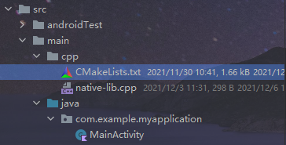

在大致了解什么是[JNI](Android/jni)之后，本节内容就要介绍开发者如何用NDK将C/C++源码，结合进Android项目最终输出的apk文件等制品当中。

## 准备工作

C/C++源码在不同的构建方式下可能会输出不同格式的构建结果，比如`.so`、`.exe`或者`.dll`等。对于NDK开发来说，就是要利用专门的构建工具将C/C++源码编译生成`.so`文件。NDK开发的主要构建方式有CMake和ndk-build，两者的相同点是都要编写脚本文件，不同点就是它们编写的脚本类型完全不一样。

NDK开发首先必须要安装NDK工具。在Android Studio Arctic Fox（2020.3.1 Patch 3）版本上，通过File - Settings... - Appearance & Behavior - System Settins - Android SDK - SDK Tools可以查看和下载NDK工具，如下图所示：


如果采用的是ndk-build的方式构建`.so`文件，那么只要下载NDK工具就可以了。如果要采用CMake的方式进行构建，那么就需要再下载CMake工具：


## 构建Native Libray

目前构建Native Library主要有两种构建方式，一种是基于CMake脚本，另一种则是基于ndk-build构建系统。需要注意的是，在这两种方式之外，Google其实还提供了一个实验性的C/C++构建系统——[Ninja](https://developer.android.google.cn/studio/build/cxx-ninja)。这是一个可以自定义的C/C++构建系统，虽然官方对其介绍不多，但是值得关注（前提是Google不会直接弃坑）。由于Ninja并不是本节内容的重点，所以接下来的内容将主要对前面两种构建方式进行介绍。当然，如果未来Ninja成为Google主推的C/C++构建系统，那么本文也会及时更新以反映这一变化。

### 基于CMake脚本构建

CMake脚本的优势在于，使用很少的脚本文件和命令就能完成NDK构建，而且在JetBrains公司针对C/C++开发的一款IDE——[CLion](https://www.jetbrains.com/clion/)中也使用CMake作为构建系统，因此学习CMake的使用，至少能通吃JetBrains家的三款IDE。最重要的是，CMake是跨平台的。

但CMake也需要开发者对CMake脚本有相当程度的了解才能熟练运用，这里只是先介绍一些Android NDK开发中基本的CMake配置，更多详细内容可以参考[Google官方文档](https://developer.android.google.cn/studio/projects/configure-cmake)和[CMake官方教程](https://cmake.org/cmake/help/latest/guide/tutorial/index.html)。

#### 创建CMake构建脚本

在基于CMake的构建方式下，编写好的C/C++源码文件需要放在module的`src/main/cpp`目录当中，然后在同一路径下创建名为`CMakeLists.txt`的文本文件，参照Android Studio提供的NDK示例项目：



>注意，CMake的脚本文件必须命名为`CMakeLists`，而且文件格式为`.txt`。如果是通过Android Studio窗口新建C++项目，那么IDE会自动完成上述步骤。尽管脚本可以放在项目任何位置，但是为了方便，通常会将脚本跟源码文件放在同一个目录下，就和IDE默认的操作一样。

#### 配置CMake脚本

[Google官方指南中](https://developer.android.google.cn/studio/projects/configure-cmake?hl=zh-cn)介绍有如何在`CMakeLists.txt`里编写CMake脚本内容，最基本的配置参考如下（英文注释已经翻译）：

```
# 设置构建Native Library所需CMake工具的最低版本，以确保能够使用一些特定的CMake功能
cmake_minimum_required(VERSION X.Y.Z)

# 指定Native Library的名称和属性（STATIC或SHARED），并提供C/C++源码文件的相对路径。
# 开发者可以通过多次调用add_library来构建多个Native Library，CMake在构建时会将它们全部包含进来。
# 项目通过Gradle执行编译打包任务时，这些共享的Native Library也会被自动打包进apk文件里。
# CMake编译出来的so文件，命名格式为“lib<your_library_name>.so”，也就是自动加一个“lib”前缀。
add_library( # 指定库名的时候要用下划线和小写字母来命名
             name_of_your_library

             # 设置Native Library为静态（static）库或者共享（shared）库时要用大写字母
             SHARED

             # 此处提供源码文件的相对路径
             src/main/cpp/xxx.cpp
             src/main/cpp/yyy.cpp
             src/main/cpp/zzz.cpp )

# 指定头文件所在路径，以便CMake在编译时能够找到头文件
include_directories(src/main/cpp/directory_of_header_files/)
```

> 注意，调用`add_executable`命令可以将C/C++源码编译成`.exe`文件，不过这是可选操作——因为创建成`.so`文件并将它们打包到apk里面已经可以满足大多数项目的要求了。此外，如果开发者重命名或移除了CMake脚本中的库，需要重新同步Gradle或是清理项目。

##### 添加NDK API

Android NDK自身也提供了一系列Native API和Native Library，如果要在项目中调用它们，可以在`CMakeLists.txt`里面参照以下方式进行添加：

```
# 将预构建好的Native Library所在的搜索路径保存到一个变量中，变量名由开发者自己定义。
# 由于这些Android平台提供的Native Library已经位于CMake默认的搜索路径中，开发者只需要指定要添加的库名即可。
# CMake会在完成构建之前，检验开发者指定的Native Library是否存在。
find_library( # 为存储Native Library路径的变量自定义一个名称，使用小写字母
              log-lib

              # 指定Native Library的库名，以便CMake进行搜索定位，使用小写字母
              log )

# 下面的命令用于指定CMake关联到开发者自己native库的系统库，以便开发者自己的Native Library能够调用系统库里的函数
target_link_libraries( # 指定目标Native Library
                       name_of_your_library

                       # 将指定的Native Library关联到目标Native Library
                       ${log-lib} )
```

NDK还以源码形式包含了一些库，这些库也可以关联进来，如下面所示：

```
# 首先以静态库的形式添加进来
add_library( app-glue
             STATIC
             ${ANDROID_NDK}/sources/android/native_app_glue/android_native_app_glue.c )

# 然后调用target_link_libraries进行关联
target_link_libraries( native-lib 
                       app-glue 
                       ${log-lib} )
```

##### 添加其他预构建库

添加预构建库的步骤与添加其他要构建的原生库的步骤相似。不过由于这些库已被构建，因此开发者需要使用`IMPORTED`标志来告知CMake不需要编译它们，只要将此库导入到项目中即可：

```
add_library( imported-lib

             # 预构建库使用的库类型为SHARED
             SHARED

             # 导入必须使用IMPORTED标志取代源码文件的路径
             IMPORTED )
```

接着，使用`set_target_properties()`命令指定库的路径，如下面代码所示。某些库会针对特定的CPU架构或应用二进制接口 (ABI) 提供单独的软件包，并将其整理到单独的目录中。此方法既有助于库充分利用特定的CPU架构，又能让开发者只使用所需的库版本。

如果开发者打算向CMake构建脚本添加库的多个ABI版本，但是又不想为每个版本重复编写相似的多个命令，可以使用`ANDROID_ABI`路径变量（此变量使用的是NDK支持的一组默认ABI），或是手动配置Gradle，只使用一组特定的ABI。

```
add_library(...)
set_target_properties( # 指定要导入的预构建库
                       imported-lib

                       # 指定开发者想要定义的一些参数
                       PROPERTIES IMPORTED_LOCATION

                       # 指定要导入的预构建库的路径
                       imported-lib/src/${ANDROID_ABI}/libimported-lib.so )
```

最后，为了让CMake能够在编译时找到预构建库里的头文件，还需要使用`include_directories()` 命令：

```
add_library(···)
set_target_properties(···)

include_directories( imported-lib/directory_of_header_files/ )
```

##### 包含其他CMake项目

如果开发者想要构建多个CMake项目，并在Android项目中包含这些CMake项目的输出，那么可以使用一个`CMakeLists.txt`文件（即关联到Gradle的那个文件）作为**顶级 CMake构建脚本**，然后添加其他CMake项目作为其依赖项。

以下代码将展示一个顶级CMake构建脚本如何会使用`add_subdirectory()`命令，将另一个`CMakeLists.txt`文件指定为构建依赖项，然后关联其输出，就像直接处理任何其他预构建库一样：

```
# 设置被依赖的CMake项目源码文件所在路径，此处例子用了一个名为lib_src_DIR的变量保存该路径
set( lib_src_DIR ../gmath )

# 设置被依赖的CMake项目输出制品的路径，此处例子用了一个名为lib_build_DIR的变量保存该路径
set( lib_build_DIR ../gmath/outputs )

# 此处用了一个MAKE_DIRECTORY的变量保存
file(MAKE_DIRECTORY ${lib_build_DIR})

# 添加被依赖的CMake项目的CMakeLists.txt作为依赖项
add_subdirectory( # 指定被依赖的CMake项目的CMakeLists.txt文件所在路径
                  ${lib_src_DIR}

                  # 指定存放输出制品的路径
                  ${lib_build_DIR} )

# 将被依赖的CMake项目的输出制品作为预构建库导入当前项目中
add_library( lib_gmath STATIC IMPORTED )
set_target_properties( lib_gmath PROPERTIES IMPORTED_LOCATION
                       ${lib_build_DIR}/${ANDROID_ABI}/lib_gmath.a )
include_directories( ${lib_src_DIR}/include )

# 关联上面配置的预构建库
target_link_libraries( native-lib ... lib_gmath )
```

### 基于ndk-build构建

ndk-build跟CMake一样都是采用脚本来编译Native Library，但是ndk-build构建方式通常出现在**早期**进行NDK开发的Android项目中（以及只会用ndk-build这一种构建工具的开发者的项目里面）。换句话说，现在CMake是NDK开发的主流构建工具——不信的话可以在Android Studio中新建一个Native项目，看看IDE默认提供的构建工具是什么。

ndk-build使用两个脚本：`Android.mk`和`Application.mk`。这两个都是[Makefile](https://makefiletutorial.com/)文件——这种文件就是一般意义上真正用来执行C/C++源码编译工作的核心——而且通常都位于`src/main/jni`目录当中。实际上，运行ndk-build脚本相当于执行以下命令：

```
$GNUMAKE -f <ndk>/build/core/build-local.mk
<parameters>
```

$GNUMAKE指向GNU Make 3.81或更高版本，<ndk>则指向NDK安装目录。开发者可以根据这些信息从其他Shell脚本或是自己编写的Make文件中调用ndk-build构建工具。

更多有关ndk-build的详细资料，可以参考[Google官方文档](https://developer.android.google.cn/ndk/guides/ndk-build)。

#### `Android.mk`脚本

按照Google官方文档的说法，`Android.mk`脚本的主要作用就是**为构建系统描述开发者项目中的源文件和共享库**，定义那些`Application.mk`脚本、构建系统以及环境变量所**未曾定义的项目级设置**，或是覆盖/替换掉特定模块的项目级设置。

`Android.mk`脚本的语法允许开发者将源文件组织成模块，比如一个静态库、共享库或是独立的可执行文件。每个`Android.mk`脚本当中都可以定义若干个模块，并且不同模块间可能会用到相同的源文件。构建系统只会将共享库打包进apk文件中，而静态库是可以生成共享库的。

##### 基本结构

`Android.mk`脚本首先必须定义`LOCAL_PATH`变量，如下面所示。该变量表示源文件在开发树（development tree）中的位置，示例中的**宏函数**`my-dir`将返回`Android.mk`所在的路径。

```
LOCAL_PATH := $(call my-dir)
```

接着声明`CLEAR_VARS`变量，这个变量的值由构建系统提供，指向一个特殊的GNU Makefile，用于清理`LOCAL_PATH`以外的`LOCAL_XXX`变量。需要注意的是，由于构建系统是在单一GNU Make执行任务的上下文（里面所有变量都是全局变量）中解析所有的构建控制文件，该变量的值必须保留。在每个模块被声明之前，开发者都必须声明（或重新声明）`CLEAR_VARS`，以清理先前定义过的`LOCAL_XXX`变量。

```
include $(CLEAR_VARS)
```

下一行是定义`LOCAL_MODULE`变量，用于存储要构建的模块名。每定义一个模块，都必须声明一次该变量，并且不同模块使用的名称不能重复，也不能包含空格。构建系统在生成`.so`库时，会自动为模块名添加`lib`前缀——如果模块名一开始就用了`lib`前缀，那么构建时就不会再添加。

```
LOCAL_MODULE := hello-jni
```

紧接着是定义`LOCAL_SRC_FILES`变量，用于指示要参与构建的C/C++源文件列表：

```
LOCAL_SRC_FILES := hello-jni.c
```

最后是调用`BUILD_SHARED_LIBRARY`变量，指示构建系统将所有源文件连接到一起。这个变量指向一个GNU Makefile脚本，用于收集最近一次`include`操作以来开发者所定义的所有`LOCAL_XXX`变量的信息，从而确定要构建的内容和构建方式。

```
include $(BUILD_SHARED_LIBRARY)
```

经过上面步骤，一个`Android.mk`脚本的基本结构大致如下：

```
LOCAL_PATH := $(call my-dir)

#################################
                                #
include $(CLEAR_VARS)           #
                                #
LOCAL_MODULE := hello-jni       #
                                #
LOCAL_SRC_FILES := hello-jni.c  #
                                #
#################################

include $(BUILD_SHARED_LIBRARY)
```

注意上面用`#`字符包围的语句，在`Android.mk`脚本当中就是用于定义一个模块的，它们可以重复出现，从而定义多个模块。而此范围之外的其他语句只能出现一次，且顺序固定。

##### 脚本语法

在介绍`Android.mk`脚本能用到哪些变量和函数宏之前，有必要先了解一下构建系统所保留的一些变量名和函数宏名：

+ 以`LOCAL_`、`TARGET_`、`BUILD_`、`PREBUILD_`、`PRIVATE_`、`NDK_`以及`APP`开头的所有变量名称；
+ 小写名称，例如`my-dir`。

如果开发者需要在`Android.mk`脚本中定义自己的变量名，最稳妥的方案就是使用大写和下划线进行命名，且名称中不带有上述开头，比如使用`MY_`作为名称前缀。下面内容只是简单整理了一些脚本语法，更多详细信息可以访问[https://developer.android.google.cn/ndk/guides/android_mk](https://developer.android.google.cn/ndk/guides/android_mk)。

###### include变量

include变量是指调用时均采用`include $(XXX)`语法的变量（注意要跟函数宏区分），具体如下表所示：

|变量名|用途描述|
|:-----:|:-----:|
|`CLEAR_VARS`|用于清理除`LOCAL_PATH`外的所有`LOCAL_XXX`变量|
|`BUILD_EXECUTABLE`|收集开发者在`LOCAL_XXX`变量中提供的模块所有信息，确定如何根据指定的源文件构建**目标可执行文件**|
|`BUILD_SHARED_LIBRARY`|收集开发者在`LOCAL_XXX`变量中提供的模块所有信息，确定如何根据指定的源文件构建**目标`.so`文件**|
|`BUILD_STATIC_LIBRARY`|收集开发者在`LOCAL_XXX`变量中提供的模块所有信息，确定如何根据指定的源文件构建**目标`.a`文件**|
|`PREBUILT_SHARED_LIBRARY`|使用该变量进行构建时，`LOCAL_SRC_FILES`变量必须指向一个已经构建好的`.so`文件|
|`PREBUILT_STATIC_LIBRARY`|使用该变量进行构建时，`LOCAL_SRC_FILES`变量必须指向一个已经构建好的`.a`文件|

> 注意，除`CLEAR_VARS`之外，其余include变量只能在`Android.mk`脚本的最后一行调用。

###### 目标信息变量

目标信息变量都是以`TARGET_`开头的变量，其调用语法为：

```
ifeq ($(TARGET_XXX),api_level_or_cpu_arch)
    # ... do something ...
endif
```

可以发现，目标信息变量用在条件控制的执行流程当中。

下表是常用的目标信息变量：

|变量名|用途描述|
|:-----:|:-----:|
|`TARGET_ARCH`|构建时限定**CPU架构**条件，其值为`arm`、`arm64`、`x86`或`x86_64`其中之一|
|`TARGET_PLATFORM`|构建时限定**API level**条件，其值格式为`android-xx`，例如`android-22`表示API level 22的Android 5.1|
|`TARGET_ARCH_ABI`|构建时限定**ABI**条件，其值为`armeabi-v7a`、`arm64-v8a`、`x86`或`x86_64`其中之一|
|`TARGET_ABI`|构建时**同时限定API level与ABI**条件，格式为`android-xx-ABI代号`，如`android-22-arm64-v8a`表示在Android 5.1上运行的64位ARM设备|

> 关于ABI的更多详细资料，可以参考[https://developer.android.google.cn/ndk/guides/abis](https://developer.android.google.cn/ndk/guides/abis)。

###### 模块描述变量

模块描述变量就是以`LOCAL_`开头的一系列变量，用于描述模块。这些变量的调用语法为`LOCAL_XXX := ···`。具体有哪些变量详见下表：

|变量名|用途描述|
|:-----:|:-----:|
|`LOCAL_PATH`|指定当前文件的路径，必须在`Android.mk`脚本开头定义此变量，且定义操作只需一次|
|`LOCAL_MODULE`|存储模块名称，指定的名称在所有模块名称中必须唯一，并且不得包含任何空格|
|`LOCAL_MODULE_FILENAME`|**可选变量**，用于替换构建系统为其生成的文件默认使用的名称（`libxxx`），通常没必要用，而且也不能替换文件路径或文件扩展名|
|`LOCAL_SRC_FILES`|指示构建系统生成模块时所用的源文件列表，通常建议使用相对路径，并且路径分隔符必须使用`/`。若要一次性指示多个源文件，各文件之间使用`\`进行分隔|
|`LOCAL_CPP_EXTENSION`|**可选变量**，为C++源文件指定`.cpp`以外的文件扩展名，比如`.cxx`，可参考[Google官方文档](https://developer.android.google.cn/ndk/guides/android_mk#local_cpp_extension)了解具体用法|
|`LOCAL_CPP_FEATURES`|**可选变量**，用于指明代码依赖于何种特定的C++功能，可参考[Google官方文档](https://developer.android.google.cn/ndk/guides/android_mk#local_cpp_features)了解具体用法|
|`LOCAL_C_INCLUDES`|**可选变量**，指定相对于NDK`root`目录的路径列表，以便在编译所有源文件时添加到`include`搜索路径中，可参考[Google官方文档](https://developer.android.google.cn/ndk/guides/android_mk#local_c_includes)了解具体用法|
|`LOCAL_CFLAGS`|**可选变量**，设置在构建C/C++源文件时构建系统要传递的编译器标记，可参考[Google官方文档](https://developer.android.google.cn/ndk/guides/android_mk#local_cflags)了解具体用法|
|`LOCAL_CPPFLAGS`|**可选变量**，用于在**只构建C++源文件**的情形中传递一组可选编译器标记|
|`LOCAL_STATIC_LIBRARIES`|用于存储当前模块依赖的静态库模块列表。若当前模块是共享库或可执行文件，此变量将强制把这些库链接到生成的二进制文件，否则仅用于指示一些信息|
|`LOCAL_SHARED_LIBRARIES`|用于列出此模块在运行时依赖的共享库模块。此信息在链接时是必需的，用于将其他相应信息嵌入到生成的文件中|
|`LOCAL_WHOLE_STATIC_LIBRARIES`|`LOCAL_STATIC_LIBRARIES`的变体，表示链接器应将相关的库模块视为完整归档，可参考[Google官方文档](https://developer.android.google.cn/ndk/guides/android_mk#local_whole_static_libraries)了解具体用法|
|`LOCAL_LDLIBS`|用于列出在构建共享库或可执行文件时使用的**额外**链接器标记，可参考[Google官方文档](https://developer.android.google.cn/ndk/guides/android_mk#local_ldlibs)了解具体用法|
|`LOCAL_LDFLAGS`|用于列出构建系统在构建共享库或可执行文件时使用的**其他**链接器标记，可参考[Google官方文档](https://developer.android.google.cn/ndk/guides/android_mk#local_ldflags)了解具体用法|
|`LOCAL_ALLOW_UNDEFINED_SYMBOLS`|此变量默认设为false，且**对静态库无效**。若构建系统在尝试构建共享库时遇到未定义的引用，将会抛出“未定义的符号”，可用来捕获源代码中的错误|
|`LOCAL_ARM_MODE`|将此变量定义为`arm`，会强制构建系统以32位arm模式生成模块的对象文件。可参考[Google官方文档](https://developer.android.google.cn/ndk/guides/android_mk#local_arm_mode)了解具体用法|
|`LOCAL_ARM_NEON`|仅在针对`armeabi-v7a`进行编译时才有意义。可参考[Google官方文档](https://developer.android.google.cn/ndk/guides/android_mk#local_arm_neon)了解具体用法|
|`LOCAL_DISABLE_FORMAT_STRING_CHECKS`|默认情况下，构建系统会在编译代码时保护格式字符串，若`printf`函数中使用了非常量格式字符串，就会强制引发编译器错误。**此保护默认启用**，不建议关闭|
|`LOCAL_EXPORT_CFLAGS`|用于记录一组C/C++编译器标记，可参考[Google官方文档](https://developer.android.google.cn/ndk/guides/android_mk#local_export_cflags)了解具体用法|
|`LOCAL_EXPORT_CPPFLAGS`|与`LOCAL_EXPORT_CFLAGS`相同，但仅适用于C++标记|
|`LOCAL_EXPORT_C_INCLUDES`|与`LOCAL_EXPORT_CFLAGS`相同，但仅用于C include路径|
|`LOCAL_EXPORT_LDFLAGS`|与`LOCAL_EXPORT_CFLAGS`相同，但适用于链接器标记|
|`LOCAL_EXPORT_LDLIBS`|与`LOCAL_EXPORT_CFLAGS`相同，用于指示构建系统将特定系统库的名称传递到编译器。可参考[Google官方文档](https://developer.android.google.cn/ndk/guides/android_mk#local_export_ldlibs)了解具体用法|
|`LOCAL_SHORT_COMMANDS`|当模块有很多源文件和依赖的静态库或共享库时，将此变量设置为true，可强制构建系统将@语法用于包含中间对象文件或链接库的归档。可参考[Google官方文档](https://developer.android.google.cn/ndk/guides/android_mk#local_short_commands)了解具体用法|
|`LOCAL_THIN_ARCHIVE`|构建静态库时将此变量设置为true，可生成一个不含对象文件，而只包含它通常包含的实际对象的文件路径库的文件，即瘦归档。可参考[Google官方文档](https://developer.android.google.cn/ndk/guides/android_mk#local_thin_archive)了解具体用法|
|`LOCAL_FILTER_ASM`|用于定义一个shell命令，供构建系统用于过滤根据开发者为`LOCAL_SRC_FILES`指定的文件所提取或生成的**汇编文件**。可参考[Google官方文档](https://developer.android.google.cn/ndk/guides/android_mk#local_filter_asm)了解具体用法|

###### NDK函数宏

宏是C/C++当中一个非常重要的概念，它本身是一种预处理指令，作用是用一个标识符替换源代码中的字符串文本。函数宏顾名思义，就是用来标识一个函数的，其调用语法为`$(call xxx)`。下表列出了NDK提供的一些函数宏：

|函数宏|用途描述|
|:-----:|:-----:|
|`my-dir`||
|`all-subdir-makefiles`|返回位于当前`my-dir`路径下所有子目录中的`Android.mk`文件列表。默认情况下，NDK只在`Android.mk`脚本所在目录中进行查找|
|`this-makefile`|返回当前Makefile（构建系统从中调用函数）的路径|
|`parent-makefile`|返回inclusion tree中父级Makefile的路径，包含当前Makefile的路径|
|`grand-parent-makefile`|返回inclusion tree中祖父级Makefile的路径，包含当前父级Makefile的路径|
|`import-module`|按模块名称来查找和include指定模块的`Android.mk`文件，调用方式为`$(call import-module,<name>)`，其中\<name>部分代表的是模块名称当中包含的某种标记|

#### `Application.mk`脚本

`Application.mk`用于指定ndk-build的**项目级**设置。跟`Android.mk`相比，它的语法实际上要简单得多，其中包含的许多参数也具有**模块等效项**，例如，`Application.mk`里的`APP_CFLAGS`对应于`Android.mk`里的`LOCAL_CFLAGS`。此外，无论何种情况下，针对模块的选项（也就是`Android.mk`脚本里面的配置）都具备高优先级，可以覆盖应用级选项（也就是`Application.mk`里面的配置）。在两者同时使用等效标记的情况下，针对模块的标记将后出现在命令行中，因此它们可能会替换掉项目级设置。

由于`Application.mk`脚本的语法非常简单（跟`Android.mk`的[目标信息变量](Android/ndk?id=目标信息变量)用法基本一样），所以这里只列出了脚本中用到的变量，并对其用途做一些简单介绍：

|变量名|用途说明|
|:-----:|:-----:|
|`APP_ABI`|用于指定构建系统要生成代码的ABI。默认情况下，NDK会为所有未被弃用的ABI生成代码，详情可参阅[Google官方文档](https://developer.android.google.cn/ndk/guides/application_mk#app_abi)|
|`APP_ASFLAGS`|用于声明要传递给项目中每个汇编源文件（`.s`和`.S`文件）编译器的标记|
|`APP_ASMFLAGS`|用于声明所有[YASM](http://yasm.tortall.net/)源文件（`.asm`文件，仅限于`x86/x86_64`）要传递给YASM的标记|
|`APP_BUILD_SCRIPT`|用于声明`Android.mk`脚本的所在目录。默认情况下，ndk-build假定`Android.mk`位于`src/main/jni/`中，如需从其他位置加载 `Android.mk`文件，需要设置为其绝对路径|
|`APP_CFLAGS`|用于声明要为项目中的所有C/C++编译传递的标记|
|`APP_CLANG_TIDY`|若要为项目中的所有模块启用clang-tidy，可将此标记设置为true，默认处于停用状态|
|`APP_CLANG_TIDY_FLAGS`|用于声明要为项目中的所有clang-tidy执行传递的标记|
|`APP_CONLYFLAGS`|用于声明要为项目中的所有C编译传递的标记，而这些标记不会用于C++代码|
|`APP_CPPFLAGS`|用于声明要为项目中的所有C++编译传递的标记，而这些标记不会用于C代码|
|`APP_CXXFLAGS`|与`APP_CPPFLAGS`相同，但编译过程中将出现在`APP_CPPFLAGS`之后，可能会被`APP_CPPFLAGS`覆盖|
|`APP_DEBUG`|若要构建可调试的应用，可将此标记设置为true|
|`APP_LDFLAGS`|用于声明关联可执行文件和共享库时所要传递的标记|
|`APP_MANIFEST`|用于声明`AndroidManifest.xml`文件的**绝对路径**，默认情况下将使用`$(APP_PROJECT_PATH)/AndroidManifest.xml`（如果存在的话）|
|`APP_MODULES`|用于显式声明要构建的模块列表，对应于`LOCAL_MODULE`|
|`APP_OPTIM`|**可选变量**，只能设为`release`或`debug`，默认情况下将构建发布二进制文件。详情可参阅[Google官方文档](https://developer.android.google.cn/ndk/guides/application_mk#app_optim)|
|`APP_PLATFORM`|用于声明构建此应用所面向的API level，对应于应用的 minSdkVersion。若未指定，ndk-build将以NDK所能支持的最低API level为目标|
|`APP_PROJECT_PATH`|设置项目根目录的**绝对路径**|
|`APP_SHORT_COMMANDS`|对应于`LOCAL_SHORT_COMMANDS`|
|`APP_STL`|用于设置此应用所使用的C++标准库，默认情况下使用system STL，其他选项包括`c++_shared`、`c++_static`和`none`。更多内容可参阅[Google官方文档](https://developer.android.google.cn/ndk/guides/cpp-support#hr)|
|`APP_STRIP_MODE`|用于设置要为此应用中的模块传递给`strip`的参数，默认为 `--strip-unneeded`，设置为`none`可避免剥离模块中的所有二进制文件。更多模式可参阅[官方文档](https://sourceware.org/binutils/docs/binutils/strip.html)|
|`APP_THIN_ARCHIVE`|对应于`LOCAL_THIN_ARCHIVE`，要为项目中的所有静态库使用瘦归档，可将此变量设置为true|
|`APP_WRAP_SH`|要被include在此应用中的[wrap.sh]()文件的路径，每个ABI都存在此变量的变体，如`APP_WRAP_SH_armeabi-v7a`和`APP_WRAP_SH_x86`等|

更多详细内容，可以参考[https://developer.android.google.cn/ndk/guides/application_mk](https://developer.android.google.cn/ndk/guides/application_mk)。

## 关联Gradle

在介绍完如何编写CMake和ndk-build脚本构建Native Library之后，接下来就是最后一步了，那就是让Android项目的Gradle构建系统在编译打包的同时，调用这些NDK脚本。如果开发者需要将Native Library项目添加到Gradle脚本中作为构建依赖项，就得向Gradle提供CMake或ndk-build脚本文件的路径。在构建应用时，Gradle会运行CMake或ndk-build，并将共享库与打包进应用当中。Gradle还会通过构建脚本来了解要将哪些文件添加到Android项目里面，以便开发者可以从Project视图中找到`src/main/cpp`目录并访问这些文件。

> 注意，如果在将CMake或ndk-build脚本文件关联到Gradle之后要对C/C++源文件进行更改，开发者需要从菜单栏中依次选择Build - Refresh Linked C++ Projects并执行，以便同步更改。

尽管[Google官方文档](https://developer.android.google.cn/studio/projects/gradle-external-native-builds#link-with-ui)提到可以通过IDE的可视化窗口来完成NDK与Gradle的关联，但经过实践发现，在Android Studio Electric Eel | 2022.1.1 Patch 2上面并没有这个配置方式，因此只能作罢，采用直接手动配置Gradle的方式来完成关联。此外，如果开发者手头上已经有现成的`.so`文件（预构建库），那么就直接放到`src/main/jniLibs`目录下，Gradle里面什么都不用配置，通常就可以直接调用了。

### 指定ABI

默认情况下，Gradle会针对NDK所支持的每一种应用二进制接口 (ABI) ，将Native Library构建为单独的`.so`文件，并将这些文件全部打包到应用中。如果开发者希望Gradle仅构建和打包针对特定ABI配置的Native Library，可以在模块级`build.gradle`文件中使用`ndk.abiFilters`来指定这些配置，如下列代码所示：

```
android {
    ...
    defaultConfig {
        ...
        // 也可以在各个产品变体的配置代码块里面单独配置相应的ABI
        ndk {
            // 指定ABI，如果支持多种ABI就使用英文逗号分隔
            abiFilters 'x86', 'x86_64', 'armeabi', 'armeabi-v7a', 'arm64-v8a'
        }
    }
    ···
}
```

### CMake添加配置

CMake在模块级`build.gradle`文件中的配置方式可参考下面的示例代码：

```
android {
    ...
    defaultConfig {...}
    buildTypes {...}

    // 使用externalNativeBuild代码块进行配置，当然externalNativeBuild也可以放在defaultConfig里面
    externalNativeBuild {

        // 如果是CMake，就用cmake代码块进行配置
        cmake {

            // 此处配置了CMakeLists.txt文件的相对路径
            path file('src/main/cpp/CMakeLists.txt')

            // 此处配置了CMake工具的版本
            version '3.22.1'

            // 此处可配置一些可选参数
            arguments "-DANDROID_ARM_NEON=TRUE", "-DANDROID_TOOLCHAIN=clang"

            // 此处可配置C编译器所用到的参数
            cFlags "-D__STDC_FORMAT_MACROS"

            // 此处可配置C++编译器所用到的参数
            cppFlags "-fexceptions", "-frtti"

            // 此处可指定不同产品变体所要构建打包的Native Library，如果不配置就默认全部构建打包
            targets "native-lib-paid",
                  "my-executible-paid"
        }
    }
}
```

更多有关cmake代码块中`argument`（工具链参数）的内容，可以参阅[https://developer.android.google.cn/ndk/guides/cmake#variables](https://developer.android.google.cn/ndk/guides/cmake#variables)。

### ndk-build添加配置

ndk-build添加配置的操作跟CMake相似，只不过里面有些参数可能需要调整，参考下面的示例代码：

```
android {
    ...
    defaultConfig {...}
    buildTypes {...}

    // 使用externalNativeBuild代码块进行配置，当然externalNativeBuild也可以放在defaultConfig里面
    externalNativeBuild {

        // 如果是ndk-build，就用ndkBuild代码块进行配置
        ndkBuild {

            // 此处配置了Android.mk文件的相对路径
            path file('src/main/jni/Android.mk')

            // 此处配置了输出`.so`文件的存放目录
            buildStagingDirectory "./outputs/ndk-build"
        }
    }
}
```

事实上，按照Google官方文档提供的信息，ndkBuild代码块能够配置的东西很少，基本上就是示例代码中所展示的那两个配置，可见ndk-build确实已经被Google逐渐边缘化了。更多详细信息，可参阅[https://developer.android.google.cn/reference/tools/gradle-api/8.0/com/android/build/api/dsl/NdkBuild](https://developer.android.google.cn/reference/tools/gradle-api/8.0/com/android/build/api/dsl/NdkBuild)。