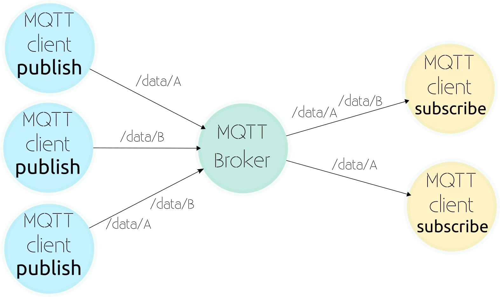
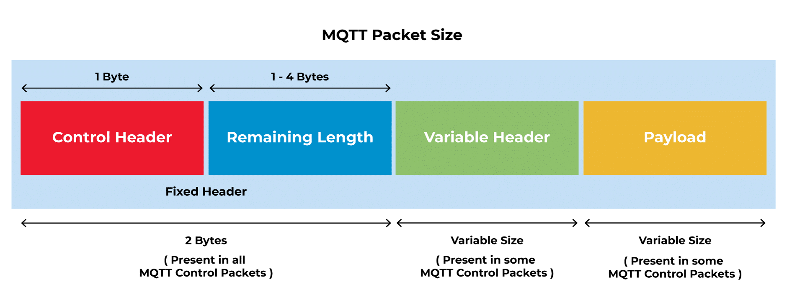
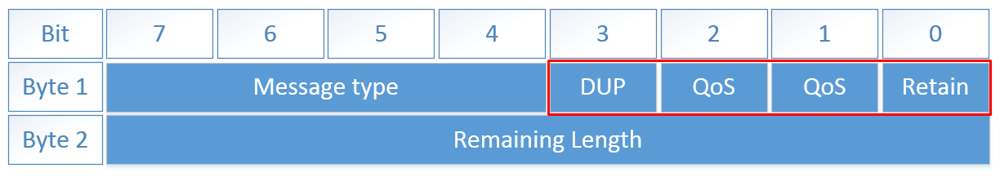

## 何为MQTT

[MQTT](https://mqtt.org)（Message Queuing Telemetry Transport，消息队列遥测传输协议）是一种基于`发布/订阅`（publish/subscribe）模式的“轻量级”通讯协议，构建于TCP/IP协议上，由IBM在1999年发布。目前MQTT的最新版本为OASIS（Organization for the Advancement of Structured Information Standards，结构化信息标准促进组织）于2019年发布的[MQTT 5.0](https://docs.oasis-open.org/mqtt/mqtt/v5.0/mqtt-v5.0.html)，但是下面要介绍的MQTT框架还只是支持2014年发布的[MQTT 3.1.1](http://docs.oasis-open.org/mqtt/mqtt/v3.1.1/os/mqtt-v3.1.1-os.html)，因此下文的内容以3.1.1版本为准。除了5.0和3.1.1版本之外，MQTT还有一个简化版的[MQTT-SN](https://www.oasis-open.org/committees/document.php?document_id=66091&wg_abbrev=mqtt)（MQTT for Sensor Networks），这里限于篇幅不做展开。

MQTT在物联网领域的应用十分广泛，以至于MQTT官网将其称为“The Standard for IoT Messaging”。其最大优点在于，**用极少的代码和有限的带宽，为连接远程设备提供实时可靠的消息服务**。MQTT的通信模式是Client-Server模式，其中Client主要负责订阅消息（因为一个Client也可以作为其他Client的Server），而Server只能发布消息，不能订阅消息。下面就是一张MQTT通信方式的示意图：



在上图中，位于中心的MQTT Broker（MQTT代理）就是Server，发布消息的Client并不能直接把消息发送给其他订阅消息的Client（点对点通信），而是先将消息传递给Server，再由Server统一推送给所有订阅消息的Client（一对多通信）。

> 注意，发布消息的Client将消息传递给Server，不代表Server“订阅”了消息，因此跟上面“Server只能发布消息，不能订阅消息”的说法并不矛盾。

### 主题

接收消息的Client之所以要使用“订阅”一词来描述其行为，是因为Server发布推送的大量消息都各自归属于不同的“主题（Topic）”。从实际角度来说，接收消息的终端往往只应该关注自己“感兴趣”的消息，否则无论Server发布什么消息都来者不拒的话，那么MQTT所采用的C/S通信模式就显得很奇怪——既然终端要接收处理所有消息，为什么还要特意设立Server加一道中转的流程，直接点对点自由通信岂不是更方便？另外，终端要接收处理所有消息，对硬件和带宽的要求也必然不会很低，这与MQTT自身定位和实际使用场景也是有冲突的。因此，MQTT要求每个消息都要带有特定主题，终端只能订阅某个主题下的消息。在MQTT中，主题的作用就是过滤出终端真正需要接收到的消息。

主题是一串分层划分的UTF-8字符串，不同的主题级别用斜杠`/`作为分隔符号，比如`一级主题/二级主题/三级主题`；如果需要订阅某一级别主题下的所有消息，那么就要将当前级别主题的<font color=red>下一级</font>主题标记为`#`。举个例子，一个Client订阅的主题为`一级主题/二级主题/三级主题`，那么它只会收到归属于三级主题的消息，而其他与三级主题平级的主题消息就接收不到。若Client订阅的主题为`一级主题/二级主题/#`，那么就会接收到所有二级主题下的消息，不但包括原来的三级主题，还包括与三级主题平级的其他主题，以及比它们更下级的主题。

### 服务质量

服务质量（Quality of Service levels，QoS）是MQTT的一个重要特性。尽管在使用TCP/IP时，通信连接已经在一定程度上受到保护，但是在无线网络中，中断和干扰很频繁，所以MQTT需要在这里提供帮助，以避免信息丢失及保证其服务质量水平。在MQTT中，QoS有以下三个等级：

+ **QoS 0**

    消息至多传送一次，开销最小，但是可靠性最低，因为完全依赖底层TCP/IP网络，会发生消息丢失或重复。通常适用于Server推送比较频繁，偶尔丢失或重复信息也不会引发严重问题的场景，比如温度传感器隔一段时间上报温度。

+ **QoS 1**

    消息至少传送一次，可靠性较高，可能会多次推送以确保消息能够到达终端（除非网络被完全切断），因此会出现消息重复的情况。适用于丢失信息会带来严重后果，但是重复传送影响不大的场景，比如考勤系统的考勤记录信息在传输过程中发生丢失会导致没有考勤记录，而重复传送可以在应用层面过滤处理，确保考勤记录存在、有效。

+ **QoS 2** 

    消息只传送一次，开销最大，可靠性最高，因为每个消息都带有唯一ID，并且会分别在发送者和接收者存储，并且发送者和接收者之间需要建立两个流传输数据。仅适用于重复推送或丢失会带来较大影响的场景，比如计费系统就需要确保一次消费只产生一条消费记录，如果重复推送会导致多扣款，而消息丢失会导致有消费但是没扣款。

### MQTT报文结构

MQTT报文由三部分组成：固定报头（Fixed Header）、可变报头（Variable Header）以及有效载荷（Payload）。具体如下图所示：



+ **固定报头**

固定头存在于所有MQTT报文中，长度固定为2字节。固定头内部又分为控制头和剩余长度两个组成部分，如下图所示：



在控制头中，消息类型是4位的无符号值，总计有16种，具体类型可以参考[MQTT标准文档](http://docs.oasis-open.org/mqtt/mqtt/v3.1.1/os/mqtt-v3.1.1-os.html#_Toc398718021)；副本标识位用于控制报文是否需要重复分发，目前只有PUBLISH类型消息会用到；服务质量标识位从00到10，由低到高分别对应三种服务质量级别（剩下一个11是预留的），同样只在PUBLISH类型中使用；保留标识位用于控制服务器是否保留此次推送的报文，目前只用在PUBLISH类型消息，如果启用该标识位，服务器在推送时会保留报文，有新的订阅者出现时就推送，没有就直接释放。

剩余长度用来表示当前报文剩余部分的**字节数**，包括可变报头和有效载荷。剩余长度**不包括**用于编码剩余长度字段本身的字节数。剩余长度这一字节可以扩展，前7位用于保存长度，后1位用做标识。当最后一位非0时，表示长度不足，需要使用下一字节继续表示剩余长度，由此可以推导出，理论上一个控制报文最长可以到256MB。但是MQTT报文是不支持分包处理的，因此不适用于数据量大的场景（如视频直播），这也是MQTT主要用于物联网领域的重要原因。

+ **可变报头**

可变报头的内容因报文类型而不同，较常的应用是作为报文的标识。许多类型报文的可变报头都是2字节长度的报文标识字段，包括`PUBLISH (QoS > 0)`、`PUBACK`、`PUBREC`、`PUBREL`、`PUBCOMP`、`SUBSCRIBE`、`SUBACK`、`UNSUBSCRIBE`以及`UNSUBACK`类型的报文。更多有关可变报头的详细说明，可以参考[MQTT标准文档](http://docs.oasis-open.org/mqtt/mqtt/v3.1.1/os/mqtt-v3.1.1-os.html#_Toc398718025)。

+ **有效载荷**

有效载荷即为应用消息，在MQTT 3.1.1中，`CONNECT`、`SUBSCRIBE`、`SUBACK`和`UNSUBSCRIBE`这四种类型报文要求必须携带有效载荷，而`PUBLISH`类型报文可带可不带。下表列出了这些报文需要携带什么样的有效载荷：

|报文类型|有效载荷内容|
|:-----:|:-----:|
|`CONNECT`|客户端的ClientID、订阅的Topic、Message以及用户名和密码等信息|
|`SUBSCRIBE`|一系列的要订阅的Topic以及QoS|
|`SUBACK`|服务器对于`SUBSCRIBE`报文所申请的Topic及QoS进行确认和回复|
|`UNSUBSCRIBE`|要订阅的Topic|
|`PUBLISH`|与业务相关的通信内容|

## Android MQTT框架

Android开发最常用的MQTT框架是Eclipse基金会开源的[Eclipse Paho](https://www.eclipse.org/paho/)框架。根据Eclipse官方的文档，Eclipse Paho目前只在Java、Python、C和C++这四种语言开发的程序上支持MQTT 5.0，而Android等开发领域仅支持到MQTT 3.1.1。

Eclipse Paho for Android的GitHub仓库地址为[https://github.com/eclipse/paho.mqtt.android](https://github.com/eclipse/paho.mqtt.android)。作为一个官方库，Eclipse Paho for Android在多数情况下是足够使用的，但问题在于，Eclipse官方对这个库的开发维护趋于停滞（2022年8月在[Maven Center](https://mvnrepository.com/artifact/org.eclipse.paho/org.eclipse.paho.android.service)查到的最新版本为1.1.1），也没有适配到Android 12或更高版本（详见[MQTT Exception not supported on Android 12](https://github.com/eclipse/paho.mqtt.android/issues/482)），因此会对未来的开发使用带来许多不便。

按照部分开发者的指引，目前比较值得使用的MQTT框架是基于Eclipse Paho for Android改进的[MQTT Android Service](https://github.com/hannesa2/paho.mqtt.android)，该框架虽然和官方库一样只支持到MQTT 3.1.1，但是开发维护较为活跃，并且使用了Kotlin语言，还适配了Android 12，因此在可预见的一段时期内，这个第三方库都是值得集成使用的。

### 依赖库导入

MQTT Android Service的导入方式为：

```
allprojects {
    repositories {
      ...
      maven { url 'https://jitpack.io' }
    }
}

dependencies {
  implementation 'androidx.legacy:legacy-support-v4:1.0.0'
  implementation 'com.github.hannesa2:paho.mqtt.android:$latestVersion'
}
```

### 基本使用

MQTT Android Service的基本使用方式如下列代码所示：

```
// 获取MQTT Client
val client = MqttAndroidClient(context, uri, clientId).apply {
    if (Build.VERSION.SDK_INT >= Build.VERSION_CODES.O) {
        val id = random.nextInt()
        // 在Android 8.0及以上的高版本系统中，需要开启前台服务
        setForegroundService(createForegroundNotification(context, id), id)
    }
 }

// 设置MQTT追踪功能
client.setTraceEnabled(true)

// 设置MQTT通信回调
client.setCallback(object : MqttCallback {
    override fun connectionLost(cause: Throwable?) {
        // TODO: 失去连接时的回调逻辑
    }

    override fun messageArrived(topic: String?, message: MqttMessage?) {
        // TODO: MQTT报文送达时的回调逻辑
    }

    override fun deliveryComplete(token: IMqttDeliveryToken?) {
        // TODO: 携带有效载荷的MQTT报文送达时的回调逻辑
    }
})

// 配置MQTT连接选项
val options = MqttConnectOptions().apply {
                // 如果通信不需要用户名和密码，就不用配置userName和password
                userName = name
                password = pswd.toCharArray()
                isAutomaticReconnect = true
                isCleanSession = true
                connectionTimeout = 30
            }

// 设置MQTT连接回调监听器
val listener = object : IMqttActionListener {
                override fun onSuccess(asyncActionToken: IMqttToken?) {
                    // QoS是枚举类，包含QoS.AtMostOnce、QoS.AtLeastOnce和QoS.ExactlyOnce
                    // 只有执行该函数后，MQTT Client才真正开始订阅主题消息
                    client.subscribe(topic, QoS.value, context, null)
                }

                override fun onFailure(asyncActionToken: IMqttToken?, exception: Throwable?) {
                    // TODO: MQTT连接失败回调
                }

            }

// 尝试建立MQTT通信连接
client.connect(options, listener)
```

> 这里推荐使用[通信猫](http://www.tongxinmao.com/App/Detail/id/126)来测试Android设备的MQTT通信情况。