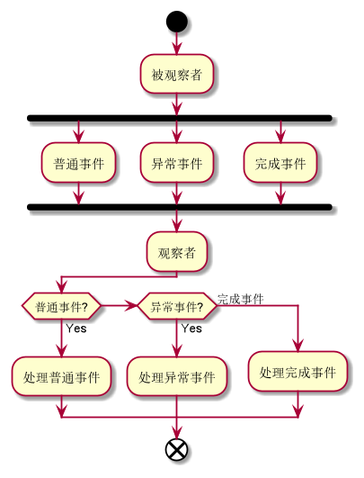
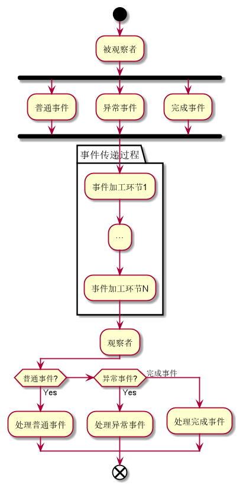

[RxJava](https://github.com/ReactiveX/RxJava)是一个非常出名的开源库，按照官方的说法：

>RxJava is a Java VM implementation of Reactive Extensions: a library for composing asynchronous and event-based programs by using observable sequences.
>
>RxJava是响应式扩展——一个使用可观察序列的组合异步、基于事件程序的库——在Java虚拟机上的一种实现。

换句话说，RxJava就是一个用Java语言实现了响应式扩展的库，其核心是[响应式编程](https://zh.wikipedia.org/wiki/%E5%93%8D%E5%BA%94%E5%BC%8F%E7%BC%96%E7%A8%8B)，所要解决的问题是**异步任务**，在这一点上，RxJava跟同样实现观察者模式的[EventBus](Android/eb)是存在区别的，二者的应用场景也因此有很大的不同。

## 响应式扩展

所谓响应式扩展（Reactive Extensions，Rx名称由来），实际上是一种对[观察者模式](DesignPattern/行为型设计模式?id=七、observer)进行大量拓展的编程模型。Rx关注数据流并对数据的改变做出响应和分发，它将数据流称为被观察者（Observable），而订阅（subscribe）数据并在数据到来时做出响应的部分被称作观察者（Observer）。

Rx模型中的可观察序列代表事件流或其他数据源。通过将可观察序列与LINQ（language-integrated query，语言集成查询）库提供的查询操作符（组合器）拼接起来，就组成了异步程序。

Rx最先由Microsoft的架构师Erik Meijer领导的团队开发，在2012年11月开源，如今已成为一种跨语言通用的设计思想和模型。因此，用哪种语言来实现这一编程模型，就在哪种语言的前面加上一个Rx前缀，比如RxJava、RxJS、RxPHP以及RxPython等等。

## 基本使用

### 依赖导入

在Android项目中使用RxJava，需要通过Gradle导入相关依赖：

```
dependencies {
    //使用RxJava 2
    implementation "io.reactivex.rxjava2:rxjava:$specific_version"
    implementation "io.reactivex.rxjava2:rxandroid:$specific_version" //Android项目通常需要导入该依赖库

    //使用RxJava 3
    implementation "io.reactivex.rxjava3:rxjava:$specific_version"
    implementation "io.reactivex.rxjava3:rxandroid:$specific_version" //Android项目通常需要导入该依赖库
}
```

>注意，RxJava 2自2021年2月28日起，已经全面停止后续的开发维护工作，因此后面介绍的内容主要基于RxJava 3。

### 从Hello World开始

RxJava的开发团队在GitHub上提供了一个简单的示例：

```
package rxjava.examples;

import io.reactivex.rxjava3.core.*;

public class HelloWorld {
    public static void main(String[] args) {
        Flowable.just("Hello world").subscribe(System.out::println);
    }
}
```

在上面的示例代码中，可以找出RxJava实现响应式扩展的四个基本要素：

+ **被观察者**：`Flowable`
+ **观察者**：`System.out::println`
+ **事件**：`just("Hello world")`
+ **订阅操作**：`subscribe()`

<font color=red>被观察者产生了事件（`Flowable.just("Hello world")`），观察者订阅了事件（`subscribe(System.out::println)`），最后事件被观察者处理掉（打印出Hello world）</font>，整个程序的执行逻辑就是这样，而使用RxJava编写的所有业务逻辑，基本上也在这个框架之内。


当然，上面只是一个简单的示例，在实际开发当中更多地是按照下面三个步骤来让RxJava执行任务的：

> *步骤一：创建被观察者，并产生事件*

```
val observable = Observable.create<SomeType> { it:ObservableEmitter<SomeType>!
    it.apply {
        onNext(···)
        onError(···)
        onComplete()
    }
}
```

由`Observable.create()`方法创建的Observable类型对象，可以通过ObservableEmitter对象发送三类事件：`onNext`对应的普通事件，`onError`对应的异常事件以及`onComplete`对应的完成事件。

注意到`Observable.create()`是一个泛型方法，而ObservableEmitter是一个抽象泛型类，因此开发者可以传入自己想要的类型。

此外，被观察者并非只有Observable类型，在后面的内容中还会引入另一种，即Flowable。

> *步骤二：创建观察者，并处理事件*

```
val observer = object :Observer<SomeType> {
    override fun onSubscribe(d: Disposable?) {
        //TODO
    }

    override fun onNext(t: SomeType?) {
        //TODO
    }

    override fun onError(e: Throwable?) {
        //TODO
    }

    override fun onComplete() {
        //TODO
    }
}
```

Observer是一个泛型接口，因此需要以匿名内部类的方式对其进行实例化并重写相关的方法。其中，`onSubscribe()`会在观察者接收被观察者的事件（建立连接）之前就调用一次，`onNext()`、`onError()`以及`onComplete()`会分别在接收到普通事件、异常事件和完成事件时调用。

> *步骤三：观察者订阅事件*

```
observable.subscribe(observer)
```

这里的代码编写方式跟实际逻辑有比较大的差异。如果按照实际逻辑，应该是由Observer对象调用`subscribe()`方法，然后把Observable对象产生的事件传进去进行处理。然而，RxJava采用这种形式的写法，恰恰符合三步实现的总体逻辑：**以被观察者产生事件为起点，以观察者处理事件为终点**。如下图所示，既然观察者处于数据流的末端，那么这样写就是理所当然的了。



为了简化写法，上述三个步骤还可以合到一起，就像下面代码所示的那样：

```
Observable.create<SomeType> { it:ObservableEmitter<SomeType>!
    it.apply {
        onNext(···)
        onError(···)
        onComplete()
    }
}.subscribe(object :Observer<SomeType> {
            
    override fun onSubscribe(d: Disposable?) {
        //TODO
    }

    override fun onNext(t: SomeType?) {
        //TODO       
    }

    override fun onError(e: Throwable?) {
        e?.printStackTrace()
        //TODO
    }

    override fun onComplete() {
        //TODO
    }
})
```

至此，RxJava的基本使用方式就介绍完毕了。

## 进阶学习

RxJava支持流式操作。所谓流式操作，本质上就是一种基于事件流的各个方法的[链式调用](DesignPattern/创建型设计模式?id=builder)。在前面的内容当中，Observable连续调用`create()`和`subscribe()`方法将三步实现简化成一个整体，一气呵成。事实上，RxJava提供的方法远不止这两个，把这些方法有机组合起来进行链式调用，就能让RxJava发挥出极大的作用——尤其是在异步任务方面，就像下面这张图所呈现的那样。



要想知道有哪些方法可以调用，怎样调用以及何时调用，就得接着往下看。

### 基础类

#### Observable

#### Flowable

#### Single

#### Completable

#### Maybe

#### Disposable

### 操作符

### 异步任务

