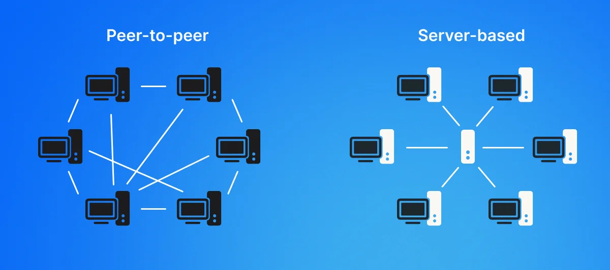
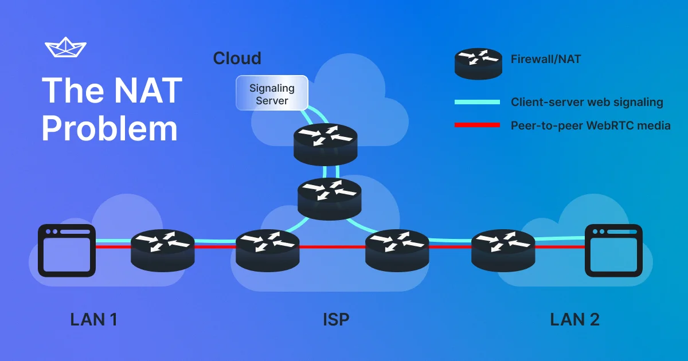
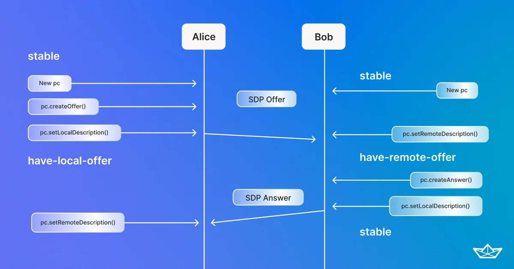
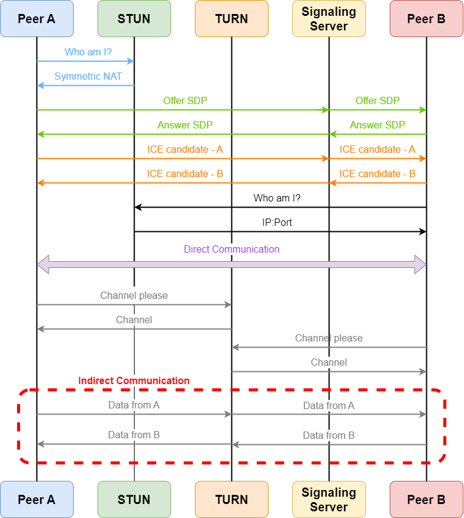

## 何为WebRTC

[WebRTC](https://webrtc.org/)（Web Real-Time Communication）是Google在2011年收购GIPS、On2以及VPx等子项目之后，被整合开源出来的一个**实时音视频通话**框架。2017年12月，WebRTC成为W3C草案；2021年1月26日，WebRTC晋升为[W3C正式标准](https://www.w3.org/TR/webrtc/)。由于WebRTC已经成为W3C正式标准，目前主流的浏览器（Firefox、Chromium系以及Safari等）和主流版本的Android、iOS系统都对其提供了支持。

### webRTC基础概念

在正式介绍如何在Android平台上使用WebRTC框架之前，有必要先来了解一下WebRTC当中的一些基础概念。

#### PeerConnection

PeerConnection是WebRTC一个重要的概念，代表着两台对等设备间所建立的一个连接。其主要作用是进行**会话控制**，比如设置SDP的提供和应答，添加[ICE](Android/webrtc_android?id=ice)协议候选，建立、监控和关闭连接。

#### Signaling Server

signaling server的翻译是“信令服务器”。在WebRTC中，信令服务器的主要作用就是**帮助两台对等设备，在尽可能少地暴露隐私信息的情况下，解决局域网路由交换和防火墙等问题，建立起点对点的WebRTC通信连接**（如下图所示）。在一般情况下，开发者应当建立自己的信令服务器，自行实现信令协议用于交换通信双方的相关信息。

一旦通信双方经过信令服务器建立起点对点通信之后，它们就可以直接向对方实时发送数据，后面的通信过程也就不再经过信令服务器，从而减少了通信延迟（在双方网络条件都正常的情况下）和服务器与客户端之间的通信压力。

#### SDP

SDP全称为Seddion Description Protocol，其主要作用就是**描述会话连接当中的信息**，包含源地址、媒体类型（音频或视频）以及[Codec](https://developer.mozilla.org/en-US/docs/web/media/formats/webrtc_codecs)（音视频编解码器）等，具体还包含有哪些信息，可以参考[RFC 4556](https://datatracker.ietf.org/doc/html/rfc4566)。

下图展示的是两台对等设备之间如何交换SDP信息：

注意图中的“offer”和“answer”过程都是要经过信令服务器的。

#### ICE

[ICE](https://developer.mozilla.org/en-US/docs/Glossary/ICE)全称为Interactive Connectivity Establishment，它也是一个协议，用于**两台对等设备协商如何建立WebRTC连接**。之所以还要使用ICE，主要是因为进行通信的对等设备往往位于不同的局域网内，它们之间还有路由器/交换机跟防火墙的阻隔，光交换SDP还不足以让它们建立点对点通信。ICE最关键的地方就在于，它会利用下面要介绍到的STUN和TURN协议来建立一条可以跨越不同局域网和ISP的通信连接。

ICE的算法会寻找两个通信终端之间延迟最低的一条路径来建立连接，其尝试的顺序为：

1. 基于STUN的UDP直连；
2. 基于HTTP端口的TCP直连；
3. 基于HTTPS端口的TCP直连；
4. 基于中继或TURN的连接。

#### STUN

STUN是WebRTC当中会用到的一个P2P通信协议，其全称为Session Traversal Utilities for NAT。STUN的主要作用是**让通信终端能够发现其公网IP和端口，同时检测通信端点间的连接性，还可以作为一种保活协议来维持NAT的绑定**。在实际使用中，STUN往往作为一种NAT传输的辅助工具。

> 注意，现行的STUN通常是指[STUN/RFC8489](https://www.rfc-editor.org/rfc/inline-errata/rfc8489.html)，而不是[STUN/RFC3489](https://www.rfc-editor.org/rfc/rfc3489.html)所代表的
Simple Traversal of UDP through NAT。前者是向下兼容的，会包含后者所有功能。

#### TURN

[TURN](https://www.rfc-editor.org/rfc/rfc8656)也是WebRTC使用的P2P通信协议之一，其全称为Traversal Using Relays around NAT，通常会跟STUN组合使用。TURN的主要作用就是**让通信终端能够在无法建立直连（比如两个终端位于不同局域网内，且无法连接到互联网）的情况下，通过一个基于TURN的中继服务器来建立地址映射，从而实现与其他终端进行正常通信**。

### WebRTC工作流程

在了解了WebRTC当中几个重要的基础概念之后，WebRTC的大致工作流程已经可以被绘制出来了：

## Android平台上的WebRTC

Google官方曾开发了针对Android平台的[WebRTC库](https://mvnrepository.com/artifact/org.webrtc/google-webrtc)，但是在2018年7月发布最后一个版本1.0.23995之后就直接弃坑了（WTF？）。不过幸运的是，Android平台的WebRTC库开发并没有就此永远终止，还是有开发者决定沿着Google开辟出来的道路继续走下去，并产出了许多令人惊喜的成功，其中就包括了后面要介绍的、目前维护最活跃的一个webRTC库——[WebRTC Android by Stream](https://github.com/GetStream/webrtc-android)。