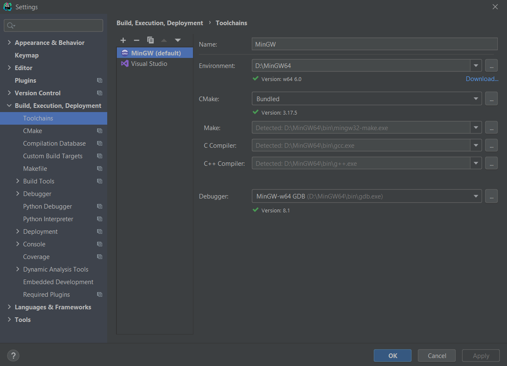

在2021年，编写C++程序用什么IDE？有人说应该用微软的宇宙第一IDE——Visual Studio，有人说记事本足矣。然而本人毕竟是做Android开发的，自然不希望所用的IDE完全脱离这个领域，因此摆在面前的有两种选择：要么用现成的VS Code，要么用Android Studio缔造者之一的JetBrains开发的CLion。当然了，既然CLion跟Android Studio有亲缘关系，那本人自然优先选用它了。此外，由于VSCode配置比较麻烦，所以可以参考微软官方的[说明](https://code.visualstudio.com/docs/languages/cpp)，这里不做赘述。

## 编译环境配置

C++程序需要一个编译环境，而Windows上最常用的环境就是MinGW。前往[sourceforge](https://sourceforge.net/projects/mingw-w64/files/mingw-w64/)，找到`MinGW-W64 GCC`最新版的位置，下载以`-posix-seh`结尾的文件。下载下来的文件是一个压缩包，将其解压到目标文件下，然后在系统环境变量中添加保存压缩包解压后的bin文件夹所在的路径，接着打开Powershell或cmd，输入`gcc -v`指令查看是否有类似于下面的信息打印出来：

```
Using built-in specs.
COLLECT_GCC=D:\MinGW64\bin\gcc.exe
COLLECT_LTO_WRAPPER=D:/MinGW64/bin/../libexec/gcc/x86_64-w64-mingw32/8.1.0/lto-wrapper.exe
Target: x86_64-w64-mingw32
···
Thread model: posix
gcc version 8.1.0 (x86_64-posix-seh-rev0, Built by MinGW-W64 project)
```

如果有的话就表明编译环境已经配置成功。

## CLion配置

>注意，CLion既不像Android Studio一样免费，也不像IntelliJ IDEA那样提供社区版，它只有30天试用期。一种薅羊毛的方法是用学校提供的edu邮箱来注册账号，这样就能用上一年了。

经过实践发现，只要事先配置好编译环境，CLion就能自动搜索到并配置好工具链，使用起来非常便利。当然，如果是先安装CLion，再安装编译环境，则需要在新建项目之后，通过`File`➡`Settings`➡`Build, Execution, Deployment`➡`Toolchains`设置编译工具链，如下图所示：



在右边的Environment里面导入MinGW的安装路径，剩下的部分IDE会自动配置，接着就可以愉快地写代码了。

使用CLion的好处在于，它的界面与Android Studio十分相似，上手操作没有那么多的不适应，学习成本比较低；最为关键的是，CLion采用CMake方式构建C++程序，这种方式在Android NDK开发当中至关重要，其地位相当于学习Java就要知道怎么用Maven，学习Android开发就必须学会怎么用Gradle构建项目。
