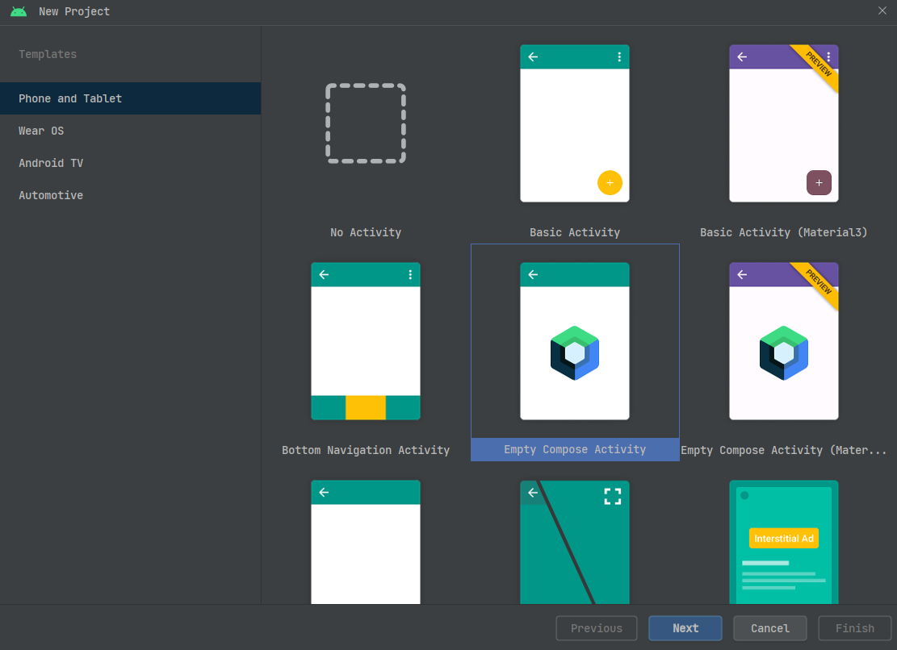

## 何为Compose

Compose是Google推出的一种采用**Kotlin DSL**和**声明式API**的UI开发框架技术方案。广义的Compose，实际上包括了Android开发领域使用的[Jetpack Compose](https://developer.android.google.cn/jetpack/compose)，和跨平台开发领域所使用的[Compose Multiplatform](https://www.jetbrains.com/lp/compose-mpp/)。Jetpack Compose跟Compose Multiplatform本质上都是同一种开发技术方案的不同实现版本，而且后者很大程度上是从前者衍生发展出来的。对于Android开发者来说，使用Kotlin DSL这一点，会使得从Android平台往Windows、macOS、Linux甚至Web等其他平台迁移的难度比[Flutter](Flutter/basic)更小一些。值得注意的是，Compose Multiplatform在桌面应用开发上，使用的图形渲染引擎是[Skia](https://github.com/google/skia)，跟Flutter基本一样。

从某种意义上讲，Compose是对传统Android UI开发方式的一次革命。声明式UI在Web前端领域并不鲜见，但是要在Android等平台上去实现这样的技术却并非易事。尤其是Android平台，众多开发者长年跟`.xml`文件打交道，在Activity/Fragment、Dialog、Adapter或者各种自定义View中，一遍遍调用控件自带的API去修改某些属性，从而达到特定的UI效果。这种命令式UI的开发方式，在多年以后终于要面临被革命的命运了。Compose采用声明式UI的技术实现方案，可以粗略地理解为通过声明式API，直接在一块“画布（Canvas）”上使用“画笔（Paint）”绘制出所有的界面元素。这种方式相对于传统UI开发而言，其最大的优势就在于从根本上一举消除了**布局嵌套导致视图树层级过深**，增加渲染负担，拉低应用性能的问题。

尽管目前Compose可能还有一些不尽如人意的地方，但是考虑到它已经发布正式版，并且仍处在迭代发展过程中，Android官方也有很大的决心去推广这套技术方案，因此有必要考虑学习这项新技术。在后续的内容中，首先了解如何用Jetpack Compose开发Android应用，接着再扩展出去，了解如何开发跨平台的Compose项目。

## Compose开发环境搭建

### Jetpack Compose

对于Android开发者而言，Jetpack Compose的开发环境与平常的Android开发环境并没有什么两样。确切地说，只要安装使用最新版的Android Studio，开发者就能直接开发Jetpack Compose应用，而不必像Flutter那样配置一大堆东西。

在Android Studio中，创建新项目时可以在下图所示的窗口里面找到Compose项目：

选中其中一种Compose项目类型，点击下一步，后面就跟平时的Android开发基本一样了：

### Compose Multiplatform

Compose Multiplatform的主要开发工具是IntelliJ IDEA，跟Android Studio的情况一样，只要开发者使用的是最新版本的IntelliJ IDEA，就可以直接创建一个Compose Multiplatform项目，不需要额外再配置什么环境：

### 小结

从前面的内容可以看到，对Android和Java开发者而言，配置Compose开发环境的上手难度实际上非常低，跟Flutter相比可以说是相当友好。这得益于Compose最早脱胎于Android开发领域，又借助使用Kotlin DSL，从而得到了Google和JetBrains的大力支持。相比Flutter需要更换编程语言的陡峭学习曲线，Compose可以被认为是对Android开发者而言，最容易入门的一项跨平台技术方案了。