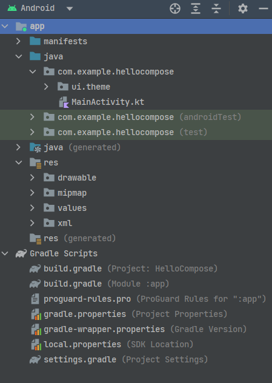
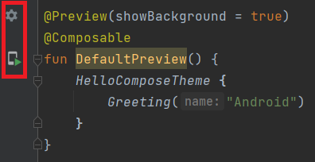
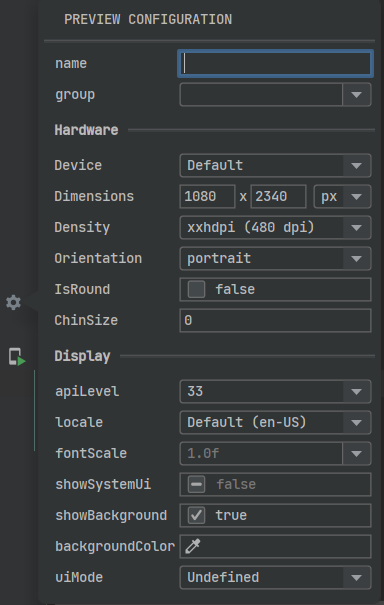
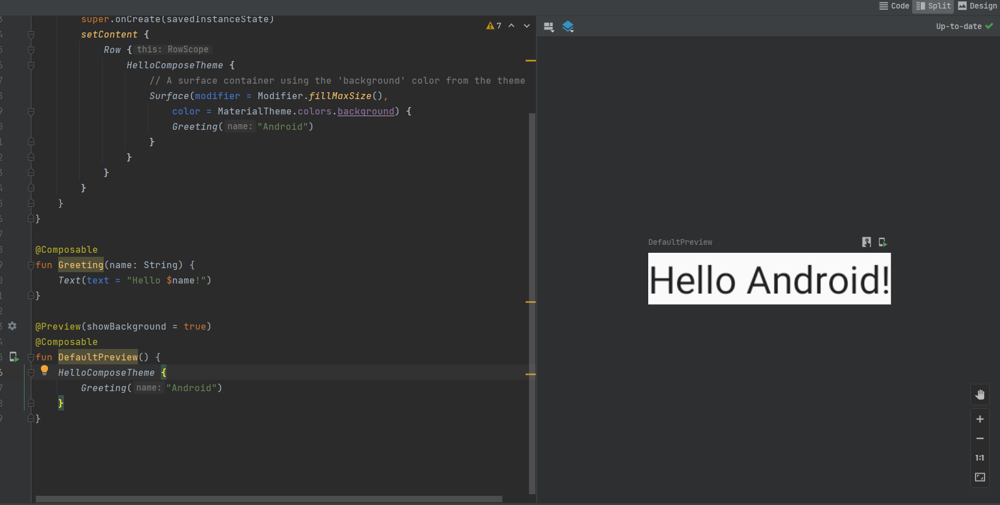
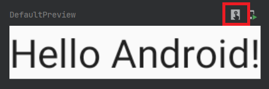

[Compose简介](Compose/basic)一节内容当中曾提到过，Jetpack Compose不需要配置特殊的开发环境，只要使用最新版的Android Studio即可。此外，那一节内容还初步展示了如何创建一个Compose项目，本节内容将沿着上一节的创建步骤继续下去，初步了解Compose项目的一些细节。

## 项目结构

下图展示的是基于Android Studio提供的模板所创建的一个简单Compose项目的结构。可以发现，Compose项目在结构上跟平常的Android项目并没有太大的区别——除了没有`res/layout`目录。



没有`res/layout`目录，就代表着模板项目完全采用Compose开发UI。那么Compose又是如何集成进项目的？这就需要前往Gradle文件中一探究竟了。直接打开模块级的`build.gradle`文件，可以在其中发现大量导入Compose依赖库的语句，类似于下面这种：

```
android {
    ···
    // 给应用启用Compose功能
    buildFeatures {
        compose true
    }
    // 此处可单独设置非稳定版Compose Compiler的版本
    composeOptions {
        kotlinCompilerExtensionVersion '1.2.0'
    }
    ···
}

dependencies {
    ···
    implementation 'androidx.activity:activity-compose:1.4.0'
    implementation "androidx.compose.ui:ui:$compose_ui_version"
    implementation "androidx.compose.ui:ui-tooling-preview:$compose_ui_version"
    implementation 'androidx.compose.material:material:1.2.0'
    ···
    androidTestImplementation "androidx.compose.ui:ui-test-junit4:$compose_ui_version"
    debugImplementation "androidx.compose.ui:ui-tooling:$compose_ui_version"
    debugImplementation "androidx.compose.ui:ui-test-manifest:$compose_ui_version"
}
```

由于引用的依赖库比较多，因此Gradle在构建时可能会花费一定的时间，对中国大陆开发者来说，如果碰到GFW干扰的情况，可能要花费更多的时间。

## Composable函数

在Gradle完成构建之后，打开模板项目的`MainActivity.kt`文件，可以看到类似于下面的代码：

```
class MainActivity : ComponentActivity() {
    override fun onCreate(savedInstanceState: Bundle?) {
        super.onCreate(savedInstanceState)
        // Compose项目中，setContentView被全面替换成setContent
        setContent {
            ···
        }
    }
}
```

`setContent`取代了以往的`setContentView`，里面要执行的就是Composable函数。一个典型的Composable函数如下面代码所示：

```
// Composable函数需要使用@Composable注解进行标识
@Composable
// Composable函数使用大驼峰命名法，用以跟普通函数区分
fun Greeting(name: String) {
    // 和挂起函数类似，Composable函数也只能在Composable作用域内执行调用
    Text(text = "Hello $name!")
}
```

Composable函数是Compose框架的关键所在。从技术层面来说，它是声明式API的主要载体；从功能角度来说，每个Composable函数都是一个绘制界面元素的单元。尽管Compose的底层实现原理，可以让开发者不需要担心过大的嵌套深度会影响Compose性能，但是从代码可读性的角度来说，良好的封装可以避免Composable函数调用出现可怕的“嵌套地狱”。

## 可视化预览功能

在抛弃了`.xml`文件之后，Compose要依靠什么去实现界面的可视化预览？毕竟总不能像早期的Android开发那样，开发者手撸一长串界面代码，而具体UI效果全靠脑补和实际部署查看。Compose提供的方案是：再写一个Composable函数，使用`@Preview`注解，Android Studio自动识别并提供可视化预览功能。具体参考下面的示例代码：

```
// 使用@Preview注解对Composable函数进行标识
@Preview(showBackground = true)
@Composable
// 用于可视化预览的Composable函数，跟单元测试的@Test函数类似，不能有参数传入，也不能有返回值输出
fun DefaultPreview() {
    HelloComposeTheme {
        Greeting("Android")
    }
}
```

Android Studio识别到代码中包含可进行预览的Composable函数，就会出现类似下图所示的符号：



点击上方的设置图标，会弹出类似下图的配置窗口，里面可以对预览效果等进行一些配置；而点击下方的运行图标，则会将待预览的界面部署到真机或模拟器上进行查看，**相当于编写运行了一个可进行UI交互的插桩测试**，这更加简化了对UI交互进行单元测试的流程。



而在编辑器，一个可视化预览窗口已经可以使用了（如下图所示）。可以发现，这种布局跟传统的`.xml`文件编辑预览基本一样，并没有什么太大的差异：



注意到上图右侧的预览窗口，中间被渲染出来进行UI效果预览的区域的右上角有两个图标。最右边的图标是部署运行按钮，在它的左边，是一个交互模式的切换按钮（如下图所示）。这个按钮在开发者想要预览点击、触摸、滑动等交互效果时会发挥作用，只要点击该按钮，预览界面就会进入交互模式。开发者同某一界面元素交互时产生的具体效果，可以通过这种模式直接呈现，这样就进一步提高了开发效率。



此外，不同于传统UI开发中一个`.xml`文件只能对应一个预览界面，如果开发者在代码中编写了多个可进行预览的Composable函数，那么预览窗口中可能就会同时渲染出多个界面，而且互不干扰，这更加方便了开发者的使用。