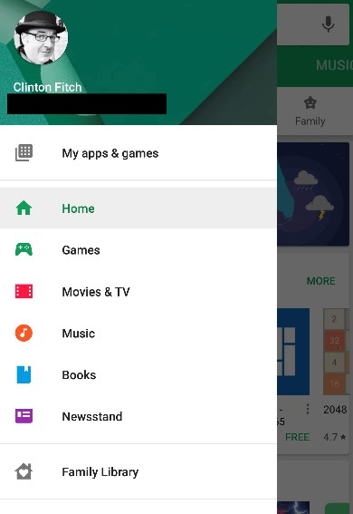
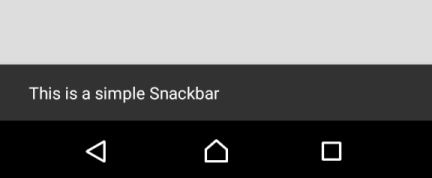

Scaffold的主要作用是，为开发者提供一个Material Design风格的**基本视图界面结构**。Scaffold布局的声明API总计有18个参数，几乎涵盖了一个按照Material Design设计准则开发的视图界面应该包含的界面元素及其样式效果。

```
@Composable
fun Scaffold(
    modifier: Modifier = Modifier,
    scaffoldState: ScaffoldState = rememberScaffoldState(),
    // 传入一个TopAppBar布局
    topBar: @Composable () -> Unit = {},
    // 可以传BottomAppBar，也可以传BottomNavigation
    bottomBar: @Composable () -> Unit = {},
    // 传入一个负责管理SnackBar的容器
    snackbarHost: @Composable (SnackbarHostState) -> Unit = { SnackbarHost(it) },
    // 传入FAB组件
    floatingActionButton: @Composable () -> Unit = {},
    // 设置FAB在界面上的位置，竖直方向始终固定为靠近屏幕底部，位于bottomBar上方，水平方向有中间和末尾两处可选
    floatingActionButtonPosition: FabPosition = FabPosition.End,
    // 设置FAB是否覆盖在bottomBar一半高度的位置，只有当bottomBar和FAB都存在的情况下，该配置才能生效
    isFloatingActionButtonDocked: Boolean = false,
    // 传入侧滑菜单的布局内容
    drawerContent: @Composable (ColumnScope.() -> Unit)? = null,
    // 设置侧滑菜单能否与手势交互
    drawerGesturesEnabled: Boolean = true,
    drawerShape: Shape = MaterialTheme.shapes.large,
    drawerElevation: Dp = DrawerDefaults.Elevation,
    drawerBackgroundColor: Color = MaterialTheme.colors.surface,
    drawerContentColor: Color = contentColorFor(drawerBackgroundColor),
    // 设置侧滑菜单打开时，遮罩层的半透明（或者说柔化）效果所使用的颜色
    drawerScrimColor: Color = DrawerDefaults.scrimColor,
    backgroundColor: Color = MaterialTheme.colors.background,
    contentColor: Color = contentColorFor(backgroundColor),
    // 设置应用界面的主要内容
    content: @Composable (PaddingValues) -> Unit
) { ··· }
```

这里稍微介绍一下scaffoldState配置。这个配置接收`androidx.compose.material.ScaffoldState`类型参数，主要作用是设置“抽屉”和SnackBar的状态。所谓抽屉，实际上是Android UI开发当中一种可以滑出滑入的侧滑菜单界面，典型的例子就是Google Play以前的某些版本，如下图所示：



注意到上图侧滑菜单右侧一部分的界面变得暗淡，这就是声明API中所提到的scrim（遮罩层）效果。

SnackBar就是下图所展示的一种跟Toast有些类似的Android界面组件：

