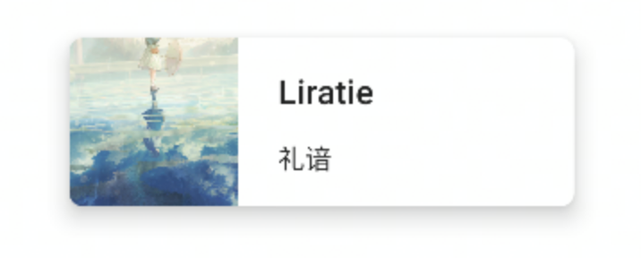

从字面上来理解，Surface是一个平面。在Material Design设计准则中也同样如此，开发者可以将很多的组件摆放在这个平面之上，并且可以设置这个平面的边框、圆角，以及颜色等样式效果。在Compose 1.2.0当中，Surface的声明API有好几个，但是除了下面源码所展示的这个API以外，其他声明API要么标注是实验性的，要么就是已经废弃的。出于避免分散精力的考虑，这里仅先讨论下面这个声明API。

```
@Composable
fun Surface(
    modifier: Modifier = Modifier,
    shape: Shape = RectangleShape,
    color: Color = MaterialTheme.colors.surface,
    contentColor: Color = contentColorFor(color),
    border: BorderStroke? = null,
    elevation: Dp = 0.dp,
    content: @Composable () -> Unit
) { ··· }
```

可以看到，Surface布局的声明API中，包含了诸多配置样式的参数。在实践当中，开发者在Surface布局的content里面编写了主要的UI代码，而Surface主要负责整个组件的形状、阴影以及背景等等，Surface可以更好地解耦一些代码，而不必在单个组件上添加很多的`Modifier`修饰符方法。下面这个例子来自于[Jetpack Compose博物馆](https://compose.funnysaltyfish.fun/docs/layout/surface)，可以初步体会Surface布局组件的用法。

```
Surface(
  shape = RoundedCornerShape(8.dp),
  elevation = 10.dp,
  modifier = Modifier
    .width(300.dp)
    .height(100.dp)
) {
  Row(
    modifier = Modifier
      .clickable {}
  ) {
    Image(
      painter = painterResource(id = R.drawable.pic),
      contentDescription = stringResource(R.string.description),
      modifier = Modifier.size(100.dp),
      contentScale = ContentScale.Crop
    )
    Spacer(Modifier.padding(horizontal = 12.dp))
    Column(
      modifier = Modifier.fillMaxHeight(),
      verticalArrangement = Arrangement.Center
    ) {
      Text(
        text = "Liratie",
        style = MaterialTheme.typography.h6
      )
      Spacer(Modifier.padding(vertical = 8.dp))
      Text(
        text = "礼谙"
      )
    }
  }
}
```

