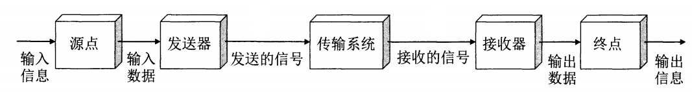
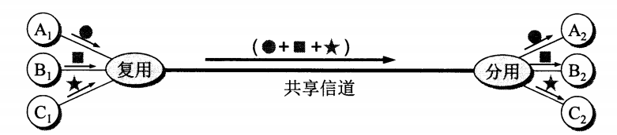
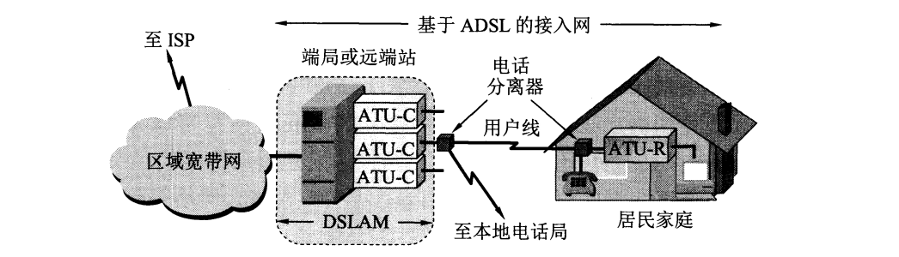
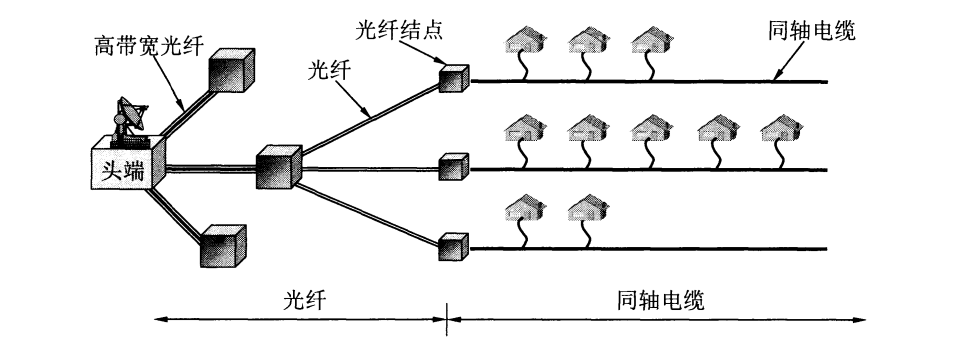
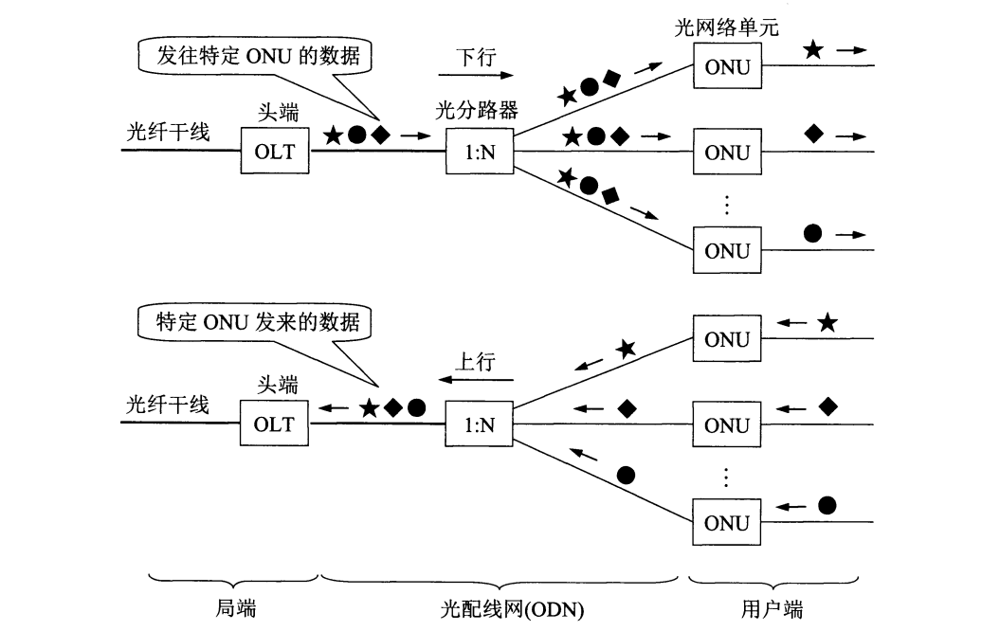

# 计算机网络：第二章——物理层
[TOC]

## 物理层的任务

### 1.基本概念

物理层是一个<u>抽象</u>概念，用于描述通过各种传输媒介和通信手段传输数据比特流的**接口**的特性。这些接口特性通常包括：

* **机械特性**
  机械特性简单来说就是指<u>接口的设计标准</u>，如形状和尺寸、引脚数目与排列等。
* **电气特性**
  指明接口电缆各条线上的<u>电压范围</u>。
* **功能特性**
  指明某条线上的某一电平的<u>电压意义</u>。
* **过程特性**
  指明对于不同功能的各种可能事件的<u>出现顺序</u>。

### 2.数据通信

数据通信系统可大致划分为**源系统**（发送端/方）、**传输系统**（传输网络）以及**目的系统**（接收端/方），其模型如下图。

各个部分之间通过**信道**（向某一方向传输信息的媒体）进行通信，由此可以引出三种通信方式：

* **单向通信**
  又称单工通信，表示只能有一个方向的通信而无法进行交互。
* **双向交替通信**
  又称半双工通信，表示通信双方可以进行交互，但不能同时发送和接收。
* **双向同时通信**
  又称全双工通信，表示通信双方可以同时发送和接收信息。

源点产生的**基带信号**需要经过发送器的**调制**。调制又分基带调制（数字信号）和带通调制（模拟信号），它们的常用方式分别有：

* **基带调制（又称编码）**

1. <u>不归零制</u>
   正电平代表1，负电平代表0。
2. <u>归零制</u>
   正脉冲代表1，负脉冲代表0。
3. <u>曼彻斯特编码</u>
   位周期中心向上（或向下）跳变代表0，反之代表1。（信号频率比不归零制高，而且能够提取出信号时钟频率，具有自同步能力）
4. <u>差分曼彻斯特编码</u>
   位中心始终有跳变，位开始边界有跳变代表0，没有则代表1。

* **带通调制**

1. <u>调频</u>
   载波频率随基带数字信号变化。
2. <u>调幅</u>
   载波振幅随基带数字信号变化。
3. <u>调相</u>
   载波初始相位随基带数字信号变化。

为了达到更高的信息传输速率，通常会采用复杂的多元制的振幅相位混合调制方法，例如正交振幅调制QAM（Quadrature Amplitude Modulation）。但是受到实际信道各种因素的影响，信息传输速率不可能达到任意高的程度，即信道存在一个极限容量，会限制信息传输速率。

限制信息传输速率的主要因素有：

**（1）信道能通过的频率范围（即频带宽度）**

在任何信道中，码元传输都会存在上限，传输速率超出上限即发生**码间串扰**（信号高频分量遭到削弱衰减，致使波形之间界限模糊无法区分码元），使得接收端无法识别。信道频带越宽，可通过的信号高频分量也就越多，信息传输速率上限也就越高。

**（2）信噪比**

所谓信噪比是指信号<u>平均功率</u>与噪声<u>平均功率</u>之比，记作 $S/N$，以 $dB$ 为单位，即 $$信噪比 = 10·log_{10}(S/N)$$

在知道带宽和信噪比之后，就可以使用香农公式计算<u>不考虑其他因素影响的信道理论极限传输速率</u>：

$$C=W·log_2(1+S/N)$$

式中 $C$ 代表极限传输速率，$W$ 代表带宽。

在带宽和信噪比都已经确定达到极限的情况下，还可以通过编码的方式让**每一个码元携带更多比特的信息量**，进而提高传输速率。如果考虑实际信道的各种干扰和失真，信息传输速率实际上是达不到香农公式的极限的。

### 3.传输媒体

传输媒体又称传输介质或传输媒介，可以分为**导引型**和**非导引型**两大类。前者是指电磁波沿固体媒体传播（有线），后者指电磁波在自由空间传播（无线）。

导引型传输媒体包括双绞线、同轴电缆、光纤以及架空明线等。

非导引型传输媒体包括微波通信、无线移动通信、红外通信以及激光通信等。

## 常用信道复用技术

信道复用是指**让不同的计算机连接到相同的信道上, 以共享信道资源**。通过在一条传输介质上传输多个信号， 提高线路的利用率，降低网络的成本。其示意图如下。

可以看到，在使用复用技术时，复用器和分用器往往是成对使用的。

### 1.频分复用、时分复用以及统计时分复用

频分复用和时分复用是最为基础的两种复用方式，技术成熟但不够灵活。

频分复用（Frequency Division Multiplexing）是指将一条信道的频率带宽划分成若干份，每个用户分配到一定带宽后，在通信时将一直**独占**这个带宽。所有用户在同一时间使用不同的频带即为频分复用。

时分复用（Time Division Multiplexing）是指将时间划分为若干等长的时分复用帧，每个用户在每一帧中占用**固定序号**的时隙，即用户的数据是周期性传输的。所有用户在不同时间内占用同样的频带宽度。时分复用更利于数字信号的传输。

统计时分复用（Statistic TDM）是一种对时分复用改进的复用技术，其目的在于解决时分复用中，固定分配时隙可能带来的<u>信道利用率低下</u>的问题。STDM的主要改进部分为：使用一个集中器按顺序扫描各个用户，并将其数据输入缓存放进STDM帧，一旦帧满则立即发送。这样，即便有用户长时间不产生任何数据，也不会造成空时隙和信道利用率下降，本质上就是**动态分配时隙**。

### 2.波分复用

波分复用（Wavelength Division Multiplexing）本质上是**光的频分复用**，随着光纤中可复用的光载波信号路数的提升，又衍生出密集波分复用（Dense WDM）的概念。

### 3.码分复用

码分复用（Code Division Multiplexing）又称为码分多址（Code Division Multiple Access，CDMA），可以让用户**在同一时间内使用同样的频带进行通信**，主要用于移动通信领域。

在CDMA中，每个比特时间再划分为 $m$ （通常为64或128）个短的时间间隔，即码片。使用CDMA的每个站被指派一个<u>唯一的 $m\ bit$ 码片序列</u>，如果要发送比特1，就发送自己的码片序列；如果要发送比特0，则发送码片序列的**二进制反码**。

扩频（spread spectrum）通信是指用来传输信息的射频信号带宽远远大于信息本身带宽的一种通信方式，通常分为**直接序列扩频**（DSSS）和**跳频扩频**（FHSS）。CDMA采用的是DSSS，即信息数据率为$b\ bit/s$，但是由于每个比特都用 $m$ 位码片表示，因此实际数据率为 $mb\ bit/s$，相应的带宽也被提升到原来的 $m$ 倍。

CDMA还有一个重要特点，就是**各站码片不仅不相同，而且必须正交**。在实际的系统中采用的是<u>伪随机码序列</u>。如果把各站码片用向量来表示，所谓正交，就是指两个站的码片（包括反码）向量的**规格化内积为0**：$$\pmb{S} \cdot \pmb{T} = \frac{1}{m}\sum_{i=1}^mS_iT_i=0$$

由正交的特点还可以推出以下两个特性：

* 任何码片向量与**自身**做规格化内积必为1；
* 任何码片向量与**自己的反码**做规格化内积必为-1。

对于任何一个站来说，任意时刻接收到的扩频信号都是周围所有站发出信号的**叠加**，因此要想接收某个特定站点的信号，就必须使用该站点的码片序列与叠加信号做规格化内积运算，从而“过滤”出特定站点的信息。

## 常用宽带接入技术

### ADSL

ADSL（Asymmetric Digital Subscriber Line，非对称数字用户线）技术是**用数字技术对现有模拟电话用户线进行改造**，使之能承载宽带数字业务，在大量布设电话线（铜线）的区域有很大的用途。ADSL把0~4 kHz的低端频谱留给传统电话使用，而把原来没有用到的高端频谱留给用户上网使用。由于下行带宽远远大于上行带宽，因而得名“非对称”。

ADSL在用户线两端各安装一个ADSL调制解调器，当ADSL启动时，调制解调器就会测试可用的频率、各子信道受到的干扰情况以及在每一个频率上测试信号的传输质量，使ADSL可以选择适合的调制方案以获得尽可能高的数据率。因此，**ADSL不能保证固定的数据率**。

### HFC

HFC（Hybrid Fiber Coax，光纤同轴混合网）是指**在有线电视网的基础上开发的一种居民宽带接入网**，除了可以传输电视节目之外，还可以提供电话、数据以及其他宽带交互型业务。其结构图如下。

HFC只需要在用户端安装一个电缆调制解调器（如电视机顶盒）即可上网，但是由于同轴电缆的**共享带宽**模式，因此每个用户能享受到的数据率是不确定的，甚至可能因为用户过多从而导致数据率严重下降。

### FTTx

FTTx（Fiber to the x，光纤入x）技术是指将光纤铺设到指定地点，这样可以使用户获得最高的上网速率。如果把光纤接入点设置在用户家中，就是FTTH（x = Home）；如果到指定楼层，就是FTTF（x = Floor）；如果到办公室，就是FTTO（x = Office）……

如下图所示，为有效利用光纤资源，在光纤干线与用户之间铺设有光配线网（Optical Distribution Network），通常使用的是运营维护成本较低的**无源光网络**（Passive Optical Network）。光纤干线与ODN之间通过光线路终端（Optical Line Terminal）连接，各个用户与ODN之间通过光网络单元（Optical Network Unit）进行连接。

ODN采用波分复用，上下行分别使用不同的波长。

最常用的PON有以太网PON（Ether PON）和吉比特PON（Gigabit PON）。

所谓光纤入x，实际上是指ONU的最终部署位置位于指定地点，总体趋势是越来越靠近用户。