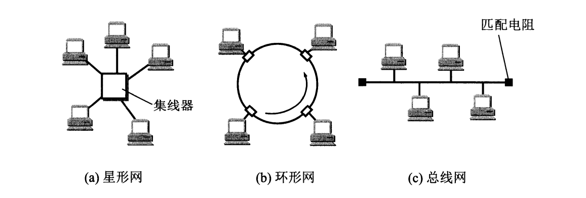
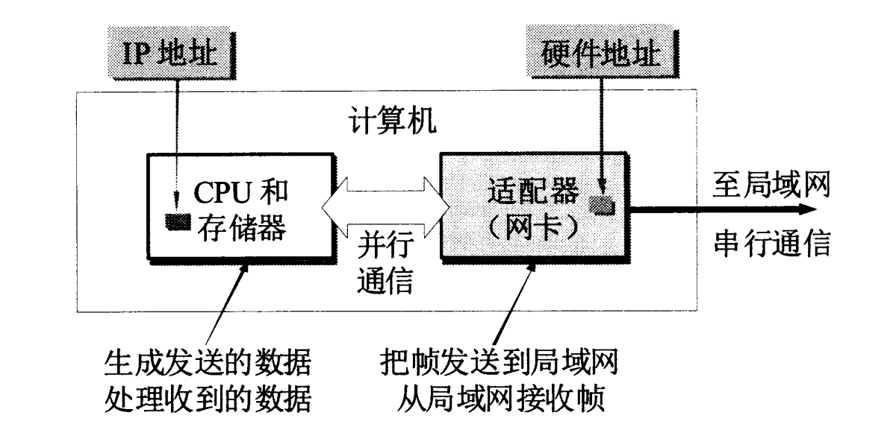
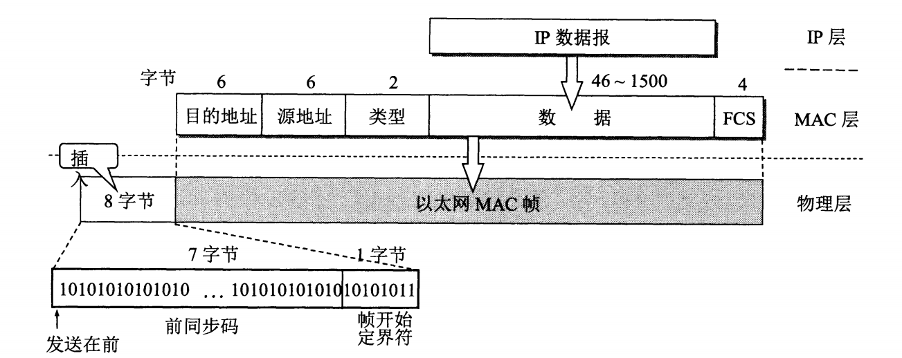

## 数据链路层的任务

数据链路层的主要任务是在局域网内实现**主机间**的分组传送，这种传送并不经过路由器。

数据链路层主要使用两种类型的信道，一种是点对点信道，另一种是广播信道。前者采用一对一的通信方式，而后者使用一对多的通信方式。两种信道根据其特点使用不同的协议，点对点信道通常是点对点协议PPP，广播信道则通常是CSMA/CD协议。

在介绍数据链路层如何设计实现相关协议之前，需要先了解以下几个概念：

+ **链路**

    链路（link）是指从一个结点到**相邻**结点的<u>一段物理线路</u>（有线或无线），中间没有其他任何的交换结点。

+ **数据链路**

    在链路的基础上，增设实现各类通信协议的软硬件设施（比如网络适配器），即构成数据链路（data link）。

+ **帧**

    帧（frame）是点对点信道数据链路层所使用的一种协议数据单元。

数据链路层的协议可以有很多种，但是它们都需要实现三个基本功能：封装成帧、透明传输以及差错检测。

### 封装成帧

所谓封装成帧，是指数据链路层将网络层交下来的**IP数据报添加首部和尾部**进行封装，组成一个数据单元，如下图所示：

图中的MTU表示最大传输单元（Maximum Transfer Unit），用于规定数据部分的长度上限。

首部和尾部的一个重要作用就是**帧定界**，通常使用特殊的帧定界符来区分每个帧，如首部设置SOH（Start Of Header）用于指示帧的开始，尾部设置EOT（End Of Transmission）指示帧的结束。帧定界的作用在传输发生差错时更为明显，因为不具备首部或尾部的帧必然是不完整帧，于是就被丢弃。

>注意，SOH和EOT都是单个控制字符，分别对应十六进制的01（二进制00000001）和04（二进制00000100），而非分别由S、O、H或E、O、T三个字母组合而成的字符串。

### 透明传输

所谓透明传输，是指无论帧中数据部分包含什么样的比特组合，都能够**按照原样没有差错地**通过数据链路层。

透明传输的问题产生于封装步骤之中。如果网络层交下来的IP数据报里面**仅包含由ASCII码组成**的数据，那么自然不会有额外的SOH或EOT字符在里面，因为这两个字符不可能通过键盘直接输入。但是在包含非ASCII码字符的条件下，某些字符转换成二进制后就有可能变成跟SOH或EOT一样的编码，这时就会导致帧定界发生错误。

为了防止一些与控制字符具有相同比特组合的数据不被接收端错误解析为控制字符，就需要采用字节填充方案，即发送端在这些字符之前加上转义字符ESC（十六进制编码1B，二进制编码00011011），之后再由接收端移除转义字符后解析数据，从而实现透明传输。

>注意，如果帧数据里面也包含了转义字符，那么同样需要再其前面再加一个转义字符，这样当接收端接收到连续两个转义字符时，就删除前面一个。

### 差错检测

现实当中不可能存在完全理想的通信链路，因此比特流在传输过程中难免会因为噪声等干扰因素出现差错。这种传输差错的存在，使得数据链路层必须具备一定的校验功能。按照传输差错的发生层面，可以划分出比特差错和帧差错两大类。

+ **比特差错**

比特差错是指数据在传输过程中因为噪声等缘故，导致原来比特位的1和0发生变化。在一段时间内，传输错误的比特占所传输的比特总数的比率称为**误码率**，它与信噪比有着密切的关系。目前在数据链路层广泛使用的比特差错校验技术为CRC（Cycle Redundancy Check，循环冗余检验）。

CRC的原理如下：

在发送端将数据以 $ k\  bit$ 为一组进行划分，然后为每个数据分组后面添加 $n$ 位冗余码（即帧检验序列FCS，Frame Check Sequence），接着构成一个帧发送出去。

$n$ 位冗余码的计算方式为：用二进制的**模2运算**进行 $2^n × M$ 的运算（相当于在数据分组 $M$ 后面添加 $n$ 个0），之后用这个 $(k + n)$ 位的数**除以**收发双方事先商定的 $(n + 1)$ 位除数 $P$，计算得出一个 $n$ 位余数 $R$，这个余数就是最后要添加的冗余码。

假设要发送的数据分组 $M$ 为`101001`，需要添加3位FCS，商定的除数 $P$ 为`1101`，那么计算过程如下图所示：

如果传输的帧没有差错，将 $(k + n)$ 位的数据分组（如上面例子中的`101001001`）除以除数 $P$ 后得到的余数必定为0。

>注意，即便是在出现误码的情况下，余数 $R$ 仍有极小的概率计算得0。不过鉴于概率太低，因此CRC校验总体上依然是比较可靠的。

最后需要注意的是，发送端的FCS生成和接收端的CRC校验都是靠硬件来完成的，处理速度很快，通常并不会延误数据的传输。

+ **帧差错**

CRC校验只能保证帧（极大概率）没有发生比特差错，但是对于传输差错中的帧差错问题——帧丢失、帧重复以及帧失序，光靠CRC是没有办法处理的。

帧丢失是很好理解的，接收端未收到应当收到的帧即为丢失；帧重复就是接收端收到了若干个同样的帧；帧失序就是接收端收到的帧排序跟发送端的序列不一致。

在这种情况下，就需要数据链路层在CRC校验的基础上增加**帧编号**、**确认**和**重传机制**。随着互联网技术进步以及通信链路质量的提高，目前采取的做法是：

对于通信质量良好的线路，数据链路层可以只做比特差错校验，发生帧差错时交由上层协议完成改正差错的任务；而对于通信质量较差的线路，由数据链路层使用确认和重传机制，向上层提供可靠传输的服务。实践证明，这种区别对待的方式有效提高了通信效率。

## 点对点协议PPP

点对点协议PPP（Point-to-Point Protocol）是目前使用最广泛的数据链路层协议。PPP除了实现前面所述的三个基本功能外，还具备简单、支持多种网络层协议以及支持多种类型链路的特点。此外，PPP不支持多点线路，并仅支持[全双工](/ComputerNetwork/Chapter_2_物理层?id=数据通信基础)链路。

PPP由以下三个部分组成：

| 组成部分         | 说明                                                                           |
| :--------------- | :----------------------------------------------------------------------------- |
| IP数据报封装方法 | IP数据报是PPP帧的信息部分，其长度受MTU限制                                     |
| 链路控制协议LCP  | Link Control Protocol，通信双方可协商一些选项，RFC 1661中定义有11种类型LCP分组 |
| 网络控制协议NCP  | Network Control Protocol是一系列协议的集合，每个协议支持不同的网络层协议       |

### 帧结构

PPP协议的帧结构如下图所示：

帧结构的首部和尾部有几个字段值得注意：

| 字段 | 十六进制编码 | 二进制编码 | 含义                            | 说明                                                                                |
| :--- | :----------- | :--------- | :------------------------------ | :---------------------------------------------------------------------------------- |
| F    | 0x7E         | 01111110   | Flag                            | PPP帧定界符                                                                         |
| A    | 0xFF         | 11111111   | Address                         | 实际上没有携带信息                                                                  |
| C    | 0x03         | 00000011   | Control                         | 实际上没有携带信息                                                                  |
| 协议 |              |            | 标识PPP帧的信息部分属于哪个协议 | 0x0021表示信息部分为IP数据报；0xC021表示信息部分为LCP数据；0x8021表示网络层控制数据 |

为确保透明传输，需要对信息部分的某些特定比特组合进行处理。当PPP使用异步传输时，RFC 1662规定采用如下**字节填充**的方式：

（1）信息字段中存在的每一个0x7E字节，都要转换为2字节序列(0x7D,0x5E);

（2）信息字段中出现一个0x7D字节，要转换为2字节序列(0x7D,0x5D);

（3）信息字段中存在ASCII码控制字符（数值小于0x20的字符）时，都要转换为(0x7D,0x2?)。

当PPP用于SONET/SDH链路进行同步传输时，会采用**零比特填充**：发送端在发送前对信息字段进行扫描，只要发现有5个连续的1，就在后面补上一个0；接收端则是反向操作，把信息部分中连续5个1后面出现的一个0去掉。这样就避免了帧边界的误判。

### 工作状态

PPP链路的工作流程大致为：
1. 用户拨号接入ISP建立物理连接；
2. 用户向ISP发送一系列封装成PPP帧的LCP分组，建立LCP链路，进行协商或鉴别；
3. LCP链路协商或鉴别通过后，NCP给新接入的用户分配临时IP地址，建立网络层连接，用户可以进行通信；
4. 用户通信结束后，依次释放网络层连接、数据链路层连接以及物理层连接。

PPP链路工作状态转换示意图如下：

在整个工作流程中，有几个点需要注意：

+ 在LCP配置协商阶段，一方要发送LCP配置请求帧（配置选项包括链路最大帧长、所用鉴别协议以及不使用PPP帧的A和C字段），另一方则回应配置确认帧/否认帧/拒绝帧；

    >确认帧表示所有选项都接受，否认帧表示理解所有选项但不接受，拒绝帧表示部分选项无法理解或需要协商通过才能接受。

+ 鉴别阶段只允许传送LCP分组、鉴别协议分组以及检测链路质量的分组。所用到的协议有口令鉴别协议PAP（Password Authentication Protocol）和口令握手鉴别协议CHAP（Challenge-Handshake Authentication Protocol）等；

+ LCP链路建立成功后，NCP根据网络层的不同协议互相交换网络层特定的网络控制分组；

+ NCP链路建立后进入链路打开阶段，两个PPP端点可以通过发送回送请求（Echo-Request）和回送回答（Echo-Reply）LCP分组检查链路状态；

+ 通信结束后，链路一端发出终止请求（Terminate-Request）LCP分组，另一端收到该分组后则以终止确认（Terminate-Ack）LCP分组进行响应，之后整个链路转到“链路终止”状态。

从上面的流程可以看出，PPP已不再是纯粹的数据链路层协议，它还包含了物理层和网络层的内容。

PPP与后面要介绍的以太网进行结合后，形成了PPPoE（PPP over Ethernet，把携带用户账号和口令信息的PPP帧封装进以太网帧），用于高速以太网的宽带接入，而现在的光纤宽带接入都采用PPPoE的方式。

使用PPPoE接入互联网时，用户家中不再需要安装使用任何调制解调器，只要用户通过网线将电脑连接到预先铺设好的RJ-45网口中，然后在电脑上安装的拨号软件中输入ISP提供的账号密码，即可进行宽带上网。

>注意，使用ASDL进行宽带上网时，虽然用户也通过PPPoE弹出的窗口进行拨号连接，但是PPP帧最后是通过RJ-11插口——也就是电话线进行传送，这跟以太网就没什么关系了。

## 局域网和以太网

在正式介绍CSMA/CD协议之前，需要先了解一下基于广播信道进行通信的局域网，以及局域网当中最重要的产品——或者说是同义词——以太网。

### 基本概念

局域网是指为一个单位所拥有，地理范围和站点数目均有限的网络。它具有以下特点：

+ 具有广播功能，从一个站点可以很方便地访问和共享全网软硬件资源；
+ 便于系统扩展和逐渐演变，各设备位置可灵活调整和改变；
+ 系统可靠性、可用性以及生存性比较高。

局域网的网络拓扑有星形网、环形网以及总线网三大类，示意图如下：

目前使用最广泛的局域网拓扑结构是**基于交换机的星形结构以太网**，而环形网和总线网现在已经很少见到了，尤其是环形网。

环形网结构跟总线网有些类似，但是前者首尾相连，以主机作为结点，信号在一个方向上进行传输。环形网扩展困难，而且整个网络的可靠性取决于结构中任意一台主机，一旦有主机发生故障，那么整个网络就会陷入无法使用的困境中。

总线网在以太网集线器/交换机出现之前是占据市场主流的局域网拓扑，传统以太网就是这种结构。总线网使用的就是CSMA/CD协议，以半双工方式工作。

局域网（以太网）使用的是共享信道进行通信，为了能使众多用户方便地共享信道媒体资源，通常采用**随机接入**和**受控接入**两种方式来分配信道。随机接入是指所有用户都可随机发送信息，但需要配合使用解决碰撞（冲突）的网络协议；受控接入是指用户只有在接收到控制指令的情况下才能发送消息，随机发送不被允许。

受控接入并不是目前最主要使用的分配信道方式，因此不做过多讨论。 

现有的以太网标准是由美国DEC公司、Intel公司以及Xerox公司联合制定并修改的DIX Ethernet V2。早在1990年代，以太网就已经在局域网市场中取得了毫无争议的垄断地位，而IEEE 802.3标准的局域网就此退出人们的视野。因此现在讨论局域网时，通常默认是指DIX Ethernet V2标准的以太网。

### 适配器

适配器原本是在主机箱内插入的一块**网络接口板**（也称网卡），后来被厂商直接集成嵌入到了计算机主板上，主要负责以太网协议的实现，计算机与外界局域网的连接通信，以及数据串并行传输的转换。因此适配器实际上包含了数据链路层以及物理层两个层次的功能。

适配器在收发各种帧时不使用计算机的CPU，并且在丢弃出现差错的帧时也不需要通知计算机。在接收到正确的帧后，适配器就会使用中断来通知计算机，并交付协议栈中的网络层。

适配器的ROM中包含有硬件地址MAC，MAC的作用会在MAC层部分进行详细介绍。

下图表示的是适配器的主要作用：

以太网适配器还可以设置成“混杂方式”（promiscuous mode）进行工作，从而监听和接收以太网上传输的所有帧，但是并不中断其他站点的通信。以混杂方式工作的适配器可以帮助专业人员监听和分析以太网上的流量，但同时也可能被黑客所利用，窃取用户传输的口令。

### MAC层

MAC（Media Access Control，媒体接入控制）层是数据链路层的子层之一，因为按照IEEE 802委员会的标准，数据链路层中还有一个LLC（Logical Link Control，逻辑链路控制）层。只不过以太网取得了垄断地位，厂家生产的适配器中只有MAC协议而没有LLC协议，因而数据链路层实际上就跟MAC层重合了。

#### MAC地址

在前面的内容中已经提到，适配器的ROM中固化保存有计算机的硬件地址——确切地说是适配器标识符EUI-48——这种硬件地址又称为物理地址或MAC地址（用在MAC帧中），是一串48位二进制字符串。在Windows 10当中，可以通过系统设置-网络和Internet-状态-查看硬件和连接属性，来查看本机适配器的MAC地址，通常是一串6个字节的十六进制字符串，比如`d1:d0:90:d2:da:f0`。

事实上，这种6个字节的MAC地址也是目前主要使用的地址格式，由IEEE RA（Registration Authority）进行管理。IEEE RA负责分配MAC地址的前三个字节，任何生产适配器的厂家都必须向IEEE购买这三个字节构成的地址块，即**组织唯一标识符OUI**（Organizationally Unique Identifier），也称公司标识符。MAC地址的后三个字节（即扩展标识符）由生产商自行指派，只要不重复即可。

IEEE规定MAC地址字段的**第一字节最低位**（也就是48位二进制的最左边比特值）为I/G位，即Individual/Group。当I/G位为0时，地址字段表示单个站地址，为1则表示组地址，用于多播。

适配器在接收到MAC帧时会检查该帧的MAC地址，从而判断是否是发往本站的帧，进而发挥过滤作用。

>有三种帧是“发往本站的帧”：
>1. 单播条件下MAC地址与本站硬件地址相同的帧；
>2. 广播条件下发送给本局域网内所有站点的帧；
>3. 多播条件下MAC地址包含本站硬件地址的帧。

#### MAC帧

以太网MAC帧的格式如下图所示：

从图中可以看出，以太网MAC帧的结构较为简单，首部由三个字段、尾部由一个字段组成。

|字段|内容|说明|
|:--|:--|:--|
|目的地址|需要接收该MAC帧的主机MAC地址|
|源地址|发送该MAC帧的主机MAC地址|
|类型|标识上一层所使用的协议|若字段值为0x0800，则数据部分为IP数据报；若字段值为0x8137，则表示该帧由Novell IPX发送|
|数据|上一层交下来的数据报|最小长度46字节，未满足最小长度时，MAC层会加入填充字段以达到最小长度|
|FCS|帧检测序列|校验范围不包括前同步码和帧开始定界符|

此外，在传输媒体上实际传送的数据要比MAC帧多8个字节，这8个字节当中的前七个组成了前同步码，用于使接收端的适配器在接收到MAC帧时能**迅速调整其时钟频率**，从而和发送端的时钟同步，避免时钟与比特流不同步导致MAC帧最前面若干位无法接收，使得MAC帧变成无效帧。最后一个字节作为帧开始定界符，前六位比特的作用跟前同步码一样，后面两位连续的1用于提示适配器准备接收MAC帧信息。

>注意，在使用SONET/SDH进行同步传输时不需要使用前同步码，因为收发双方在这种情况下的位同步始终保持一致。

由于以太网使用了[曼彻斯特编码](/ComputerNetwork/Chapter_2_物理层?id=基带调制)，发送方在发送完一个MAC帧之后并不会立马发送其他码元，而是停留一小段时间，此时适配器的接口电压也就不再发生变化，形成了一个帧间间隙。这样做可以确保接收方找到帧开始定界符后，其后接收到的连续比特流必然属于同一个MAC帧，也很容易地确定出MAC帧的结束位置。因此，**以太网MAC帧并不需要使用帧结束定界符，也不需要使用字节填充来保证透明传输**。

从MAC帧结束位置往前数4个字节（FCS字段长度）就能找到数据字段的结束位，而数据字段的起始位也很容易找到，因此数据字段的长度就可以直接计算出来，不需要像IEEE 802.3原来规定的那样，在MAC帧中特意添加一个长度字段用于标识数据字段的长度。

除了使用曼彻斯特编码信号之外，以太网还采用**无连接**的工作方式，即不必先建立连接就可以直接发送数据。适配器对发送的数据帧不进行编号，也不要求对方进行确认；对于无效MAC帧，以太网会直接丢弃，而不会进行重传（从某种角度来说，以太网是“无记忆”的，哪怕网络层下发了重传数据，以太网也会当作新的数据帧进行发送）。编号、确认以及重传等工作通常交给网络层，尤其是TCP协议去完成，因此以太网仅仅是**尽最大努力交付**，并不保证交付的可靠性。

>IEEE 802.3标准规定凡出现以下情况之一的即为无效的MAC帧：
>
>+ 帧长度不是整数个字节；
>+ FCS校验未通过；
>+ MAC帧长度不在64~1518字节的范围内。

## 使用CSMA/CD协议的以太网拓扑

### 从总线到集线器

传统以太网（$10\ Mbit/s$）采用的是总线结构，各站直接连接在一条总线（同轴电缆）上，总线两端设置匹配电阻以吸收总线上传播的电磁波信号能量，避免在总线上产生有害的电磁波反射。总线结构的特点是，当一台计算机发送数据时，总线上所有计算机都能检测到这个数据，这就是广播通信方式。由于MAC帧包含有目的主机的MAC地址，因此只要配合适配器，就能在共享信道的情况下实现一对一通信。

由于使用了总线结构，因此**在同一时刻，最多只能有一个站发送数据**，否则就会发生信号干扰（即碰撞、冲突），导致数据被破坏。为了确保该机制的有效运行，就必须使用后面要介绍的CSMA/CD协议。

集线器（双绞线电缆）可以视为总线的一种物理演进，因为在**逻辑上还是总线结构**，只不过CSMA/CD协议由适配器来执行。这种设备使用了大规模集成电路芯片，能够进行自适应串音回波抵消，防止端口转发出去的较强信号对该端口接收到的较弱信号产生干扰，同时还会对转发出去的比特进行再生整形和重新定时，可靠性很高。

集线器工作在物理层，其接口仅仅是简单地转发比特，而不进行任何碰撞检测，而且通常具有少量的容错能力和网络管理功能。目前常见的集线器通常是由4~8个集线器堆叠起来使用的**堆叠式**集线器，一些模块化的机箱式集线器还支持功能模块的热插拔。

使用了集线器的以太网拓扑虽然在逻辑上依然是总线结构，但是物理上已经演变为星形拓扑。

### CSMA/CD协议

### 信道利用率

## 基于交换机的星形以太网拓扑

### 交换机

### 虚拟局域网