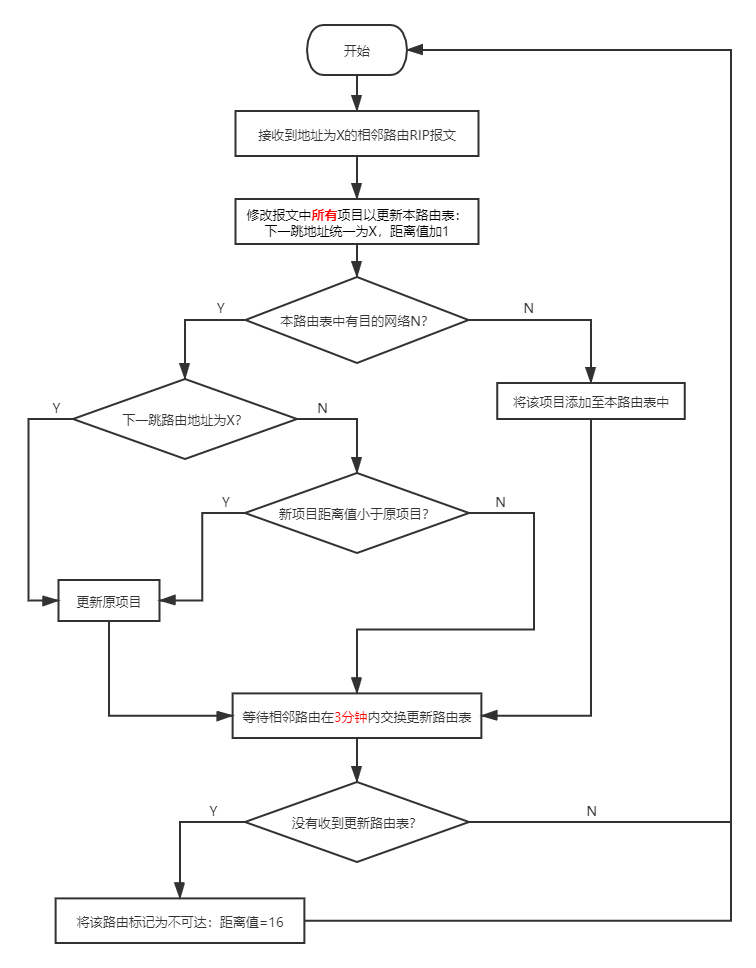
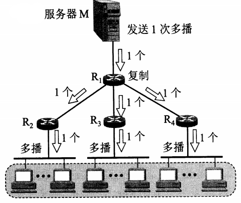
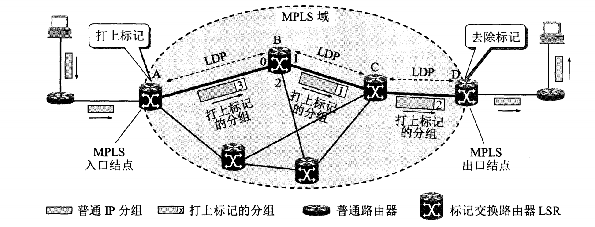

## 网络层的任务

网络层又称网际层，其任务就是向上一层（运输层）只提供**简单灵活**、**无连接的**、**尽最大努力交付的**数据报（即分组）服务。因此网际层不承诺保证服务质量，可靠通信的工作交由运输层负责。

网络层的核心是网际协议IP（Internet Protocol）——至少在2021年依然如此。自该协议出现以来，分布在世界各地性能各异的物理网络得以相互连接，形成了一个**虚拟互连网络（逻辑互连网络）**，分属于不同网络的主机如同在一个单一网络上进行通信，而各种具体的异构细节（编址方案、路由选择协议等）被屏蔽，简化了问题的描述。

IP协议至今总共出现了6个版本，而目前主要使用的是第四个版本（IPv4）和第六个版本（IPv6），后面会对这两个版本的IP协议进行更深入的了解。

在某些语境下，IP还表示一台主机的IP地址。IP地址是一种用来标识主机或路由器**接口**的标识符，具有**唯一性**，目前由ICANN进行管理和分配。当一台主机同时接入两个不同的网络（比如同时接入以太网和Wifi）时，必须同时具有两个不同网络号的IP地址。具有**相同网络号**的局域网被视为同一个网络，反之就是不同的，需要使用路由器进行互连。

与网络层紧密相关的硬件设备是路由器（Router）。路由器是工作在网络层的核心设备，负责网络互连，其作用正如转发器之于物理层，以太网交换机之于数据链路层，网关之于运输层等等。虽然路由器的作用非常重要，但是由于传输网络并不像电话那样需要线路本身提供可靠传输服务，因此路由器可以做得比较简单，价格也比较低廉，从而使得网络造价与电信网相比大大降低，而且运行方式灵活（不用建立连接即可发送分组），能适应多种应用。

如果只分析网络层收发IP数据报的话，那么一台主机发出的IP数据报，通常会在传输网络上经过若干个路由器的转发才会被目的主机接收到，这一过程被称为**间接交付**；如果IP数据报没有经过任何路由器（说明两台主机位于同一局域网内）就抵达了目的主机，则称为**直接交付**。路由器寻址的方式跟[以太网交换机](ComputerNetwork/Chapter_3_数据链路层?id=以太网交换机)有一些类似，在后面会做更为详细的介绍。

## 路由器

### 路由器的构成

路由器是一种具有多个输入端口和多个输出端口的**专用计算机**，主要任务是转发分组。其结构示意图如下。

图中的1表示物理层处理模块，2表示数据链路层处理模块，3则代表网络层处理模块。此外，图中还显示了路由器有两大构造，即路由选择部分和分组转发部分。

路由选择部分也被称为控制部分，其核心构件是路由选择处理机，主要负责根据所选定的路由选择协议构造出路由表，同时经常或定期和相邻路由器交换路由表信息以进行更新维护。

转发部分由交换结构、输入端口以及输出端口所组成，其中交换结构是核心，其主要任务是根据转发表对分组进行处理，将来自输入端口的分组从合适的输出端口转发出去。事实上，在通常情况下，各个输入端口还会持有一份转发表的副本（该副本由路由选择处理机负责更新），以实现**交换功能分散化**，避免路由器在交换过程中出现瓶颈。输入输出端口都设置有队列，来不及处理的分组会先存储在队列中等候处理，如果队列溢出就会导致分组丢失。

### 路由选择协议

路由选择协议的核心是路由选择算法，不同的应用场景对于该算法的侧重要求也会有所不同，但也无外乎正确性、简单性、自适应性、稳定性以及公平性等。互联网采用的路由选择协议主要是**自适应**的、**分布式**的以及**分层次**的路由选择协议。自适应表示算法能够根据网络通信量和网络拓扑的变化自动作出调整，以确保数据报仍能正常转发；分布式表示每台路由器都保存和采用相同的链路状态数据库和算法，以确保最短路径树的计算结果一致、快速、无环和稳定；分层次表示各个网络内部采用各自选定的路由选择协议，但是各网络之间采用统一的路由选择协议，这种策略就使得路由选择协议划分为内部和外部两大层次。

互联网可以被划分为若干个较小的**自洽系统**（autonomous system，AS），即单一技术管理下的一组路由器。每个AS对其他AS表现出的是一个单一的和一致的路由选择策略。AS内部的路由选择称为域内路由选择，AS间的路由选择就是域间路由选择。AS内部使用的路由选择协议统称为**内部网关协议**（Interior Gateway Protocol，IGP），AS间使用的路由选择协议就是**外部网关协议**（External Gateway Protocol，EGP）。

>注意，早期的RFC文档并未使用“路由器”而是“网关”这一名词，因此确切来说IGP和EGP需要改称IRP和ERP。

#### 内部网关协议RIP

路由信息协议RIP（Routing Information Protocol）是一种基于**距离向量**的分布式路由选择协议，常用于规模较小的网络。所谓距离向量，就是指一个路由器本身到其他每一个目的网络的所有距离组成的集合。在RIP中，“距离”被定义为一个路由器到目的网络之间经过的路由器数量再加1（加1的含义是直接交付），因此距离也被称为跳数，并且在默认情况下均指最小跳数，即最短距离。

RIP一条路径最多只能包含15个路由器，因此当距离达到16时就认为目的网络不可达。RIP不能在两个网络间同时使用多条路由路径，因为其基于距离向量的特性（将路由器跳数作为最主要乃至唯一的衡量指标），只会选择路由器最少的一条路径，而并不会考虑路径的综合性能如何。正是由于考虑的东西少，RIP的最大特点就是简单，但同时这也意味着它不适用于规模庞大、结构复杂的网络。

运行RIP的AS会在某个网络出现故障时，要经过**比较长的时间**才能将此信息传送到所有的路由器，也就是所谓的“坏消息传得慢”，其原因在于路由器间交换更新路由表信息的过程可能会**反复覆盖**本应尽早传递出去的“到某个网络距离为16”的故障信息，因此如果不采取一些措施阻断覆盖，最终整个AS会花上比较多的时间才能完成传递故障信息的收敛过程。

+ **工作原理**

运行有RIP的路由器在工作时，会按照固定的时间间隔，同**相邻**的路由器交换自己当前所持有的路由表信息。经过若干次的交换更新之后，最终所有路由器都会知道到达本AS中任何一个网络的最短距离和下一跳路由器的地址。在一般情况下，RIP可以在较短时间内完成收敛，即AS中所有结点都能获得正确的路由选择信息。

对于每一个从相邻路由器发送过来的RIP报文，运行RIP的路由器会按照下面的流程图执行距离向量算法：

这种算法的基础是Bellman-Ford算法或Ford-Fulkerson算法，其要点为：设X是结点A到B的最短路径上的一个结点，若把路径A➡B拆分为A➡X和X➡B两段路径，则这两段路径也分别是A到X和X到B的最短路径。

+ **RIP报文格式**

现在较新的RIP版本是1998年11月公布的RIP2，支持变长[子网掩码](#划分子网)和[CIDR](#无分类编址)，以及提供简单的鉴别过程支持多播，性能上也有所改进。RIP2报文由首部和路由两部分所组成，其中首部共4字节大小，路由部分最大不超过500字节。

| 首部字段 | 描述说明                                                                                   |
| :------: | :----------------------------------------------------------------------------------------- |
|   命令   | 指出报文的意义（如1表示请求路由信息，2表示对路由信息的响应或未被请求而发出的路由更新报文） |
|   版本   | 指示当前RIP报文所使用的版本                                                                |
| 填充字节 | 将整个首部除命令和版本以外的部分用0补齐到4个字节                                           |

|   路由部分字段   | 描述说明                                                                       |
| :--------------: | :----------------------------------------------------------------------------- |
|   地址族标识符   | 标志所使用的地址协议，例如IP地址的值为2                                        |
|     路由标记     | 自洽系统号ASN（Autonomous System Number），RIP有可能收到本AS以外的路由选择信息 |
|     网络地址     | 本路由器在当前网络中的地址                                                     |
|     子网掩码     | 当前网络的子网掩码                                                             |
| 下一跳路由器地址 |                                                                                |
|       距离       | 最大值16                                                                       |

>注意，路由部分包含**最多25条**路由信息，每条路由信息长20字节。

#### 内部网关协议OSPF

开放最短路径优先（Open Shortest Path First）是对RIP的一种改进，在RIP的基础上克服了RIP以路由器跳数为主要乃至唯一衡量指标所带来的缺陷，适用于规模较大的网络。OSPF的“开放”表现在该协议不受某一家厂商的控制，而是公开发表的；“最短路径优先”表示该协议使用的是Dijkstra提出的最短路径算法SDF（事实上所有的IGP都会寻找“最短路径”，无非是算法不同）。

+ **工作原理**

OSPF和RIP在具体的工作原理上有三个不同：

1. OSPF采用**洪泛法**向当前AS中**所有路由器**发送信息；
2. OSPF发送的是本路由项琳的所有路由器的**链路状态**；
3. OSPF只在**链路状态变化时**发送信息。

>注意，链路状态包含的信息主要有与哪些路由器相邻，该链路的费用、距离、时延和带宽等度量（metric）指标。度量指标是一个1至65535之间的无量纲数，可以由网络管理人员根据需要来确定，因此非常灵活。

由于各路由器之间频繁交换链路状态信息，因此所有的路由器最终都能够建立一个可以描述全网拓扑结构的**链路状态数据库**（link-state database），这个拓扑结构在全网范围内都是一致的，即链路状态数据库的同步，而每个路由器都可以利用这个数据库构造出自己的路由表。OSPF的链路状态数据库能较快地进行更新，从而确保每个路由器都能及时更新路由表，换言之就是收敛速度快，这就是OSPF的重要优点。

OSPF将一个AS划分为若干更小的区域（area），每个区域都有一个32位的区域标识符（跟IP地址一样用点分十进制表示），里面包含的路由器数量建议不超过200个。划分区域可以减少使用洪泛法交换链路状态信息时整个网络上的通信量，确保这些信息交换仅局限于区域内部。

OSPF采用的是层次结构的区域划分，分为主干区域（backbone area）和区域两大类。主干区域的作用是连通其他位于下层的区域，标识符规定为0.0.0.0。其内部的路由器称为**主干路由器**，其中用于概括处理其他区域来的信息的那些又叫做**区域边界路由器**，而一台专门用于本AS同其他AS交换路由信息的路由就是**自洽系统边界路由器**。

如果到同一目的网络有多条度量指标相同的路径，那么可以将通信量分配给这几条路径以实现负载平衡，这是RIP所无法做到的。

+ **OSPF报文格式**

OSPF使用的是[IP数据报](#ip数据报)进行传送，长度很短，可以减少路由信息的通信量，也避免了分片带来的不便。OSPF分组位于IP数据报的数据部分，同样由首部和数据两部分组成：

|  首部字段  | 描述说明     |
| :--------: | :----------- |
|    版本    |使用的OSPF协议版本，和RIP一样，当前版本号也是2|
|    类型    |表示该OSPF分组是哪种类型|
|  分组长度  |包括首部在内的分组长度，以字节为单位|
| 路由器标识符 |标志发送该分组的路由器接口IP地址|
| 区域标识符 |标识该分组属于哪个区域|
|   校验和   |用于检测分组中是否存在差错|
|  鉴别类型  |目前只有0（不用鉴别）和1（需要口令）两类，使用鉴别功能可以确保仅在可信赖的路由器间交换链路状态信息|
|    鉴别    |当鉴别类型为0时就填入0，为1时需要填入8个**字符**的口令|

OSPF有五种分组类型，详细说明如下：

|     类型     | 描述说明 |
| :----------: | :------------------------------------------------------------------------------------- |
|     问候     | Hello分组，用于发现和维持邻站的可达性，每10秒交换一次，40秒内未收到则标记邻站不可达|
|  数据库描述  | Database Description分组，向邻站给出自己的链路状态数据库中的所有链路状态项目的摘要信息 |
| 链路状态请求 | Link State Request分组，向对方请求发送某些链路状态项目的详细信息                       |
| 链路状态更新 | Link State Update分组，用洪泛法对全网更新链路状态，将本站链路状态通知给邻站 |
| 链路状态确认 | Link State Acknowledgment分组，对链路更新分组进行确认                                  |

可以看到，除问候分组之外，其余四种类型的分组都是用来进行链路状态数据库同步的。两个相邻且链路状态数据库一致（同步）的路由器被称为“**完全邻接**”（fully adjacent），相邻但不同步的就叫做非完全邻接。

>注意，由于网络中的链路状体可能经常发生变化，因此OSPF让每一个链路状态都带上一个32位的序号，越大表示状态越新。OSPF还规定序号增长速率不得超过5秒一次，这样在可预见的时期内都不会产生重复序号。

为了克服RIP“坏消息传得慢”的缺陷，OSPF采取可靠洪泛法，即一个路由器收到更新分组后必须向源头反馈确认分组，同时向源头以外的其他相邻路由器转发更新分组，这样就避免了故障信息被反复覆盖难以快速传递的问题，相应网络变化的时间通常可以小于100ms。对于**多点接入**的局域网，OSPF指定其中某个路由器（designated router）作为该局域网的代表，向连接到该网络上的各路由器发送所有内部链路的状态信息。

#### 外部网关协议BGP

边界网关协议（Border Gateway Protocol）于1989年公布，当前最新版本是BGP-4。BGP采用**路径向量**路由选择算法，主要用途是力求寻找一条能够到达目的网络且比较好的路径，它RIP和OSPF的“寻求最佳路径”相比有着很大的区别。采取路径向量方式的主要原因有两点，一是互联网规模太大使得不同AS之间路由选择非常困难，尤其是计算某条路径的代价；二是AS之间的路由选择不能只考虑技术方面计算出来的度量指标，还有政治、安全性等方面的考量（比如中国大陆国安部门的通信内容一般情况下不会经过美国境内的服务器），这些因素是IGP所没有考虑到的。

+ **工作原理**

在配置BGP时，AS管理员会指定至少一个路由器作为该AS的代表（即所谓的BGP speaker，通常是BGP边界路由器），同其他AS的BGP speaker采用TCP连接的方式（port = 179）建立BGP会话交换路由信息。通过TCP连接交换路由信息的两个BGP speaker，彼此称为对方的邻站（neighbor）或对等站（peer）。

>注意，BGP speaker不光运行BGP，还要运行所在AS使用的IGP。此外，BGP支持CIDR。

邻站之间交换的是**网络可达性**信息，即要到达某个网络所要经过的一系列AS。当各个BGP speaker互相交换了网络可达性信息之后，就会根据各自采用的策略从这些路由信息中找出到达各AS的**较好**路径。这些路径是都树形结构的，并且排除了包含本AS的路径，从而避免兜圈子问题的产生。

在BGP刚刚开始运行时，BGP的邻站是交换整个BGP路由表，此后只会更新有变化的部分，这样就可以节省网络带宽和减少路由器的处理开销。而当某个路由器或链路出故障时，BGP speaker可以从不止一个邻站获得路由信息，很容易选出新的路由，因此可以轻松解决“坏消息传得慢”这一问题。

+ **BGP报文格式**

BGP报文由通用首部和主体两部分组成，在发送前会被先后封装到TCP和IP数据报当中，其具体内容如下：

|通用首部字段|长度/字节|描述说明|
|:-----:|:-----:|:----------:|
|标记|16|marker，用于鉴别收到的BGP报文，不使用鉴别时置为全1|
|长度|2|指出包括通用首部在内的整个报文长度，最小值19，最大值4096|
|类型|1|指出报文类型，值为1到4|

BGP-4规定的报文类型有4种，即OPEN、UPDATE、KEEPALIVE以及NOTIFICATION。

|报文类型|作用|内容描述|
|:-----:|:----------------:|:----------:|
|OPEN|通信初始化，与邻站建立关系|报文主体由版本（1字节，当前值为4）、本自洽系统号（2字节，由ICANN分配）、保持时间（2字节，以秒计算的保持邻站关系的时间）、BGP标识符（4字节，通常就是该路由器的IP）、可选参数长度（1字节）以及可选参数等字段组成|
|UPDATE|通告某一路由信息，以及列出要撤销的多条路由|报文主体包含不可行路由长度（2字节，指明下一字段长度）、撤销的路由（列出所有要撤销的路由）、路径属性总长度（2字节，指明下一字段长度）、路径属性（定义在该报文中增加路径的属性）、网络层可达性信息NLRI（Network Layer Reachability Information，定义发出此报文的网络，如网络前缀位数和IP地址前缀等）|
|KEEPALIVE|周期性检测邻站连通性|报文主体为空，只有通用首部|
|NOTIFICATION|告知检测到的差错|报文主体由差错代码（1字节）、差错子代码（1字节）和差错数据（诊断信息）三个字段组成|

## IPv4

### IPv4地址的表示方法

IPv4的地址是一个32位的二进制标识符，为了方便阅读，通常采用**点分十进制**的方式将其表示为`XXX.XXX.XXX.XXX`的形式，每8位对应一个十进制数，比如`01111111000000000000000000000001`对应的点分十进制形式就是`127.0.0.1`。在目前的语境下，IP地址默认指IPv4形式的地址，IPv6形式的地址则称为IPv6地址，后面的内容将以此进行区分。

IP地址的编址方法有三个阶段：

1. 分类IP地址
2. 划分子网
3. 无分类编址

#### 分类IP地址

分类IP地址是最基本的编址方法，其相应的标准协议早在1981年就已经通过。分类IP地址的形式为`IP地址::={<网络号>，<主机号>}`。网络号用于标志主机或路由器所连接到的网络，在**整个互联网范围内**必须是唯一的；主机号用于标识一台主机或路由器，在**给定的局域网或广域网范围内**必须是唯一的。

“分类”的含义在于使用网络号将IP地址划分为A~E五类地址：

| 地址类别 | 网络号长度/位 | 主机号长度/位 |    网络号指派范围     | 备注                  |
| :------: | :-----------: | :-----------: | :-------------------: | :-------------------- |
|   A类    |       8       |      24       |        1 - 126        | **单播**，类别位为0   |
|   B类    |      16       |      16       |    128.1 - 192.255    | **单播**，类别位为10  |
|   C类    |      24       |       8       | 192.0.1 - 223.255.255 | **单播**，类别位为110 |
|   D类    |       -       |       -       |           -           | 多播，类别位为1110    |
|   E类    |       -       |       -       |           -           | 保留，类别位为1111    |

这种两级结构的IP地址有以下好处：

+ 网络号由IP地址管理机构分配，主机号由单位内部分配，便于管理；
+ 路由器仅根据网络号进行转发，减少路由表的存储空间和查找时间；
+ 既指明了主机，又指明了主机所连接到的网络。

一些特殊的IP地址及含义表示如下：

| 网络号 | 主机号             | 含义                         |
| :----- | :----------------- | :--------------------------- |
| 0      | 0                  | 本网络上的本主机             |
| 1      | 1                  | 只在本网络上进行广播         |
| 0      | host-id            | 在本网络上的某台主机         |
| net-id | 1                  | 对本网络上的所有主机进行广播 |
| 127    | 非全0或全1的任何数 | 只用于本地软件环回测试       |

>注意，当两个路由器直接相连时，在连线两端的接口处通常并不分配IP地址，以节省IP地址资源。

#### 划分子网

两级IP地址存在两个主要的问题：一是利用率有时候很低，二是不够灵活。

在两级IP地址的基础上，将**主机号**的若干位划为子网号，**在本单位内部**就变成了三级IP地址：`IP地址::={<网络号>，<子网号>，<主机号>}`。由于子网划分是一个单位内部的事情，并没有对原来的两级IP地址产生根本性的改变，因此这个单位内部的各个子网对外仍表现为同一个网络。该标准从1985年开始实行，现在已经成为互联网的正式标准协议，所有网络都必须使用子网掩码。

在划分子网之后，路由器利用**子网掩码**来找到目的主机所在的子网。子网掩码的格式为：`全1网络号 + 全1子网号 + 全0主机号`。将子网掩码和目的主机的IP地址逐位进行“**与**”运算，就可以得出目的主机所在的子网地址。使用子网掩码的好处在于，无论网络是否划分子网，都能够立即获得网络地址。如果一个网络没有划分子网，那么它就会使用**默认子网掩码**，A、B、C三类地址的默认子网掩码分别为`255.0.0.0`、`255.255.0.0`以及`255.255.255.0`。

使用子网时，路由器转发算法也要进行改动，加入子网掩码和目的主机的IP地址进行“与”运算的步骤。每个路由器在与相邻路由器交换信息时，都必须把自己所在网络的子网掩码告诉对方，同时在路由表中的每个项目都要记录相应的子网掩码信息。

#### 无分类编址

无分类编址CIDR的正式名称为无分类域间路由选择（Classless Inter-Domain Routing），它的出现是为了解决这些问题：一是B类地址在1992年已经消耗一半，二是互联网主干网的路由表项目数激增，三是IPv4终将耗尽。

CIDR采用的IP地址形式为：`IP地址::={<网络前缀>，<主机号>}`，乍一看又恢复到了两级IP地址，但实际上这已经是无分类的两级IP地址。CIDR的IP地址记法跟以往相比有很大不同，常用的记法有下面几种：

| 记法格式                                 | 示例                 | 说明                                   |
| :--------------------------------------- | :------------------- | :------------------------------------- |
| `IP地址/网络前缀位数`                    | 128.14.35.7/20       |                                        |
| `点分十进制省略低位连续的0/网络前缀位数` | 10.0.0.0/10 -> 10/10 |                                        |
| `网络前缀*`                              | 0000101000*          | \*之前是网络前缀，\*表示任意值的主机号 |

CIDR的主要特点如下：

1. 消除了传统的地址分类和子网划分概念，更有效地分配IPv4空间；

2. **网络前缀相同**的连续IP地址组成一个CIDR地址块，里面可以包含多个地址（通常情况下，一个$n$位的CIDR地址块可以包含$2^n$ 个C类地址）；

3. CIDR使用了和子网掩码相似的地址掩码，其形式为`全1网络前缀 + 全0主机号`；

4. CIDR划分子网的方式是**从主机号划出若干位**并入网络前缀。

由于一个CIDR地址块包含许多地址，因此在路由表中就利用CIDR地址块来查找目的网络。这种地址的聚合又被称为**路由聚合**，使路由表中的一个项目可以表示传统分类地址中的很多个路由，**减少了路由器之间的路由选择信息交换**，从而提高整个互联网的性能。

### IP数据报

#### 格式

IP数据报由首部（最长60字节）和数据两部分组成。首部又由20字节的固定部分和最长40字节的可变部分组成。事实上，可变部分很少被使用，而大多数路由器也并不会考虑这些可选的字段，因此IPv6就取消了这个部分，首部也就完全固定了。

在首部的固定部分中包含有以下字段：

| 首部字段               | 长度  | 含义                           | 说明                                                                                                                        |
| :--------------------- | :---: | :----------------------------- | :-------------------------------------------------------------------------------------------------------------------------- |
| 版本                   |   4   | IP协议版本号                   |                                                                                                                             |
| 首部长度               |   4   |                                | 可表示的最大十进制数为15，即15个32位字长，对应60字节                                                                        |
| 区分服务               |   8   | 用来获得更好的服务             | 通常情况下不使用该字段                                                                                                      |
| 总长度                 |  16   | 整个IP数据报的长度             | 单位为字节，最大长度65535，但是一般在超过576字节的时候就会被分片                                                            |
| 标识（identification） |  16   | 数据报分片标识符               | 当同一份数据报被分片时，所有分片会被打上同一标识，以便接收端可以正确组装                                                    |
| 标志（flag）           |   3   | 用于提示分片情况               | 最低位MF（More Fragment），1表示后面还有分片，0表示后面没有分片；中间位DF（Don't Fragment），0表示允许分片，1表示不允许分片 |
| 片位移                 |  13   | 某分片相对于数据字段起点的位置 | 以8个字节为偏移单位，除最后一个分片外，其他分片的长度必定是8字节的整数倍                                                    |
| 生存时间               |   8   | 数据报在网络中的寿命           | 现在表示路由器的“跳数”，每经过一个路由器该值减一，为零时即被丢弃，最大值255，设为1表示只能在本局域网内传输                  |
| 协议                   |   8   | 表示数据字段使用何种协议       | 字段值1表示ICMP，2表示IGMP，4表示IP，6表示TCP，17表示UDP，89表示OSPF等                                                      |
| 首部校验和             |  16   | 校验首部是否变化               | 用于检验数据报在转发过程中是否出错                                                                                          |
| 源地址                 |  32   | 发送该数据报的主机IP地址       |                                                                                                                             |
| 目的地址               |  32   | 接收该数据报的主机IP地址       |                                                                                                                             |

>首部校验和的计算方法为：
>
>1. 发送方将首部划分为若干个16位字长的序列，并把首部校验和字段置为0；
>2. 将所有序列用反码算数运算相加，再将和的反码写入首部校验和字段；
>3. 接收方将首部所有16位字长序列用反码算数运算相加，将得到的和取反码；
>4. 若接收方算出的反码为0，表示首部未出现差错，该数据报可以保留，否则就丢弃。

#### 分组转发流程

IP数据报是由路由器进行转发的，这一过程依赖于路由表的引导。路由器的路由表通常并不是直接指示目的主机的IP地址，而是指示“下一跳”路由器的地址。也就是说，除了最后一跳路由器以外，网络上的其他路由器只会将数据报转发到另一个路由器上（传递到另一个网络），然后逐步接近目的主机所在的网络，最后完成交付。

在采用两级分类IP的时期，路由表主要包含**目的网络地址**和**下一跳地址**等重要信息，路由器的分组转发算法如下：

在使用子网的情况下，路由表增加了**子网掩码**这条重要信息，而分组转发算法就要变成这样：

在采用CIDR之后，路由表就改为包含**网络前缀**和**下一跳地址**等重要信息，在分组转发算法上跟划分子网基本一致，但是在执行逐位相与运算的时候，采用的是“最长前缀匹配”方式，即查找路由表得到的匹配结果，应当选择**具有最长网络前缀**的路由进行转发，这样才能精确转发到特定的路由上。在路由表项目数量很大的情况下，CIDR还要配合各种压缩技术和二叉线索树来寻找最长前缀匹配，从而减少查找的时间。

### 地址解析协议ARP

与IP地址不同，MAC地址需要**地址解析协议ARP**（Address Resolution Protocol）解析IP地址来获取。建立IP到MAC的映射是非常重要的一步，它可以避免用户主机直接用MAC地址通信所带来的极其复杂的地址转换问题（不同的网络和不同的硬件会使用不同的MAC地址），极大方便了计算机用户。

每台主机都设有ARP高速缓存，用于存放和动态更新从**同一局域网下**其他主机或路由器从IP地址到MAC地址的映射表。映射表的动态更新工作由主机中的ARP进程执行，通过广播发送ARP请求分组，让目的主机接收到该请求分组之后，通过单播返回一个ARP响应分组，从而获得目的主机或路由器的IP到MAC映射。在这一过程中，目的主机或路由器也储存了源主机IP到MAC的映射。整个解析过程都是由相应软件自动执行和完成的，用户对此并没有感知。

ARP对每一个映射项目都设置有生存时间，凡超过生存时间的项目都会被删除，然后再重新执行上述请求 - 响应的流程，以完成映射表的更新。这种动态更新和自学习建立映射表的方式跟以太网交换机是非常相似的。

如果所要寻找的主机或路由器不在同一局域网内，那么就要通过路由器进行查找转发，当最后一个路由器查找到目的主机IP到MAC的映射之后，它就会将分组直接交付给目的主机。

### 网际控制报文协议ICMP

ICMP（Internet Control Message Protocol）用于主机或路由器报告差错情况和提供有关异常情况的报告。ICMP报文被装在IP数据报的数据部分，其格式如下：

ICMP报文分为两种，一种是ICMP**差错报告**报文，另一种是ICMP**询问**报文。常用的报文类型有以下几种：

| 种类     | 类型值 | 类型       | 描述                                                                                        |
| :------- | :----- | :--------- | :------------------------------------------------------------------------------------------ |
| 差错报告 | 3      | 终点不可达 | 路由器或主机不能交付数据报时向源主机发送该报文                                              |
| 差错报告 | 11     | 时间超过   | 路由器收到生存时间为0的分组，或目的主机在预定时间内未收到全部数据报分片时向源主机发送该报文 |
| 差错报告 | 12     | 参数问题   | 路由器或目的主机收到的数据报收报有字段不正确时向源主机发送该报文                            |
| 差错报告 | 5      | 重定向     | 路由器提示源主机应该将后续数据报交由其他（更好的）路由进行转发                              |
| 询问报文 | 8      | 回送请求   | 路由器或主机向一个特定主机发出的询问，测试目的主机是否可达以及了解其有关状态                |
| 询问报文 | 0      | 回送应答   | 收到此报文的主机必须给源主机或路由器发送该报文                                              |
| 询问报文 | 13     | 时间戳请求 | 路由器或主机向特定目的主机发送该报文以查询当前时间                                          |
| 询问报文 | 14     | 时间戳应答 | 接收到时间戳请求报文时返回UTC时间戳                                                         |

>注意，除重定向外，其他差错报告报文发送都表明数据报已经被丢弃。
>
>另外，以下几种情况不应发送ICMP差错报告报文：
>1. 不对ICMP差错报告报文发送
>2. 不对第一个分片的分组片及其后续所有分组片发送
>3. 不对具有多播地址的分组发送
>4. 不对具有特殊地址的分组发送

ICMP的一个典型应用就是通过PING（Packet InterNet Group，分组网间探测）来测试两台主机的连通性，比如`ping www.google.com`。另一个典型应用就是利用traceroute（Windows上是tracert）命令来跟踪一个分组从源点到终点的路径，也就是经过哪些路由的转发，比如`tracert www.google.com`。

## IPv6

随着IPv4地址在2011年耗尽、2019年11月分配完毕（但是还可以回收复用），IPv6的部署和使用已经势在必行。IPv6仍支持无连接的传送，但是将协议数据单元PDU称为分组，而非数据报。IPv6跟IPv4相比，有以下几个值得注意的重大变化：

| 变化               | 说明                                                                                                         |
| :----------------- | :----------------------------------------------------------------------------------------------------------- |
| 更大的地址空间     | IPv6地址长度达到128位，地址空间可包含$2^{128}$（大约$3.40×10^{38}$）个IPv6地址                               |
| 扩展的地址层次结构 | 128位地址长度可以划分出更多更复杂的层次                                                                      |
| 灵活的首部格式     | IPv6定义了许多可选的扩展首部，功能上多余IPv4，还可提高路由器的处理效率                                       |
| 首部长度固定       | IPv6的首部长度是固定的，选项则放到数据部分（即有效载荷）。此外，IPv6的首部长度是8字节的整数倍（即8字节对齐） |
| 自动配置           | IPv6不需要使用DHCP                                                                                           |
| 允许协议继续扩充   | IPv6的功能可以在首部进行扩充，以满足不断变化的技术发展需要                                                   |

### IPv6地址表示法

由于IPv6的地址长度为128位，如果继续使用[点分十进制](#IPv4地址的表示方法)记法的话，就会导致IPv6地址依然过长（16个十进制数以及15个点号）。而使用**冒号十六进制记法**之后，每16位转换成一个十六进制数，就变成类似于`68E6:8C64:FFFF:FFFF:0:1180:960A:FFFF`的形式。在该记法当中，允许把十六进制数前面的0省略，例如`68E6:8C64:FFFF:FFFF:0:1180:960A:FFFF`中的0原来表示的是0000。

冒号十六进制记法还允许IPv6地址进行**零压缩**，也就是把**一连串的零用一对冒号代替**，比如`FF05:0:0:0:0:0:0:B3`可以压缩成`FF05::B3`。为了不发生混乱，任一地址只能进行**一次**零压缩。对于早期分配的含有较长连续零串的IPv6地址，这种技术可以方便用户的使用。

冒号十六进制记法还可以结合点分十进制记法的**后缀**，也就是把冒号十六进制记法的**最右边两个**十六进制数转换成点分十进制，主要用于在IPv4向IPv6的转换阶段。比如一个IP地址`126.10.2.1`转化成IPv6地址，就可以记为`0:0:0:0:0:0:126.10.2.1`，使用零压缩后记为`::126.10.2.1`。

CIDR的[斜线表示法](#无分类编址)依然有效，例如IPv6地址`12AB:0000:0000:CD30:0000:0000:0000:0000`的网络前缀为`12AB00000000CD3`（对应60位二进制数），那么可以记为以下三种形式：

+ `12AB:0000:0000:CD30:0000:0000:0000:0000/60`
+ `12AB::CD30:0:0:0:0/60`
+ `12AB:0:0:CD30::/60`

IPv6地址可以分为以下几种类型：

| 地址类型         | 二进制前缀                   | 说明                                                             |
| :--------------- | :--------------------------- | :--------------------------------------------------------------- |
| 未指明地址       | ::/128                       | 不能用作目的地址，在特定主机未配置标准地址时可暂时作为源地址使用 |
| 环回地址         | ::1/128                      | 和IPv4的环回地址作用一样                                         |
| 多播地址         | FF00::/8                     | 和IPv4的多播功能一样                                             |
| 本地链路单播地址 | FE80::/10                    | 在局域网没有连接到互联网的单位中使用                             |
| 全球单播地址     | 除上述四种类型地址的所有地址 |

### IPv6分组格式

IPv6分组由**基本首部**（base header）和**有效载荷**（payload）两部分组成。前面已经提到过，IPv6的基本首部是固定长度的，如果有扩展首部就统一放到有效载荷里面，位于数据部分之前。

IPv6的首部被固定为40字节，其结构如下图所示：

各字段含义和作用如下表所示：

| 字段         | 长度 | 含义               | 描述                                                                     |
| :----------- | :--- | :----------------- | :----------------------------------------------------------------------- |
| 版本         | 4    | IP协议版本号       |                                                                          |
| 通信量类     | 8    |                    | 区分不同IPv6数据报的类别和优先级                                         |
| 流标号       | 20   |                    | 标识属于同一流的数据报                                                   |
| 有效载荷长度 | 16   |                    |                                                                          |
| 下一个首部   | 8    |                    | 标识第一个扩展首部的类型，没有扩展首部则用于指出数据报应交给TCP或UDP处理 |
| 跳数限制     | 8    | 路由器转发次数限制 |                                                                          |
| 源地址       | 128  |                    |                                                                          |
| 目的地址     | 128  |                    |                                                                          |

### 从IPv4过渡到IPv6

#### 双协议栈

双协议栈（dual stack）是指在完全过渡到IPv6之前，使一部分主机或路由器同时支持IPv4和IPv6协议。当主机或路由器通过DNS查询到目的主机使用IPv4时，源主机就跟着用IPv4，否则就跟着用IPv6。

需要注意的是，如果IPv6分组被转发到仅支持IPv4的路由器，那么后者会把分组中的基本首部转换成IPv4数据报首部，而在恢复成IPv6分组时，某些字段却并不能随之恢复，于是就会造成信息的损失。

#### 隧道技术
隧道技术（tunneling）是指在IPv6分组要进入IPv4网络时，把IPv6分组封装成IPv4数据报，当IPv4数据报离开IPv4网络时，就把数据部分提取出来交给IPv6网络继续传送。

要使双协议栈的主机知道IPv4数据报里封装有IPv6分组，就必须把IPv4首部的协议字段设置为41。

### ICMPv6

IPv6和IPv4一样也并不保证数据报的可靠交付，因此也需要ICMP来反馈一些差错信息，这就是ICMPv6。ICMPv6和以往的ICMP相比，**合并了ARP和后面要谈到的IGMP**，复杂度要高出许多。ICMPv6是面向报文的协议，它利用报文来报告差错，获取信息。探测邻站或管理多播通信（因此ICMPv6报文主要分为差错报文、信息报文、邻站发现报文以及组成员关系报文四大类）。

>注意，邻站发现（Neighbor-Discovery）报文运行在ND协议上，而多播听众交付（Multicast Listener Delivery，也就是组成员关系报文）报文运行在MLD协议上。但是它们都具有相同的ICMPv6报文格式，因此实际上还是会交给ICMPv6进行处理。

## IP多播

IP多播（multicast）是一种一对多通信形式的互联网服务，最早在1992年实现。IP多播与单播相比可大大节约网络资源，因为IP多播分组只需发送一次，而非向多个目的主机发送完全相同的多个分组，因此路由器在转发分组时只需要视情况复制出一定数量的副本以供其他路由器进行转发，最终分组进入局域网后通过硬件多播，就能使多播组成员都能收到该分组，过程示意图如下：

IP多播分组的目的地址并不使用主机的IP地址，而是**多播组**的地址（IPv4的[D类地址](#分类ip地址)），作为多播组的标识符，而且多播地址只能用于目的地址，不能用于源地址。IP多播分组和单播分组一样也是尽最大努力交付，并不保证一定能够交付多播组内所有成员。

### 局域网硬件多播

硬件多播依赖于[MAC地址](/ComputerNetwork/Chapter_3_数据链路层?id=mac地址)，MAC多播地址只有最低23位可用，与之对应的就是D类地址的后23位，这种映射关系就导致多播IP与MAC地址并非严格一一对应，因此收到多播分组的主机还要再IP层用软件进行过滤，把不是本主机要接收的分组丢弃掉。

### 互联网多播与网际组管理协议IGMP

IGMP（Internet Group Management Protocol）是互联网上实现IP多播的两大重要协议之一，其主要作用是让连接在本地局域网上的多播路由器，知道本局域网上是否有主机参加或退出某个多播组。

和ICMP类似，IGMP也是利用IP数据报传递其报文。当一台主机加入某个多播组时，需要向该多播组的多播地址发送IGMP报文，以声明自己要成为该组的成员。本地的多播路由器收到IGMP报文后，利用多播路由选择协议把组成员关系转发到互联网上的其他多播路由器。本地多播路由器会周期性探询本地局域网上的主机是否仍为该多播组的成员，只要有主机对某个组响应，就认为该组是活跃的；若某个组在若干次探询后没有主机响应，本地多播路由器就认为本网络上的所有主机都已离开该组，于是不再转发这个组的成员关系。

IGMP为避免多播控制信息给网络增加大量开销，采取了以下具体措施：

1. 只有参加IP多播的主机才会收到IGMP报文，且只要有可能，携带IGMP报文的数据报都通过硬件多播来传送；
2. 多播路由器只需要对所有组发送一个请求信息的询问报文来探询组成员关系，默认探询周期为每125秒一次；
3. 同一网络上连接多个多播路由器时，只会迅速而有效地选择其中一个来探询主机成员关系；
4. 同一多播组内所有主机都要监听响应，只要有一台主机率先发送响应，其他主机都不需要再发送响应；
5. 同时参加多个组的主机收到询问时，会根据询问报文中的最长响应时间N，对每个组选择一个从0到N的随机数做为发送时延，并优先发送时延最小的响应；
6. 若一台主机上的多个进程都加入某个多播组，则主机只会接收一个发给该组的多播数据报副本，然后再在本地复制若干副本供相应的进程使用。

### 多播路由选择协议

#### 基本技术方法

和IP多播协议不同，多播路由选择协议至今尚未标准化，因此在实际场景中有多种协议存在和被使用。多播路由选择本质上就是要找出以源主机为根节点的**多播转发树**，并确保树上的每个路由器都不会收到重复的多播数据报（不兜圈子）。同一个多播组对于不同的源点也会有不同的多播转发树。

多播路由选择协议在转发多播数据报时使用以下三种方法：

+ **洪泛与剪除**

适用于规模较小的多播组，且所有组成员接入的局域网也是邻接的。路由器转发多播数据报时先采用洪泛法进行广播，然后采取反向路径广播RPB（Reverse Path Broadcasting）策略以避免数据报兜圈子。RPB的要点为：每个路由器在收到一个多播数据报时，先检查其是否从源点经**最短路径**传来，若是则向除进入以外的其他方向转发数据报，否则就丢弃。如果本路由器同时连接若干条同样长度的最短路径，则以相邻路由器中IP最小者为唯一选择。当多播转发树上的某个路由发下它的下游数值已经没有该多播组成员时，就应把它和下游的树枝一起剪除；反之有树枝新增组成员时可以再接入树上。经过上述步骤，就能构建出没有环路的树形拓扑。

>注意，要进行上述检查，只需确定从本路由器到源点（这就是反向的含义）的最短路径上遇到的第一个路由器是不是刚才转发多播数据报的路由器即可。

+ **隧道技术**

适用于**多播组的位置在地理上很分散**，且多播数据报不得不经过某些不支持的多播的网络的情况。在多播数据报进入不支持多播的网络之前，转发路由器会将该数据报封装成普通的单播数据报，然后就可以通过不支持多播的网络（这个网络就充当了隧道的作用）转发到目的网络的接收路由器上，最后由接收路由器脱壳恢复成多播数据报。整个过程跟IPv4数据报转IPv6分组有相似之处。

+ **基于核心的发现技术**

适用于多播组大小会**发生较大范围波动**的场景，比如线上直播开始和结束。这种技术所采取的方式为：对每一个多播组G指定一个**核心路由器**（core），并给出其IP单播地址。核心路由器创建出对应于多播组G的转发树。任一由其他路由器向核心发送的数据报，都会在途中接受每个途径路由器的检查。

例如，路由器A发出了一个目的地址为G组地址的多播数据报，在进入G时接受组内路由器B的检查，B就会向组内成员转发该数据报；如果A发的是加入G的数据报，那么B就会将该信息加进路由表，并用隧道技术向A转发每一个多播数据报的副本，从而实现多播转发树范围的扩大。

#### 常用建议协议

|协议名|缩写|描述说明|
|:----------:|:----------:|:----------:|
|距离向量多播路由选择协议|DVMRP|Distance Vector Multicast Routing Protocol是互联网上使用的第一个多播路由选择协议，在UNIX中实现该协议的程序为mrouted|
|基于核心的转发树|CBT|Core Based Tree使用核心路由器作为转发树的根节点，这个核心路由器跟前文所述的有所差异，是指一个AS划分为若干area时每个area选定的中心/汇聚点路由器|
|OSPF多播扩展|MOSPF|Muticast extensions of OSPF是对单播的[OSPF](#内部网关协议ospf)的扩充，适用于一个机构内，采用的是多播链路状态路由选择基于源点的多播转发树|
|协议无关多播|PIM|Protocol Independent Muticast和CBT采取同样方法构建多播转发树，但并不要求使用特定的单播路由协议来跟远程路由器进行联系。若组成员分布非常分散，则使用稀疏方式（PIM-SM，SM = Sparse Mode），反之就采用密集方式（PIM-DM，DM = Dense Mode），直接洪泛转发而不经过核心路由器|

## VPN与NAT

在正式介绍VPN和NAT之前，需要了解一个重要的概念：专用网。所谓专用网，是指在一个网络内部，所有主机使用的IP地址都是RFC 1918规定的专用地址，即：

1. 10.0.0.0到10.255.255.255（或记为10.0.0.0/8）
2. 172.16.0.0到172.31.255.255（或记为172.16.0.0/12）
3. 182.168.0.0到192.168.255.255（或记为192.168.0.0/16）

在实际场景中，一个单位内部所使用的局域网，几乎就可以等同于上面所描述的专用网。专用IP地址也称作**可重用**地址，比如同样是192.168.1.3这个IP，公司里使用该地址和在家里使用该地址在通常情况下并不会引起冲突。

### 虚拟专用网络VPN

专用网的目的在于为本机构的主机提供内部通信方式，如果专用网不同网点间（比如同一公司分布在不同地区的各个部门）要进行通信，通常可以采用虚拟专用网络（Virtual Private Network）技术。VPN的主要作用是让专用网不同网点之间通过公用互联网进行通信，且通信数据得到保密。

>注意，在日常语境中，VPN不仅表示一种网络技术，同时也代表使用这类技术的一系列计算机软件。

一个机构要构建自己的VPN，必须为每个网点配置专门的软硬件，尤其是具有合法全球IP地址的路由器（例如各国的国际流量出入口）。各网点的出口路由在转发专网内部IP数据报到互联网之前，会先将该数据报进行加密，然后加上包含目的主机所在网点入口路由IP的首部，组成外部数据报；公用互联网在网点之间充当隧道，连接各网点的出入口，并传递网点间发出的外部数据报；外部数据报进入另一个网点时会被该网点的入口路由解密恢复成内部数据报，之后再转发给目的主机。

同一机构内不同网点的VPN组成内联网VPN（intranet VPN），如果有外部机构参与则组成外联网VPN(extranet VPN)，它们都基于TCP/IP协议。还有一种是在个人电脑上通过VPN软件接入某个机构，同该机构内部的主机进行通信，这种被称为远程接入VPN（remote access VPN），各类公司、学校的内网VPN就是这种。

### 网络地址转换NAT

网络地址转换（Network Address Translation）的主要用途是将某台主机在专用网中的IP地址，同安装有NAT软件的路由器中某个全球IP地址建立起映射关系，这样就能使位于专用网内的主机接入互联网发起通信。NAT路由器在转发IP数据报时会将源地址或目的地址按照转换表中对应的映射关系进行替换，这是它与普通路由器的主要区别之一。值得注意的是，率先主动发起通信的一方必然是专网内的某台主机，而不能是互联网上的主机，否则NAT路由器在没有建立起转换映射的情况下就接收到IP数据报，自然不知道要把数据报交给哪台目的主机，同时这也意味着专网内部主机不能充当服务器使用。

为了更有效地利用NAT路由器上的全球IP地址，现在常用的转换表把运输层的端口号也用上了，这样就可以使得多台专网内部主机可以共享同一个NAT路由器上的全球IP地址，这种利用端口号的地址转换技术被称为NAPT（Network Address and Port Transaltion），但在实际使用中并不特意与传统的NAT进行区分，而是统称为NAT。

## 多协议标记交换MPLS

MPLS（MultiProtocol Label Switching）是一种**面向连接**，在上层可采用多种协议的新型互联网协议，与2001年1月成为互联网建议标准。MPLS具有以下三方面的特点：

1. 支持面向连接的服务质量；
2. 支持流量工程，平衡网络负载；
3. 有效支持VPN。

MPLS有几个重要的概念。第一个是转发等价类FEC（Forwarding Equivalence Class），它表示路由器**按照同样方式对待**的IP数据报的**集合**。所谓按照同样方式对待，是指从同样接口转发到同样的下一跳地址，并且具有同样的服务类别和同样丢弃优先级等。

第二个是流量工程（Traffic Engineering，TE），或称通信量工程，是指对网络上的通信量进行测量、建模和控制，使网络运行性能得到最优化。FEC的其中一个作用是用于网络负载均衡，避免所有流量都经过同一条路径造成过载，这就是流量工程的一个典型实例。

>注意，MPLS没有取代IP，相反是作为一种IP增强技术被广泛运用在互联网中。

### 基本工作原理

MPLS会在MPLS域的入口处给每个分组打上一个长度固定的被叫做**标记**（label）的小整数，当分组到达标记交换路由器（Label Switching Router，LSR）时，该标记会被读取并用于检索分组转发表（工作在数据链路层），通过硬件进行转发，在速度上比检索路由表快得多。

>所谓MPLS域（MPLS domain），是指该域中有许多彼此相邻的LSR。

MPLS的基本工作流程如下图所示：

图中的LDP是标记分配协议（Label Distribution Protocol），而与特定标记相对应的路径就是标记交换路径LSP（Label Switched Path）。各LSR根据LSP构造出转发表，过程与路由表类似。

### MPLS格式