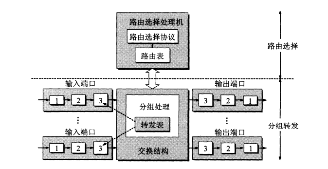
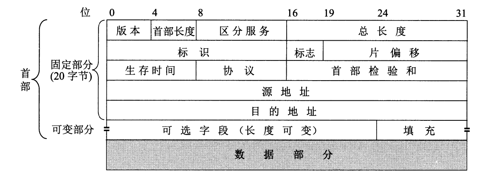
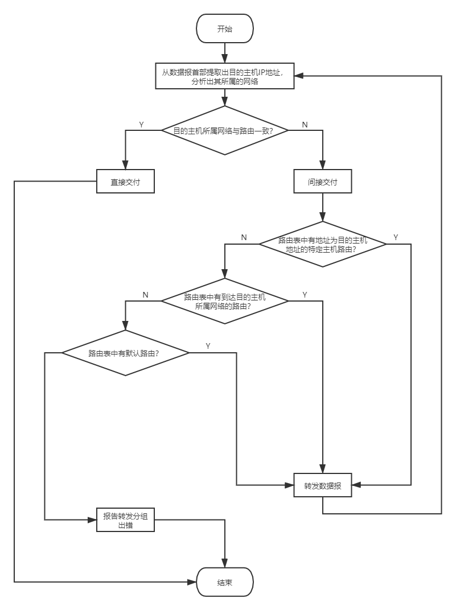
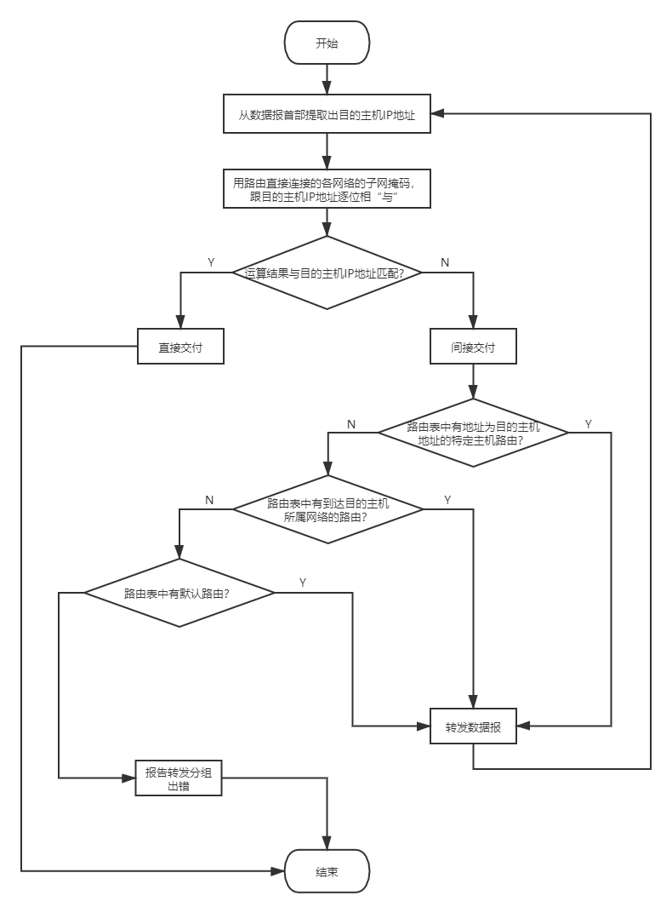
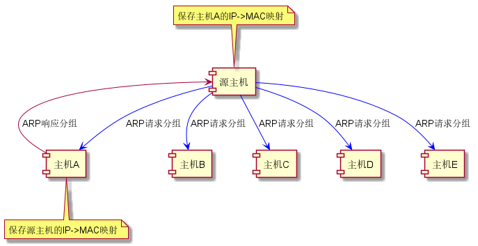
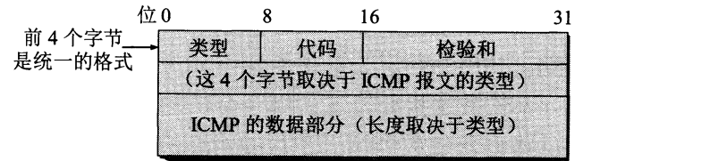
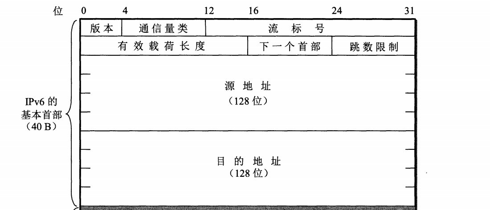

## 网络层的任务

网络层又称网际层，其任务就是向上一层（运输层）只提供**简单灵活**、**无连接的**、**尽最大努力交付的**数据报（即分组）服务。因此网际层不承诺保证服务质量，可靠通信的工作交由运输层负责。

网络层的核心是网际协议IP（Internet Protocol）——至少在2021年依然如此。自该协议出现以来，分布在世界各地性能各异的物理网络得以相互连接，形成了一个**虚拟互连网络（逻辑互连网络）**，分属于不同网络的主机如同在一个单一网络上进行通信，而各种具体的异构细节（编址方案、路由选择协议等）被屏蔽，简化了问题的描述。

IP协议至今总共出现了6个版本，而目前主要使用的是第四个版本（IPv4）和第六个版本（IPv6），后面会对这两个版本的IP协议进行更深入的了解。

在某些语境下，IP还表示一台主机的IP地址。IP地址是一种用来标识主机或路由器**接口**的标识符，具有**唯一性**，目前由ICANN进行管理和分配。当一台主机同时接入两个不同的网络（比如同时接入以太网和Wifi）时，必须同时具有两个不同网络号的IP地址。具有**相同网络号**的局域网被视为同一个网络，反之就是不同的，需要使用路由器进行互连。

与网络层紧密相关的硬件设备是路由器（Router）。路由器是工作在网络层的核心设备，负责网络互连，其作用正如转发器之于物理层，以太网交换机之于数据链路层，网关之于运输层等等。虽然路由器的作用非常重要，但是由于传输网络并不像电话那样需要线路本身提供可靠传输服务，因此路由器可以做得比较简单，价格也比较低廉，从而使得网络造价与电信网相比大大降低，而且运行方式灵活（不用建立连接即可发送分组），能适应多种应用。

如果只分析网络层收发IP数据报的话，那么一台主机发出的IP数据报，通常会在传输网络上经过若干个路由器的转发才会被目的主机接收到，这一过程被称为**间接交付**；如果IP数据报没有经过任何路由器（说明两台主机位于同一局域网内）就抵达了目的主机，则称为**直接交付**。路由器寻址的方式跟[以太网交换机](ComputerNetwork/Chapter_3_数据链路层?id=以太网交换机)有一些类似，在后面会做更为详细的介绍。

## 路由器

### 路由器的构成

路由器是一种具有多个输入端口和多个输出端口的**专用计算机**，主要任务是转发分组。其结构示意图如下。

图中的1表示物理层处理模块，2表示数据链路层处理模块，3则代表网络层处理模块。此外，图中还显示了路由器有两大构造，即路由选择部分和分组转发部分。

路由选择部分也被称为控制部分，其核心构件是路由选择处理机，主要负责根据所选定的路由选择协议构造出路由表，同时经常或定期和相邻路由器交换路由表信息以进行更新维护。

转发部分由交换结构、输入端口以及输出端口所组成，其中交换结构是核心，其主要任务是根据转发表对分组进行处理，将来自输入端口的分组从合适的输出端口转发出去。事实上，在通常情况下，各个输入端口还会持有一份转发表的副本（该副本由路由选择处理机负责更新），以实现**交换功能分散化**，避免路由器在交换过程中出现瓶颈。输入输出端口都设置有队列，来不及处理的分组会先存储在队列中等候处理，如果队列溢出就会导致分组丢失。

### 路由选择协议

#### 内部网关协议RIP

#### 内部网关协议OSPF

#### 外部网关协议BGP

## IPv4

### IPv4地址的表示方法

IPv4的地址是一个32位的二进制标识符，为了方便阅读，通常采用**点分十进制**的方式将其表示为`XXX.XXX.XXX.XXX`的形式，每8位对应一个十进制数，比如`01111111000000000000000000000001`对应的点分十进制形式就是`127.0.0.1`。在目前的语境下，IP地址默认指IPv4形式的地址，IPv6形式的地址则称为IPv6地址，后面的内容将以此进行区分。

IP地址的编址方法有三个阶段：

1. 分类IP地址
2. 划分子网
3. 无分类编址

#### 分类IP地址

分类IP地址是最基本的编址方法，其相应的标准协议早在1981年就已经通过。分类IP地址的形式为`IP地址::={<网络号>，<主机号>}`。网络号用于标志主机或路由器所连接到的网络，在**整个互联网范围内**必须是唯一的；主机号用于标识一台主机或路由器，在**给定的局域网或广域网范围内**必须是唯一的。

“分类”的含义在于使用网络号将IP地址划分为A~E五类地址：

| 地址类别 | 网络号长度/位 | 主机号长度/位 |    网络号指派范围     | 备注                  |
| :------: | :-----------: | :-----------: | :-------------------: | :-------------------- |
|   A类    |       8       |      24       |        1 - 126        | **单播**，类别位为0   |
|   B类    |      16       |      16       |    128.1 - 192.255    | **单播**，类别位为10  |
|   C类    |      24       |       8       | 192.0.1 - 223.255.255 | **单播**，类别位为110 |
|   D类    |       -       |       -       |           -           | 多播，类别位为1110    |
|   E类    |       -       |       -       |           -           | 保留，类别位为1111    |

这种两级结构的IP地址有以下好处：

+ 网络号由IP地址管理机构分配，主机号由单位内部分配，便于管理；
+ 路由器仅根据网络号进行转发，减少路由表的存储空间和查找时间；
+ 既指明了主机，又指明了主机所连接到的网络。

一些特殊的IP地址及含义表示如下：

| 网络号 | 主机号             | 含义                         |
| :----- | :----------------- | :--------------------------- |
| 0      | 0                  | 本网络上的本主机             |
| 1      | 1                  | 只在本网络上进行广播         |
| 0      | host-id            | 在本网络上的某台主机         |
| net-id | 1                  | 对本网络上的所有主机进行广播 |
| 127    | 非全0或全1的任何数 | 只用于本地软件环回测试       |

>注意，当两个路由器直接相连时，在连线两端的接口处通常并不分配IP地址，以节省IP地址资源。

#### 划分子网

两级IP地址存在两个主要的问题：一是利用率有时候很低，二是不够灵活。

在两级IP地址的基础上，将**主机号**的若干位划为子网号，**在本单位内部**就变成了三级IP地址：`IP地址::={<网络号>，<子网号>，<主机号>}`。由于子网划分是一个单位内部的事情，并没有对原来的两级IP地址产生根本性的改变，因此这个单位内部的各个子网对外仍表现为同一个网络。该标准从1985年开始实行，现在已经成为互联网的正式标准协议，所有网络都必须使用子网掩码。

在划分子网之后，路由器利用**子网掩码**来找到目的主机所在的子网。子网掩码的格式为：`全1网络号 + 全1子网号 + 全0主机号`。将子网掩码和目的主机的IP地址逐位进行“**与**”运算，就可以得出目的主机所在的子网地址。使用子网掩码的好处在于，无论网络是否划分子网，都能够立即获得网络地址。如果一个网络没有划分子网，那么它就会使用**默认子网掩码**，A、B、C三类地址的默认子网掩码分别为`255.0.0.0`、`255.255.0.0`以及`255.255.255.0`。

使用子网时，路由器转发算法也要进行改动，加入子网掩码和目的主机的IP地址进行“与”运算的步骤。每个路由器在与相邻路由器交换信息时，都必须把自己所在网络的子网掩码告诉对方，同时在路由表中的每个项目都要记录相应的子网掩码信息。

#### 无分类编址

无分类编址CIDR的正式名称为无分类域间路由选择（Classless Inter-Domain Routing），它的出现是为了解决这些问题：一是B类地址在1992年已经消耗一半，二是互联网主干网的路由表项目数激增，三是IPv4终将耗尽。

CIDR采用的IP地址形式为：`IP地址::={<网络前缀>，<主机号>}`，乍一看又恢复到了两级IP地址，但实际上这已经是无分类的两级IP地址。CIDR的IP地址记法跟以往相比有很大不同，常用的记法有下面几种：

| 记法格式                                 | 示例                 | 说明                                   |
| :--------------------------------------- | :------------------- | :------------------------------------- |
| `IP地址/网络前缀位数`                    | 128.14.35.7/20       |                                        |
| `点分十进制省略低位连续的0/网络前缀位数` | 10.0.0.0/10 -> 10/10 |                                        |
| `网络前缀*`                              | 0000101000*          | \*之前是网络前缀，\*表示任意值的主机号 |

CIDR的主要特点如下：

1. 消除了传统的地址分类和子网划分概念，更有效地分配IPv4空间；

2. **网络前缀相同**的连续IP地址组成一个CIDR地址块，里面可以包含多个地址（通常情况下，一个$n$位的CIDR地址块可以包含$2^n$ 个C类地址）；

3. CIDR使用了和子网掩码相似的地址掩码，其形式为`全1网络前缀 + 全0主机号`；

4. CIDR划分子网的方式是**从主机号划出若干位**并入网络前缀。

由于一个CIDR地址块包含许多地址，因此在路由表中就利用CIDR地址块来查找目的网络。这种地址的聚合又被称为**路由聚合**，使路由表中的一个项目可以表示传统分类地址中的很多个路由，**减少了路由器之间的路由选择信息交换**，从而提高整个互联网的性能。

### IP数据报

#### 格式

IP数据报由首部（最长60字节）和数据两部分组成。首部又由20字节的固定部分和最长40字节的可变部分组成。事实上，可变部分很少被使用，而大多数路由器也并不会考虑这些可选的字段，因此IPv6就取消了这个部分，首部也就完全固定了。

在首部的固定部分中包含有以下字段：

| 首部字段               | 长度  | 含义                           | 说明                                                                                                                        |
| :--------------------- | :---: | :----------------------------- | :-------------------------------------------------------------------------------------------------------------------------- |
| 版本                   |   4   | IP协议版本号                   |                                                                                                                             |
| 首部长度               |   4   |                                | 可表示的最大十进制数为15，即15个32位字长，对应60字节                                                                        |
| 区分服务               |   8   | 用来获得更好的服务             | 通常情况下不使用该字段                                                                                                      |
| 总长度                 |  16   | 整个IP数据报的长度             | 单位为字节，最大长度65535，但是一般在超过576字节的时候就会被分片                                                            |
| 标识（identification） |  16   | 数据报分片标识符               | 当同一份数据报被分片时，所有分片会被打上同一标识，以便接收端可以正确组装                                                    |
| 标志（flag）           |   3   | 用于提示分片情况               | 最低位MF（More Fragment），1表示后面还有分片，0表示后面没有分片；中间位DF（Don't Fragment），0表示允许分片，1表示不允许分片 |
| 片位移                 |  13   | 某分片相对于数据字段起点的位置 | 以8个字节为偏移单位，除最后一个分片外，其他分片的长度必定是8字节的整数倍                                                    |
| 生存时间               |   8   | 数据报在网络中的寿命           | 现在表示路由器的“跳数”，每经过一个路由器该值减一，为零时即被丢弃，最大值255，设为1表示只能在本局域网内传输                  |
| 协议                   |   8   | 表示数据字段使用何种协议       | 字段值1表示ICMP，2表示IGMP，4表示IP，6表示TCP，17表示UDP等                                                                  |
| 首部校验和             |  16   | 校验首部是否变化               | 用于检验数据报在转发过程中是否出错                                                                                          |
| 源地址                 |  32   | 发送该数据报的主机IP地址       |                                                                                                                             |
| 目的地址               |  32   | 接收该数据报的主机IP地址       |                                                                                                                             |

>首部校验和的计算方法为：
>
>1. 发送方将首部划分为若干个16位字长的序列，并把首部校验和字段置为0；
>2. 将所有序列用反码算数运算相加，再将和的反码写入首部校验和字段；
>3. 接收方将首部所有16位字长序列用反码算数运算相加，将得到的和取反码；
>4. 若接收方算出的反码为0，表示首部未出现差错，该数据报可以保留，否则就丢弃。

#### 分组转发流程

IP数据报是由路由器进行转发的，这一过程依赖于路由表的引导。路由器的路由表通常并不是直接指示目的主机的IP地址，而是指示“下一跳”路由器的地址。也就是说，除了最后一跳路由器以外，网络上的其他路由器只会将数据报转发到另一个路由器上（传递到另一个网络），然后逐步接近目的主机所在的网络，最后完成交付。

在采用两级分类IP的时期，路由表主要包含**目的网络地址**和**下一跳地址**等重要信息，路由器的分组转发算法如下：

在使用子网的情况下，路由表增加了**子网掩码**这条重要信息，而分组转发算法就要变成这样：

在采用CIDR之后，路由表就改为包含**网络前缀**和**下一跳地址**等重要信息，在分组转发算法上跟划分子网基本一致，但是在执行逐位相与运算的时候，采用的是“最长前缀匹配”方式，即查找路由表得到的匹配结果，应当选择**具有最长网络前缀**的路由进行转发，这样才能精确转发到特定的路由上。在路由表项目数量很大的情况下，CIDR还要配合各种压缩技术和二叉线索树来寻找最长前缀匹配，从而减少查找的时间。

### 地址解析协议ARP

与IP地址不同，MAC地址需要**地址解析协议ARP**（Address Resolution Protocol）解析IP地址来获取。建立IP到MAC的映射是非常重要的一步，它可以避免用户主机直接用MAC地址通信所带来的极其复杂的地址转换问题（不同的网络和不同的硬件会使用不同的MAC地址），极大方便了计算机用户。

每台主机都设有ARP高速缓存，用于存放和动态更新从**同一局域网下**其他主机或路由器从IP地址到MAC地址的映射表。映射表的动态更新工作由主机中的ARP进程执行，通过广播发送ARP请求分组，让目的主机接收到该请求分组之后，通过单播返回一个ARP响应分组，从而获得目的主机或路由器的IP到MAC映射。在这一过程中，目的主机或路由器也储存了源主机IP到MAC的映射。整个解析过程都是由相应软件自动执行和完成的，用户对此并没有感知。

ARP对每一个映射项目都设置有生存时间，凡超过生存时间的项目都会被删除，然后再重新执行上述请求 - 响应的流程，以完成映射表的更新。这种动态更新和自学习建立映射表的方式跟以太网交换机是非常相似的。

如果所要寻找的主机或路由器不在同一局域网内，那么就要通过路由器进行查找转发，当最后一个路由器查找到目的主机IP到MAC的映射之后，它就会将分组直接交付给目的主机。

### 网际控制报文协议ICMP

ICMP（Internet Control Message Protocol）用于主机或路由器报告差错情况和提供有关异常情况的报告。ICMP报文被装在IP数据报的数据部分，其格式如下：

ICMP报文分为两种，一种是ICMP**差错报告**报文，另一种是ICMP**询问**报文。常用的报文类型有以下几种：

| 种类     | 类型值 | 类型       | 描述                                                                                        |
| :------- | :----- | :--------- | :------------------------------------------------------------------------------------------ |
| 差错报告 | 3      | 终点不可达 | 路由器或主机不能交付数据报时向源主机发送该报文                                              |
| 差错报告 | 11     | 时间超过   | 路由器收到生存时间为0的分组，或目的主机在预定时间内未收到全部数据报分片时向源主机发送该报文 |
| 差错报告 | 12     | 参数问题   | 路由器或目的主机收到的数据报收报有字段不正确时向源主机发送该报文                            |
| 差错报告 | 5      | 重定向     | 路由器提示源主机应该将后续数据报交由其他（更好的）路由进行转发                              |
| 询问报文 | 8      | 回送请求   | 路由器或主机向一个特定主机发出的询问，测试目的主机是否可达以及了解其有关状态                |
| 询问报文 | 0      | 回送应答   | 收到此报文的主机必须给源主机或路由器发送该报文                                              |
| 询问报文 | 13     | 时间戳请求 | 路由器或主机向特定目的主机发送该报文以查询当前时间                                          |
| 询问报文 | 14     | 时间戳应答 | 接收到时间戳请求报文时返回UTC时间戳                                                         |

>注意，除重定向外，其他差错报告报文发送都表明数据报已经被丢弃。
>
>另外，以下几种情况不应发送ICMP差错报告报文：
>1. 不对ICMP差错报告报文发送
>2. 不对第一个分片的分组片及其后续所有分组片发送
>3. 不对具有多播地址的分组发送
>4. 不对具有特殊地址的分组发送

ICMP的一个典型应用就是通过PING（Packet InterNet Group，分组网间探测）来测试两台主机的连通性，比如`ping www.google.com`。另一个典型应用就是利用traceroute（Windows上是tracert）命令来跟踪一个分组从源点到终点的路径，也就是经过哪些路由的转发，比如`tracert www.google.com`。

## IPv6

随着IPv4地址在2011年耗尽、2019年11月分配完毕（但是还可以回收复用），IPv6的部署和使用已经势在必行。IPv6仍支持无连接的传送，但是将协议数据单元PDU称为分组，而非数据报。IPv6跟IPv4相比，有以下几个值得注意的重大变化：

| 变化               | 说明                                                                                                         |
| :----------------- | :----------------------------------------------------------------------------------------------------------- |
| 更大的地址空间     | IPv6地址长度达到128位，地址空间可包含$2^{128}$（大约$3.40×10^{38}$）个IPv6地址                               |
| 扩展的地址层次结构 | 128位地址长度可以划分出更多更复杂的层次                                                                      |
| 灵活的首部格式     | IPv6定义了许多可选的扩展首部，功能上多余IPv4，还可提高路由器的处理效率                                       |
| 首部长度固定       | IPv6的首部长度是固定的，选项则放到数据部分（即有效载荷）。此外，IPv6的首部长度是8字节的整数倍（即8字节对齐） |
| 自动配置           | IPv6不需要使用DHCP                                                                                           |
| 允许协议继续扩充   | IPv6的功能可以在首部进行扩充，以满足不断变化的技术发展需要                                                   |

### IPv6地址表示法

由于IPv6的地址长度为128位，如果继续使用[点分十进制](#IPv4地址的表示方法)记法的话，就会导致IPv6地址依然过长（16个十进制数以及15个点号）。而使用**冒号十六进制记法**之后，每16位转换成一个十六进制数，就变成类似于`68E6:8C64:FFFF:FFFF:0:1180:960A:FFFF`的形式。在该记法当中，允许把十六进制数前面的0省略，例如`68E6:8C64:FFFF:FFFF:0:1180:960A:FFFF`中的0原来表示的是0000。

冒号十六进制记法还允许IPv6地址进行**零压缩**，也就是把**一连串的零用一对冒号代替**，比如`FF05:0:0:0:0:0:0:B3`可以压缩成`FF05::B3`。为了不发生混乱，任一地址只能进行**一次**零压缩。对于早期分配的含有较长连续零串的IPv6地址，这种技术可以方便用户的使用。

冒号十六进制记法还可以结合点分十进制记法的**后缀**，也就是把冒号十六进制记法的**最右边两个**十六进制数转换成点分十进制，主要用于在IPv4向IPv6的转换阶段。比如一个IP地址`126.10.2.1`转化成IPv6地址，就可以记为`0:0:0:0:0:0:126.10.2.1`，使用零压缩后记为`::126.10.2.1`。

CIDR的[斜线表示法](#无分类编址)依然有效，例如IPv6地址`12AB:0000:0000:CD30:0000:0000:0000:0000`的网络前缀为`12AB00000000CD3`（对应60位二进制数），那么可以记为以下三种形式：

+ `12AB:0000:0000:CD30:0000:0000:0000:0000/60`
+ `12AB::CD30:0:0:0:0/60`
+ `12AB:0:0:CD30::/60`

IPv6地址可以分为以下几种类型：

| 地址类型         | 二进制前缀                   | 说明                                                             |
| :--------------- | :--------------------------- | :--------------------------------------------------------------- |
| 未指明地址       | ::/128                       | 不能用作目的地址，在特定主机未配置标准地址时可暂时作为源地址使用 |
| 环回地址         | ::1/128                      | 和IPv4的环回地址作用一样                                         |
| 多播地址         | FF00::/8                     | 和IPv4的多播功能一样                                             |
| 本地链路单播地址 | FE80::/10                    | 在局域网没有连接到互联网的单位中使用                             |
| 全球单播地址     | 除上述四种类型地址的所有地址 |

### IPv6分组格式

IPv6分组由**基本首部**（base header）和**有效载荷**（payload）两部分组成。前面已经提到过，IPv6的基本首部是固定长度的，如果有扩展首部就统一放到有效载荷里面，位于数据部分之前。

IPv6的首部被固定为40字节，其结构如下图所示：

各字段含义和作用如下表所示：

| 字段         | 长度 | 含义               | 描述                                                                     |
| :----------- | :--- | :----------------- | :----------------------------------------------------------------------- |
| 版本         | 4    | IP协议版本号       |                                                                          |
| 通信量类     | 8    |                    | 区分不同IPv6数据报的类别和优先级                                         |
| 流标号       | 20   |                    | 标识属于同一流的数据报                                                   |
| 有效载荷长度 | 16   |                    |                                                                          |
| 下一个首部   | 8    |                    | 标识第一个扩展首部的类型，没有扩展首部则用于指出数据报应交给TCP或UDP处理 |
| 跳数限制     | 8    | 路由器转发次数限制 |                                                                          |
| 源地址       | 128  |                    |                                                                          |
| 目的地址     | 128  |                    |                                                                          |

### 从IPv4过渡到IPv6

#### 双协议栈

双协议栈（dual stack）是指在完全过渡到IPv6之前，使一部分主机或路由器同时支持IPv4和IPv6协议。当主机或路由器通过DNS查询到目的主机使用IPv4时，源主机就跟着用IPv4，否则就跟着用IPv6。

需要注意的是，如果IPv6分组被转发到仅支持IPv4的路由器，那么后者会把分组中的基本首部转换成IPv4数据报首部，而在恢复成IPv6分组时，某些字段却并不能随之恢复，于是就会造成信息的损失。

#### 隧道技术
隧道技术（tunneling）是指在IPv6分组要进入IPv4网络时，把IPv6分组封装成IPv4数据报，当IPv4数据报离开IPv4网络时，就把数据部分提取出来交给IPv6网络继续传送。

要使双协议栈的主机知道IPv4数据报里封装有IPv6分组，就必须把IPv4首部的协议字段设置为41。

### ICMPv6

IPv6和IPv4一样也并不保证数据报的可靠交付，因此也需要ICMP来反馈一些差错信息，这就是ICMPv6。ICMPv6和以往的ICMP相比，**合并了ARP和后面要谈到的IGMP**，复杂度要高出许多。ICMPv6是面向报文的协议，它利用报文来报告差错，获取信息。探测邻站或管理多播通信（因此ICMPv6报文主要分为差错报文、信息报文、邻站发现报文以及组成员关系报文四大类）。

>注意，邻站发现（Neighbor-Discovery）报文运行在ND协议上，而多播听众交付（Multicast Listener Delivery，也就是组成员关系报文）报文运行在MLD协议上。但是它们都具有相同的ICMPv6报文格式，因此实际上还是会交给ICMPv6进行处理。

## IP多播

### 网际组管理协议IGMP

### 多播路由选择协议

## VPN与NAT

## 多协议标记交换MPLS