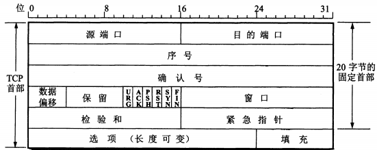
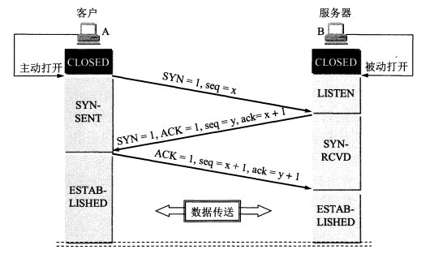
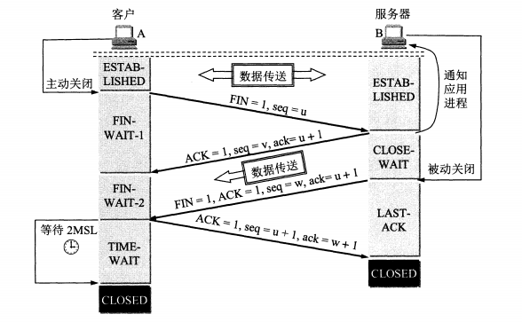
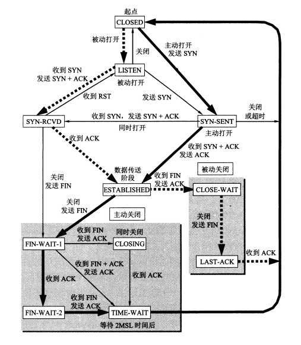
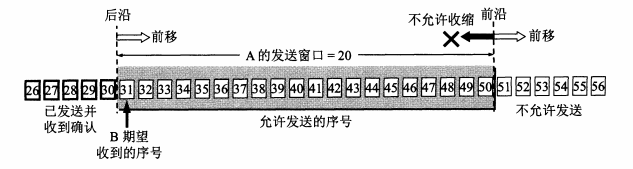
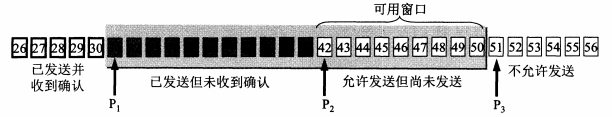

## 运输层的任务

运输层（也称传输层）是TCP等协议所在的重要层次，主要任务是**为相互通信的应用进程提供逻辑通信服务**。运输层是面向通信部分的最高层，同时也是用户功能中的最低层。运输层存在的主要原因是，两台主机之间的通信实际上是两台主机上的应用进程间进行通信，仅仅使用IP协议只能将数据报传输到目的主机上，而无法直接交给应用进程。

运输层具备**复用**（multiplexing）和**分用**（demultiplexing）这两个重要的功能。复用是指发送方不同的应用进程都可以使用同一个运输层协议传送数据，分用则表示接收方的运输层再剥去报文首部后能够将这些数据正确交付给目的应用进程——如果仔细研究网络层的工作过程的话，也会发现其具有类似的复用和分用功能。

在网络层中，IP协议只校验首部是否出现差错，而运输层会对数据部分进行差错检测。根据应用程序的不同需求，运输层需要有两种不同的运输协议即**面向连接的TCP**和**无连接的UDP**，前者确保可靠传输，而后者不保证。

## 基本概念

+ **面向连接**

所谓面向连接，是指在传输数据之前建立连接，传输结束后释放连接，类似于打电话。数据传输依赖于已建立的可靠连接（无论是逻辑的还是物理的），而连接建立则依赖于两进程间一系列的会话通信，比如请求确认等。通信双方必须经常地确认对方能够正常接收到正确的数据报，从而实现可靠传输。

与面向连接相对应的概念是无连接，通信双方不需要建立连接，发送方不用确认接收方是否能够正常接收到正确数据，接收方也不必向发送方反馈任何确认信息，类似于送报纸。正如报纸有可能在半路上丢失那样，无连接传输的数据在途中也是有可能因为各种原因被路由器丢弃掉的。

+ **端口**

在运输层中，“端口”一词指代的是协议端口号（protocol port number），作为一种应用层各协议进程与运输实体进行层间交互的**地址**，它跟物理层的不同硬件设备进行交互的硬件接口并不是一回事。运输层使用端口从而得以实现数据报的分用，如果不用端口，而直接使用系统进程标识符，那么就会产生问题：系统进程的创建和撤销都是动态的，通信双方几乎无法识别对方机器上的进程；不同操作系统的进程标识符格式不一，识别工作繁琐复杂。

TCP/IP运输层端口用一个16位的端口号来标志一个端口，很显然这种长度的地址是不可能像IP那样进行全球分配的，因此端口号和专用IP地址一样**只具有本地意义**，不同主机上的进程使用相同端口号并不会引起冲突。在同一主机上，端口号也是一种非共享资源，一个端口在同一时刻只能由一个进程占用，否则会发生冲突。

运输层端口主要分为两大类：

|    类别    | 描述说明                                                                                                                                       |
| :--------: | :--------------------------------------------------------------------------------------------------------------------------------------------- |
| 服务器端用 | 0-1023为系统端口号，由IANA指派给TCP/IP最重要的一些应用程序，如HTTPS对应443，HTTP对应80等；1024-49151为登记端口号，使用前必须在IANA办理登记手续 |
|  客户端用  | 4915-65535又称短暂端口号，仅在客户端程序运行时由系统动态分配，进程结束后即释放资源                                                             |

## 用户数据报协议UDP

UDP（User Datagram Protocol）是一种比较简单的运输层协议，它只是在IP数据报服务基础上增加了复用、分用以及差错检测的功能，主要特点有：

1. 无连接的；
2. 尽最大努力交付；
3. 面向报文，一次交付一个**完整**报文，无论长短均不合并不拆分；
4. 无拥塞控制，即便网络拥塞也不会改变发送速率；
5. 支持一对一、一对多、多对一和多对多的交互通信；
6. 开销小，首部只有8个字节。

UDP报文只有首部和数据两个部分，首部由以下字段构成：

|   字段   | 长度/字节 | 描述说明                                    |
| :------: | :-------: | :------------------------------------------ |
|  源端口  |     2     | 发送该报文的端口号，不需要对方回信时全部置0 |
| 目的端口 |     2     | 接收该报文的端口                            |
|   长度   |     2     | 包含首部在内的报文长度，最小值为8           |
|  检验和  |     2     | 监测报文在传输过程中是否有错，有错就丢弃    |

UDP校验过程如下：

1. 发送方将检验和字段全部置0；
2. 添加12字节伪首部；
3. 若UDP数据部分非偶数字节，则以一个全0字节补齐；
4. 将上述步骤所得内容按16位划分，并对这些16位字之和进行二进制反码计算，结果写入校验和；
5. 接收方对收到的UDP数据报执行步骤1至步骤3，按二进制反码计算结果；
6. 若步骤5结果全为1，表明无差错，否则即为有差错，应当进行差错处理。

## 传输控制协议TCP

TCP（Tranmission Control Protocol）是TCP/IP体系中非常重要且非常复杂的一个协议，其主要特点有：

1. 面向连接；
2. 一对一、全双工通信；
3. 可靠交付；
4. 面向字节流，TCP将应用层交下来的数据仅看作无结构的字节流，并不知道字节流的含义。

TCP建立连接之后，其两端的收发双方通过**套接字**（socket）进行通信。所谓套接字，实际上就是一种`IP:port`形式的地址，每一条TCP连接**唯一**地被通信两端的两个套接字所确定。socket在不同的场景中代表不同的含义：

+ 运输层和应用层间的一种接口称为socket API，简称socket；
+ socket API当中的一个函数名是socket；
+ 调用socket函数的端点也被称为socket；
+ 调用socket函数返回的socket描述符简称socket；
+ 操作系统内核联网协议的Berkeley实现被称作socket实现。

TCP报文分为TCP首部和数据两大部分，而TCP的全部功能体现在其首部各字段的作用，因此这里重点讨论首部。TCP首部结构如下图所示：

各字段含义如下：

| 字段      | 长度/字节 | 功能描述                                                                                                                                |
| :-------- | :-------: | :-------------------------------------------------------------------------------------------------------------------------------------- |
| 源端口    |     2     |                                                                                                                                         |
| 目的端口  |     2     |                                                                                                                                         |
| 序号      |     4     | 范围$[0,\ 2^{32}-1]$，循环使用，用于标识本报文段所发送数据的**第一个**字节（实际上每个字节都会按顺序编号，该字段也称为报文段序号）      |
| 确认号    |     4     | **期望**收到对方下一个报文段数据部分的第一个字节的序号，其值=`序号+本报文段数据长度+1`，确认号=N表示到序号N-1为止的所有数据都已正确收到 |
| 数据偏移  |     4     | 指示TCP报文段的首部长度，即本报文段数据起始处与首部起始处之间的距离                                                                     |
| 保留      |     6     | 目前置为0，保留为今后使用                                                                                                               |
| 控制位URG |     1     | URG=1表明紧急指针有效，指示该报文段有高优先级数据需要传送和处理（发送方在数据部分最前端插入紧急数据）                                   |
| 控制位ACK |     1     | ACK=1表明确认号有效，TCP规定在连接建立后所有传送报文都必须把ACK置1                                                                      |
| 控制位PSH |     1     | PSH=1表示接收方收到该报文段后尽快交付目的应用进程，不需要等待缓存填满                                                                   |
| 控制位RST |     1     | RST=1表示TCP连接需要重置（释放后再建立），或是拒绝一个非法报文段，抑或是拒绝打开一个连接                                                |
| 控制位SYN |     1     | 在连接建立时用来同步序号，SYN=1/ACK=0表示一个连接请求报文段，SYN=1/ACK=1表示一个同意建立连接的响应报文段                                |
| 控制位FIN |     1     | FIN=1表示此报文段的发送方已经完成数据发送，要求释放运输链接                                                                             |
| 窗口      |     2     | 范围$[0,\ 2^{16}-1]$，表示接收方目前允许对方发送的数据量（动态变化，以字节为单位），以免发生缓存溢出导致报文被丢弃                      |
| 检验和    |     2     | 计算过程和UDP一样，但是伪首部的协议号和报文长度字段需要根据TCP作出调整                                                                  |
| 紧急指针  |     2     | 指出本报文段紧急数据字节数，可无视窗口值为0的情况继续发送                                                                               |
| 选项      |   <=40    | 主要有最大报文段长度（MSS）选项、窗口扩大选项、时间戳选项以及选择确认（SACK，通常很少用到）选项等                                       |

>注意，最大报文段长度（Maximum Segment Size）实际表示的是**最大数据部分**长度，由收发双方的其中一方指定；窗口扩大选项可在双方初始建立TCP连接时协商确定，用一个字节表示位移值S（最大为14），新窗口位数=16+S，亦即窗口最大值可以扩大到$2^{16+S}-1$；时间戳选项主要包含时间戳值和时间戳回送回答两个字段，用于计算[RTT](/ComputerNetwork/Chapter_1_概述?id=往返时间rtt)，同时用于区分具有相同序号发送有时间差的报文段。

### 工作流程始末

TCP建立连接采用的是C/S方式，主动发起连接建立的应用进程为client，被动等待连接建立的应用进程就是server。在连接建立的过程中，要解决以下三个问题：

+ 使每一方能够确知对方的存在；
+ 允许双方协商一些参数；
+ 能够对运输实体资源进行分配。

这里主要介绍的是TCP连接的建立和释放过程，数据传输篇幅较长，因此在后面拆分成几个部分做详细介绍。

#### 建立连接

TCP建立连接的过程叫做**三报文握手**（three message handshake），即一次握手需要在client和server之间交换三个TCP报文段。而在其他一些专业著作中，三报文握手也称“三次握手”（three way handshake），但是从表达准确性上来讲，前者更胜于后者。三报文握手流程如下图所示：

无论是client还是server，在建立连接之前都要创建传输控制块（Transmission Control Block，TCB），用于存储每一个连接中的一些重要信息，如TCP连接表、指向发送和接收缓存的指针、指向重传队列的指针以及当前发送和接受序号等等。

server在client发送SYN报文段之前一直处于监听状态。client发送的SYN报文段不能携带数据（防止放大SYN Flood攻击），但会消耗一个序号（seq）；server同意建立连接就返回确认报文段，将SYN和ACK置为1，设置确认号（ack）和序号，同样也不能携带数据；client收到确认报文段后也要向server进行确认，此时发出的ACK报文段允许携带数据，如果不带数据就不消耗序号。交换三次报文之后，client和server之间的TCP连接就正式建立了。

>注意，server返回的确认报文段可以拆分成一个ACK报文段和一个SYN报文段先后发送，使得握手过程变成四报文握手，但效果是一样的。在实践中，一些server也确实这样做。

client在接收到server的确认报文段后还要再发一个ACK报文段，其作用之一在于防止可能存在的**已失效**连接请求报文段突然又传送到server造成混乱——根据RFC 793，TCP需要seq来做可靠重传或接收，而避免连接复用时无法分辨出seq是延迟或者是旧链接的seq，因此需要三次握手来同步双方的ISN（Initial Sequence Number，初始序列号）。此外，三次交换就能确认连接“可用”，收发双方并不需要无限次地交换报文段来确定信道是否“可靠”，这样也能节约网络资源。

>注意，在上面的三报文握手流程图中，server返回的确认报文段使用了自己生成的序号，这就是ISN。ISN是动态随机生成的，以防止被第三方（前提是流量没有经过第三方）猜到并伪造RST报文对TCP连接实施重置，同时也减少了后续传输数据发生序号冲突的可能性。

#### 连接释放

TCP连接的释放过程被称为四报文握手（其实比较准确的说法应该是“四报文挥手”，这样可以避免同建立连接可能用到的四报文交换过程发生混淆），当然有些专业著作里面称作“四次挥手”，具体过程如下图所示：

>注意，在上面的四报文握手流程图中，client发送的FIN报文段实际上是把ACK置为1的，因为TCP规定除第一个SYN报文段外，其他所有报文段必须ACK置为1。

client在接收到server对FIN报文段的确认之后，TCP连接就处于半关闭（half-close）状态，即client已经没有数据要发送，只会接收server发来的数据。若server也没有数据要发，则发出FIN+ACK报文段要求client进行最终确认。只有client返回确认之后，server才会撤销TCB，否则就要重传FIN+ACK报文段继续等待确认。待client经过2MSL时间之后撤销TCB，连接才算真正被结束。

>注意，2MSL时间由时间等待计时器（TIME-WAIT timer）设置，其中MSL表示最长报文段寿命（Maximum Segment Lifetime），RFC 793建议为2分钟，实际上可以根据需要使用更小的MSL值。client等待的这段时间里，可以保证server重传的FIN+ACK报文段得到回应，也可以确保当前连接产生的所有报文段在网络中消失，避免干扰新建立的TCP连接。

server设置有保活计时器（keepalive timer），每收到一次client发来的数据就要重置一次。若在一段时间内没有收到数据，server就会每隔75s发送一次探测报文段，连续探测10次仍无响应的话，server就会主动关闭TCP连接。

#### 有限状态机

将上面的连接建立和释放过程整合成下图所示的**有限状态机**，可以清晰地看到粗实线箭头所指示的client状态正常变化、粗虚线箭头表示的server状态正常变化，以及细实线箭头表示的其他状态变迁。

### 可靠传输实现

TCP中常用的可靠传输协议有连续ARQ协议和滑动窗口协议，它们都采用“流水线传输”模式。所谓流水线传输，是指发送方可以连续发送分组，而不需要每发送一个分组就得停下来等待接收方的确认响应，这样可以提高信道利用率和传输效率。在使用可靠传输协议时，发送方发出的每一个分组都必须得到接收方确认（接收方将确认分组传回发送方），否则就认为分组丢失需要重传。这种重传是自动执行的（ARQ，Automatically Repeat reQuest），而且接收方同样需要返回确认分组。如果发送方接收到重复的确认分组，那么就直接丢弃；反之，接收方接收到重复的数据分组时，除了丢弃重复分组外，还要再发送确认分组以免发送方继续传来重复的内容（不管发送方能否接收到确认分组）。在采用这种确认重传机制的情况下，收发双方就可以在不可靠的网络上实现可靠传输。

#### 连续ARQ协议

连续ARQ协议在本质上是对本文未做介绍的“停止等待协议”（因为这种协议并没有在运输层使用过）的一种改进，即采用“流水线模式”取代“等待确认”。发送方在连续发送分组的过程中会维持一个**发送窗口**，即窗口包含的若干分组在每次发送时，作为一个完整单元连续发送出去；接收方一般采用**累积确认**的方式，对按序到达的最后一个分组发送确认（表示到这个分组为止的所有分组都已正确收到）；发送方每接收到一个确认，就会把窗口向下一个分组滑动，收到哪个分组的确认就滑动到该分组的下一个分组位置。

采用累积确认的好处是容易实现，即使确认丢失也不必重传；缺点是发送方无法得知接收方具体正确接收到哪些分组，一旦有分组发生丢失，只能采取Go-back-N（回退N）的方式重传已发送过的N个分组，而这N个分组里面也许绝大部分实际上已经被接收方正确收到。当通信线路质量不好时，使用连续ARQ会带来负面影响。

TCP标准规定：累积确认推迟时间不应超过0.5s，以免导致发送方不必要的重传浪费网络资源；若收到一连串具有最大长度的报文段，则必须每隔一个报文段就发送一个确认。

#### 滑动窗口

滑动窗口是TCP运行机制的核心所在，并且以**字节**为单位。滑动窗口按照数据处理方式分为发送窗口和接收窗口两类，而无论是发送方还是接收方，都可以同时拥有这两种窗口，因为TCP通信是全双工通信（尽管大多数应用程序很少同时在两个方向上发送数据）。

+ **发送窗口**

发送方收到接收方发来的确认报文段后，会根据确认号和窗口（实际场景中还要考虑网络拥塞程度）在发送缓存中构造出发送窗口。发送窗口的位置由**前沿**和**后沿**共同确定，其中前沿是允许发送和不允许发送两类字节的界限，只能不动或向不允许发送字节方向前移；后沿是已确认和未确认两类字节的界限，只能向未确认字节方向移动。具体如下图所示：

从上面的描述中可以看出，发送窗口的扩大和收缩主要是靠前后沿各自的前移动作配合来实现。而要描述一个发送窗口，通常会使用三个指针：

$P_1$：指向窗口中已发送但未收到确认字节的第一个

$P_2$：指向窗口中允许发送但未发送字节的第一个

$P_3$：指向窗口中不允许发送字节的第一个

具体如下图所示：

注意到$P_2$和$P_3$之间形成了一个**可用窗口**，当可用窗口减小到零（即发送窗口已满）的时候，发送方就要停止发送非紧急数据。对于已发送但未收到确认的字节，发送窗口需要将它们暂时保留一段时间以备超时重传；而对于已发送并收到确认的字节，发送缓存会将它们删除掉以免没有足够空间存放其他字节。

+ **接收窗口**

接收窗口由接收方在接收缓存中构造，用于暂时存储允许接收的字节。对于已发送确认并交付应用进程的字节，接收缓存会把它们删掉；对于允许接收的字节，接收方只会对**按序收到**的字节中**序号最高者**给出确认，因此确认号只可能是该字节的下一个序号。未按序抵达的字节由于不能跳过其他未确认字节进行确认，所以会暂时保留在窗口中，待其他字节按序收到后再全部交付上层的应用进程。

#### 超时重传时间

TCP计算超时重传时间的算法如下：

> **计算$RTT$**

$RTT$的值为一个报文段发出与收到相应确认的时间差。

> **计算$RTT_S$**

$RTT_S$是TCP保留的一个RTT加权平均往返时间（也称平滑往返时间，下标s代表的是Smoothed），其计算公式为：$$RTT_S=\begin{cases}RTT, &\text{首次测量RTT样本} \\ \\ (1-α)×(旧RTT_s)+α×(新RTT样本), & \text{非首次测量RTT样本，α推荐值0.125}\end{cases}$$

> **计算$RTT_D$**

$RTT_D$是$RTT$的偏差加权平均值，它与$RTT_S$值和新的$RTT$样本之差有关，计算公式为：$$RTT_D=\begin{cases}\frac{RTT}{2}, & \text{首次测量RTT样本} \\ \\ (1-β)×(旧RTT_D)+β×|RTT_S-新RTT样本|, &\text{非首次测量RTT样本，β推荐值0.25}\end{cases}$$

> **计算$RTO$**

$RTO$（Retransmission Time-Out）是超时计时器设置的超时重传时间，其计算公式为：$$RTO=\begin{cases}RTT_S+4×RTT_D, & \text{未发生报文段重传的情形} \\ \\2×旧RTO, & \text{发生报文段重传}\end{cases}$$

### 流量控制实现

流量控制（flow control）的作用是限制发送方的发送速率，以免接收方来不及接收处理造成接收缓存溢出。

流量控制的工作原理是利用滑动窗口可以动态变化的机制，以及发送方的发送窗口大小不能超过接收方的接收窗口大小这一限制，对发送数据行为产生负反馈作用。当发送方发送速率过快时，接收方的接收窗口会迅速填满变成零窗口，返回给发送方的确认报文段也会将窗口字段的值设为0字节，发送方的发送窗口就不能再继续前移，于是发送行为暂停，起到了流量控制的效果。

为了防止由于携带非零窗口信息的报文丢失，导致已停止发送行为的发送方和已空出窗口的接收方陷入相互等待的死锁状态，TCP为每一个连接设有一个持续计时器（persistence timer）。只要TCP连接的一方收到对方的零窗口通知，就启动该计时器，到期后自动发送一个1字节的零窗口探测报文段（接收方在零窗口状态下仍能接收零窗口探测报文段、确认报文段以及紧急报文段），对方再响应一个窗口值，若仍为零窗口就重新设置计时器，否则开始发送数据。

TCP报文段的发送时机是一个较为复杂的问题，TCP针对发送方和接收方制定了基本运行规则：发送方尽量不发送过小的报文段，接收方也不要将过小的窗口值通知给对方，以免对方发送过小的报文段。前者是为了确保网络吞吐量同时减少带宽占用，后者是为了防止出现**糊涂窗口综合征**（silly window syndrome）降低TCP性能。

为确保发送方尽可能发送较长的报文段，TCP在实现中广泛采用Nagle算法：若发送方应用进程把要发送的数据逐字节送到发送缓存，则先发送第一个数据字节，待收到相应确认后就把剩余字节组装成报文段发出去，同时继续对随后到达的数据进行缓存，只有在收到对前一个报文段的确认后才继续发送下一个报文段。当数据缓存达到发送窗口大小的一半或报文段最大长度时就立即发送一个报文段。

解决糊涂窗口综合征的方法为：接收方应该在接收缓存已有足够空间容纳一个最长报文段，或是已有一半空闲空间时，就发出确认报文段通知对方当前的窗口大小。

### 拥塞控制实现

拥塞控制的作用是在网络能够承受现有网络负荷的前提下，防止过多数据注入网络，引起路由器或链路过载。和流量控制的端对端性质相比，拥塞控制需要考虑网络全局，仅仅对部分环节进行优化不一定能解决问题，甚至还有可能使得性能恶化。

衡量网络拥塞程度的主要指标有：因缓存溢出而被丢弃的分组占比、平均队列长度、超时重传分组数以及平均分组时延分组时延的标准差等。这些指标的上升往往标志着拥塞的增长。

#### 四种拥塞控制算法

TCP采用四种算法进行拥塞控制：慢开始（slow-start）、拥塞避免（congestion-avoidan）、快重传（fast retransmit）和快恢复（fast recovery）。

+ **慢开始**

慢开始和拥塞避免算法都是**基于窗口**的拥塞控制方式，这里的窗口代表的是拥塞窗口（cwnd），其大小取决于网络拥塞程度，且动态变化。在考虑网络拥塞的情形下，发送方的发送窗口大小就不再只看接收方接收窗口的反馈，而是取$$min(rwnd,cwnd)$$

慢开始算法在主机开始发送数据时，不会立即发送大量数据（这就是“慢开始”的含义所在），而是逐渐增大拥塞窗口的大小，也就是逐步增加每次注入的数据量，避免网络短时间内就发生拥堵。窗口的初始大小与发送方最大报文段（Sender Maximum Segment Size，SMSS）的长度有关，具体规定如下：

| SMSS长度/字节 |         初始窗口大小限制         |
| :-----------: | :------------------------------: |
|    > 2190     | $cwnd=2×SMSS$且不得超过2个报文段 |
| (1095, 2190]  | $cwnd=3×SMSS$且不得超过3个报文段 |
|    ≤ 1095     | $cwnd=4×SMSS$且不得超过4个报文段 |

每收到一个对**新的**报文段的确认，拥塞窗口大小的增量为$min(N,SMSS)$，其中N代表该报文段所确认的字节数。

>注意，每收发一次确认报文段就扩大一次窗口，拥塞窗口大小的增长其实是非常快的，以1、2、4等指数函数的速度增长，每次注入的数据量也会迅速增加，这样可以尽快、尽可能地提高网络利用率。

+ **拥塞避免**

慢开始只是避免发送方在最开始的一小段时间向网络中注入大量数据，并不能限制拥塞窗口的快速扩大。而如果窗口太大，每次注入数据过多，那么原本防止网络拥塞的拥塞窗口机制反而会引起网络拥塞。

拥塞避免算法在拥塞窗口大小超过阈值的时候，就停止使用慢开始算法的**加倍增长**机制，改为**按线性规律**缓慢增长，即每收到一个新的确认，拥塞窗口就增大$\frac{MSS×MSS}{cwnd}$个字节，也就是所谓的“加法增大”（Additive Increase，AI），从而使得网络比较不容易出现拥塞。

拥塞窗口大小的阈值被称为“慢开始门限”ssthresh，**在Tahoe版本拥塞控制算法中，ssthresh的值可以设置为任意大以保证连接以慢开始方式启动**。一旦发生网络拥塞（超时），该值需要按照RFC 5681的计算公式进行下调：$$ssthresh=max(\frac{FlightSize}{2},2×SMSS)$$

其中FlightSize表示正在网络中传送（已发出但还未收到确认）的数据量，可知不会超过发送窗口的大小。

ssthresh下调的同时还要减小拥塞窗口——这一环节常称为“乘法减小”（Multiplicative Decrease）——启动慢开始算法，直至拥塞窗口大小超过ssthresh后转为拥塞避免算法。

>注意，将“加法增大”和“乘法减小”整合在一起，就形成了所谓的AIMD算法。

+ **快重传**

快重传算法的基本原理是：当接收方发现**个别**报文段丢失（丢失原因不一定是网络拥塞），必须立即发送对已按序收到报文段的重复确认；发送方只要连续收到若干个重复确认（Reno版本是3-ACK，NewReno版本是5-ACK），就立即进行重传，以免误判为网络拥塞启动慢开始算法导致网络吞吐量骤降。

+ **快恢复**

快恢复是指在发送方判定网络并未拥塞，实际只是丢失个别报文段的情况下，按照RFC 5681的规定下调ssthresh，并设置$cwnd=\begin{cases}ssthresh, & \text{Reno版本} \\ \\ ssthresh+3×MSS, & \text{NewReno版本}\end{cases}$，启动拥塞避免算法。

#### 主动队列管理AQM

AQM（Active Queue Management）主要是针对解决网络中的“全局同步”（global synchronization）问题。所谓全局同步，是指路由器由于执行尾部丢弃策略（tail-drop policy），在处理队列已满的情况下直接丢弃后续抵达的分组，发生超时重传，于是就可能导致网络中多条TCP连接的发送方判定网络发生拥塞，**同时**启动慢开始算法从而引起全网通信量骤降。

AQM的“主动”体现在当队列长度达到阈值，显示出网络拥塞的某些征兆时，路由器就主动丢弃到达的分组以提醒发送方降低发送速率，这样网络拥塞就可能减轻程度甚至消除。AQM的具体实现方法很多，最为典型的一种就是RED（Random Early Detection/Drop/Discard，名称不同但缩写相同）。实现RED时需要路由器维持队列长度最小和最大门限两个参数，每到达一个分组，就按照规定的算法计算当前的**平均队列长度**。

若平均队列长度小于最小门限，允许新分组进入队列排队；若平均队列长度超过最大门限，直接丢弃新分组；若平均队列长度介于两者之间，则计算出一个丢弃概率决定是否丢弃新分组。丢弃概率的计算是RED的关键所在，然而RED在多年实践中并没有展示出比较好的使用效果，因而不再被推荐使用。

尽管RED风光不再，但是针对路由器实施AQM对分组排队进行智能管理依然是必要的。

## 其他运输层协议

### UDP-Lite

UDP-Lite顾名思义就是一种轻量级的UDP协议，它跟普通UDP的主要差别在于**计算校验和的范围可以由应用自行决定**，也就是说，可以只针对绝对不允许出错的部分进行校验和检查，其他部分即便出错也不会导致包被丢弃，还可以直接传给应用继续处理。一些使用H.263+、H.264以及MPEG等图像和音频数据格式的应用，可能并不希望在接收到错误的包时只能简单丢弃，因此在这种情形下使用UDP-Lite会是比较合适的选择。

### SCTP

流控制传输协议SCTP（Stream Control Transmission Protocol）跟TCP一样也是面向连接的实现可靠传输的传输层协议，它跟TCP的主要区别在于：

1. **以消息为单位收发**：TCP接收方并不知道发送方定义的消息大小，而SCTP可以；
2. **支持多重宿主**：在具有多个IP地址且随时可能发生变化的主机上也能正常通信，提高交付容错率；
3. **支持多数据流通信**：TCP中建立多个连接才会有的通信效果，SCTP只需使用一个连接，吞吐量有效提升；
4. **定义消息生存期限**：超过生存期限的消息不会被重传；
5. **有效防御SYN Flood攻击**：在关联初始化阶段接收方既不保存任何状态信息也不分配任何资源，绕开TCP建立连接时存在的固有漏洞。

SCTP主要用于通信双方之间发送**众多较小消息**（TCP主张尽量不要发送过小报文段）的情形。这些较小的应用消息被称作数据块（Chunk），多个数据块可以组成一个数据包。

SCTP的连接建立过程称为关联（association），其定义为：$$关联::=(一组发送方IP地址+发送方端口)+(一组接收方IP地址+接收方端口)$$

在关联初始化阶段，通信双方通过一次四路握手交换通信状态，并产生状态Cookie，后续双方就依靠Cookie来确认和维持关联。由于关联时已经记录多个IP地址，除非地址全部失效，否则SCTP在传输数据过程中并不会因为通信双方的个别IP地址出问题而导致包无法被送达。如果数据包在传输过程中发生丢失，SCTP的处理机制与TCP截然不同：前者接收方会一边等待丢失包重传（这时候SACK就可以发挥重要作用了）一边继续接收正常数据包，后者接收方必须等到丢失字节重传完成才能继续接收后续的字节。

### DCCP

数据报拥塞控制协议DCCP（Datagram Congestion Control Protocol）是一个辅助UDP的新型运输层协议，主要用于UDP数据传输的拥塞控制机制。DCCP的主要特点如下：

+ 尽最大努力交付；
+ 面向连接，在建立和释放连接方面具有可靠性；
+ 可根据网络拥堵情况进行拥塞控制；
+ 接收方通过返回确认应答以便发送方判断是否需要重传。