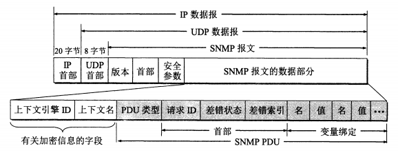

## 应用层的基本任务

应用层主要负责不同主机多个应用进程之间的通信和协同工作，具体而言就是精确定义应用进程间的通信规则。应用层协议种类繁多，但基本都包含以下内容：

+ 应用进程交换的报文类型，如请求和响应报文；
+ 各类报文的语法，如各字段及其详细描述；
+ 字段的语义，即包含在字段中的信息的含义；
+ 进程何时、如何发送报文，以及对报文进行响应的规则。

许多应用层协议都是基于C/S方式运行的，即便是后面要提到的P2P通信。而值得注意的是，应用层协议仅仅是应用的组成部分之一（应用程序的开发就是另外一个话题了），并且也不是所有的应用程序都有联网通信的需求。此外，同一个应用程序可能还同时支持多个应用层协议，最典型的就是电子邮件，目前常见的电子邮件应用（比如Outlook、Thunderbird等）都支持SMTP、POP3以及IMAP等协议；反过来，即便是基于同一种应用层协议也能开发出各式各样的应用软件，典型例子就是市面上常见的各种浏览器，无论是Google Chrome还是FireFox，都必须使用到HTTP/HTTPS协议。

由于应用层协议种类繁多，而且新协议也是层出不穷，限于篇幅不可能一一介绍（有些协议还是非公开专用，甚至保密），下面主要介绍公开常用的几种重要协议。

## 域名系统DNS

### 何为域名

域名（domain name）是一台主机或路由器所使用的具有**层次树状结构**的名字，在整个互联网空间中具有唯一性，比如Google搜索使用的域名`www.google.com`。域名的“域”是名字空间中一个可被管理的划分，常见的域划分有顶级域、二级域和三级域等等。一个域名都是由标号（label）序列组成，各标号之间以`.`分隔。域名中的标号<font color=red>通常由英文字母、数字或连字符`-`</font>组成，每个标号不超过63个字符（在实际场景中建议不要超过12个），完整域名不超过255个字符，并且不区分大小写。代表<font color=blue>顶级域</font>的标号位于域名<font color=blue>最右边</font>，域层级从右往左依次下降。

互联网的域名空间是一棵根在上、枝叶在下的倒置树。根没有对应的名字，根以下第一层节点就被称作顶级域名（Top Level Domain，TLD），再往下就是二级、三级和四级等层级的域名，直到该域名已经能指示出单台主机为止便停止划分。目前顶级域名共分为以下三大类：

|类型|示例说明|
|:-----:|:---------:|
|国家顶级域名nTLD/ccTLD|us表示美国，cn表示中国等，允许使用域名所在国文字作为TLD|
|通用顶级域名gTLD|com表示公司企业，org表示非营利组织，gov表示政府部门等|
|基础结构域名|infrastructure domain只有arpa一个TLD，用于反向域名解析|

在nTLD下注册的二级域名均由该国家自行确定。

使用域名的好处在于使用方便，比如Bing搜索的其中一个服务器IP地址为`202.89.233.100`，然而用户不可能也不愿意去记Bing使用的所有服务器IP地址，因此使用`www.bing.com`这个域名去访问Bing无疑是比记一堆IP地址要方便得多。而域名与IP地址间的联系，会在DNS部分进行较为详细的介绍。

>注意，域名只是一个逻辑概念，不代表计算机所在的物理地点，其形式与IP地址的形式也<font color=red>没有必然关联</font>。

### DNS作用

DNS（Domain Name System）是互联网使用的一套命名系统，依据标准为RFC 1034/1035，用来把计算机域名解析为IP地址。

DNS被设计为一个联机分布式数据库系统，并采用C/S方式，使得大多数名字都可以在本地进行解析，仅少量解析需要在互联网上通信，因此效率很高。域名到IP地址的解析，是由分布在互联网上许多运行有专门解析程序的域名服务器共同完成的，其主要过程为：当某一应用进程需要把域名解析为IP地址时，就调用解析程序，并成为DNS的一个client，把待解析的域名放在DNS请求报文中，通过<font color=red>UDP</font>发给**本地**域名服务器。本地域名服务器在查找到域名对应的IP地址后（若本地查找不到就向其他域名服务器发起请求扩大查找范围），就返回一个携带该IP地址的应答报文，应用进程拿到应答报文后就可以取出IP地址进行通信。

### 域名服务器

DNS采用划分区（zone）的方式来解决域名服务器数量过多降低运行效率的问题。所谓的区，是指一个域名服务器所负责管辖的（或有权限的）范围，从关系上来讲，“区”是“域”的**子集**。为了提高DNS查询效率，除了划分区以外，域名服务器还广泛使用高速缓存，用于存放最近的查询结果。根据域名服务器所起的作用，可以划分出四种不同类型：

1. **根域名服务器（root name server）**

根域名服务器是<font color=red>最高层次</font>，也是最重要的域名服务器。所有的根域名服务器都知道所有顶级域名服务器的域名和IP地址，如果根域名服务器全部瘫痪，那么整个互联网的DNS系统都将无法工作。鉴于根域名服务器的特殊地位，建立一个根域名服务器有许多具体要求（尤其是防御网络攻击方面），并不是随便租用一台服务器主机就能建起来，可以参阅RFC 2870。

全球各地都安装有根域名服务器，但它们只使用<font color=red>13个</font>不同IP地址的**域名**（从a.root-servers.net到m.root-servers.net），简而言之，绝大多数根域名服务器只是起到镜像同步的作用，因此确切来说全世界目前有<font color=red>13组</font>根域名服务器，分别用A到M来表示。各组根域名服务器的镜像数量和覆盖范围都各不相同。再次强调，目前全世界共有13个根域名（包括1个主根域名和12个辅根域名）和对应的13组根域名服务器，而不是某些垃圾博客和劣质科普文章所说的13台根域名服务器，仅仅依靠13台服务器根本不可能支撑起全球互联网服务。

由于根域名服务器采用了任播（anycast）技术，因此当DNS客户向某个根域名服务器的IP地址发出查询报文时，互联网上的路由器就能找到离该客户最近的一个根域名服务器，加快查询速度，使互联网资源利用更为合理。根域名服务器并不存放顶级域名服务器以下级别的域名和对应IP地址信息，因此在许多情况下只是告诉本地域名服务器下一步应当通过哪个顶级域名服务器进行查询。

2. **顶级域名服务器**

顶级域名服务器负责管理在该顶级域名服务器所注册的所有二级域名，当收到DNS查询请求时，就给出相应的回答，可能是最终结果，也有可能是下一步应当查找的域名服务器的IP地址。

3. **权限域名服务器**

权限域名服务器就是负责一个区的域名服务器。

4. **本地域名服务器（local name server）**

本地域名服务器也称默认域名服务器，是主机发出DNS查询请求获取目标域名对应IP地址的第一站（通常也是最后一站）。本地域名服务器的建立要求相对要低一些，即便是一个普通单位也可以拥有。用户在计算机上配置网络时可能会被要求设置DNS服务器，指的就是设置本地服务器。由于本地域名服务器通常距离主机较近，一般不超过几个路由器，因此查询速度非常快。

主机向本地域名服务器查询一般采用**递归**查询（recursive query），即本地域名服务器自己没有相应结果的情况下，就会<font color=red>代替主机</font>向根域名服务器继续进行查询，根域名服务器将查询委托给顶级域名服务器，顶级域名服务器再将查询委托给权限域名服务器，然后将查询结果或报错信息按原路返回给主机。

本地域名服务器向根域名服务器查询一般用**迭代**查询（iterative query），当然也可以用递归查询，这取决于查询请求报文的设置。迭代查询是指本地域名服务器在查询过程中，没有上级域名服务器层层委托转交查询请求和回答结果，而是直接让本地服务器向对应上级域名服务器查询。

两者的差别可以通过下图看出：


可以看到，不管采用什么类型的查询方式，主机始终只要跟本地域名服务器打交道，这样就减少了主机的工作负担。

## 文件共享协议FTP/TFTP

文件共享协议可以分为两大类，一类是复制整个文件到本地，其含义为：若要存取一个文件，就必须先获得一个本地的文件副本。如果要修改文件，只能对文件的副本进行修改，然后再将修改后的文件副本传回原节点。像FTP和TFTP就是属于这种类型。但是<font color=red>每次都要传输一整个文件副本的做法并不总是合理的</font>，因此出现了另一类文件共享协议。

文件共享协议的另一大类是联机访问（on-line access），即允许多个程序同时对一个文件进行存取，但用户不需要使用特殊的客户进程，而是由**操作系统**提供对远地共享文件进行访问的服务，如同对本地文件的访问一样，实现了**透明存取**。常用的协议有NFS（Network File System），主要用在TCP/IP网络上，适用于UNIX和MS-Windows等系统。NFS允许应用进程打开一个远程文件，并能在该文件的某一特定位置上读写数据，用户只需要复制文件中一个很小的片段，然后通过网络传输少量修改数据即可。

### 文件传送协议FTP

FTP（File Transfer Protocol）是互联网上使用最为广泛的文件传送协议，它基于TCP，采用C/S方式运行，提供交互式的访问，允许客户指明文件的类型与格式，并允许文件具有存取权限。FTP的主要功能是减少或消除在不同操作系统下处理文件的不兼容性。

FTP的应用进程分为server和client。server可同时为多个client提供服务，并且由两部分组成：负责接收新请求的主进程，以及若干负责处理单个请求的从属进程。主进程的工作步骤为：

1. 打开端口21，使client进程能够连接上；
2. 等待client进程发出连接请求；
3. 启动从属进程处理client进程发来的请求，处理完毕即终止，可根据需要创建其他子进程；
4. 回到等待状态，继续接受其他client进程发来的请求。

>注意，主进程和从属进程的处理是并发进行的。

在进行文件传输时，FTP的client和server之间要建立两个并行的TCP连接，即用来传输传送请求的**控制连接**，以及用来传输文件数据的**数据连接**。前者在整个会话期间一直保持打开，与文件传输相分离，因此FTP的控制信息传输也被称作带外（out of band）传送。

### 简单文件传送协议TFTP

TFTP（Trivial File Transfer Protocol）是一个基于UDP的文件分享协议，它只支持文件传输而不支持交互，也不能对用户进行身份鉴别，主要在小型设备上。TFTP的主要特点有：

1. 除最后一次传送外，每次传送的数据报文中必须有512字节的数据；
2. 数据报文从1开始按序编号；
3. 支持ASCII码或二进制传送；
4. 可对文件进行读写；
5. 使用很简单的首部。

TFTP在工作时，client会向server的69端口发送请求报文，server选择一个新的端口和client进行通信。每发送完一个文件块后就等待对方的确认，确认时应指明所确认的块编号，规定时间内未收到确认就重发数据。

## 超文本传送协议HTTP

HTTP（HyperText Transfer Protocol）是万维网（World Wide Web，WWW，也称Web）的核心组成部分，它定义了浏览器如何向服务器请求文档，以及服务器如何将文档传送给浏览器，基于TCP运行。为了提高安全性，HTTP现在又加上[SSL/TLS](/ComputerNetwork/Chapter_7_网络安全?id=ssltls)协议对传输的数据实施加密，形成了HTTPS（HTTP over Secure Socket Layer）。

>SSL是Secure Socket Layer的缩写，TLS是Transport Layer Security的缩写，后者由前者发展而来。

### Web、URL与HTML

Web是一个大规模联机式的信息存储系统，由大量站点提供分布式的超媒体（hypermedia）系统服务。超媒体是超文本的扩充，所谓超文本是指包含指向其他文档的链接的文本，仅包含文本信息，而超媒体还包括图形音像等非文本类信息。Web把大量信息分布在整个互联网上，每个站点单独管理自己的文档——也就是页面（page）——并通过链接进行访问。可以说，Web就是互联网的基石，没有Web也就不会有今天的互联网，更不会有后来以智能移动设备和App为核心的移动互联网（现在基于浏览器提供网页服务的被称作WebApp）。

之前提到，互联网各个站点通过链接（link）建立联系，所谓链接，实际上指代的是统一资源定位符URL（Uniform Resource Locator），一个在整个互联网范围内的唯一标识符。能够在互联网上可以被访问到的任何类型的对象都被称为“资源”，使用URL就可以标识这些资源在互联网上的位置以及访问方法。URL的基本格式为：`<协议>://<域名/IP地址>:<端口>/<路径>`， 目前常用的协议有HTTP和FTP。使用HTTP协议的URL可以省略端口，因为HTTP使用的是[系统端口](/ComputerNetwork/Chapter_5_运输层?id=基本概念)80。如果把路径省略，那么就默认访问的是一个站点的主页（home page）。主页是一个站点最高级别的页面，主要用来展示站点的重要信息，同时也可以提供访问其他页面或站点的链接。

HTML（HyperText Markup Language，超文本标记语言）是Web使用的一种核心技术，用于制作Web页面，截至2021年8月，最新版本为HTML 5.0。HTML文档跟普通文档的主要区别在于标签（tag）的使用，如果把`.html`文件直接改成`.txt`，原有的文本基本上都能直接读取出来，而且用于设置文本样式和资源链接的各类标签也会直接展示。HTML的标准由W3C负责制定维护，详见地址：[https://html.spec.whatwg.org/multipage/sections.html](https://html.spec.whatwg.org/multipage/sections.html)。HTML并不总是单独出现，与之配套使用的还有CSS（Cascading Style Sheets，层叠样式表），专门用于为HTML文档定义布局，比如在浏览器上显示的字体、颜色、边距、高度、宽度、背景以及图像等。HTML和CSS的主要区别是前者用于结构化内容，而后者用于格式化这些内容。

早期的Web站点都是基于HTML开发一系列静态文档（static document）进行展示，随着技术的发展又出现了由应用程序动态创建的动态文档（dynamic document），当服务器接收到浏览器请求时就运行CGI程序生成HTML文件并返回给浏览器进行展示。CGI（Common Gateway Interface，通用网关接口）是一种标准，它定义了动态文档如何被创建，输入的数据如何提供给应用程序，以及输出结果应如何使用。

为了使HTML能进一步支持活动内容（比如动画效果），又出现了一种称作“活动文档”（active document）的技术。活动文档中嵌入了Java applet（小程序），当浏览器下载该类型文档之后，用户点击页面上的区域或控件，就可以动态地改变页面上展示的内容。活动文档跟动态文档的差别在于，前者的活动内容展示需要由浏览器支持并执行，而后者需要服务器运行CGI程序。

### HTTP工作原理

HTTP是一种**面向事务**（transaction-oriented）的应用层协议，除了传送完成链接跳转所必需的信息，还传送任何可从互联网上得到的信息。基于HTTP的Web工作过程大致如下图所示：


HTTP基于TCP实现可靠传输，不需要考虑数据在传输过程中被丢弃后又怎样被重传。HTTP本身是<font color=red>无连接</font>的，即通信双方在交换HTTP报文之前不必先建立所谓的HTTP连接；HTTP也是<font color=red>无状态</font>（stateless）的，服务器并不知道客户是否访问过，也不知道为该客户提供过多少次服务——当然，这是在不使用Cookie等手段记录访客信息的情况下——从这一角度来看，无状态的特性可以简化服务器的设计。

HTTP目前已经更新到2.0版本，但主要在用的版本依然是HTTP/1.0和HTTP/1.1。HTTP/1.0有一个明显的缺点是采用**非持续连接**，每请求一个文档就得建立一个TCP连接，并且还要发送请求和接收文档，之后断开，这样就花费了两倍的RTT；而每次建立连接都要分配服务器资源，通信量也会随之上升，对服务端的工作负担很大。HTTP/1.1对此进行了改进，采取**持续连接**（persistent connection）方式确保只用一条TCP连接就可以传送HTTP请求报文和响应报文，减少了通信量和服务器工作负担。此外，HTTP/1.1还支持非流水线（without pipeline）和流水线（with pipeline）两种工作方式，目前普遍使用的是后一种类型。

#### HTTP报文结构

HTTP报文分为请求报文和响应报文两大类。由于HTTP是面向文本的，因此报文中的每个字段都是一些ASCII码串，各个字段长度并不固定。先来看请求报文的基本格式：

```
方法 相对URL 版本   <这是请求行>
首部字段名1: 值1    <这是首部行的第一个字段>
首部字段名2: 值2
···
                   <首部行与报文主体间必须用一行CRLF分隔>
报文主体            <报文主体可以为空>
```

请求方法和含义可以参考Mozilla的相关文档：[https://developer.mozilla.org/en-US/docs/Web/HTTP/Methods](https://developer.mozilla.org/en-US/docs/Web/HTTP/Methods)

响应报文的格式除了最开始一行，几乎与请求报文没有差别：

```
版本 状态码 状态短语    <这是响应行>
首部字段名1: 值1        <这是首部行第一个字段>
首部字段名2: 值2
···
                       <首部行与报文主体间必须用一行CRLF分隔>
报文主体                <报文主体可为空>
```

状态码和含义可以参考Mozilla相关文档：[https://developer.mozilla.org/en-US/docs/Web/HTTP/Status](https://developer.mozilla.org/en-US/docs/Web/HTTP/Status)。

利用Google Chrome的开发者工具（按F12调出），在Network选项下选择一个会话，即可查看该会话的请求和响应报文详细信息，如下图所示：


#### 代理服务器

代理服务器（proxy server）是一种网络实体，负责把最近的一些请求和响应暂存在本地磁盘中，当新请求到达时，若代理服务器发现这个请求已经存在，就直接返回暂存的响应，否则就进入互联网访问该资源。使用代理服务器的好处是可以提高资源的访问速度，减少通信链路的负担，而坏处就是如果代理服务器的缓存更新不及时，那么用户的使用体验会非常糟糕，典型的反面教材就是长城宽带的缓存服务器。

#### Cookie

Cookie是一种在HTTP服务器和客户之间传递的状态信息，目前尚无标准译名。由于HTTP本身是无状态的，因此在某些需要保存状态的场景中，比如在线购物，就必须设法保存用户的状态信息，目前通用的方案就是使用Cookie。

当用户浏览某个使用Cookie的网站时，该站服务器就为用户生成并在响应报文中返回一个Cookie值（赋给首部行字段Set-cookie），同时在数据库中保存；用户浏览器收到该响应后，就会在特定Cookie文件中加入该Cookie值和对应的主机名，用户继续浏览该网站时，每发送一个请求报文，都会用这个Cookie值去设置首部行字段Cookie，这样该网站的服务器就能跟踪用户在该站的活动。但是Cookie的使用也带来了用户隐私泄露的隐患，因此市面上的浏览器也都基本支持禁用Cookie。

## 电子邮件协议SMTP/POP3/IMAP

电子邮件协议分为邮件发送和邮件读取两大类，前者使用简单邮件传送协议SMTP（Simple Mail Transfer Protocol），后者使用邮局协议版本3POP3（Post Office Protocol ver.3），以及网际报文存取协议IMAP（Internet Message Access Protocol）。

### SMTP工作原理

SMTP规定了在两个相互通信的SMTP进程之间应如何交换信息。SMTP采用C/S方式，但并未规定邮件内部格式、如何存储以及邮件系统的发送速度等详细内容。SMTP规定了14条命令和21种应答信息，每条命令用几个字母组成，而每一种应答信息一般只有一行信息，由一个3位数字的代码开始，后面可能会附上简单的文字说明。

SMTP不使用中间的邮件服务器，而是直接在通信双方之间建立TCP连接。发件人的邮件送到发送方邮件服务器的邮件缓存后，SMTP客户每隔一段时间对邮件缓存扫描一次，若发现有邮件，就通过端口25通接收方的SMTP服务器建立连接。连接建立后，接收方SMTP服务器发出“220 Service ready”，SMTP客户向服务器发送HELO命令，并附上发送方的主机名。若服务器有能力接收邮件，就回答"250 OK"，否则就返回“421 Service not available”，发送方需要等待一段时间后在尝试建立连接发送邮件。

邮件传送时，SMTP客户先发送MAIL命令，确认服务器已准备好接收邮件，然后通过RCPT命令确认接收方邮箱地址是否正确，最后调用DATA命令正式传送邮件内容。邮件发送完成之后，SMTP客户发出QUIT命令，服务器返回“221”信息同意释放连接，邮件的传送过程就结束了。尽管发送成功不代表收件人必然能读取邮件，但是基于SMTP的电子邮件通常都被认为在“确保邮件能被对方收到”这件事情上是可靠的。

2008年10月颁布的RFC 5321对SMTP进行扩充，形成了ESMTP（Extended SMTP），用来解决发送邮件不鉴权带来的垃圾邮件问题、非ASCII码长报文传输效率低下问题以及明文传输引发的安全性问题。为了兼容原有的SMTP邮件服务器，ESMTP客户端在准备传送报文时会先发送EHLO报文判断服务器是否使用ESMTP，若报文被拒绝，就采用SMTP参数进行邮件传送，否则使用ESMTP参数。

### POP3工作原理

POP3是一个非常简单，但是功能有限的邮件读取协议，也是采用C/S方式运行。POP3服务器只有在用户输入鉴别信息后才允许读取，而且读取完邮件之后就会将该邮件删除，当然后来POP3做了改进，允许用户事先设置邮件读取后仍能继续在POP3服务器保存的时间。

### IMAP工作原理

IMAP是一个联机协议，跟POP3一样采用C/S方式运行，目前最新版本为IMAP4。用户通过IMAP客户端与接收方的IMAP服务器建立TCP连接，在自己的计算机上就可以操纵邮件服务器的邮箱。和POP3不同，读取邮件的操作并不会删除服务器上的内容，只有用户明确执行了删除操作，服务器才会删除邮件。IMAP的好处在于用户可以在不同地方使用不同的计算机随时处理邮件，而且可以只阅读一部分邮件内容，包含较大体积附件的邮件不必在阅读前完全下载所有数据。IMAP需要用户联网才能从邮件服务器复制邮件到自己的计算机上，因此使用IMAP客户端时要保证网络正常。

IMAP和POP3的主要功能对照如下：

|操作位置|操作内容|IMAP|POP3|
|:-----:|:---------------:|:----------:|:----------:|
|收件箱|阅读、标记、移动、删除邮件等|客户端与邮箱同步更新|仅在客户端内|
|发件箱|保存到已发送|同上|同上|
|创建文件夹|创建自定义的文件夹|同上|同上|
|草稿|保存草稿|同上|同上|
|垃圾文件夹|接收并移入垃圾文件夹的邮件|支持|不支持|
|广告邮件|接收并移入广告文件夹的邮件|支持|不支持|

### 通用互联网邮件扩充MIME

MIME（Multipurpose Internet Mail Extensions）是针对SMTP存在的若干缺点而提出的一种解决方案，在不改动邮件格式的基础上，增加了邮件主体的结构，并定义了传送非ASCII码的编码规则。

>SMTP存在的缺点有：
>(1)不能传送可执行文件或其他二进制对象；
>(2)仅限传送7位的ASCII码，非ASCII码字符无法传送；
>(3)SMTP会拒绝超过一定长度的邮件；
>(4)某些SMTP的实现没有完全按照互联网标准。

MIME主要包含三部分内容：5个邮件首部新字段、邮件内容格式定义和传送编码定义。


1. **邮件首部字段**

MIME的5个邮件首部字段及其含义如下表所示：

|字段|含义说明|
|MIME-Version|标识MIME的版本，当前版本为1.0。若无此行则为英文文本|
|Content-Description|标识邮件主体类型是否为图像、音频或视频|
|Content-Id|邮件唯一标识符|
|Content-Transfer-Encoding|标识传送邮件主体时采取何种编码方案|
|Content-Type|说明邮件主体的数据类型和子类型|

2. **邮件内容格式**

邮件内容格式由Content-Type字段定义。Content-Type由两个标识符组成，其形式为`内容类型/子类型`。下表是可在MIME中出现的内容类型和子类型举例：

|内容类型|子类型举例|说明|
|:-----:|:----------:|:----------:|
|text（文本）|plain，html，xml，css等|不同格式的文本|
|image（图像）|gif，jpeg，tiff等|不同格式的图像|
|audio（音频）|basic，mpeg，mp3等|不同格式的音频|
|video（视频）|mpeg，mp4，quicktime等|不同格式的影片|
|model（模型）|vrml|3D模型|
|application（应用）|pdf，javascript，zip等|不同应用程序产生的数据|
|message（报文）|http，rfc822等|不同协议的封装报文|
|multipart（多部分）|mixed，alternative，parallel，digest|多种类型的组合|

multipart类型是一个值得关注和利用的类型，因为它使邮件增加了相当大的灵活性。其子类型和含义如下：

|子类型字段|含义说明|
|:-----|:---------|
|mixed|允许单个报文含有多个相互独立的子报文，每个报文可有自己的类型和编码。mixed后面需要使用`Boundary=`来定义一个分隔字符串（邮件内容中不能存在相同的字符串），各报文之间以`--分隔字符串`作为区分标志，而multipart整体以`--分隔字符串--`作为结束标志。|
|alternative|允许单个报文含有同一数据的多种表示|
|parallel|允许单个报文含有可同时显示的各个字部分|
|digest|允许单个报文含有一组其他报文|

3. **内容传送编码**

由ASCII码字符构成，且每行不超过1000字符的邮件主体不需要再进行编码转换即可直接传送。

包含**少量**非ASCII码字符的邮件主体，对除特殊字符`=`以外的可打印ASCII码都不转换，`=`和所有非ASCII字符都要先将每个字节的二进制代码用十六进制数表示，然后在前面加上等号`=`。这种编码方式被称作quoted-printable。

对于任意的二进制文件，可以使用base64编码，即先把二进制代码按照24位一组划分成若干个单元，然后每个单元划分为4个6位组。6位二进制代码可以表示64种值，从0到63可以依次表示26个大写字母、26个小写字母、0-9共计10个数字以及表示62的`+`和63的`/`。最后再用`==`和`=`分别表示最后一个单元仅有8位和16位。base64编码忽略回车和换行。

## 动态主机配置协议DHCP

DHCP（Dynamic HostConfiguration Protocol）是一种实现即插即用联网机制的应用层协议，采用C/S方式，基于UDP运行。无论一台主机是固定的还是移动的，运行的是client还是server程序，DHCP都适用。DHCP客户在通信过程中使用端口68，而DHCP服务器使用端口67。

DHCP的工作过程为：需要配置IP地址的主机启动时，向DHCP服务器广播发送发现报文（DHCPDISCOVERY），报文中的源地址被设为`0.0.0.0`，目的地址被设为`255.255.255.255`，这时主机就成为了DHCP客户。DHCP服务器接收到该报文后，会先在自己的数据库中查找该主机的配置信息，如果有就返回找到的信息，否则就从IP地址池（address pool）里分配一个地址，并通过提供报文（DHCPOFFER）将IP地址的配置信息返回给该主机。对于运行服务器程序而位置固定的主机，DHCP会为其指派一个永久地址。整个过程不需要手工干预，完全自动配置。在常用的操作系统中，如果网络配置选用自动获得IP地址和DNS地址，那么就表明在使用DHCP。

在实际使用中，并不是每个网络都会设置有DHCP服务器，否则的话数量就太多了，成本也会很高。通常的做法是在一个网络中用一台路由器充当**DHCP中继代理**（relay agent），它被配置了DHCP服务器的IP地址信息，需要设置IP地址的主机的广播报文被中继代理收到后，就会向真正的DHCP服务器单播转发此报文，待DHCP服务器回答后再将提供报文转发回该主机。

值得注意的是，DHCP分配给DHCP客户的IP地址是有时限的，这个时限称为“租用期”（lease period），短至1秒，长至136年不等，可以由DHCP服务器单方面设置，也可以由DHCP客户向DHCP服务器提出要求。

## 简单网络管理协议SNMP

SNMP（Simple Network Management Protocol）是一套用于实施网络管理的庞大标准体系（一共有RFC 3411~3418共计8个文档进行描述），目前较新的版本是SNMPv3。SNMP采用C/S方式工作，基于UDP运行。

所谓网络管理，简称网管，目前还没有精确定义，其核心内容主要包括**对硬件、软件和人力的使用、综合与协调，以便对网络资源进行监视、测试、配置、分析、评价和控制，从而以合理成本满足网络的一些需求，如实时运行性能、服务质量等**。

### 网络管理模型

在正式介绍SNMP网络管理各组件之前，需要先了解一下网络管理模型。由于网络——尤其是互联网——是一个高度复杂的分布式系统，上面有很多生产自不同厂家、运行多种协议并时时相互通信交换数据信息的结点（主要是路由器），网络的状态也是随时变化的。因此，必须有一种机制来获取这些结点上的状态信息，有时还要写入一些新的状态信息。

网络管理模型中有以下两大类构件：

1. **管理站/管理器**

管理站/管理器（manager）是整个网络管理系统的核心，通常是一个具有良好图形界面的高性能工作站，由网络管理员（administrator）直接操作和控制。manager安装有管理程序，运行时变成管理进程，其所在部门被称为网络运行中心（Network Operation Center，NOC）。大型网络往往实行多级管理，因而有多个manager，而一个manager一般只管理本地网络的设备。

2. **被管设备**

被管设备是manager负责管辖的网络中的所有设备（如主机、路由器、打印机、集线器、网桥或调制解调器等）的统称，也可以称为网络元素，简称网元。每台被管设备中可能有许多被管对象（Managed Object），可以是某个硬件也可以是某些软硬件的配置参数的集合；此外，每台被管设备中都要运行一个被称作网络管理代理（简称为代理）的应用程序，和manager的管理程序进行通信。代理在管理程序的命令和控制下，在被管设备上采取本地的行动。

SNMP的网络管理有三大组成部分：SNMP本身、管理信息结构SMI（Structure of Management Information）和管理信息库MMIB（Management Information Base）。它们的基本任务分别为：

|组成|功能任务|
|:-----|:----------|
|SNMP|定义manager和代理之间的分组格式，负责读取和改变分组所包含的各代理中的对象名（变量）及其状态（值）|
|SMI|定义命名对象及其类型（包括范围和长素）的通用规则，以及把对象及其值进行编码的规则，确保网络管理数据的语法和语义不发生歧义|
|MIB|在被管理的尸体中创建命名对象并规定其类型|

### 管理信息结构SMI

SMI规定，所有的被管对象都必须处在**对象命名树**（object naming tree）上。所谓的对象命名树，就是<font color=red>一套按照一定标准规则对网络管理框架内的被管对象进行标识的命名系统</font>（习惯上采用**英文小写**来表示），结构上是一棵倒置的树，根部没有名字（和[域名](/ComputerNetwork/Chapter_6_应用层?id=何为域名)类似）。对象命名树的部分结构如下图所示：


可以看到，树的每一层的对象，都由对象名称及其在该层的标号构成。要描述一个位于对象命名树上的被管对象，实际上就是描述从某一顶级对象节点到达该节点的唯一路径。比如上图中描述mib-2这个对象，使用的是`1.3.6.1.2.1`这个标识符，可以视为从iso向下逐层搜索找到mib-2的路径。

SMI基于**抽象语法记法1**（ASN.1）来定义数据类型，换句话说SMI是ASN.1的超集。ASN.1的记法很严格，确保数据含义不可能发生歧义，当网络中的计算机对数据项并不都是用相同的表示是，采用这种精确记法就尤其重要。某种确定类型的值就是该类型的一个具体实例——在接触过面向对象编程和相关语言的情况下，这句话的含义应该是很容易就能理解的。

SMI将数据类型划分为**简单类型**和**结构化类型**两大类（可以参考Java里面的基本类型和引用类型）。简单类型是最基本的、直接用ASN.1定义的类型，常见的几种简单类型如下图所示：


结构化数据类型有两种，即`sequence`和`sequence of`。前者类似于Java中的类，是一些简单数据类型的组合；而后者类似于Java中的数组或列表，是相同数据类型（简单类型或sequence类型）的组合。

SMI除了基于ASN.1定义数据类型外，还依靠ASN.1制定的**基本编码规则**（Basic Encoding Rule，BER）对数据进行编码。BER指出了每种数据的类型和值，ASN.1报文又加入了指示数据值长度的字段，于是每一个数据元素可以用一个Tag-Length-Value的TLV序列来表示。其中，Tag字段定义数据类型，Length字段定义数据值的长度，Value字段定义数据的值。

Tag字段由类型（2位）、格式（1位）和编号（5位）三个子字段构成。类型子字段分为通用（00，ASN.1定义的类型）、应用（01，SMI定义的类型）、上下文（10，上下文所定义的类型）以及专用（11，保留为特定厂商定义的类型）四种；格式用于指出数据类型是属于简单数据类型（0）还是结构化数据类型（1）；编号用于标志不同的数据类型，范围一般是0~30，当编号大于30就要将Tag字段扩展为多字节。

Length字段分为单字节或多字节两种。单字节Length的格式为：最高位置0，其余7位定义Value字段的长度；多字节Length的格式为：第一个字节最高位置为1，其余7位定义后续字节的字节数。后续字节并置的二进制整数定义Value字段长度。具体如下图所示：


Value字段可以嵌套其他数据元素的TLV字段，并可多重嵌套。

### 管理信息库MIB

MIB是一个虚拟的被管对象信息存储器。所谓的“管理信息”，实际上是指互联网的网管框架中被管对象的**集合**，而这些被管对象需要维持可供管理程序读写的若干控制和状态信息。只有MIB中的对象才能被SNMP所管理，因为管理程序是要使用MIB中这些信息的**值**对网络进行管理的。MIB变量（即被管对象）只是给出了每个数据项的逻辑定义，而一个路由器使用的数据结构可能与MIB的定义不同，当一个查询到达路由器时，路由器上的代理软件负责为MIB变量和路由器用于存储信息的数据结构提供映射关系。

### SNMP

manager的管理程序运行的是SNMP client，使用系统端口162；而被管设备代理运行的是SNMP server，使用系统端口161。在网管系统中往往是一个或少数几个client与很多server进行交互。尽管SNMP现在十分庞大，但它最初就是按照以下基本原则来设计的：

**若要管理某个对象，就必然会给该对象添加一些软硬件，但这种操作对原有对象的影响必须尽量小些。**

若网元使用的不是SNMP协议，而是另一种网络管理协议，那么就需要使用委托代理的方式进行协议转换和过滤等操作，对被管对象实施管理。实际上，SNMP只有“读”和“写”两类管理功能，前者用Get报文来检测被管对象的状况，而后者用Set报文来改变被管对象的状况。为了能成为一种有效的网络管理协议，SNMP既使用探询机制以维持对网络资源的实时监视，又采用陷阱机制报告特殊事件。

探询是指SNMP管理进程定时向被管设备周期性发送探询信息，以获取被管设备的实时状态。探询可以使系统相对简单，同时限制网络通信量，但探询管理协议不够灵活，且所能管理的设备数目不能太多。如果频繁探询却并未得到有用的报告，则通信线路和计算机的CPU周期都会被浪费，因此开销较大。

陷阱机制是指SNMP不经过询问就能直接发送一些能够捕捉“事件”，但参数受到限制的信息，这些信息被称作陷阱（trap）。当被管对象的代理检测到有事件发生时，回检查其门限值，并过滤出达到门限值的事件向管理进程报告。陷阱机制仅在严重事件发生时发送陷阱，信息简单且字数很少。

SNMP报文跟其他大多数TCP/IP协议的报文不一样，没有固定的字段，相反还使用标准ASN.1进行编码，因此SNMP报文用人工进行编码和理解都比较困难。一个SNMP报文共由四个部分组成，即版本、首部、安全参数和数据部分。SNMP报文首部包含报文标识（message identification）、最大报文长度和保温标志（message flag）三个字段；数据部分由上下文引擎ID、上下文名、PDU类型、请求ID、差错状态、差错索引以及一系列变量名+值的字段所构成。具体如下图所示：



SNMP数据部分的上下文引擎ID和上下文名只有在数据部分需要加密时才会用到。PDU（Protocol Data Unit，协议数据单元）类型可以参考下表：

|PDU编号（T字段）|PDU名称|用途|
|:-----:|:-----:|:------------|
|0（A0）|GetRequest|manager从代理读取一个或一组变量的值|
|1（A1）|GetNextRequest|manager从代理读取MIB树上的下一变量的值，即便不知道此变量名。可反复操作，按序读取较为方便|
|2（A2）|Response|代理向manager或manager向另一manager发送对物种Request报文的响应，并提供差错码、差错状态等信息|
|3（A3）|SetRequest|manager对代理的一个或多个MIB变量的值进行设置|
|5 （A5）|GetBulkRequest|manager从代理读取大数据块（比如一个大列表）的值|
|6（A6）|InformRequest|manager从另一远程manager读取该manager控制的代理中的变量值|
|7（A7）|SNMPv2Trap|代理向manager报告异常事件|
|8（A8）|Report|在manager之间报告某些类型的差错，目前尚未定义|

请求ID（request ID）是由管理进程设置的4字节整数值，用于管理进程识别返回的响应对应于哪个请求报文；差错状态（error status）也是一个整数值，范围0~18，请求报文中为0；差错索引（error index）是一个整数值，在请求报文中设为0，在代理进程的响应报文中用于指出有差错的变量在变量列表中的位置；变量绑定（variable-binding）指明若干变量的名称和对应的值，在请求报文中，变量的值为Null。

## P2P通信

P2P（Peer to Peer）是一种特殊的C/S体系结构，在这种体系结构中，没有（或只有极少数的）固定的服务器，绝大多数交互都是使用对等方式（即两台主机之间直接通信，互为对方的client和server）进行的。P2P文件分发不依赖某个集中式的媒体服务器，因为相互传输文件的普通主机实际上已经充当了这一角色，这种文件分发方式解决了集中式媒体服务器可能出现的瓶颈问题。此外，目前P2P文件分发使用的流量在整个互联网中已经占到相当大的比例，份额达到第一，比Web还要大得多。

### 具有集中目录服务器的工作方式

早期的P2P工作方式是Napster，即用户通过运行Napster程序访问Napster**目录**服务器查找MP3的下载地址（也就是存储该MP3文件且运行有Napster程序的主机），同时运行有Napster程序的主机会向Napster目录服务器报告本地存储的音乐文件信息，实现下载地址目录的动态更新。这一工作过程概括起来就是：**集中查询文件定位，以P2P方式传输文件**。

“集中目录”的含义就体现在文件下载地址的定位上。<font color=red>文件本身的存储是分布式的，但是下载地址的索引是集中式的</font>，也就是说服务器在其中扮演的角色是一个“指路人”，本身并不存储任何媒体文件。集中目录服务器的最大缺点就是可靠性差，在用户数量较大的情况下很容易成为性能瓶颈。

在2000年7月底，随着Napster文件共享网站的关闭，第一代P2P退出了互联网的舞台。

### 具有全分布式结构的工作方式

目前主流的全分布式结构P2P文件分发方式，是基于以BitTorrent、eMule为代表的第三代P2P文件共享程序发展起来的。这种文件分发方式采用了分散定位和分散传输技术，解决了第二代P2P查询定位准确性不高的问题。

以BitTorrent为例进行基本工作机制的分析。在BiteTorrent中，所有参与文件分发的对等方（peer）组成了一个称为洪流（torrent）的集合，对等方下载文件的数据单元被称作文件块（chunk），每个文件块长度固定（典型值256KB）。当一个新的对等方加入某个洪流时，一开始没有文件块，等到它从别的对等方获得文件块后，也会开始为别的对等方上传一些文件块。一个对等方获得整个文件后，可以自由选择退出洪流停止分享，或是继续驻于其中进行分享。

每一个洪流都有一个称作追踪器（tracker）的基础设施结点。当一个对等方接入洪流时就会向追踪器进行注册登记，并且只要它还在洪流中就会周期性地通知追踪器，以便让追踪器能追踪对等方。追踪器在一个新对等方P加入时会随机选择若干个对等方并将它们的IP地址告知给P。所有与P建立起TCP连接的对等方被称为相邻对等方（neighboring peers），这样在逻辑上就可以构造出一个图状结构。

在进行文件块传输的时候，P会采取“最稀有者优先”（rarest first）的策略，优先向所有的相邻对等方请求副本数量最少的文件块，以免拥有稀有文件块的对等方退出洪流影响所缺文件块的收集。此外，为确保较高的传输速率，凡当前有以最高数据率向P传输的某相邻对等方，P就优先把所请求的文件块传送给该相邻对等方。P会持续每隔10秒测量从相邻对等方接收数据的速率，并动态确定速率最高的4个，这4个对等方称为已疏通/无障碍（unchoked）对等方。

在全分布式结构的工作方式下，如何在规模庞大的互联网中定位到资源就成为一个十分重要的问题。现在广泛使用的索引和查找技术是分布式散列/哈希表（Distributed Hash Table，DHT），这是一张由大量对等方共同维护的散列表，基于DHT开发的算法主要有Chord、Pastry、CAN（Content Addressable Network）以及Kademilia等，其中Chord是使用最为广泛的一个。

DHT利用Hash函数，把资源名K及其存放结点的IP地址N都分别映射为资源名标识符KID和结点标识符NID。如果所有对等方都使用Hash函数SHA-1，那么生成的KID和NID都是一串160位的二进制数，能够均匀且稀疏地分布在Chord环上，发生碰撞（不同输入得到相同输出）的概率极低。Chord环上的每个结点都要维护两个指针变量，一个指向其后继结点，另一个指向前趋结点，类似于[双向链表](/DataStructure/2.线性表?id=双向链表)中的结点。

为了加速查找，Chord环上还可能会附加一些指针表（finger table），其作用类似于路由表。指针表的工作方式为：若Chord环上的标识符有$m$位，则在结点$n$上的指针表最多可设置$m$个用于指向其后继的指针。指针表的第$i$项存放结点$n$的**第$[(n + 2^{i - 1})\ mod\ 2^m]$个**后继。在Chord环上，出现`hash(n)`≥`hash(k)`的第一个结点就是资源的存储位置（`hash()`代表Hash函数，$n$代表结点标识符，$k$代表资源标识符）。

在实际场景中往往是已知资源标识符$k$，从本主机——也就是标识符为$n$的结点——出发定位到资源所在的主机位置$X$。整个工作流程大致如下：

1. 若`hash(k)`的结果落在从`hash(n)`到`hash(o)`之中（其中$o$是结点$n$指针表里最后一个后继结点的标识符），那么就直接完成定位，不用再进行下一步查找；
2. 若上一步未定位到资源，则在结点$n$的指针表中找到Hash计算结果最接近`hash(k)`，**且**小于`hash(k)`的后继结点，将查找请求转发给该结点；
3. 重复上述步骤直至定位到资源，或是返回错误。

这种查找方式类似于二分查找，定位一个资源仅需$O(log_2N)$步。

在P2P网络中，对等方可能会频繁加入或退出，这就需要很好地维护这个分布式数据库，即维护各节点的指针表。而这种维护所需要的工作量又相当大，因此在实际应用中，需要根据具体情况来确定合理的查询机制。