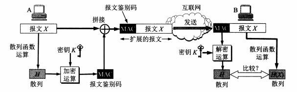
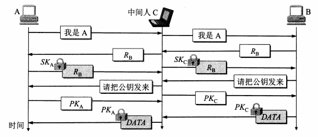
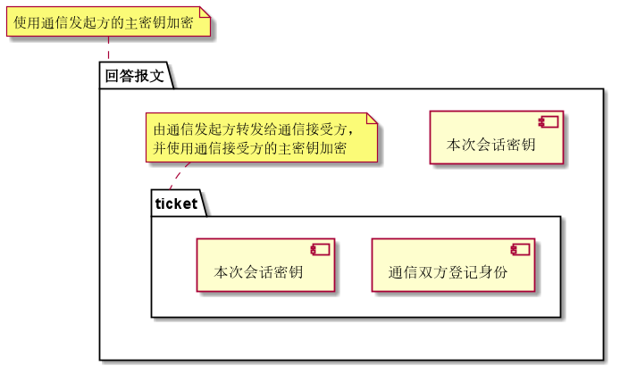
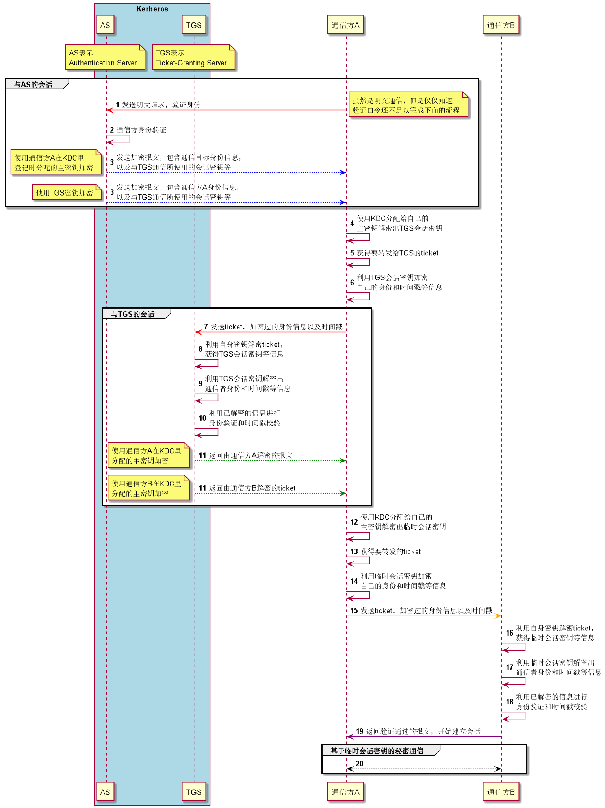
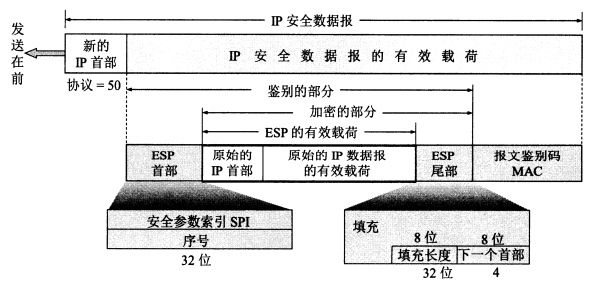

## 网络安全威胁概述

计算机网络通信面临的威胁可以分为两大类：**被动攻击**和**主动攻击**。

被动攻击是指攻击者从网络上窃听他人的通信内容，故也称截获。在被动攻击中，攻击者指示观察和分析某一协议数据单元PDU而不干扰信息流（流量分析，traffic analysis）。

主动攻击包含但不限于以下几种方式：

|攻击方式|说明|
|:------|:----------|
|篡改|包括彻底中断传送的报文、传送伪造报文等|
|恶意程序|包括病毒（virus）、蠕虫（worm）、木马（Trojan horse）、逻辑炸弹（logic bomb）、后门入侵（backdoor knocking）以及流氓软件等|
|拒绝服务DoS|攻击者向特定服务器持续发送大量分组，使服务器无法提供正常服务（Denial of Service），甚至完全瘫痪，常见手段为基于大量肉鸡的分布式拒绝攻击，即DDoS（Distibuted DoS）|

## 通信加密方法

### 数据加密模型

一般的数据加密模型如下图所示：

从图中可以看到，明文$X$被加密成密文$Y$的过程为：$$Y=E_K(X)，E_K表示某种加密算法$$而将密文$Y$解密为明文$X$的过程为：$$X = D_K(Y) = D_K(E_K(X))，D_K表示某种解密算法$$

>注意，加密和解密用到的密钥K可以是完全一样的，也可以是不一样但具有某种相关性的。

数据加密的基础是密码学（cryptology），它有两大领域，一是设计密码体制的密码编码学（cryptography），二是在未知密钥的情况下从密文推演出明文或密钥的密码分析学（cryptanalysis）。

无论截获者能获取到多少密文，只要截获者无法从中分析出足够信息来唯一地确定对应的密文，那么用于加密的这种密码体制就被称为“无条件安全/理论上不可破解”。然而在现实世界，目前几乎所有使用的密码体制在**无任何限制**的条件下都是可以破解的。出于实用性的考虑，人们更关心在计算上（即一定时间内可以调用所有能调用的资源）不可破解的密码体制，因为在通常情形中，任何一个完善的安全机制都不会允许攻击者调用无限多的计算资源和花费无限长的时间去进行破解。

### 对称/非对称密钥密码体制

#### 对称密钥密码体制

对称密钥的含义是加密密钥和解密密钥都使用**相同**的密码体制。这种密码体制的典型例子就是数据加密标准DES（Data Encryption Standard）。

DES是一种分组密码。在加密前，先对整个明文进行分组，每组是一个64位长的二进制数据。接着对每个组进行加密处理，转换成64位一组的密文数据。最后将各组密文串接即可获得整个密文。加密使用的密钥有64位，其中8位专门用于奇偶校验，其余56位是真正的密钥。DES的最大缺陷在于，在算法公开的情况下，密钥的保密就完全决定了DES的保密性。而56位的密钥长度在如今计算机算力大幅提升，且DES密钥搜索专用芯片已经面世的环境下，也早已不是什么不可逾越的障碍——尽管如此，DES在其他方面并没有什么大的缺陷被发现。

为了解决DES密钥长度过短的问题，有学者提出了一个广泛使用于网络和金融等系统的三重DES（Triple DES/3DES）加密方案：把一个64位明文用一个密钥$K_1$加密，然后用另一个密钥$K_2$解密（这个步骤在密码学上并没有什么讲究），最后再用$K_1$加密。整个过程用数学语言可以概述为$$Y=DES_{K1}(DES^{-1}_{K2}(DES_{K1}(X)))$$

>上式中$DES^{-1}$表示加密的逆操作，也就是解密。双重密钥相当于直接将DES密钥长度扩展一倍，这样就大大提高了破解代价。3DES并不是什么全新的加密算法，仅仅是提高了破解难度的DES而已。

1997年，美国标准与技术协会（NIST）开始遴选高级加密标准AES（Advanced Encryption Standard）以替代DES；2001年，Rijndael算法被选为AES，对称密钥密码体制自此翻开了新的篇章。

#### 非对称密钥密码体制

非对称密钥密码体制和对称密钥密码体制相反，加密密钥和解密密钥是**不同**的，其加密技术也被称为非对称加密。非对称密钥密码体制的产生基于两方面的原因：对称密钥密码体制的密钥分配问题，以及对数字签名的需求。非对称密钥密码体制的典型例子就是1978年由Rivest、Shamir和Adleman正式发表的RSA，该算法至今仍广泛活跃在各种需要使用非对称加密技术的场合之中。

非对称密钥密码体制的加密密钥跟加密算法和解密算法一样都是公开的，因此称为公钥（public key），这也使得非对称密钥密码体制被称作公钥密码体制；而解密密钥是私人持有并严格保密的，因此称为私钥（secret key）。非对称密钥密码体制的工作流程如下图所示：

上图中，公钥$PK_B$和私钥$SK_B$都是由接收方B使用密钥对产生器生成的，虽然在计算机上可以很容易地产生成对的公私钥，但是从公钥推导出私钥在计算上是不可实现的。此外，公钥只能用来加密，而不能用来解密，强行使用肯定得不到预期的结果。正是由于这种特性，非对称密钥密码体制可以应用于**多对一单向保密通信**的场景中。对称密钥加密只能是一对一双向保密通信，任何一方泄露密钥都会使得加密全部失效。

非对称密钥密码体制在安全性方面的效果目前还是有目共睹的，但是非对称加密的算法开销较大，因此在某些场合中，对称加密依然还是有用武之地。需要强调的是，任何加密方法的安全性取决于**密钥长度**和攻破密文所需的**计算量**，而非简单地取决于加密体制。

非对称密钥算法在数字签名的使用中发挥了重要的作用。所谓数字签名，是一种具备**报文鉴别**、**验证报文完整性**以及确保发送者**不可否认**等三大功能的证明机制和手段。数字签名的实现可以参照下图：

可以发现，签名过程本质上就是利用发送者自己的密钥对来加密和解密报文，从而实现报文鉴别——除发送者以外没有其他人能使用该私钥产生该密文，验证报文完整性——篡改过的报文必然无法用发送者的公钥解密，以及确保发送者不可否认——只有发送者提供的公钥能解密利用发送者私钥加密过的密文。当然，上述结论的前提是**发送者的私钥没有被泄露盗用**。为了实现秘密通信，还要对已经签过名的报文再进行一次非对称加密，整体流程就大致如下图所示：

### 鉴别

鉴别是指验证通信双方是否为自己所要通信的对象，而不是其他的冒充者，并且所传送的报文没有被他人篡改过。鉴别可以按照对象划分为报文鉴别和实体鉴别两大类。

1. **报文鉴别**

从理论上讲，用数字签名就能实现报文鉴别，但是对较长的报文而言，采用数字签名反而会耗费大量的CPU时间，因此需要采用更为简单一些的方式，即Hash函数。Hash函数的输入长度可以很长，但输出结果的长度则是固定的，并且有可能比报文还要短得多。尽管不同的输入有可能会得到相同的输出，但是这种概率太低，以至于想要伪造一份能够用Hash函数计算出相同Hash值的报文在计算上不可实现。

常用的Hash函数有MD5和SHA-1、SHA-256等，但是在密码学领域，MD5和SHA-1已经被证明不安全，因此逐渐被其他更安全的加密算法所替代。但是MD5目前还可以应用于文件错误检查，比如校验下载的文件。在使用Hash函数的基础上，还要对计算出的Hash值通过密钥再加密一次，得出**报文鉴别码**（Message Authentication Code，MAC），最后和报文拼接到一起再发出去，整个过程示意图如下：

注意在上图中，报文本身没有加密，只是拼接了MAC用于鉴别而已，但也足以保护报文的完整性。

>注意，报文鉴别码的缩写和媒体接入控制MAC一样，需要根据上下文进行理解。目前使用最广泛的MAC标准是HMAC，通常会跟SHA-256之类的Hash函数搭配使用。

2. **实体鉴别**

实体鉴别的含义是在系统接入的全部持续时间内对和自己通信的对方实体**只需验证一次**。

简单的身份口令鉴别容易遭到**重放攻击**（replay attack），即攻击者截获发送者S的报文后并不破解，而是直接发给接收者R；R误以为攻击者就是原本的发送者，于是把本应该发送给S的报文发给了伪装成S的攻击者。避免重放攻击的方法就是使用不重数（nonce），也就是一个不重复使用的大**随机数**，把重复的鉴别请求和新的鉴别请求区分开来。通信双方在进行不同会话时会采用不同的不重数集，这样攻击者就无法重复使用所截获的不重数。

除了重放攻击之外，还有一种非常著名的针对实体鉴别的攻击方式：**中间人攻击**（man-in-the-middle attack，MITM）。这种攻击在形式上表现为“**对发送方冒充自己是接收方，对接收方冒充自己是发送方**”，典型的攻击流程如下图所示：

MITM和重放攻击在形式上有一些相似之处，但是MITM的区别在于攻击者使用自己的密钥，顶替了原本通信双方其中一方的密钥，从而实现报文的监听和解密。也就是说，通信双方的报文在攻击者那里是完全透明的，毫无秘密可言，极大威胁通信安全。与中间人攻击相关的网络安全事件有很多，比如臭名昭著的中国互联网网络信息中心（China Internet Network Information Center，CNNIC）曾因卷入中间人攻击事件，其根证书被Google、Mozilla等公司集体吊销（拒绝信任），最终导致CNNIC自己也不得不改用海外机构签发的根证书才能访问有关网站。

### 密钥分配

密钥分配是密钥管理当中的一个重要环节。常用的分配方式可以分为**网外**分配和**网内**分配两大类，前者可以通过派可靠信使进行密钥分配，而后者主要采取自动化手段进行分配。不管采用哪种方式，都必须严格保证分配通路的安全性。

#### 对称密钥的分配

对称密钥分配有两大核心：密钥分配中心KDC（Key Distribution Center）和密钥分配协议。

KDC是一个受到广泛信任的机构，其任务是**给需要进行秘密通信的用户临时分配一个一次性的会话密钥**。KDC会定期为每个登记用户分配一个用于和KDC进行通信的主密钥（master key），当两个用户需要进行秘密通信时，其中一方（发起方）会先通过明文方式告知KDC通信双方的登记身份，接着KDC向通信发起方返回一个回答报文，其包含的内容大致如下图所示：

通信接受方拿到通信发起方送来的ticket并解密出会话密钥，之后双方就可以利用该密钥进行秘密通信了。

注意，在上面的过程中，解密报文和ticket的主密钥都没有在网上传送，只要KDC和通信双方没有泄露主密钥，即便回答报文和ticket被拦截也不会被轻易破译。

KDC要执行上述工作过程，自然离不开密钥分配协议。目前使用相当广泛的密钥分配协议是Kerberos V5，由MIT开发，使用AES加密，它既是一个协议，同时也是一个KDC。Kerberos的基本工作流程如下图所示：

>注意，Kerberos对时间误差有一定的容忍度，如果误差太大就会导致验证失败。因此想通过永久持有一个带有时间戳的报文进行重放攻击是不可能的。此外，Kerberos不仅支持对称密钥分配，而且支持非对称密钥的分配。

#### 非对称密钥的分配

非对称密钥的分配和对称密钥都要依赖于一个可以高度信任的机构，对后者来说是KDC，对前者来说就是认证中心CA（Certification Authority）。CA一般由政府出资建立，其任务就是将公钥和实体进行绑定，并向实体签发证书（certificate），以自身信用担保这些信息的真实性。任何用户都可以通过正规CA去验证某个公钥是否属于某个实体。

前文曾提到过，中国互联网网络信息中心CNNIC因卷入中间人攻击事件，导致机构信用彻底破产，其签发的证书也被吊销，以致于机构本身的网页服务都不得不改用其他CA的证书才能正常访问。可以看到，如果一个CA不能保证自己的信用，那么就无法确保使用该CA签发证书的实体不会对用户做出危险举动。因此最稳妥的举措自然就是效仿某些官僚，实行一刀切的政策，直接将这个失信的CA排除在外。

为了使CA证书具有统一格式，ITU-T制定了X.509协议标准，用于描述证书的结构。在X.509中规定要使用ASN.1，IETF在X.509的基础上做了少许改动，最终形成了RFC 5280的互联网X.509公钥基础结构PKI（Public Key Infrastructure）。

## 安全协议

### IPsec协议族

IPsec是IP security的缩写，它支持IPv4和IPv6。IPsec协议族是一套框架，它允许通信双方选择合适的加密和鉴别算法，为了确保互操作性，它还包含了一套加密算法，所有IPsec的实现都必须使用。IPsec协议族由三大部分组成：

+ IP安全数据报格式协议：鉴别首部AH（Authentication Header）协议和封装安全有效载荷ESP（Encapsulation Security Payload）协议；
+ 加密和鉴别算法；
+ 互联网密钥交换IKE（Internet Key Exchange）协议。

AH协议提供源点鉴别和数据完整性检验，但不支持保密，而复杂得多的ESP协议不仅支持保密，而且还包含了AH协议的功能，因此在使用ESP的情况下可以不用AH。使用了ESP或AH的IP数据报称为IPsec数据报，可以使用**运输模式**（transport mode）和**隧道模式**（tunnel mode）两种方式工作，最常用的是后者。运输模式是在整个运输层报文段的首尾分别添加若干控制信息，再加上IP首部组成IPsec数据报；而隧道模式则是在原始的IP数据报首尾分别添加若干控制信息，再加上新的IP首部构成IPsec数据报。IPsec数据报的IP首部并不加密，只是数据部分加密，因此加密的数据部分就被称作有效载荷（payload）。

在隧道模式下，IPsec数据报的结构如下图所示：

一个源实体和目的实体在发送IPsec数据报之前需要先创建一条网络层的逻辑链接，即安全关联SA（Security Association）。这是一条从源点到终点的**单向**连接，可以提供安全服务。如果需要确保双向安全通信，那么就要两个方向都建立SA。建立了SA的路由器或主机需要读取和维护这条SA的状态信息，以了解如何加密和鉴别IP数据报。通常的维护项目有：

1. 安全参数索引SPI；
2. SA的源点和终点的IP地址；
3. 所使用的加密类型；
4. 加密时用到的密钥；
5. 完整性检查的类型；
6. 鉴别使用的密钥。

需要注意的是，SA并不是用完即弃的一次性用品，它往往被存储于安全关联数据库SAD（Security Association Database）当中。当主机要发送IPsec数据报时，就要在SAD种查找相应的SA，以获取对该IP数据报实施安全保护的必要信息；当主机要接收IPsec数据报时，同样需要在SAd种查找相应的SA，以获得必要信息检查该分组的安全性。除了SAD，还有一个安全策略数据库SPD（Security Policy Database），专门用于指明什么样的数据报需要进行IPsec处理，以及在IP数据报到达时应当做什么。

大型SAD的建立往往采用自动化操作，这时候IKE就派上用场了。IKE是一个非常复杂的协议，目前已成为互联网正式标准，最新版本IKEv2，具体可参考RFC 7296/4945/7427这三份标准。IKE的主要任务就是为IPsec数据报创建SA，其工作基于以下三个协议：

|协议|描述|
|:----|:------|
|密钥生成协议Oakley||
|安全密钥交换机制SKEME|Secure Key Exchange Mechanism，利用公钥加密来实现密钥交换协议中的实体鉴别|
|互联网安全关联和密钥管理协议ISAKMP|Internet Secure Association and Key Management Protocol，用于实现IKE中定义的密钥交换，使之能以标准化、格式化的报文创建SA|

### SSL/TLS

安全套接字层SSL（Secure Socket Layer）是Netscape公司在1994年开发的安全协议，后来IETF在SSL3.0基础上又设计了运输层安全TLS（Transport Layer Security）协议，为所有基于TCP的网络应用提供安全数据传输服务。由于SSL和TLS都是广泛使用的运输层安全协议，因此通常都会把两者并列提及为SSL/TLS，就如同TCP/IP那样。

虽然SSL/TLS是一种TCP增强服务，但实际上它运行在应用层，也就是夹在应用程序和TCP之间，形成了一个SSL/TLS子层。就是这一子层实现了应用层下发数据的加密和运输层上交数据的解密。在介绍[HTTP协议](/ComputerNetwork/Chapter_6_应用层?id=超文本传送协议http)的时候曾经提到过一个概念，即HTTP加上SSL/TLS就得到了HTTPS，这就是SSL/TLS的一个典型应用。SSL/TLS提供的安全服务大致有三类：

+ SSL/TLS服务器鉴别，允许客户验证服务器的身份；
+ SSL/TLS客户鉴别，允许服务器验证客户的身份，该服务是可选的；
+ SSL/TLS会话加密和报文篡改检测。

## 系统安全

前文所讨论的各种加密方法和安全协议等机制只能解决一部分网络安全问题。对于已经入侵到计算机的恶意程序，这些安全机制不仅无法应付，甚至还有可能被反利用（比如勒索病毒将用户硬盘文件全部加密）；而针对服务器发动DDoS攻击使之丧失继续提供正常服务的能力，即便秘密通信绝对安全也无济于事。

### 防火墙

防火墙（firewall）是一种**访问控制技术**（包括软件和硬件设备），用于实施访问控制策略（一般由使用者自行制定），控制进出网络边界的分组，从而禁止任何不必要的通信，减少潜在入侵的发生。防火墙将网络划分为可信网络（trusted network）和不可信网络（untrusted network）两个领域，可信网络就是指位于防火墙以内受到访问控制策略保护的网络，不可信网络则代表位于防火墙以外不受控制的网络，通常就是互联网。

防火墙技术通常分为**分组过滤路由器**和**应用网关/代理服务器**两大类，通常情况下都是结合使用。前者简单高效，对用户透明，基于分组的网络层或运输层首部信息制定过滤规则，然后路由器依照规则检查进出内部网络的分组，并决定是执行转发还是丢弃操作；后者检查应用层报文数据，从而实现报文过滤和高层用户鉴别，但是需要针对每种应用单独配置，处理负担较重，对用户也不透明。

### 入侵检测系统IDS

入侵检测系统IDS（Intrusion Detection System）是一种对进入网络的分组进行深度检测分析，用于发现和提示疑似入侵行为的网络活动的防御机制。IDS能用于检测多种网络攻击，包括网络映射、端口扫描、DoS攻击、蠕虫和病毒，以及系统漏洞攻击等。IDS的入侵检测方法一般可以分为**基于特征**和**基于异常**两种，前者较为常用。传统的IDS入侵检测往往需要投入大量人力物力去分析网络攻击的流量和报文等方面的统计规律，从而提取出相应的特征，并在此基础上制定检测规则。随着机器学习技术的发展，AI的自主学习分析能力将越来越强，依靠AI实现高效入侵检测和防御，对于IDS而言是一个重要的发展方向。

### 杀毒软件

已经入侵到计算机的恶意程序，比如各种蠕虫、病毒、恶意脚本和流氓软件等，它们的目标可能不止窃听通信内容，还会包括扫描甚至篡改计算机文件，而且扫描文件和篡改文件还不一定需要联网，所以针对联网通信的那些安全措施基本上可以说是无能为力。要对付这些恶意程序，通常情况下就是安装杀毒软件。

杀毒软件的工作原理和IDS有些类似，就是进行特征检测，包括文件特征检测和行为特征检测。文件特征包括文件md5码、文件格式以及特定文件内容（比如执行代码）等；行为检测主要是指检测高风险的敏感操作，如修改系统敏感配置和系统敏感文件等。通常的杀毒软件会在检测到恶意程序之后就会报警提示用户，在一些情况下还会自动执行阻断和隔离的操作。

