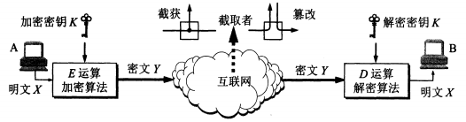
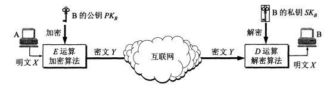
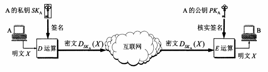
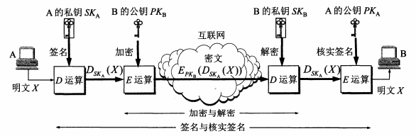

## 网络安全威胁概述

计算机网络通信面临的威胁可以分为两大类：**被动攻击**和**主动攻击**。

被动攻击是指攻击者从网络上窃听他人的通信内容，故也称截获。在被动攻击中，攻击者指示观察和分析某一协议数据单元PDU而不干扰信息流（流量分析，traffic analysis）。

主动攻击包含但不限于以下几种方式：

|攻击方式|说明|
|:------|:----------|
|篡改|包括彻底中断传送的报文、传送伪造报文等|
|恶意程序|包括病毒（virus）、蠕虫（worm）、木马（Trojan horse）、逻辑炸弹（logic bomb）、后门入侵（backdoor knocking）以及流氓软件等|
|拒绝服务DoS|攻击者向特定服务器持续发送大量分组，使服务器无法提供正常服务（Denial of Service），甚至完全瘫痪，常见手段为基于大量肉鸡的分布式拒绝攻击，即DDoS（Distibuted DoS）|

## 通信加密方法

### 数据加密模型

一般的数据加密模型如下图所示：

从图中可以看到，明文$X$被加密成密文$Y$的过程为：$$Y=E_K(X)，E_K表示某种加密算法$$而将密文$Y$解密为明文$X$的过程为：$$X = D_K(Y) = D_K(E_K(X))，D_K表示某种解密算法$$

>注意，加密和解密用到的密钥K可以是完全一样的，也可以是不一样但具有某种相关性的。

数据加密的基础是密码学（cryptology），它有两大领域，一是设计密码体制的密码编码学（cryptography），二是在未知密钥的情况下从密文推演出明文或密钥的密码分析学（cryptanalysis）。

无论截获者能获取到多少密文，只要截获者无法从中分析出足够信息来唯一地确定对应的密文，那么用于加密的这种密码体制就被称为“无条件安全/理论上不可破解”。然而在现实世界，目前几乎所有使用的密码体制在**无任何限制**的条件下都是可以破解的。出于实用性的考虑，人们更关心在计算上（即一定时间内可以调用所有能调用的资源）不可破解的密码体制，因为在通常情形中，任何一个完善的安全机制都不会允许攻击者调用无限多的计算资源和花费无限长的时间去进行破解。

### 对称/非对称密钥密码体制

#### 对称密钥密码体制

对称密钥的含义是加密密钥和解密密钥都使用**相同**的密码体制。这种密码体制的典型例子就是数据加密标准DES（Data Encryption Standard）。

DES是一种分组密码。在加密前，先对整个明文进行分组，每组是一个64位长的二进制数据。接着对每个组进行加密处理，转换成64位一组的密文数据。最后将各组密文串接即可获得整个密文。加密使用的密钥有64位，其中8位专门用于奇偶校验，其余56位是真正的密钥。DES的最大缺陷在于，在算法公开的情况下，密钥的保密就完全决定了DES的保密性。而56位的密钥长度在如今计算机算力大幅提升，且DES密钥搜索专用芯片已经面世的环境下，也早已不是什么不可逾越的障碍——尽管如此，DES在其他方面并没有什么大的缺陷被发现。

为了解决DES密钥长度过短的问题，有学者提出了一个广泛使用于网络和金融等系统的三重DES（Triple DES/3DES）加密方案：把一个64位明文用一个密钥$K_1$加密，然后用另一个密钥$K_2$解密（这个步骤在密码学上并没有什么讲究），最后再用$K_1$加密。整个过程用数学语言可以概述为$$Y=DES_{K1}(DES^{-1}_{K2}(DES_{K1}(X)))$$

>上式中$DES^{-1}$表示加密的逆操作，也就是解密。双重密钥相当于直接将DES密钥长度扩展一倍，这样就大大提高了破解代价。3DES并不是什么全新的加密算法，仅仅是提高了破解难度的DES而已。

1997年，美国标准与技术协会（NIST）开始遴选高级加密标准AES（Advanced Encryption Standard）以替代DES；2001年，Rijndael算法被选为AES，对称密钥密码体制自此翻开了新的篇章。

#### 非对称密钥密码体制

非对称密钥密码体制和对称密钥密码体制相反，加密密钥和解密密钥是**不同**的，其加密技术也被称为非对称加密。非对称密钥密码体制的产生基于两方面的原因：对称密钥密码体制的密钥分配问题，以及对数字签名的需求。非对称密钥密码体制的典型例子就是1978年由Rivest、Shamir和Adleman正式发表的RSA，该算法至今仍广泛活跃在各种需要使用非对称加密技术的场合之中。

非对称密钥密码体制的加密密钥跟加密算法和解密算法一样都是公开的，因此称为公钥（public key），这也使得非对称密钥密码体制被称作公钥密码体制；而解密密钥是私人持有并严格保密的，因此称为私钥（secret key）。非对称密钥密码体制的工作流程如下图所示：

上图中，公钥$PK_B$和私钥$SK_B$都是由接收方B使用密钥对产生器生成的，虽然在计算机上可以很容易地产生成对的公私钥，但是从公钥推导出私钥在计算上是不可实现的。此外，公钥只能用来加密，而不能用来解密，强行使用肯定得不到预期的结果。正是由于这种特性，非对称密钥密码体制可以应用于**多对一单向保密通信**的场景中。对称密钥加密只能是一对一双向保密通信，任何一方泄露密钥都会使得加密全部失效。

非对称密钥密码体制在安全性方面的效果目前还是有目共睹的，但是非对称加密的算法开销较大，因此在某些场合中，对称加密依然还是有用武之地。需要强调的是，任何加密方法的安全性取决于**密钥长度**和攻破密文所需的**计算量**，而非简单地取决于加密体制。

非对称密钥算法在数字签名的使用中发挥了重要的作用。所谓数字签名，是一种具备**报文鉴别**、**验证报文完整性**以及确保发送者**不可否认**等三大功能的证明机制和手段。数字签名的实现可以参照下图：

可以发现，签名过程本质上就是利用发送者自己的密钥对来加密和解密报文，从而实现报文鉴别——除发送者以外没有其他人能使用该私钥产生该密文，验证报文完整性——篡改过的报文必然无法用发送者的公钥解密，以及确保发送者不可否认——只有发送者提供的公钥能解密利用发送者私钥加密过的密文。当然，上述结论的前提是**发送者的私钥没有被泄露盗用**。为了实现秘密通信，还要对已经签过名的报文再进行一次非对称加密，整体流程就大致如下图所示：

### 鉴别

鉴别是指验证通信双方是否为自己所要通信的对象，而不是其他的冒充者，并且所传送的报文没有被他人篡改过。鉴别可以按照对象划分为报文鉴别和实体鉴别两大类。

### 密钥分配

## 安全协议

### IPsec协议族

### 安全套接字层SSL

### 运输层安全TLS

## 系统安全

### 防火墙

### 入侵检测系统IDS