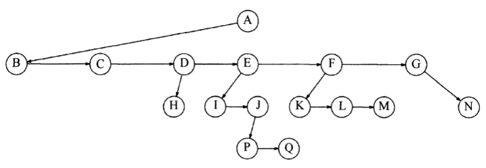

## 基本概念

树（tree）是 $n$ （$n \ge 0$）个结点的有限集（在一些专业书籍中，也将树定义为“保证结点连通的最小连接方式”），本质上是一种图（graph）。在任意一棵非空树中，<u>有且仅有一个根结点（root）</u>，当 $n \ge 1$ 时其余结点可分为 $m （m \ge 0）$ 个**互不相交**的有限集（称为**根的子树**）。对于一棵包含 $n$ 个结点的树，其内部具有 $n - 1$ 条边。

一般来说，分等级的分类方案都可用层次结构来表示，从而形成一个树的结构——这同时意味着树结构通常不宜采用数组来表示，而是利用链表。

树结构中包含以下重要的概念：

+ **结点**

树的结点表示包含一个数据元素及若干指向其子树分支的一种数据结构。

一个结点的子树根结点被称为孩子（Child），相应地，该结点就是孩子的父辈（Parent），同一个父辈的孩子之间互称兄弟（Sibling）。

一个结点的祖先（ancestor）是指从根结点到该结点所经分支上的所有结点，反之，以某结点为根的子树中的所有结点都是该结点的子孙（descendant）。

+ **度**

度（degree）可以分为两种，一种是结点的度，<u>用于描述一个结点所拥有的子树数量</u>；另一种是树的度，<u>用于描述树内各结点的度的最大值</u>。

度为0的结点称为**叶结点**（leaf）或**终端结点**，反之则为**分支结点**或**非终端结点**。

+ **路径与层次**

从结点$n_1$到$n_k$的路径（path）定义为结点$n_1$，$n_2$，···，$n_k$的一个序列，使得对于$1 \le i \le k$的结点$n_i$是$n_{i+1}$的父结点。路径的长度（length）就是该条路径上的边的条数，即包含$k$个结点的路径长度为k-1$$。每个结点都有一条到达自身的长度为0的路径；每个结点与根结点之间都恰好存在一条路径。

如果存在$n_1$到$n_2$的一条路径，那么$n_1$是$n_2$的一位**祖先**（ancestor），而$n_2$就是$n_1$的一个**后裔**（descendant）；若$n_1 \ne n_2$，则$n_1$是$n_2$的真祖先（proper ancestor），$n_2$就是$n_1$的真后裔（proper descendant）。

结点的层次（level）从根开始定义，以根为第一层，根的孩子为第二层，孩子的孩子在第三层，依此类推。树中结点的**最大层次**称为树的深度（depth）或高度。

+ **森林**

森林（forest）是 $m（m \ge 0）$ 棵**互不相交**（即每棵树的每个结点都不与其他树内部的结点发生联系）的树的集合，对于树中每个结点而言，其**子树**的集合即为森林。

+ **有序树和无序树**

这里需要先了解一下树的实现方式。树的一种典型实现方式，被称作“孩子-兄弟表示法”，也就是一个结点自身除了包含数据之外，（可能）还会分别声明指向第一个子结点和相邻兄弟结点的链接。这种方式的好处在于，可以避免每个结点都要为其下所有子结点建立直接链接，即便子结点数可能发生很大变化也不会造成太多空间浪费，并且还能保证树中各个结点的结构是统一的。

如果用图画来表示一个结点的第一个子结点和相邻兄弟结点，通常是“左指孩子，右指兄弟”，其形式大致如下图：

在“孩子-兄弟表示法”下实现的树，其结点的各个子树可以看成是**从左至右**是有次序的（即位置不能互换），这就是所谓的有序树。当然，后面要说到的二叉树也是有序树，虽然不是采用“孩子-兄弟表示法”，但也十分相似。如果树中结点不像前面描述的那样是有次序的，那就是无序树。

## 二叉树

### 定义

二叉树（binary tree）是一种每个结点**至多**只有两棵子树的**有序**（自上而下、从左到右分布）树形结构。根据具体形态的不同，又可分为*满二叉树*、*完全二叉树* 以及*非完全二叉树*。

**满二叉树**是指深度为 $k$ 且结点数等于 $2^k-1$ 的二叉树。在满二叉树中，层 $i$ 的结点数是$2^i-1$，亦即除最后一层是叶结点外，其余层中的结点都是度数为2的非终端结点。

**完全二叉树**是满二叉树的一个<u>严格子集</u>，如果对满二叉树的各个结点自上而下、从左到右进行编号，则完全二叉树包含了满二叉树的部分结点，且编号和位置一一对应。完全二叉树具有两个特点：1）叶结点只可能在**层次最大**的两层上出现；2）对任一结点，若其右分支下的子孙的最大层次为 $l$，则其左分支下的子孙的最大层次必为 $l$ 或 $l+1$。

**非完全二叉树**就是满二叉树以及完全二叉树以外的所有二叉树的总称。

### 性质

**性质1：**   在二叉树的第 $i$ 层上最多有 $2^{i-1}$ 个结点$（i \ge 1）$

**性质2：**   深度为 $k$ 的二叉树至多有 $2^k-1$ 个结点$（k \ge 1）$

**性质3：**   对于任意一棵二叉树，若其终端结点数为 $n_0$，度为2的结点数为 $n_2$，则 $n_0 = n_2 + 1$

**性质4：**   具有 $n$ 个结点的<u>完全</u>二叉树的深度为 $⌊log_2\ n⌋ + 1$（⌊ ⌋表示向下取整）

**性质5：**   如果对一棵有 $n$ 个结点的完全二叉树的结点按**层序**编号（自上而下，从左到右），对于任意一个结点 $i（1 \le i \le n）$ 都有：
* 若 $i = 1$ ，则结点 $i$ 为根节点；若 $i \ge 1$ ，则其双亲为结点 $⌊i/2⌋$；
* 若 $2i > n$ ，结点 $i$ 无左孩子，否则其左孩子为结点 $2i$；
* 若 $2i + 1 > n$ ，结点 $i$ 无右孩子，否则其右孩子为结点 $2i + 1$；

一棵普通二叉树的深度通常比结点个数要小得多，平均深度为$O(\sqrt{N})$，而对于一些特殊类型的二叉树，比如后面谈到的二叉查找树（binary search tree，BST），其平均深度为$O(log\ N)$，再比如最坏情形下的一种二叉树，（除叶结点外的）每个结点都只有一棵子树，也就是度全部为1，这时树的深度就跟结点数相当了。这些信息所带来的一个重要启示，就是开发者在组织数据的时候，要注意采用合理的层级结构。

### 存储结构

+ **顺序结构**

顺序结构使用一组地址连续的存储单元依次自上而下、从左到右存储**完全**二叉树上的结点元素。这种存储结构只适用于完全二叉树，因为一般二叉树会使得存储单元中有太多的空单元（也就是使用空单元表示不存在此结点）。

+ **链式结构**

用链式结构表示的二叉树结点至少包含3个域：<u>数据域</u>和<u>左右子结点指针域</u>，有时还会增加指向父结点的指针域，这种存储结构被分别称作二叉链表和三叉链表。如果是叶结点，那么左右子结点的指针域就会指向null。但是在作图时，通常并不需要把null链画出来，因为具有$N$个结点的一棵二叉树都将需要$N+1$个null链。

### 遍历二叉树

遍历二叉树是指按照某条搜索路径巡访树中每个结点，使得每个结点均被且只被访问一次。如果限定访问顺序为**先左后右**，那么就会衍生出三种遍历顺序：（1）**先序遍历**：根结点➡左子树➡右子树；（2）**中序遍历**：左子树➡根结点➡右子树；（3）**后序遍历**：左子树➡右子树➡根结点。

三种遍历方式经过的结点都是一样的，只不过访问各结点的时机有所不同而已。遍历的结果最终可以用一个[栈](DataStructure/stack?id=栈)或者数组等一维结构来进行存储，因此二叉树遍历问题的核心实际上就是**二维结构线性化**。一棵二叉树可以通过遍历来确定其结构，通常会使用中序遍历+另一种遍历序列来联合确定。

除了上面这三种遍历顺序，还有自上而下、从左到右的**层序遍历**。而无论采用哪一种次序进行遍历，其时间复杂度和空间复杂度均为$O(N)$。

树、森林和二叉树之间可以借助二叉链表进行相互转换。

### 线索二叉树

在二叉链表结点的基础上，将原本用来指示左右孩子的null指针域，改造成指示本结点前驱和后继的指针域（线索），即构成线索链表，加上线索的二叉树即为线索二叉树。对二叉树以某种次序遍历使其变为线索二叉树的过程叫做**线索化**。线索化的过程，实际上就是在遍历过程中修改空指针使其成为线索，从而使结点具备指示其前驱与后继的能力的过程。在线索二叉树上进行遍历，只要找到序列中第一个结点，然后依次找结点后继直至后继为空为止。

### 二叉查找树

二叉树的一个重要应用是“查找”。对于树中的每个结点$N$，当其左子树中所有项的值都小于$N$的项，而右子树所有项的值都大于$N$的项，那么这种二叉树就被称作二叉查找树，也称二叉排序树（binary sort tree，BST）。当然，上述各结点之间的值比较并没有什么特定的要求，只要它们的项都包含有能够用于量化和排序的指标，那么就可以构成一棵二叉查找树。

如果组成树的结点包含有重复项，一种可行的方式是增加一个记录值，用于描述重复的频率，这样比直接添加一个重复元素到树中导致深度变大要好一些。另外，在对包含有重复项的二叉查找树做删除时，通常只是将结点标记为“已删除”，这种策略被称为**懒惰删除**（lazy deletion）：如果是重复结点，不过是减少重复频率数，再重新插入也就是增加重复频率数而已，性能开销并不大；如果是非重复结点，那么无论是删除还是重新插入，都只需要修改标记，同样不会消耗太多性能。只有在插入全新结点时，才会有较大的性能开销，这对于一棵以查找为核心操作的二叉查找树来说是比较好的。

一棵树中所有结点的深度之和被称为**内部路径长**（internal path length）。对于一棵二叉查找树，如果所有的插入序列都是等可能的，那么所有结点的平均深度将为$O(log\ N)$。

### 平衡查找树

### Huffman树

## 三、树与等价问题

## 四、回溯法、树的遍历与树的计数