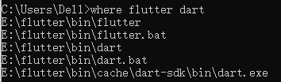
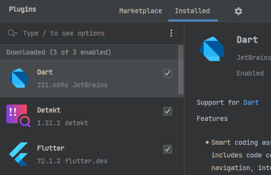
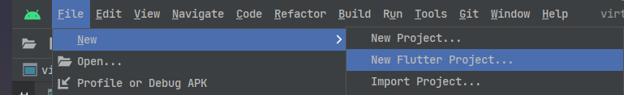
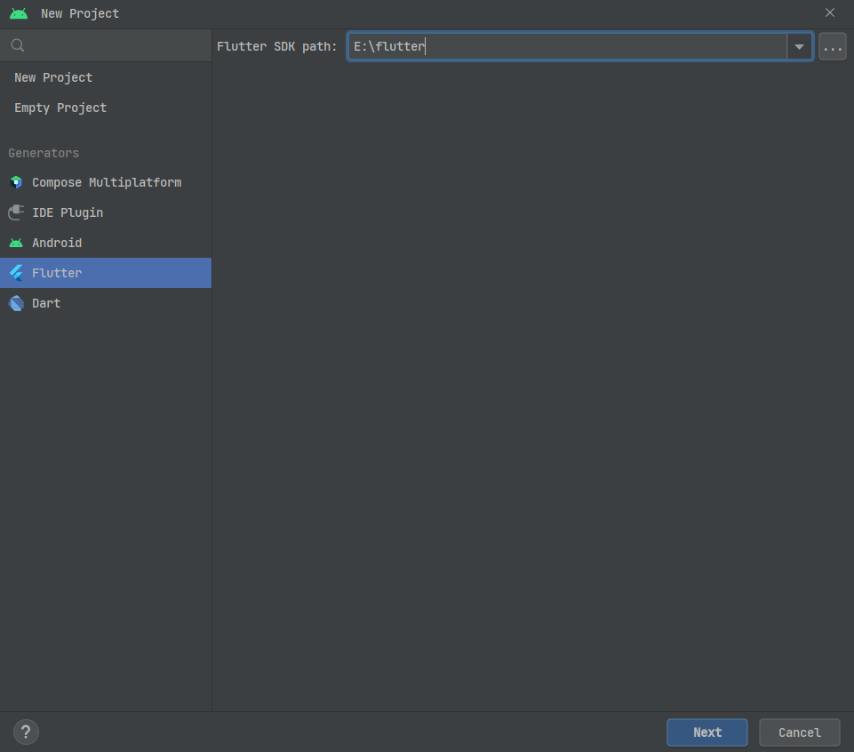
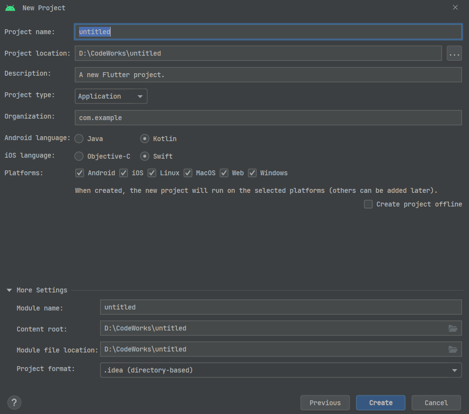

## 何为Flutter

[Flutter](https://flutter.dev/)是Google于2017年发布的一款开源框架，其设计目标为使用一套代码，为不同平台构建出好看且使用原生代码编译的应用。换句话说，Flutter就是为实现跨平台应用而打造的。

Flutter实现跨平台的技术方案，是类似Java那样采用自己的虚拟机——Dart虚拟机（跟Android早期的Dalvik虚拟机可不是同一个东西），并且提供一定的桥接技术，完成页面渲染和平台服务调用等功能。尤其值得注意的是，Flutter有自己的图形渲染引擎[Skia](https://github.com/google/skia)，这就是它的UI得以实现跨平台的重要基础。

Flutter采用的开发语言是Google自己发布的[Dart](https://dart.dev/)，这是一门几乎完全为Flutter进行深度适配，并与其牢牢绑定的编程语言。Dart以其被Google高度掌控的优势（远远超过Kotlin），成为Flutter开发的首选语言。

## Flutter开发环境搭建

### Flutter SDK下载

首先前往Flutter官网，在[指定页面](https://docs.flutter.dev/get-started/install)选择自己进行开发时使用的操作系统，点击进入后按照指示去下载Flutter SDK的压缩包到本地。

Flutter官方对于Flutter SDK的存放位置也很有讲究：1）解压Flutter SDK到指定路径下时，路径中不能包含有空格或其他特殊字符；2）不能将Flutter SDK放在`C:\Program Files\`等需要申请权限才能访问的目录下。

如果发现Flutter官网已经没有公开的可供下载的Flutter SDK链接，只能勉为其难地使用最后一种方式：从GitHub仓库中拉取。Flutter官方提供的仓库地址如下：

```
// 通常情况下使用stable版本的Flutter
git clone https://github.com/flutter/flutter.git -b stable
```

> 注意，从GitHub仓库拉取的Flutter SDK，是不包含Dart SDK的。因此需要从[Dart官网](https://dart.dev/get-dart)额外下载Dart SDK，放到`flutter\bin\cache`目录下。此外，Dart SDK在`flutter\bin\cache`目录展开后的路径应该为`flutter\bin\cache\dart-sdk\...`。

### 配置Flutter SDK的环境变量

Flutter SDK配置环境变量主要有几个地方：一是配置Flutter和Dart的SDK路径，二是为中国大陆开发者配置专门的仓库镜像地址。Flutter和Dart这两个SDK的配置方式跟JDK几乎一样，只要配置到`bin`目录级别即可；镜像地址的配置，这里以Windows为例：

首先打开系统环境变量的配置窗口，找到“用户变量”一栏；然后在“用户变量”中分别创建名为`FLUTTER_STORAGE_BASE_URL`和`PUB_HOSTED_URL`的用户变量，分别填入Flutter SDK的压缩包存储仓库和Flutter依赖库仓库镜像域名。具体可以参考[Flutter官方文档](https://docs.flutter.dev/community/china)的指导说明。

在配置好Flutter/Dart SDK的环境变量后，打开系统命令行终端，输入`where flutter dart`指令并执行，如果出现类似于下图的输出结果，就表明Flutter/Dart SDK已经成功配置：



### Android Studio的配置

如果开发者使用的Android Studio当中没有Flutter和Dart的插件，那就先去插件市场下载安装它们，然后重启Android Studio。



重启后的Android Studio，如果新建项目，就会发现已经出现了`new Flutter Project`的选项，如下图所示：



下图展示的就是在Android Studio上创建Flutter项目的一般流程：




至此，Android Studio配置Flutter/Dart开发环境的工作也基本结束了。

## 从Android到Flutter

为了更快地入门Flutter开发，这里基于[Flutter官方文档](https://docs.flutter.dev/get-started/flutter-for/android-devs)对Android原生开发和Futter开发做一些简要的对比和说明。

### 声明式UI

传统的Android原生开发采用的是命令式UI，而Flutter和Jetpack Compose在[声明式UI](https://docs.flutter.dev/get-started/flutter-for/declarative)这一技术方案上的选择出奇地一致。传统的命令式UI，除了需要开发者以`.xml`文件等形式摆好控件布局之外，还需要开发者在Activity/Fragment等位置，主动调用大量的控件API去完成界面更新；而声明式UI，则主要是让开发者聚焦于怎么把组件摆放好，至于界面更新的操作，Flutter和Jet pack Compose都有自己的一套数据订阅机制，只要运用好这套机制就基本可以抛弃以往命令式更新界面的开发思维了。

Flutter的界面元素被称为Widget，大致对应于Android View，但是它又跟Android View有很多不同。Flutter Widget的主要作用就是描述“界面上某个位置摆放了一个具备某些特性的组件”，并且是“不可变”的——刷新界面，实际上就是将某个或某些Flutter Widget用新的不可变实例对象取代掉，然后更新界面树。这跟Android View通过API修改一部分特性的实现方案完全不同，也是声明式UI的一大特性。由于抛弃了传统的Android View开发思维，布局文件之类的概念也就随之消失了，取而代之的是开发者在`.dart`文件中手撸应用界面——当然，Android Studio有提供可视化预览功能，不必担心Flutter开发会倒退到早期对着`.xml`写一堆LinearLayout的局面。

至于动画、画笔以及画布等等概念，Flutter中或者有对应的替代实现，或者直接抛弃，具体可以参考Flutter官方文档的说明。

### 项目结构

Flutter项目的结构跟以往的Android项目有很大区别。在Flutter项目中，不同平台的源码目录是相互独立的，比如Android平台就有专门的`android`目录，Windows平台有专门的`windows`目录，等等。除此之外，Flutter项目当中最重要的配置文件当属`pubspec.yaml`，它发挥的作用类似于Android项目中的`build.gradle`文件，但却远远不止Gradle。因为Flutter的跨平台特性，注定了`pubspec.yaml`不可能仅仅为Android项目的Gradle构建系统所服务，而是要整合其他平台的构建工具链，甚至是依赖库等。总之，Flutter项目在结构和构建系统等方面，从头到脚都跟Android项目有很大的差异，因此需要逐渐适应。

### Flutter插件

Flutter官方维护有一个[插件库](https://pub.dev/packages)，中国大陆开发者有时可能需要访问[https://pub.flutter-io.cn/packages](https://pub.flutter-io.cn/packages)才能正常使用它。截止到2023年2月底，Flutter插件库中的插件数量已经超过3.3万个，大量针对不同平台开发使用的插件为许多Flutter开发者带来便利。Flutter插件的导入主要借助`flutter pub add`指令，将指定插件添加到`pubspec.yaml`文件中，然后通过`import`方式导入`.dart`文件使用。由于插件的导入方式与目标平台无关，因此通常不需要担心这些操作流程无法执行。真正需要担心的是，某一系统平台上没有可用的插件，只能完全靠自己实现一个功能，这种情况就需要开发者多加注意了。