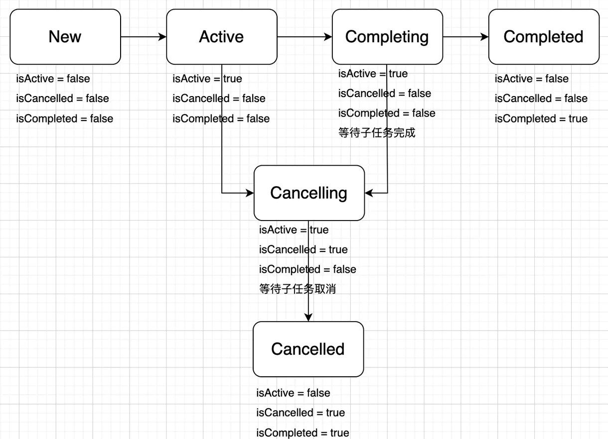

## Kotlin协程基本概念

### 协程作用域

作用域（scope）是指**变量和函数执行代码可被访问和生效的区域范围**。例如在一个类中，函数以外定义的属性，其作用域为整个类；而函数以内定义的成员变量，其作用域仅为该函数。Java里面的使用`public static`修饰的类属性和方法，其作用域即为整个项目。Kotlin协程也有对应的协程作用域，所有协程只能在协程作用域中使用，脱离协程作用域就无法通过编译。

+ **CoroutineScope**

CoroutineScope是Kotlin官方提供的作用域<font color=red>接口</font>，它声明了一个名为`coroutineContext`（协程上下文）的属性。在此基础上，Kotlin又设计了`launch`、`async`以及`runBlocking`等扩展函数，作为协程构建器。注意，这些构建器里面执行的代码也被称作“协程”，因此从这里开始，协程实际上既可以指一种并发设计模型和组件，也可以指一系列执行异步任务的代码，在后续的内容中需要联系上下文加以辨别。

常用构建器如下：

`launch{}`：用于创建一个不阻塞当前线程的协程，**并返回一个`Job`对象用于管理该协程实例**；

`async{}`：和`launch`类似，但是返回一个`Deferred`对象，里面包含一个异步代码块返回、需要调用`await()`同步获取的结果；

`runBlocking{}`：创建一个可以阻塞当前线程的协程，官方**强烈建议不要在正式开发中使用该构建器**；

`withContext(){}`：创建一个指定调度器的协程，并同步获取内部异步代码块返回的结果，通常用于取代`async{···}.await()`的用法。

+ **GlobalScope**

GlobalScope是一个由Kotlin官方实现的最基础的<font color=red>自定义</font>作用域，通常只用于功能测试或演示。它能够以单例模式创建启动一个**顶级**协程，这些协程在整个应用程序生命周期内运行，不会被过早地被取消。

然而，GlobalScope通常也不与任何生命周期组件绑定，除非手动管理，否则很难满足实际开发中的需求。因此，Android项目的程序代码应该使用自定义的协程作用域，<font color=red>强烈不建议在生产用的业务逻辑中直接使用GlobalScope</font>。

+ **MainScope**

MainScope是Android领域扩展出的自定义作用域（下面要谈到的lifecycleScope和viewModelScope也是一样），它用于在主线程中创建一个协程，但是需要注意在组件的生命周期结束时手动调用`cancel()`函数取消协程，以防内存泄漏。

+ **LifecycleCoroutineScope**

LifecycleCoroutineScope是一个抽象类，通常在Android中调用的是`lifecycleScope`这一实例对象，进而调用其内部的抽象方法。LifecycleCoroutineScope的特点是可以自动管理生命周期，开发者只需要在合适的地方调用它即可，不需要像GlobalScope或者MainScope那样手动管理协程的取消与资源释放。除了前面介绍过的常用构建器，LifecycleCoroutineScope还可以通过`launchWhenCreated{}`、`launchWhenStarted{}`以及`launchWhenResumed{}`等构建器，在合适的声明周期创建并启动协程。

+ **viewModelScope**

ViewModel没有提供lifecycleScope来创建协程，而是用了一个viewModelScope的实例对象（继承的是CoroutineScope，而不是LifecycleCoroutineScope），用于创建管理只在ViewModel生命周期内运行的协程。和LifecycleCoroutineScope类似，开发者同样不需要手动管理viewModelScope的生命周期。

### 挂起函数

目前在JVM平台上的任何Kotlin协程代码块，要么写在协程作用域里，要么写在挂起函数当中，绝无例外；同样地，挂起函数要么也是运行在协程作用域里，要么也是运行在另一个挂起函数中。之所以要这样设计，是因为JVM只认识线程，而不认识基于线程封装出来的协程。如果要让协程正常运行，那就必须设法让JVM知道哪些线程是以协程方式调用的，这就用到了`suspend`关键字来修饰相关函数，使之成为一个挂起函数。当然，这里只是简单介绍为什么要用挂起函数，`suspend`相关更深入的内容会在下一节继续介绍。

挂起函数的主要作用包括：

1. **挂起：使协程从正在执行该协程的线程上脱离出来；**
2. **切换：将协程切换到挂起函数指定的线程中继续执行；**
3. **恢复：在协程执行完毕之后自动切回1里面的原线程。**

> 注意，在引入协程之后，Kotlin语言体系中内的函数就划分为普通函数和挂起函数两派，其中挂起函数既能调用普通函数又能调用其他挂起函数，而普通函数只能调用其他的普通函数。

### 启动模式

在官方提供的Kotlin协程框架中，`launch`等构建器都会有一个`CoroutineStart`类型的`start`参数，用于设置协程的启动模式，默认值为`CoroutineStart.DEFAULT`。目前启动模式一共有如下四种：

|模式|说明|
|:--:|:---------:|
|`DEFAULT`|协程创建后立即开始调度，在调度前如果协程被取消，其将直接进入取消相应的状态|
|`ATOMIC`|协程创建后立即开始调度并执行，协程执行到第一个挂起点之前不会响应取消|
|`LAZY`|只有协程被需要时，如主动调用`start`、`join`或`await`等函数时才会开始调度，若调度前就被取消将直接进入异常结束状态|
|`UNDISPATCHED`|协程创建后立即在当前函数调用栈中执行，直到遇到第一个挂起点|

在上面的说明中，需要弄清楚“立即调度”和“立即执行”不是同一回事，一个协程从接收调度到真正执行往往还有一段时间，主要是为了寻找执行时机和分配线程。通常情况下，`DEFAULT`和`LAZY`这两种启动模式就足够应付了，其他两种主要用于一些特殊场景。

### 调度器

Kotlin协程执行通常需要进行调度，这时候就需要向构建器中传入`Dispatcher`类型的调度器。官方框架预置了以下四个调度器：

|调度器|描述|
|:----:|:------:|
|`Dispatcher.Default`|CPU密集型任务调度器，适合处理后台计算|
|`Dispatcher.IO`|IO密集型任务调度器适合执行IO相关操作|
|`Dispatcher.Main`|UI调度器，在Android上就是主线程调度器|
|`Dispatcher.Unconfined`|非受限调度器，不要求协程执行在特定线程上|

> CPU密集型任务是指**以数值运算为主**的任务（比如计算圆周率、编解码等），IO密集型任务是指**以磁盘读写和网络通信为主**的任务。

> 非受限调度器的作用是让协程在挂起点恢复执行时，会在恢复操作所在的线程上直接执行。若嵌套创建以它为调度器的协程，那么这些协程会在启动时被调度到协程框架内部的事件循环上，以免出现StackOverflow。

> `Dispatcher.Default`和`Dispatcher.IO`这两个调度器实际上用的是**同一个线程池**，但是后者会对阻塞性的IO任务并发量进行限制，并且为任务打上PROBABLY_BLOCKING标签，以便线程池在执行任务调度时对阻塞任务和非阻塞任务区别对待，避免出现资源使用不合理的情况。

如果预置的任务调度器无法满足需求，还可以继承`CoroutineDispatcher`自行定义调度器，不过更常见的做法是将[线程池](Kotlin/coroutine?id=线程池)转换为调度器，只要调用`asCoroutineDispatcher()`函数即可。但是要注意，线程池转换出来的调度器还需要主动关闭以免造成内存泄漏，通常可以调用`use`函数包裹要执行的业务逻辑，这样就不用手动管理。

如果在使用构建器开启协程时没有传入调度器，那么协程就会自动使用`EmptyCoroutineContext`而非`Dispatcher.Default`作为默认的协程上下文，换句话说就是所有协程都会运行在当前线程之中。所以如果要确保耗时任务在正确的线程上运行，最好在开启协程的时候就指明调度器，不要让系统自动将任务调度到不合适的线程当中。

## Kotlin协程基本用法

### 前置工作

在Android项目中使用协程，首先要通过Gradle导入相关依赖：

```
// 基本使用
implementation "org.jetbrains.kotlinx:kotlinx-coroutines-android:$specific_version"

// 在ViewModel中使用viewModelScope
implementation "androidx.lifecycle:lifecycle-viewmodel-ktx:$specific_version"

// 使Room支持协程
implementation "androidx.room:room-ktx:$specific_version"

// 在Activity中使用lifecycleScope
implementation "androidx.lifecycle:lifecycle-runtime-ktx:$specific_version"

// 在Service中使用lifecycleScope
implementation "androidx.lifecycle:lifecycle-service:$specific_version"
```

### 开启协程

+ **GlobalScope**

要在程序中开启一个协程，最为简单的方式如下：

```
// 开启全局顶级协程
GlobalScope.launch { 
    // TODO       
}

// 取消全局顶级协程的一种方式
GlobalScope.cancel()

// 取消全局顶级协程的另一种方式
GlobalScope.cancel("canceled by developer","exceptions")
```

在`launch{}`当中编写需要异步执行的代码，然后编译运行即可。

但是前面已经提到过，GlobalScope由于不绑定任何生命周期组件，手动管理相对麻烦，因此通常并不建议在正式的Android项目中使用。如果想要在正式的Android项目中使用协程，一般会选用MainScope、lifecycleScope以及viewModelScope这三个作用域来开启协程并进行管理。

此外，GlobalScope开启的协程类似于[守护线程](Kotlin/coroutine?id=守护线程)，只要虚拟机结束运行，无论里面的协程代码是不是一个一直在执行的死循环，都会跟着被取消。

+ **MainScope**

MainScope在主线程中开启和取消协程的基本方式如下：

```
// MainScope实例化
val mainScope = MainScope()

// 开启MainScope协程
mainScope.launch {
    // TODO
}

// 取消MainScope协程的一种方式
mainScope.cancel("Canceled by developer","exceptions")

// 取消MainScope协程的另一种方式
mainScope.cancel()
```

> 注意，必须对同一个MainScope对象进行开启和取消协程的操作，否则达不到管理协程的目的，还会引发内存泄漏问题。

+ **lifecycleScope**

lifecycleScope主要是在具有生命周期的组件（比如Activity和Fragment等）当中开启协程。它最主要的协程构建器在前面已经提到过，下面是简单用法：

```
// 在组件创建时开启协程
lifecycleScope.launchWhenCreated {
    // TODO
}

// 在组件启动时开启协程
lifecycleScope.launchWhenStarted {
    // TODO
}

// 在组件恢复时开启协程
lifecycleScope.launchWhenResumed {
    // TODO
}

// 以普通方式开启协程
lifecycleScope.launch {
    // TODO
}
```

lifecycleScope的存在意义，就在于调用它不需要额外编写任何取消协程的代码，只要组件的生命周期走到`onDestroy`这个阶段，所有属于lifecycleScope作用域的协程都会被**自行取消**，从根本上杜绝了开发者忘记手动取消协程引发内存泄漏的可能性。因此从这个角度来说，用lifecycleScope比MainScope更为方便和安全。

+ **viewModelScope**

viewModelScope用在MVVM架构的项目当中，特别是用在ViewModel里面。使用viewModelScope在ViewModel当中开启协程的基本方式如下：

```
viewModelScope.launch { 
    // TODO
}
```

viewModelScope和lifecycleScope一样，也不需要额外编写取消协程的代码。但是要注意，viewModelScope开启的协程跟ViewModel本身的生命周期是同步的。

### 异步任务

Kotlin协程既然在本质上是线程的一种良好封装，那么用来执行异步任务自然是理所应当的了。Kotlin协程提供的`async{}`构建器就是专门用来实现异步并发执行的。

`async{}`构建器的一个使用示例如下：

```
launch {
    val a = async {
        delay(1000L)
        (Math.random()*10).toInt()
    }

    val b = async {
        delay(1500L)
        (Math.random()*10).toInt()
    }

    Log.e("MyTag","a = ${a.await()} b = ${b.await()} c = ${a.await()+b.await()}")
}
```

上述示例代码的总执行时间通常接近1500毫秒，而非2500毫秒。这表明两个子协程的确是并发执行的，而且最后拿到的结果也是二者结果的汇总。

前面的内容已经提到过，`async{}`构建器返回的是一个`Deffered`对象，而`Deffered`是一个继承于`Job`的泛型接口，可以视为一个轻量级的非阻塞[Future](Kotlin/coroutine?id=future和completablefuture)。在`async{}`构建器当中，最后一行代码往往就是要返回的结果，如果不返回结果，那么通过`await()`方法拿到的结果类型就是`Unit`。

利用`async{}`构建器构建协程执行异步任务，<font color=red><u>在需要结果的地方</u></font>，调用`await()`方法获取异步任务产生的结果，这就是Kotlin协程基本的异步任务使用方式。

如果将示例代码改成下面的形式：

```
launch {
    val a = async {
        delay(1000L)
        (Math.random()*10).toInt()
    }.await()

    val b = async {
        delay(1500L)
        (Math.random()*10).toInt()
    }.await()

    Log.e("MyTag","a = $a b = $b c = ${a+b}")
}
```

执行后会发现所需时间接近2500毫秒，表明这两个协程变成**同步执行**的了。

在使用`async{}`构建器编写结构化并发代码时，如果任意一个子协程抛出异常，那么第一个子协程以及整个父协程都会被取消，并且异常抛出和协程取消会按照父子协程的结构依次传递出去。需要注意的是，这种做法并不一定违反结构化并发的要求，因为这种同步代码意味着任何一个环节出问题都将可能导致后续环节全部无法执行，因此与其强行继续运行下去，不如直接放弃。

值得注意的是，IDE会提示可以将`async{···}.await()`修改成`withContext(···){···}`形式的代码：

```
launch {
    val a = withContext(Dispatchers.Default) {
        delay(1000L)
        (Math.random() * 10).toInt()
    }

    val b = withContext(Dispatchers.Default) {
        delay(1500L)
        (Math.random() * 10).toInt()
    }

    Log.e("MyTag","a = $a b = $b c = ${a+b}")
}
```

之前已经提到过，`withContext()`就是用来替换`async{}.await()`这种调用方式的，而且前者**占用内存更低**。因此只要出现`async{}.await()`这种形式的调用，都应当调整成`withContext()`。

### 结构化并发

每个并发操作都在处理一个任务，它可能属于某个父任务，也可能有自己的子任务。每个任务都拥有自己的生命周期，而不同长度生命周期的并发任务整合在一起时，它们之间的协调就成了一个十分重要的问题。一种典型的情况是：如何确保一个短周期父任务在嵌套一个长周期子任务时，还能确保这个子任务执行完毕，而不是跟着父任务被强行结束？另外一种典型情况是：如何确保两个有明显顺序执行关系的并发任务按照开发者的意图依次执行？

结构化并发这一概念的提出就是为了解决上述的两个问题。对于开发者而言，父任务不应该在其所有的子任务执行完毕前（或任一子任务抛出异常）就自行结束；两个需要按照顺序执行下来的并发任务也不应该完全听凭操作系统的随机调度。传统的线程对于这两个问题都没有很便捷的解决方案，而Kotlin协程则提供了相对优雅的方法。

Kotlin协程只需要用一种方式编写代码即可同时解决上述两个问题，示意如下：

```
// 在某个作用域协程中开启子协程
launch {
    // 按同步写法依次开启子协程执行任务
    launch {
        // TODO
    }

    launch {
        // TODO
    }

    // 一个挂起函数
    foo() 
    ···
    // TODO: 所有子协程执行结束之后才会执行父协程
}
```

在上面的示意当中，代码结构非常清晰，而且意图也比较明确，很好地实现了结构化并发。

在结构化并发当中，`Job`对象是一个非常重要的存在，它代表着一段协程代码，一项协程任务。每创建一个协程，都会生成一个`Job`实例，用于管理协程的生命周期。当协程创建、执行、完成和取消时，`Job`实例的状态都会随之改变，因此通过检查`Job`对象的属性可以追踪到协程当前的状态。

`Job`对象一共包含有`New`、`Active`、`Completing`、`Completed`、`Cancelling`以及`Cancelled`六个状态，这也代表着它的生命周期。协程在`Active`和`Completing`阶段可以响应取消命令，一旦接收到取消命令，协程就会马上经过`Cancelling`和`Cancelled`这两个生命周期。



对协程作用域调用`cancel()`函数会取消此作用域内的所有子协程，而对代表某个子协程的`Job`实例调用`cancel()`时只会取消该子协程，并不会影响其他兄弟协程的继续执行。如果对`Job`实例调用`join()`函数，那么父协程就会被阻塞，直至该子协程执行完或被取消。