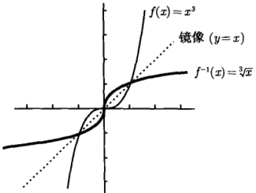

## 函数

函数是将一个对象转化为另一个对象的规则。起始对象称为输入，来自称为定义域的集合；返回的对象称为输出，来自称为上域的集合。所谓上域，是函数**可能输出**的集合，函数**实际输出**的集合被称为值域。一个函数必须给每一个有效的输入指定**唯一**的输出。

要检验一个图像是否属于一个函数，可以进行垂线检验：若任意一条垂线和图像相交都**不多于一次**，那么该图像就是函数图像。垂线检验的含义就是确认图像中一个自变量是否只对应一个因变量，即是否符合函数的定义和特征。

## 反函数

给定一个函数$\it f$，其反函数为$\it f^{-1}$，二者关系为：若$\it f(x) = y$，则$\it f^{-1}(y) = x$。原函数$\it f$的值域和反函数$f^{-1}$的定义域相同，反函数$\it f^{-1}$的值域和原函数$\it f$的定义域相同。

要确认一个函数是否具有反函数，可以进行水平线检验：若任意一条水平线和一个函数的图像**至多相交一次**，该函数必然有反函数。水平线检测的含义在于，确认函数图像中一个因变量是否只对应一个自变量，如果自变量和因变量之间是严格的逐一相互对应，那么该函数必然会有反函数，因为其反函数同样能通过水平线检验。

在一个平面直角坐标系上，函数及其反函数的图像**以直线$\it y = x$为中心形成轴对称**，如下图所示：

如果一个函数无法通过水平线检验，可以采用**限制定义域**的方式来确保其图像的一部分

## 函数奇偶性

## 三角函数