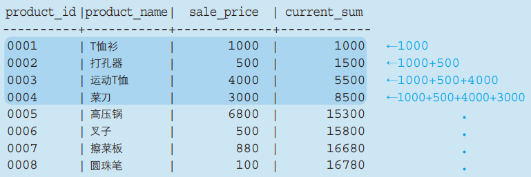
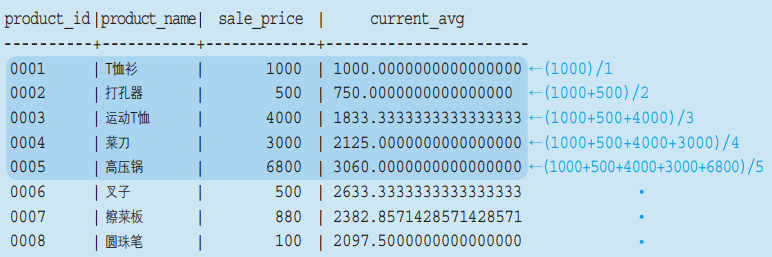

## 何为窗口函数

窗口函数（OnLine Analytical Processing，OLAP函数）可以实现对数据库数据进行实时分析处理。它可以大致划分为非专用和专用两类，前者包括SUM、AVG、COUNT、MAX以及MIN等所有聚合函数， 后者包含RANK、DENSE_RANK以及ROW_NUMBER等专用窗口函数。窗口函数通常情况下都是在SELECT子句中使用，在SELECT以外的位置使用虽然没有语法错误， 但是并不会输出预期的结果，所以没有意义。

## 常用窗口函数

+  RANK()

计算排序时，如果存在位次相同的记录，则会跳过之后的位次。例如有3条记录排在第一位，那么排序时就是1位、1位、1位、4位……

+ DENSE_RANK()

计算排序时，如果存在位次相同的记录，则不会跳过之后的位次。例如有3条记录并列第一位，那么排序时就是1位、1位、1位、2位……

+ ROW_NUMBER()
计算排序时，对每个记录赋予唯一的连续位次，就是通常的1位、2位、3位、4位……

## 基本用法

窗口函数的基本语法如下：

```
SELECT <columns>
    <OLAP functions> OVER (
        [PARTITION BY <columns>]
            ORDER BY <columns>
            ROWS [m PRECEDING] [n FOLLOWING] [BETWEEN m PRECEDING AND n FOLLOWING]
            )
FROM <tables>;
```

在上面的语句中，有几个地方需要注意：

+ PARTITION BY的作用是在使用窗口函数之前，将数据分成几个特定的组；
+ 在OVER里面的ORDER BY语句，是用来决定窗口函数的工作方式的，如果相对输出的结果进行排序，在FROM后面使用ORDER BY。

最为值得注意的地方就是ROWS的使用，它可以构建一个以当前记录为基准的移动统计框架。如果ROWS后面跟着m PRECEDING， 就表示统计框架的范围包括当前记录之前的m行记录；n FOLLOWING表示统计框架的范围包括当前记录之后的n行记录； BETWEEN m PRECEDING AND n FOLLOWING则表示统计框架的范围从当前记录之前的m行开始，一直到当前记录之后的n行为止（这就是“窗口”的含义由来）。

## 作为窗口函数的聚合函数

聚合函数在作为窗口函数使用时，依然要带有参数，并且它们会使用一种被称为累计的统计方法，即输出的都是截止到当前记录的统计结果。 下面通过几个《SQL基础教程（第二版）》当中的例子来了解相关的用法。

+ 例一：使用SUM统计Product表中，截止到当前商品的销售单价合计值。

使用语句为：

```
SELECT product_id, product_name, sale_price,
    SUM (sale_price) OVER (ORDER BY product_id) AS current_sum
FROM Product;
```

结果为：



可以看到，current_sum显示的是截止到当前商品的销售单价合计值，当然这些结果会收排序方式的影响，因为不同的排序方式会导致当前商品前面的记录发生改变。

+ 例二：使用AVG统计Product表中，截止到当前商品的销售单价平均值。

使用语句为：

```
SELECT product_id, product_name, sale_price,
    AVG (sale_price) OVER (ORDER BY product_id) AS current_avg
FROM Product;
```

结果为：



可以看到，current_avg显示的是截止到当前商品的销售单价平均值，和例1一样，这些结果会受排序方式的影响。