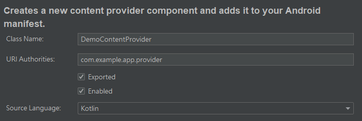

内容提供器（Content Provider）主要用于在不同的应用程序间实现数据共享的功能，它允许一个应用访问另一个应用的数据， 同时还能确保被访问数据的安全性——这体现在内容提供器可以选择性地共享数据，从而确保用户的数据不会有泄露的风险。 

 但是Android出于安全性的考虑，并不会允许一个应用可以随意地访问另一个应用（尤其是系统应用）的数据，这就涉及到权限申请的问题。 一般设置权限只要通过\<uses-permission>进行声明就行了，但是对于本文所提到的运行时权限（Runtime Permissions）来说， 这种方式是无法达到预期目的的。

 ## 运行时权限

 所谓运行时权限，就是指应用在运行过程中申请使用的一类权限，这类权限即使被用户拒绝，也不应该影响到其他功能的使用。 Android将所有权限划分为两类，一类是普通权限，系统会自动授权，另一类则是危险权限，必须经过用户授权方可使用。 显然，危险权限就应该列入运行时权限的范围内，否则会给用户带来潜在的隐私和财产安全威胁。

普通权限只需要在AndroidManifest.xml文件的< uses-permission>中进行声明就可以直接使用。危险权限除了声明之外， 还要在代码中加入用户授权验证的模块，如果确认获得用户授权，那么就可以使用相关功能，反之就不能使用。当然，如果开发者认为某些普通权限也需要得到用户授权， 那么也可以按照下面这种方式进行用户授权验证：

```
val permission = ContextCompat.checkSelfPermission(applicationContext,Manifest.permission.XXX)
if (permission != PackageManager.PERMISSION_GRANTED){
    val access = arrayOf(Manifest.permission.XXX)
    ActivityCompat.requestPermissions(this, access, REQUEST_CODE) /*若没有权限则申请授权*/
}else {
    try { /*如果已申请授权，则尝试调用相关应用*/
        val intent = Intent(Intent.XXX)
        intent.data = Uri.parse("PROTOCOL:···")
        startActivity(intent)
    }catch (e: SecurityException){
        //TODO
    }
}
```

注意，授权验证一般可以将其封装成一个模块，比如封装成方法，这样可以大大减少代码的重复量。 在应用调用requestPermissions()之后，会弹出一个权限申请对话框，无论用户是否同意授权，都会回调到onRequestPermissionsResult()：

```
override fun onRequestPermissionsResult(
        requestCode: Int,
        permissions: Array< out String>,
        grantResults: IntArray
    ) {
    super.onRequestPermissionsResult(requestCode, permissions, grantResults)
    when (requestCode){
         REQUEST_CODE_1 -> /*对每个请求码所对应的权限授权情况进行检查*/
         if (grantResults.isNotEmpty() && grantResults[0] == PackageManager.PERMISSION_GRANTED){
            //TODO：同意授权，执行相关功能
         }else{
            //TODO：不同意授权，执行后续操作
         }
         REQUEST_CODE_2 -> ···
         ···
         else -> ··· /*else分支可以视情况决定是否添加*/
    }/*如果需要用户授权的危险权限比较少，那么可以用if来替代when*/
}
```

这里的REQUEST_CODE表示上文requestPermissions()中所使用的请求码，请求码可以是任意数字， 只要确保它在整个应用当中具有唯一性即可；授权结果封装在grantResults中，应用通过判断授权结果来决定是否可以执行相关功能。

如果用户授权过该应用危险权限之后，又不想继续保持这种状态，那么可以在系统设置中撤销其授权。

## 访问应用数据

如果一个应用想要访问其他应用的数据，那么就必须使用ContentResolver类。ContentResolver类提供了getContentResolver()方法， 可以获取该类的实例。通过调用ContentResolver的insert()、delete()、query()以及update()四个方法，就可以像操作数据库那样， 对其他应用的数据实现基本的CRUD操作。

不同于数据库的CRUD，ContentResolver的CRUD方法不接收表名作为参数，而是使用内容Uri。 内容Uri为Content Provider中的数据建立了唯一标识符，其格式和URL非常相似——在后面使用到WebView的时候， Uri就是要解析一个URL。它主要由两部分组成：authority和path。authority一般是程序包名，path用于对同一应用程序中不同的表进行区分。 Uri的一种标准写法如下：

```
content://com.example.app.App/table1
```

可以看到，Content Provider的Uri确实和平常使用的URL十分相似，只不过它所使用的"协议"不是http或者https，而是content， authority和path也可以跟网址域名、路径一一对应，这样既方便记忆，又可以实现格式上的统一。

接下来要讨论如何使用ContentResolver提供的CRUD方法。首先是查询，查询的使用方法如下：

```
val uri = "CONTENT_URI"
val cursor = contentResolver.query(uri, PROJECTION, SELECTION, SELECTION_ARGS, SORT_ORDER)
/*PROJECTION：指定查询列名*/
/*SELECTION：指定WHERE约束条件，例如"column = ?"，是一个字符串*/
/*SELECTION_ARGS：为WHERE中的占位符（即"?"）提供具体的值，是一个字符串数组*/
/*SORT_ORDER：指定查询结果排列方式*/
/*以上四个参数可以设置为null，效果等同于SQL语句SELECT * FROM TABLE_NAME*/
try {
    if (cursor != null) {
        while (cursor.moveToNext()) {
            val column1 = cursor.getColumnIndex("CONTENT_COLUMN_1")
            val display1 = cursor.getXxx(column1)
            val column2 = cursor.getColumnIndex("CONTENT_COLUMN_2")
            val display2 = cursor.getXxx(column2)
            ···
        }
    }
    ···
} catch (e: Exception) {
     //TODO
} finally {
     ···
     cursor?.close()
     ···
}
```

这里要特别注意的是contentResolver.query()和cursor?.close()两个地方。

contentResolver.query()返回的是一个Cursor?对象，相当于在数据库中通过SELECT语句查询表中的指定记录。 若Cursor对象不为空，则对其进行遍历，利用cursor.getColumnIndex()获取指定列的索引，再通过cursor.getXxx()获取索引对应的数据， 然后执行其他的代码对获取到的数据进行处理。

cursor?.close()是必须执行的代码。在对数据库进行查询操作时，如果使用完Cursor对象却不将其关闭，那么与它相关联的资源就不会被释放， 一方面会浪费设备资源，另一方面还会导致这些读取到Cursor对象的数据被封锁，使得其他的应用程序无法正常访问。
利用ContentResolver添加数据的方法如下：

```
val uri = "CONTENT_URI"
val values = ContentValues()
values.put("COLUMN_NAME_1",VALUE_1)
values.put("COLUMN_NAME_2",VALUE_2)
···
contentResolver.insert(uri,values)
/*等效于SQL语句：INSERT INTO table_name(···) VALUES(···)*/
```
利用ContentResolver更新数据的方法如下：

```
val uri = "CONTENT_URI"
val values = ContentValues()
values.put("COLUMN_NAME_1",VALUE_1)
values.put("COLUMN_NAME_2",VALUE_2)
···
val selection = "···"
val selectionArgs = arrayOf("ARG_1","ARG_2",···)
contentResolver.update(uri,values,selection,selectionArgs)
/*等效于SQL语句：UPDATE table_name SET···WHERE···*/
```

利用ContentResolver删除数据的方法如下：

```
val uri = "CONTENT_URI"
val selection = "···"
val selectionArgs = arrayOf("ARG_1","ARG_2",···)
contentResolver.delete(uri,selection,selectionArgs)
/*等效于SQL语句：DELETE FROM table_name WHERE···*/
```
注意，有些应用程序的数据不完全支持上述操作，因为这跟它们的内容提供器设置有关，随意使用CRUD可能会抛出异常或引发应用崩溃。

## 创建自定义内容提供器

创建一个自定义内容提供器的方式就是继承ContentProvider类，然后覆写里面的方法。 Android Studio提供了一个比较便捷的创建方式，通过右键点击MainActivity所在目录，选择New - Other - Content Provider， 然后会弹出如下图所示的配置窗口，配置完成后就会创建出一个内容提供器。



新创建的Content Provider会自带6个等待被覆写的方法：

```
class DemoContentProvider : ContentProvider() {

    override fun delete(uri: Uri, selection: String?, selectionArgs: Array< String>?): Int {
        //TODO
    }

    override fun getType(uri: Uri): String? {
        //TODO
    }

    override fun insert(uri: Uri, values: ContentValues?): Uri? {
        //TODO
    }

    override fun onCreate(): Boolean {
        //TODO
    }

    override fun query(
        uri: Uri, projection: Array< String>?, selection: String?,
        selectionArgs: Array< String>?, sortOrder: String?
    ): Cursor? {
        //TODO
    }

    override fun update(
        uri: Uri, values: ContentValues?, selection: String?,
        selectionArgs: Array< String>?
    ): Int {
        //TODO
    }
}
````

四个CRUD方法这里不再详细介绍，主要关注onCreate()和getType()这两个方法。
onCreate()在有ContentResolver尝试访问本应用的数据，需要初始化内容提供器的时候调用。 通常会在这里完成对数据库的创建和升级等操作。方法返回true表示内容提供器初始化成功，false则为失败。

getType()会根据传入的内容URI来返回相应的MIME内容。 MIME (Multipurpose Internet Mail Extensions) 是描述消息内容类型的因特网标准， MIME消息能包含文本、图像、音频、视频以及其他应用程序专用的数据。 一个内容URI对应的MIME字符串由三部分组成：

1. 以vnd.为开头

2. 若内容URI以path结尾，则在1）后面接android.cursor.dir/； 若内容URI以id结尾，则在1）后面接android.cursor.item/

3. 在2后面接vnd.< authority>.< path>

内容URI以path结尾很好理解，以id结尾的意思是在path后面接上一个数字（如/1），表示该id所对应的数据。

刚才已经提到，内容URI可以有两种格式的写法，一种以path结尾，另一种则以id结尾。那么在传入内容URI的时候， 要如何进行匹配才能够调用方法执行对应的操作？答案就是在DemoContentProvider中使用UriMatcher。 UriMatcher是系统提供的一个类，常用的主要方法有addURI()和match()。

addURI()用于接收3个参数，分别是authority、path和一个自定义的代码。 authority要和AndroidManifest.xml文件内< provider>标签所包含的android:authorities信息一致； path则用于标识某张表或表中指定数据的路径，比如"table"或者"table/#"，其中/#是通配符，表示id为#的数据； 自定义代码是一个整型数值，在调用match()的时候会被返回。addURI()的具体用法如下：

```
private val uriMatcher = UriMatcher(UriMatcher.NO_MATCH)
init {
    val authority = "com.example.app.provider"
    uriMatcher.addURI(authority,PATH_1,CUSTOM_CODE_1)
    uriMatcher.addURI(authority,PATH_2,CUSTOM_CODE_2)
    ···
}
```

UriMatcher的另一个关键作用在于，只要开发者不通过addURI()添加任何包含有隐私数据的path， 那么其他应用程序的ContentResolver无论如何都不可能采用uri方式访问到这些隐私数据，这就同时实现了数据共享和隐私保护。
match()通常会跟when（Java里面使用switch）搭配使用，这样才能够在CRUD方法和getType()方法中，实现不同的内容URI匹配不同的执行代码。 上文提到调用match()的时候会返回一个addURI()接收到的自定义代码，这个自定义代码就是用来进行匹配的。具体如下：

```
when(uriMatcher.match(uri)){
    CUSTOM_CODE_1 -> //TODO
    CUSTOM_CODE_2 -> //TODO
    ···
    else -> //TODO
    /*else分支视情况决定是否添加*/
}
```

例如，当uri表示一张表的路径时，uriMatcher.match(uri)就会返回对应的自定义代码，执行对表操作的分支代码； 当uri表示一张表中指定id数据的路径时，uriMatcher.match(uri)也会返回对应的自定义代码，执行对数据操作的分支代码。