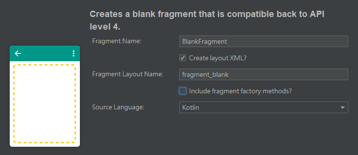
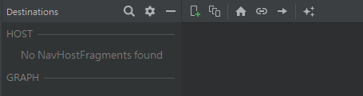
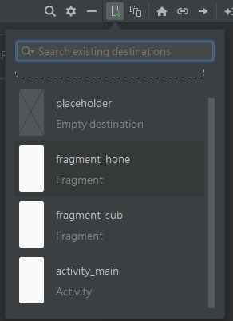
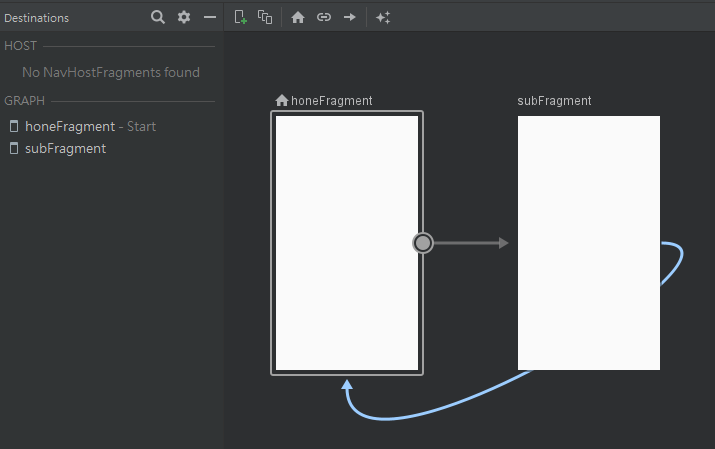
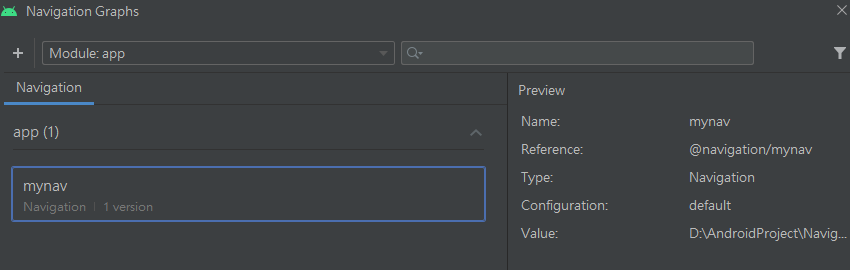
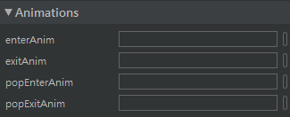
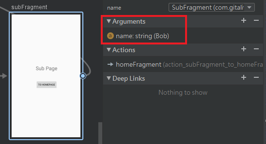
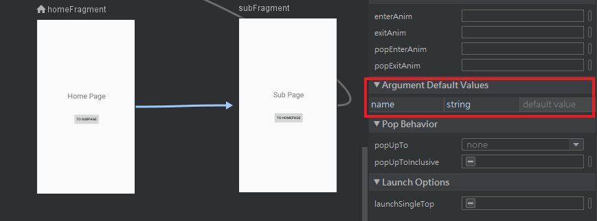

Fragment作为Activity的一部分，本应该合并到[Activity](Android/activity)当中进行介绍，但是实际上，Fragment发展至今已经具有相当广泛的用途，因此有必要将它单独拎出来详细讲讲。

Fragment具有以下特点：

+ 依赖于Activity，不能独立存在；
+ 一个Activity里可以有多个Fragment；
+ 一个Fragment可以被多个Activity重用；
+ Fragment有自己的生命周期，并能接收输入事件；
+ Activity运行时，可以动态地添加或删除Fragment。

使用Fragment的优势有：

+ 模块化（Modularity）：不必把所有代码全部写在Activity中，而是把代码写在各自的Fragment中；
+ 可重用（Reusability）：多个Activity可以重用一个Fragment；
+ 可适配（Adaptability）：根据硬件的屏幕尺寸、屏幕方向，能够方便地实现不同的布局，这样用户体验更好。

按照Google官方的说法，Fragment可以被视为轻量级的Activity，因此在性能和资源占用上具有一定的优势。

## Fragment的创建

使用Android Studio新建项目之后，右键点击MainActivity文件所在的文件夹，通过New - Fragment创建Fragment文件。 如果是第一次接触Fragment，那么建议使用Fragment(Blank)。



在创建好之后，需要在res目录下创建一个Android Resource File， 该资源文件的类型（Resource type）默认是Values，需要改成Navigation。注意xml文件的名称中应该只包含小写字母和下划线。

创建这个资源文件以后，IDE会提示要添加依赖才能显示一个可视化操作的图形界面，选择添加即可。 之后就可以通过下面所示的界面对Fragment之间的导航动作等进行编辑。



如下图所示，首先将两个布局拖入操作窗口，然后用箭头指示导航方向。先拖入的布局被默认为起始页面， 如果需要更换起始页面，就右键点击指定布局，选择“Set as Start Destination”。



接着设置Fragment间的导航方向，使用图形化界面的好处就在于，仅仅通过一个符合直觉的操作，就能完成若干行代码才能实现的东西：



接着前往layout目录下对三个布局文件进行配置。首先在activity_main布局中找到Containers - NavHostFragment，将其拖入布局，IDE会弹出下图所示的窗口：



选定Navigation资源文件之后，再为它添加约束，activity_main.xml文件的配置就完成了。

Fragment布局文件建议将FragmentLayout改成ConstraintLayout，这样便于布置控件。

## Fragment的跳转

Fragment之间的跳转和Activity不同，前者采用的是Navigation，后者使用Intent。Navigation的核心代码非常简单：

```
//onViewCreated()：
Navigation.findNavController(view).navigate(R.id.action_aFragment_to_bFragment)

//onActivityCreated()：
Navigation.findNavController(it).navigate(R.id.action_aFragment_to_bFragment)
```

注意，Navigation的调用是有限制的，通常要么在onViewCreated()方法中，要么就在onActivityCreated()方法中，最好不要在onCreateView()里面。因为应用刚启动时，View还没有加载出来， 此时在onCreateView()调用Navigation很有可能会发生空异常。

此外，无论传入Navigation.findNavController()的是view还是it，它们都指向同一个东西——那就是当前Fragment所对应的布局。

当然，可能会有人觉得IDE默认的跳转动作缺乏美感，所以可以通过Navigation的图形界面，选中页面间的导航动作箭头， 这时IDE右侧就会出现该导航动作的属性栏，里面有一个Animations，在这里设置页面进入退出等动作的动画效果即可，如下图所示。



除了IDE自带的以外， 还可以在res目录下创建Animation资源，编写相关的动画效果xml文件，然后引用即可。

## Fragment数据的传递、保存与复现

### Argument

利用Fragment属性中的Arguments，



或是指向该页面的action自带的Argument Default Values，



都可以让静态数据随着动作传递。目的Fragment可以通过requireArguments()调用get方法来读取数据：

```
var variable = requireArguments().getString(keyName, defValue)
```

这种方式虽然简单，但是通常只用来传递一些不会发生变化的静态数据。

### Bundle

依靠Bundle保存一个键值对，然后跟随action传递到目的Fragment，再由目的Fragment读取Bundle里面的数据。使用Bundle时， 要先在一个Fragment当中创建Bundle类型的变量，接着通过调用put方法保存一个键值对，之后将Bundle变量当作参数放进动作语句，如下面代码所示：

```
val bundle = Bundle()
bundle.putString(keyName, value)
Navigation.findNavController(it).navigate(R.id.action_aFragment_to_bFragment,bundle)
```

和使用Argument一样，目的Fragment也要通过requireArguments()，调用get方法来读取传递过来的Bundle对象里的数据。

### ViewModel

利用ViewModel（或者AndroidViewModel）来让各个页面共享数据， 同时还能提供数据保存与复现的功能，具体步骤如下：

首先新建一个继承于ViewModel的自定义ViewModel：

```
class MyViewModel: ViewModel() {
    private var number = MutableLiveData(0)

    fun getNumber(): MutableLiveData< Int> {
        return number
    }

    fun add(x: Int) {
        number.value = number.value!!.plus(x)
    }
}
```

在Fragment对应源文件的onCreateView()中添加ViewModel类型对象和DataBinding对象：

```
private lateinit var myViewModel: MyViewModel
private lateinit var binding: FragmentSubBinding
override fun onCreateView(
        inflater: LayoutInflater, container: ViewGroup?,
        savedInstanceState: Bundle?
    ): View? {
        myViewModel = ViewModelProvider(requireActivity())[MyViewModel::class.java]
        binding = DataBindingUtil.inflate(inflater, R.layout.fragment_???, container, false)
        binding.data = myViewModel
        binding.lifecycleOwner = requireActivity()
        return binding.root
}
```

注意，DataBinding对象的类型名称为"布局文件名称+Binding"。例如MainActivity对应的DataBinding类型为ActivityMainBinding，HomeFragment对应的则是FragmentHomeBinding。

此外，在Fragment中调用ViewModelProvider时，带入的参数是requireActivity()， 而不是和Activity一样的this，否则会报错。同理，使用AndroidViewModel时，传入的是requireActivity().application。

## Fragment上的特定内容

Fragment特有的控件、元素以及动作等要在对应的Fragment源文件中编写代码，而不是在Activity文件中编写，原因有两个：

第一，Activity文件对应的布局中是没有指定Fragment的控件的。如果在想依靠import强行引用， it:View!就会唯一地指向Activity文件的布局，而这个布局上不存在对应控件，因此就会出现空引用，导致应用崩溃。

第二，Activity文件统管全局，任何在里面编写的有效内容都会被应用到所有Fragment上。如果希望某些元素（比如菜单）只存在于特定页面上， 那么就不要把这些内容写到Activity文件，而是写到指定Fragment的源文件当中。

