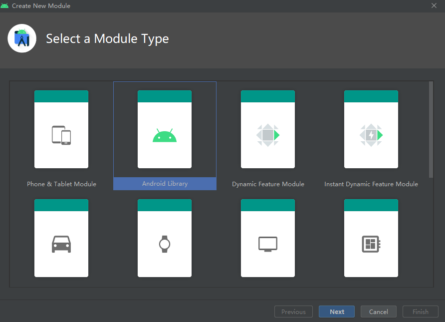
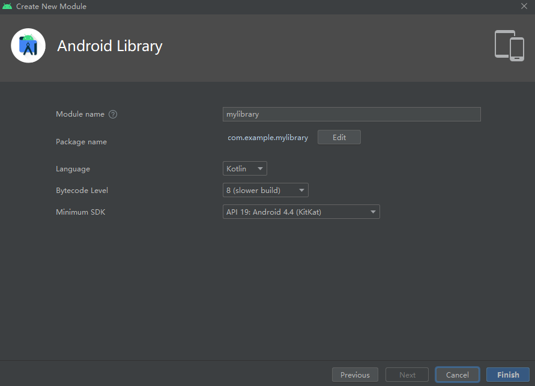
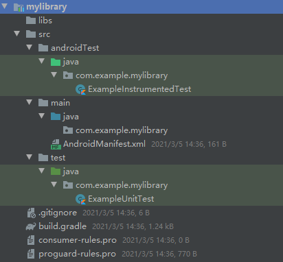

## 项目结构化

在大型项目的开发中，把所有代码文件都塞进同一个文件夹是一种极其愚蠢的行为。虽然这么做可以确保这些文件在整个项目当中相互可见——事实上并不需要这种确保——但是要进行项目维护的时候就令人头疼了（除非这个项目不需要维护）。

有些开发者可能稍微聪明一点，把代码文件**划分成不同的种类**，然后分别放进不同的文件夹里，这样看起来总比一锅大杂烩有条理一些。然而这种方式还是有问题，同类型的文件夹里面可能存放着相互之间没有任何关联的文件，比如两个没有交互的Activity——如果硬要说它们有什么关系，大概就是两点：都是Activity类型，以及都能被编译成`.class`文件。在维护的时候，开发者或许知道某个变量、常量、方法/函数以及类位于哪个文件夹里的哪个文件，但还是得在一堆毫不相关的文件中搜索一番才能定位。如果要新增一个功能，编写好的文件又得按照种类分散到不同的地方，维护起来更加令人感到恼火。

无论是大杂烩还是垃圾分类，所有的代码文件都始终位于项目的`app`文件夹当中，带来的后果就是文件夹日益臃肿。这种不合理的项目结构必然影响开发维护，最后使得整个项目形成一座臭不可闻的屎山（shit mountain）。事实上，任何一个项目都是自带结构的，如果一个开发者在需求评审和技术方案选型阶段不能意识到这一点，甚至脑海中连一个模糊的轮廓都浮现不出来，那无疑是非常可怕的。

给项目划分出清晰的结构，而不是一锅煮的大杂烩或是简单的垃圾分类，是确保项目可维护性的第一步。要知道，即便是采取大杂烩方式的开发者们，也并非对项目结构毫无感知，至少他们应该知道哪些文件是存在关联的。<font color=red>从本质上来说，项目结构化就是把有极强关联性的代码文件组织到一起，形成一个能够实现若干特定功能的文件集合，最后再由这些集合相互配合交互，从而构成一个完整的项目</font>。对于Android开发而言，这种文件集合就是模组或插件。

## 模组化开发

模组（Module，又称模块）是一个具有高内聚、低耦合特性的文件集合结构。它类似于积木，需要用到的时候就加上去，不需要用到的时候就拿下来，在这个过程中，模组里的代码文件始终作为一个整体与外界进行交互。在Android开发中，一个模组通常用于执行某个或某些特定功能，因此从这个角度来讲，**功能是模组划分的主要依据**。

>注意：在Android项目中，app是一个特殊的模组。

### Module的创建

Android Studio为开发者创建Module提供了便利的工具。在Android Studio中创建一个Module，需要先通过`File`➡`New`➡`New Module`来打开一个创建窗口，如下图所示。



里面有很多选项，最基础的就是Android Library，因此可以先从它开始接触学习模组化开发。选择Android Library之后会进入下面的配置窗口，配置完成之后点击Finish，Module就会开始创建。当然，选择第一个“Phone & Tablet Module”也是可以的，只不过这个Module从一开始就是一个可以独立编译打包运行的App，并不能直接引用，至于如何转化成普通的Module，可以参考下面Module转App的部分。



以Android Library形式创建出来的Module只包含几个基础文件，比如AndroidManifest，具体如下图所示。



Android Library既可以编写纯粹业务逻辑的代码（类似于jar包），也可以像开发app那样为各种Activity和Fragment设计视图和功能（但是不能像app那样直接启动，需要手动调整配置文件），还可以纯粹设计各种视图以供其他Module引用。总之，它可以认为是上手简单却功能丰富。

### Module的引用

在创建完Android Library形式的Module之后，查看项目的`settings.gradle`文件，可以发现里面有一句

```
include ':mylibrary'
```

这表示项目已经包含了一个名为mylibrary的Module了。

>注意：所有的Module都是以小写字母命名。

Module的引用和依赖类似，只不过需要以下面这种形式进行引用：

```
//引用Module的模块的build.gradle文件
dependencies {
    impelementation(project(":mylibrary"))
    ···
}
```

引用Module有以下两个重要的注意点：

+ impelementation(project(···))里的Module名称**必须**与`settings.gradle`文件中注册的名称**保持一致**，包括大小写；
+ 被引用Module的所有依赖，包括直接依赖和依赖内部引用的间接依赖，其版本<font color=red>都不能高于</font>引用该Module的上层模块中所包含的，具有相同名称的直接或间接依赖的版本。

关于第二点可以举一个例子：

一个Module引用了Version 1.1的依赖A，而这个依赖A本身又引用了Version 1.1的依赖B；引用该Module的模块，使用的是Version 1.0的依赖A，且这个Version 1.0的依赖A还引用了Version 1.0版本的依赖B，那么在Gradle Build阶段就会发生依赖版本冲突的情况。

上述问题的解决方法有三个，要么把Module里面的依赖A降级成Version 1.0，要么就让引用该Module的模块升级自己的依赖A版本，或是放弃引用该Module。

### Module转独立App

任何包含有Activity的Android Library Module可以通过一些手动配置转化成独立运行的App，主要有两个文件要做修改：

1. AndroidManifest文件

任何能够独立打包运行的App，其AndroidManifest文件中必须注册有包含指定配置的Activity，如下面所示：

```
<?xml version="1.0" encoding="utf-8"?>
<manifest xmlns:android="http://schemas.android.com/apk/res/android"
    package="com.example.myapplication">

    <application
        android:allowBackup="true"
        android:icon="@mipmap/ic_launcher"
        android:label="@string/app_name"
        android:roundIcon="@mipmap/ic_launcher_round"
        android:supportsRtl="true"
        android:theme="@style/Theme.MyApplication">
        <activity android:name=".MainActivity">
            <intent-filter>
                <action android:name="android.intent.action.MAIN" />

                <category android:name="android.intent.category.LAUNCHER" />
            </intent-filter>
        </activity>
    </application>

</manifest>
```

Module的AndroidManifest文件可能是这样的：

```
<?xml version="1.0" encoding="utf-8"?>
<manifest xmlns:android="http://schemas.android.com/apk/res/android"
    package="com.example.mylibrary">

    <application>
        <activity android:name=".MainActivity"></activity>
    </application>

</manifest>
```

对比两者之后可以发现，Module需要仿照app模块将application和intent-filter标签里的配置补全，这样就完成了第一步。

2. `build.gradle`文件

通过观察app模块与Android Libray Module的`build.gradle`文件，可以发现两者有以下不同点：

① app模块的plugins部分，id为`com.android.application`，而Module的plugins id则为`com.android.library`，后者需要将“library”改成“application”；

② app模块的defaultConfig部分包含applicationId，而Module的不包含，需要加上。

完成上述两处文件的修改之后，Android Studio就会将Module的文件夹图标从Library修改成App样式，此时就表示Module已经被转化成一个可以独立编译打包运行的App了。