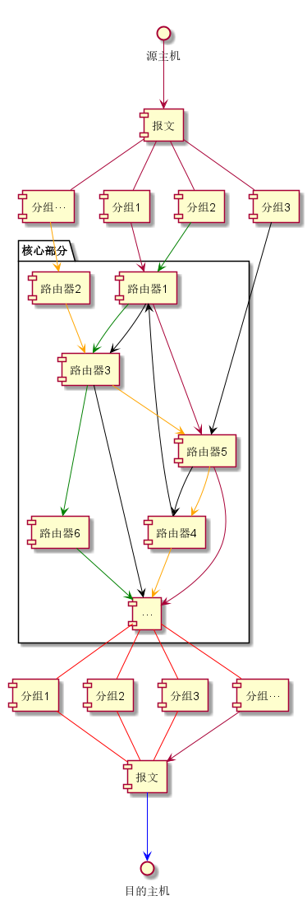
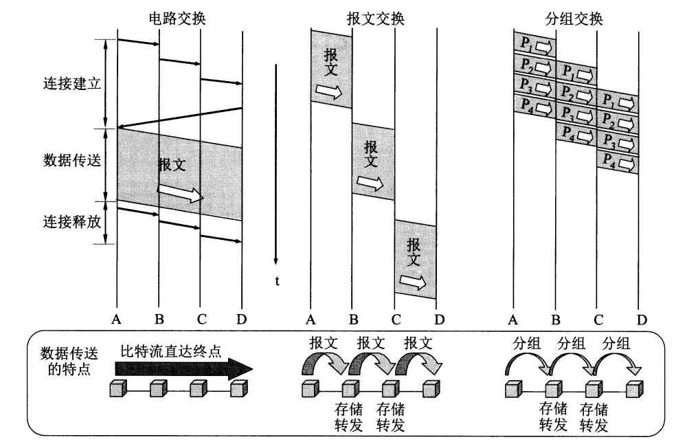
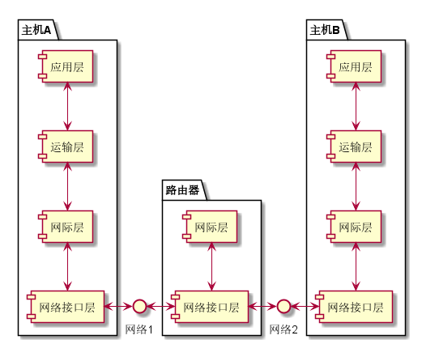
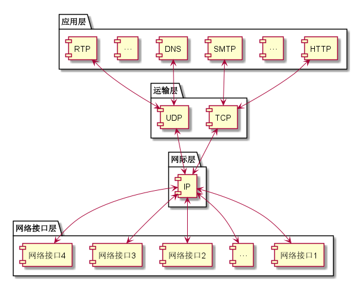
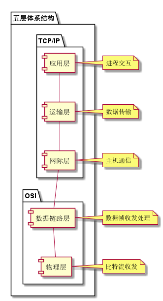

## 互联网的组成

互联网由边缘部分跟核心部分组成。

### 1.边缘部分

边缘部分包含所有连接在互联网上的*主机*（端系统） ，比如个人电脑、联网的外围设备以及大型计算机甚至服务器等，由用户直接使用，它们的通信方式分为C/S（B/S）方式和P2P方式。

C/S方式就是指两个主机之间采用请求服务 - 提供服务的方式进行通信和交换共享信息；P2P方式则是指两个主机之间不区分客户端和服务器，以对等的地位进行通信。

### 2.核心部分

核心部分包含的主要部分是路由器，负责为边缘部分的主机提供连通性。路由器的核心工作是实现分组交换，将收到的分组进行转发。

分组交换是指采用存储转发技术，将报文划分成若干分组后传送到路由器暂时保存，路由器查找路由表确定转发给下一个路由，直到将分组转发给目的主机。如下图所示。

与分组交换相关的其他两种交换方式，还有电路交换和报文交换。

电路交换最典型的就是打电话，要经过“**建立连接（占用通信资源）——通话（一直占用通信资源）——释放连接（归还通信资源）**”三个步骤才能完成信息交换，若互联网采用这种交换方式会使得信道利用率低，通常适用于大规模长时间信息传输的场景。

报文交换的典型应用就是邮政系统，将一份**完整报文**传送到一个节点后再确定下一个传送节点，直到报文被转发到接收者。

## 计算机网络性能

### 1.性能指标

#### 速率

数据（比特）的传输速率，单位为bit/s，有时写作bps。速率较大时，通常会在单位前加上10的幂次方所代表的字母（k、M、G等）。速率往往指标称速率或额定速率，而非实际速率。

#### 带宽

在计算机网络中，带宽表示的是单位时间内某条信道所能通过的**最高数据率（速率）**，因此单位和速率一样都是bit/s。

#### 吞吐量

吞吐量表示单位时间内通过某个网络（或者信道、接口）的**实际**数据量。吞吐量的大小取决于瓶颈链路（短板）。

#### 时延

时延是指数据从网络一端传送到另一端所需要的时间。它由以下几部分组成：

|  时延类型  |                            定义                             | 说明                                                                                                                   |
| :------------------------------------: | :---------------------------------------------------------: | :--------------------------------------------------------------------------------------------------------------------- |
| *发送时延* |    $D_{send} = \frac{数据帧长度(bit)}{传输速率(bit/s)}$     |
| *传播时延* | $D_{trans} = \frac{信道长度(m)}{信道内电磁波传输速率(m/s)}$ | 通常1000km光纤需要大约5ms                                                                                              |
| *处理时延* |                                                             | 主机或路由器收到分组后进行处理所需的时间                                                                               |
| *排队时延* |               $D_{queue} = T_{pro} + T_{for}$               | $T_{pro}$为分组进入路由器后在输入队列中排队等候处理的时间，$T_{for}$进入输出队列等待转发的时间，取决于当前的网络通信量 |

上述四个部分中，任意一个部分都有可能成为主导时延大小的关键因素。

#### 时延带宽积

用于描述一个链路所能容纳的比特数量（或者称为**以比特为单位的链路长度**），其定义如下：

$$时延带宽积 = 传播时延 × 带宽$$

#### 往返时间RTT

往返时间用于描述信息双向交互一次所需的时间。在计算有效数据率的时候是个很重要的指标。

#### 利用率

利用率分为信道利用率和网络利用率。信道利用率描述的是信道中有百分之几的时间是有数据通过的，而网络利用率则是**全网络信道利用率的加权平均**。

若以 $D_0$ 表示网络空闲（所有信道利用率为0）时的时延，以 $D$ 表示当前的网络时延，$U$ 为利用率，则在适当的假定条件下有如下公式：

$$D ＝ \frac{D_0}{1 - U}$$

从上面的公式中可以知道，信道或带宽的利用率不能过高，否则会产生较大的时延。通常会控制在50%以下。

### 2.非性能特征

包括**费用**、**质量**、**标准化**、**可靠性**、**可扩展性和可升级性**以及**易于管理和维护**等。

## 计算机网络体系结构

所谓网络体系结构，就是指计算机网络中各层及其协议的集合。

### 1.TCP/IP体系结构

TCP/IP是目前占据绝对主导地位的体系结构，并且还在发展演变。通常把TCP/IP划分为四层：

还有一种表示方法，是依照各个层次的协议来表示TCP/IP协议族：

上图中可以看到IP协议在整个体系中所占据的关键地位与核心作用。

对于TCP/IP来说，最主要的还是上面三层，至少目前网络接口层并没有什么协议可以深入研究。

### 2.五层体系结构

五层体系结构是教学中为了介绍网络原理，将事实上已经**被废弃**的OSI七层体系结构，和TCP/IP的四层结构折中之后形成的一种体系结构，示意图如下：

### 3.实体、协议、服务和服务访问点

（1）基本概念

`实体（Entity）：任何可收发信息的硬件或软件进程`

`协议（Protocol）：控制若干对等实体进行通信的规则集合`

`服务（Service）：下层向上层通过层间接口提供的功能`

`服务访问点（SAP）：同一系统中，相邻两层实体进行信息交换的地方`

（2）重点了解

1）网络协议由语法、语义和同步三要素构成。语法表示**数据与控制信息的结构或格式**，语义表示**需要发出何种控制信息、完成何种动作以及做出何种响应**，同步表示**事件实现顺序的详细说明**。

2）协议和服务在概念上存在差异：一、协议的实现保证了下层能够向上层提供服务，下面的协议对上面的实体是**透明**的，也就是说，使用本层服务的实体只能看见服务而无法看见下面的协议；二、协议是“水平”的，而服务是“垂直”的。