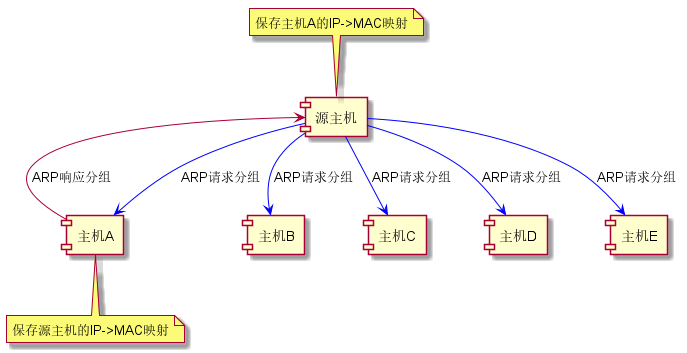
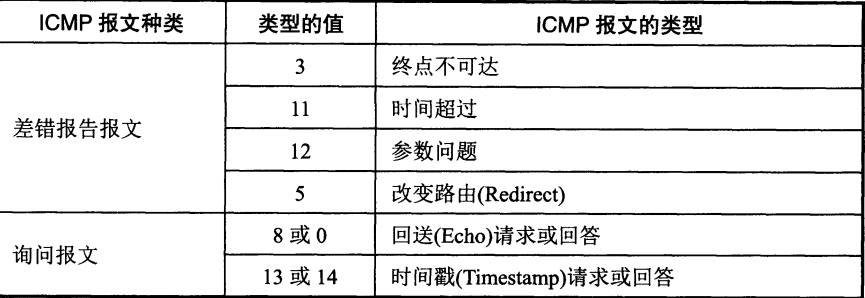

网络层又称网际层，其任务就是向上一层只提供**简单灵活**、**无连接的**、**尽最大努力交付的**数据报（分组）服务。因此网际层不承诺保证服务质量，可靠通信的责任转移到运输层。

IP协议的出现使得分布在世界各地性能各异的物理网络得以互连，形成**虚拟互连网络（逻辑互连网络）**，如同在一个单一网络上进行通信，各种具体的异构细节（编址方案、路由选择协议等）也被屏蔽，简化了问题的描述。

与IP协议配套使用的还有地址解析协议ARP、网际控制报文协议ICMP以及网际组管理协议IGMP。

## 网际协议IP

IP地址的特点：

1.IP地址是标志一台主机和一条链路的**接口**，当一台主机同时接入两个不同的网络时，必须同时具有两个不同网络号的IP地址；

2.具有**相同网络号**的局域网（使用转发器或网桥连接）被视为同一个网络，反之就是不同的，需要使用路由器进行互连；

3.互联网**平等**对待每一个IP地址。

### 1.分类的IP地址

分类的IP地址是最基本的编址方法，其形式为`IP地址::={<网络号>，<主机号>}`，“分类”的含义就在于使用网络号将IP地址划分为A~E五类地址：

|地址类别|网络号长度 /位|主机号长度 /位|总长度 /位|网络号指派范围|备注|
|:-------:|:--------:|:-------:|:------:|:----------:|:---|
|A类     |8         |24       |32     |1 - 126|**单播**，类别位为0   |
|B类     |16        |16       |32     |128.1 - 192.255|**单播**，类别位为10  |
|C类     |24        |8        |32     |192.0.1 - 223.255.255|**单播**，类别位为110 |
|D类     |-         |-        |32     |-|多播，类别位为1110|
|E类     |-         |-        |32     |-|保留，类别位为1111|

IP地址都是32位的二进制代码，为了方便阅读，采用**点分十进制**的方式将其表示为XXX.XXX.XXX.XXX的形式。

两级IP地址有以下好处：

1. 网络号由IP地址管理机构分配，主机号由单位内部分配，便于管理；

2. 路由器仅根据网络号进行转发，减少路由表的存储空间和查找时间。

### 2.子网划分

子网划分的目的在于解决两个问题：一是两级IP地址的利用率有时很低，二是两级IP地址不够灵活。

在两级IP地址的基础上，将**主机号**的若干位划为子网号，**在本单位内部**就变成了三级IP地址：`IP地址::={<网络号>，<子网号>，<主机号>}`。由于子网划分是一个单位内部的事情，并没有对原来的两级IP地址产生根本性的改变，因此这个单位内部的各个子网对外仍表现为同一个网络。

在划分子网之后，路由器采用**子网掩码**来找到目的主机所在的子网。子网掩码的格式为：`全1网络号 + 全1子网号 + 全0主机号`。将子网掩码和目的主机的IP地址进行“**与**”运算，就可以得出目的主机所在的子网地址。使用子网掩码的好处在于，<font color=red>无论网络是否划分子网，都能够立即获得网络地址</font>。

如果一个网络没有划分子网，那么它就会使用**默认子网掩码**，A、B、C三类地址的默认子网掩码分别为255.0.0.0、255.255.0.0以及255.255.255.0。

使用子网时，路由器转发算法也要进行改动，加入子网掩码和目的主机的IP地址进行“与”运算的步骤。

目前所有的网络都使用子网掩码，路由器转发表中也要有子网掩码的信息。

### 3.无分类编址CIDR（构造超网）

CIDR的正式名称为无分类域间路由选择（Classless Inter-Domain Routing），它的出现是为了解决这些问题：一是B类地址在1992年已经消耗一半，二是互联网主干网的路由表项目数激增，三是IPv4终将耗尽。

采用CIDR的IP地址形式为：`IP地址::={<网络前缀>，<主机号>}`，或者采用CIDR记法：`IP地址/网络前缀位数`、`点分十进制低位连续的0省略/网络前缀位数`、`网络前缀*`等。CIDR的特点如下：

1. 消除了传统的地址分类和子网划分概念，更有效地分配IPv4空间；

2. **网络前缀相同**的连续IP地址组成一个CIDR地址块，里面可以包含多个地址（通常情况下，一个CIDR地址块可以包含*2<sup>n</sup>* 个C类地址）；

3. CIDR使用了和子网掩码相似的地址掩码，其形式为`全1网络前缀 + 全0主机号`；

4. CIDR划分子网的方式依然是从主机号划出若干位并入网络前缀。

所谓构造超网，就是利用CIDR地址块实现<font color=red>地址聚合</font>（也称路由聚合，会使路由的网络前缀缩短），使路由表中的一个项目可以表示传统分类地址中的上千个路由。这种方式**减少了路由器之间的路由选择信息交换**，从而提高整个互联网的性能。

使用CIDR时，路由转发采用的是**最长前缀匹配原则**，即从匹配结果中选择具有最长网络前缀的路由作为下一跳的目的地。采用最长前缀匹配原则的路由选择算法，会使用**二叉线索**来查找路由表。

### 4.IP地址与MAC地址

所谓MAC地址，就是封装在MAC帧中（在数据链路层中封装）的源地址和目的地址（都是固化在ROM中的**硬件地址**）。与IP地址不同，MAC地址需要**地址解析协议ARP**（Address Resolution Protocol）解析IP地址来获取。

每台主机都设有ARP高速缓存，用于存放和动态更新从**同一局域网下**其他主机或路由器从IP地址到MAC地址的映射表。映射表的动态更新工作由主机中的ARP进程执行，通过<font color=blue>广播</font>发送ARP请求分组，让目的主机接收到该请求分组之后，通过<font color=brown>单播</font>返回一个ARP响应分组，从而获得目的主机或路由器的IP到MAC映射。在这一过程中，目的主机或路由器也储存了源主机IP到MAC的映射。



ARP对每一个映射项目都设置有生存时间，凡超过生存时间的项目都会被删除，然后再重新执行上述请求 - 响应的流程，以完成映射表的更新。

如果所要寻找的主机或路由器不在同一局域网内，那么就要通过路由器进行查找转发，当最后一个路由器查找到目的主机IP到MAC的映射之后，它就会将分组直接交付给目的主机。

### 5.IP数据报格式

IP数据报由首部（最长60字节）和数据两部分组成。首部又由固定部分（20字节）和可变部分组成。

在首部的固定部分中包含有以下字段：


```
（1）版本：占4位，指IP协议版本号

（2）首部长度：占4位，可表示最大十进制值15（表示首部最大长度位60字节）

（3）区分服务：占8位，用以获得更好的服务。（实际上还没有使用过）

（4）总长度：占16位，指首部和数据的总长度，通常不超过576字节

（5）标识：占16位，用于数据报分片时，使用同一标识字段标识数据报片，以确保它们可以被重新正确组装成数据报

（6）标志：占3位，但只有后两位有意义。最低位是MF，用于表示该数据报后面是否还有分片（1有0无），中间位是DF，用于表示能否分片（1否0能）

（7）片位移：占13位，用于在较长的分组分片之后，标识某片在原分组中相对于用户数据字段起点的位置（以8个字节为偏移单位）

（8）生存时间：占8位，表明数据报在网络中的寿命（现在是跳数），一旦超过生存时间（跳数减少到零），该数据报就会被路由器丢弃

（9）协议：占8位，指出数据报携带的数据使用的是何种协议，以便使目的主机的IP层知道要将数据报交给哪个协议处理

（9）首部校验和：占16位，用于校验数据报首部，正常情况下校验算出的结果为0

（10）源地址：占32位

（11）目的地址：占32位
```

### 6.IPv6

随着IPv4地址在2011年耗尽、2019年11月分配完毕，IPv6的部署和使用已经势在必行。

常用的IPv4向IPv6过渡的方法包括<font color=red>双协议栈</font>和<font color=red>隧道技术</font>。前者需要主机同时支持IPv4和IPv6，并且根据通信时DNS返回的地址来决定采用哪个版本的IP协议，在传输过程中进行首部转换时会发生信息损失；后者则是将IPv6数据报封装成IPv4数据报以进入IPv4网络进行传输，IPv4首部协议字段要设置成41。

IPv6的地址长度为128位，使用**冒号十六进制记法**，只允许进行一次**零压缩**（即将一连串的零用一对冒号代替），还可以结合点分十进制记法的**后缀**，CIDR记法也仍然可用。

IPv6的首部被固定为40字节，其结构如下图所示：


```
版本：占4位，指明IP协议版本号，当前为6

通信量类：占8位，用于区分不同IPv6数据报的类别和优先级

流标号：占20位，用于标识属于同一流的数据报

有效载荷长度：占16位，数据报中除基本首部之外的其他数据长度，最大64KB

下一个首部：占8位，用于标识第一个扩展首部的类型，没有扩展首部则用于指出数据报应交给TCP或UDP处理

跳数限制：占8位，作用和IPv4的生存时间一样

源地址：占128位

目的地址：占128位
```

## 网际控制报文协议ICMP

ICMP用于主机或路由器报告差错情况和提供有关异常情况的报告。ICMP报文被装在IP数据报的数据部分，其格式如下：




有以下几种情况不应发送ICMP差错报告报文：

```
（1）不对ICMP差错报告报文发送

（2）不对第一个分片的分组片及其后续所有分组片发送

（3）不对具有多播地址的分组发送

（4）不对具有特殊地址的分组发送
```

ICMP的一个典型应用就是通过ping来测试两台主机的连通性，另一个典型应用就是利用traceroute（Windows上是tracert）命令来跟踪一个分组从源点到终点的路径。

新版本的ICMPv6配合IPv6使用，合并了ARP和IGMP，

## IP多播


## 路由选择协议

## VPN与NAT

## 多协议标记交换MPLS