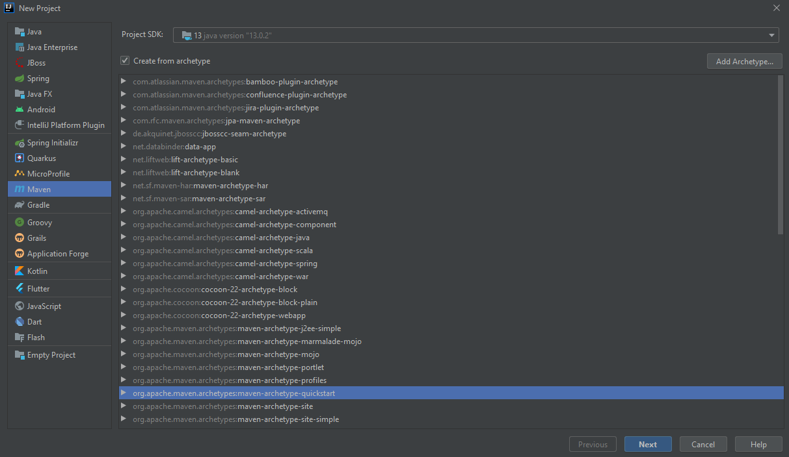
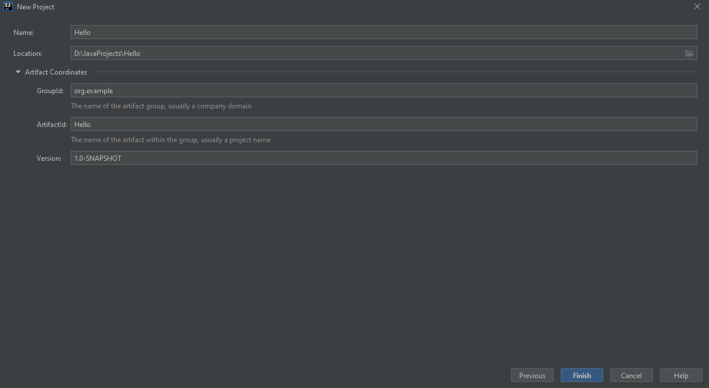
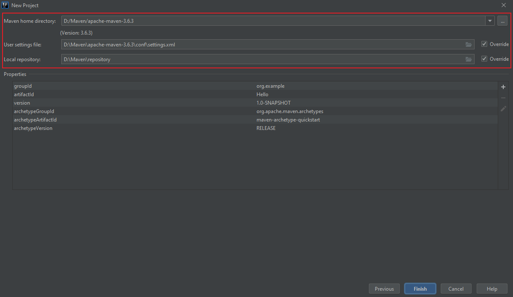
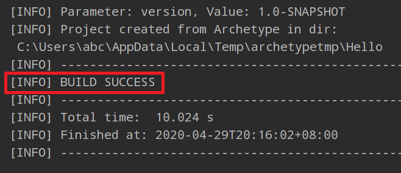
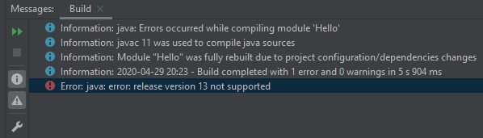
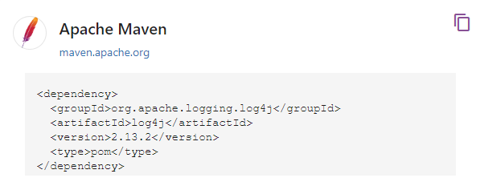
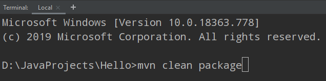
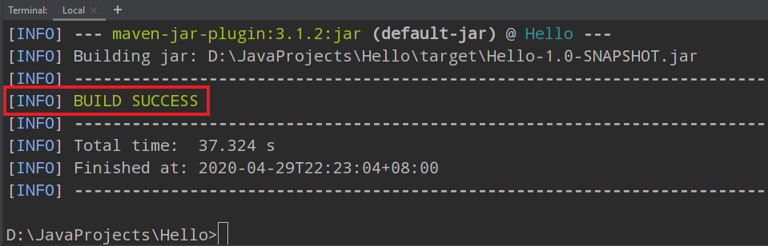
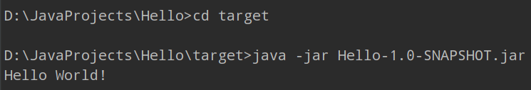

## 为什么使用项目管理工具

如果纯粹靠人工手动将一个Java项目打包成一个可以直接正常运行的jar文件，应该怎么做？

+ 第一步：创建项目时，要组织好项目结构；
+ 第二步：编写源文件和添加依赖时，注意将文件放到合适的目录下；
+ 第三步：编写一个MANIFEST.MF文件，在里面指定Main-Class和其它信息；
+ 第四步：通过鼠标右键将项目打包成一个压缩文件，然后修改后缀名为jar；
+ 第五步：使用控制台或脚本文件执行java -jar xxx.jar。

上述步骤中有任何一个步骤出现问题，都会导致jar包无法正常运行。尤其是第三步，由于MANIFEST.MF文件对于内容格式有着严格的要求， 稍不注意就会出现错误，而一般情况下IDE又没有针对这种文件专门的查错、提示和纠错功能，因此一旦写错该文件的内容，不仅会导致jar包无法正常运行， 还会导致问题排查极为困难。

为了解决从创建项目到打包jar包过程中，由于人工操作所带来的不确定性和不可靠因素，有必要引入专门的工具，不仅可以自行组织好项目结构， 还可以解决项目依赖以及MANIFEST.MF文件编写等问题。Java社区提供了很多这样的开源工具，其中最常用的工具就是Maven和[Gradle](Gradle/Groovy语言入门_基本语法)。 Maven是一套专门用于Java项目的管理构建工具，它的主要功能是提供标准化项目结构、标准化构建流程以及依赖管理机制。 特别是它提供了一个pom.xml项目描述文件，通过配置这个文件，可以高效地进行依赖管理以及项目构建。

## Maven安装与配置

首先到Maven官网去下载Maven，然后在指定的本地目录下解压， 之后在环境变量PATH下添加Maven的安装路径。要检验Maven能否正常使用，打开命令行窗口，输入指令`mvn -version`并执行，和检测Java环境的做法完全一样。 如果命令行窗口输出了Maven的版本信息，则代表Maven可以正常使用，否则需要修复PATH路径之后再重新检测。

在正式创建项目之前，还要对Maven进行一些其他的配置。进入Maven安装目录下的apache-maven-x.x.x文件夹中，找到conf文件夹， 打开之后对settings.xml进行修改。最重要的一项就是在\<mirrors>标签中加入Maven在中国大陆的中央仓库镜像站：

```
<mirrors>
    ···
    <mirror>
        <id>maven.net.cn</id>
        <name>one of the central mirrors in china</name>
        <url>http://maven.net.cn/content/groups/public/</url>
        <mirrorOf>central</mirrorOf>
    </mirror>
</mirrors>
```

Maven默认的本地仓库位于C:\User\用户名\\.m2\repository，如果需要更换位置，则将settings.xml文件中\<settings> 标签底下第一个标签\<localRepository>的内容修改为自己指定的路径。

## 创建Maven项目

以IDEA为例，如果是首次创建Maven项目，那么最好是先从给定的模板项目开始一步步执行创建流程。 熟练之后，就可以在模板无法满足自己需求的情况下，直接创建Maven项目。初次创建可按照以下步骤进行：

1. 选择模板项目



2. 设置项目属性



注意Maven的安装路径、 settings.xml文件以及本地仓库的位置要选择自己之前设置好的，而不是IDEA默认的。



3. 项目创建成功



如果IDEA提示需要导入某些Maven文件，则按照提示选择导入。

quickstart项目在运行后会输出“Hello World”，然而有些时候，如果不对pom.xml文件甚至是IDEA的设置作适当修改， 就很可能会出现如下错误提示：



出现这个错误的原因，就在于模板pom.xml文件中的如下部分：

```
<properties>
    <project.build.sourceEncoding>UTF-8</project.build.sourceEncoding>
    <maven.compiler.source>1.7</maven.compiler.source>
    <maven.compiler.target>1.7</maven.compiler.target>
</properties>
```

1.7表示的是maven.compiler.source以及maven.compiler.target所支持的Java版本，如果IDEA使用了非1.7的Java版本， 那么这两处可以先尝试修改成和IDEA一致的版本号。当然，如果IDEA使用的Java版本太新以至于Maven还没来得及支持，那么可以考虑适当降低版本号。

此外，模板pom.xml文件自带的依赖和插件版本可能已经落后，因此可以在每个\<version>标签中输入当前版本号第一个数字来查看有哪些可用版本， 然后选择最新的版本号即可。 修改好之后，就在IDEA右侧边缘的Maven窗口中刷新一下，再运行这个项目，如果不出意外，最终会成功打印出“Hello World”。

## 依赖管理

这里所说的依赖一般是指第三方依赖，即创建项目之后需要自行导入的那些jar包。在Maven项目中， 开发者们都是通过配置pom.xml文件添加依赖的。以模板项目为例，它通过以下内容添加一个用于junit测试的依赖：

```
<dependencies>
    <dependency>
        <groupId>junit</groupId>
        <artifactId>junit</artifactId>
        <version>4.11</version>
        <scope>test</scope>
    </dependency>
    ···
</dependencies>
```

\<groupId>表示组织的名称，\<artifactId>表示该jar包自身的名称，\<version>表示版本号，\<scope>表示依赖关系。 前三个标签所对应的内容组成GAV坐标，可唯一地确定某个jar包；后一个标签则规定依赖在什么时候用上。

如果不设置\<scope>， 那么这个依赖就被默认为编译时（compile）用到，Maven会将这类依赖直接放入classpath；如果设置为test，如junit，就表示仅在测试时用到； 如果设置为runtime，如JDBC，就表示仅在运行时用到；如果是provided，如Servlet API，就表示编译时需要用到，但运行时由JDK或某个服务器提供。 

值得一提的是，\<version>中以-SNAPSHOT结尾的版本都被视为开发版本，每次都会重新导入，正式发布的版本不能出现-SNAPSHOT。

如果需要引用某个依赖，但又不清楚GAV坐标，那么就在[Maven官网](search.maven.org)中搜索关键字来查找。 例如需要使用log4j，那么就通过上述网站查找，找到自己想用的组件后，直接复制使用即可。



## 命令行编译

IDEA自带调试终端，因此可以在里面输入指令将项目打包成jar包。但是在打包之前，先确定已经在pom.xml文件中添加了这些内容：

```
<plugin>
    <artifactId>maven-jar-plugin</artifactId>
    <version>3.1.2</version>
    <configuration>
        <archive>
            <manifest>
                <mainClass>org.example.App</mainClass>
            </manifest>
        </archive>
    </configuration>
</plugin>
```

其中\<mainClass>org.example.App\</mainClass>的作用是在MANIFEST.MF文件中添加Main-Class的路径， 如果没有这个路径，打包出来的jar包在运行时将找不到可以执行的主类，于是就会报错。

在终端中输入指令`mvn clean package`并执行，通常会打包成功。 再切换到target目录下运行生成好的jar包，应该也会成功，在本例中，终端会打印输出“Hello World”，整个过程如下图所示。

执行打包指令：



打包成功：



运行jar包：


